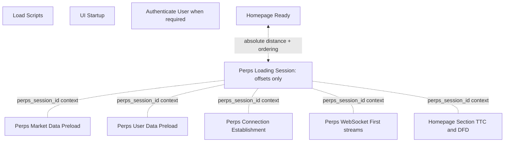

# Perps performance Sentry contract

This maps the approved event model to Sentry. It contains no performance values.

## Rule

Reuse existing startup, preload, connection, first-data, Homepage-section, and critical-user-flow traces. Add only missing attributes, targeted child measurements, and one slim bootstrap-relative loading session. No boundary may have two producers.

## Trace topology

These remain independent root transactions. The session is not a synthetic parent and does not copy their durations.

## Existing authoritative traces

| Stage                  | Existing trace                                                     | Minimal change                                                                |
| ---------------------- | ------------------------------------------------------------------ | ----------------------------------------------------------------------------- |
| Script load            | `Load Scripts`                                                     | Query by release/platform/app-start type                                      |
| UI mount               | `UI Startup`                                                       | Query by release/platform/app-start type                                      |
| Authentication         | `Authenticate User`                                                | Query only where authentication occurs                                        |
| Homepage readiness     | `Homepage Ready`                                                   | Add unlock-only auth-end-to-ready measurement                                 |
| Global market preload  | `Perps Market Data Preload`                                        | Add source, counts, snapshot status, and targeted Terminal child measurements |
| User preload           | `Perps User Data Preload`                                          | Remove raw address; add bounded cache identity/source attributes              |
| Connection             | `Perps Connection Establishment`                                   | Reuse provider-init, health, socket, and subscription measurements            |
| First live streams     | `Perps WebSocket First Price/Positions/Orders/Account`             | Add lifecycle/source/session context to all four                              |
| Homepage Perps TTC/DFD | `Homepage Section Time To Content` / `Homepage Section Data Fetch` | Add lifecycle, market source, account source, content variant                 |
| Critical flows         | Existing Perps CUF traces                                          | Query by release/platform/network/provider                                    |

## Measurements by authoritative trace

### `Homepage Ready`

- `authentication_end_to_homepage_ready_ms`, unlock cohort only.

Cold app-open, unlock, and warm app-open Homepage Ready traces keep their existing distinct anchors. Missing authentication on an already-unlocked cold start remains missing.

### `Perps Market Data Preload`

- `terminal_request_duration_ms`
- `terminal_parse_validate_duration_ms`
- `terminal_mobile_adoption_duration_ms`

These measurements are emitted once by Core and written to the explicit market-preload span handle through the Mobile tracing adapter. They do not appear on the loading session.

### `Perps Loading Session`

All measurements are non-negative bootstrap-relative offsets:

- `process_to_perps_bootstrap_start_ms`
- `homepage_ready_distance_from_perps_bootstrap_start_ms`
- `process_to_perps_controller_constructed_ms`
- `markets_ready_ms`
- `account_cache_ready_ms`
- `account_live_ms`
- `positions_live_ms`
- `orders_live_ms`
- `prices_live_ms`

`bootstrap_before_homepage_ready` records ordering. Percentiles must be split by this boolean; a signed offset is forbidden.

The session starts at `perps_bootstrap_start`. It ends when the surface-specific resolved requirement and any lifecycle-required live streams are recorded, or at a bounded error/timeout. Homepage trending does not wait for live prices.

### Existing Homepage section traces

Do not add another Homepage TTC or DFD transaction.

- Existing TTC remains the resolved-content duration.
- Existing DFD remains the loading duration.
- Add `surface_initial_ui_ms` and `surface_live_content_ms` as measurements on that existing surface trace only where applicable.
- Keep `socket_to_visible_ms` recipe-only until on-device evidence justifies promotion.
- Keep socket→subscriber→commit→frame components recipe-only.

Visible errors retain the existing event shape for compatibility. Successful-latency widgets must filter `content_state != error`; error-rate widgets use `content_state = error`.

Dashboard cohort queries use span attributes. The section hook writes bounded
cohort values as start attributes and refreshes them on the same span before
completion; Sentry event tags are compatibility metadata, not the dashboard
source of truth.

## Attributes

### Indexed, bounded cohort attributes

- `release`
- `environment`
- `platform`
- `app_start_type`
- `surface`
- `content_variant`
- `lifecycle`
- `provider`
- `network`
- `market_source`: `terminal_v2`, `provider`, `memory_cache`, `disk_cache`
- `account_source`: `provider_snapshot`, `memory_cache`, `disk_cache`, `fresh_socket`
- `terminal_snapshot_status`: `accepted`, `stale`, `invalid`, `http_error`, `not_attempted`
- `cache_identity_valid`
- `cache_age_bucket`
- `data_ready_at_demand`
- `required_live_streams_complete`
- `bootstrap_before_homepage_ready`
- `content_state`
- `success`
- `failure_stage`

### Trace data/context, never dashboard group-by tags

- `perps_session_id`
- `account_generation`
- `context_generation`
- `enabled_dex_fingerprint`
- market coverage counts

`hip3_config_version` may be indexed only if its production value space is demonstrably bounded.

Never attach wallet addresses, account names, order IDs, position IDs, balances, or raw upstream error bodies. The existing raw `userAddress` on `Perps User Data Preload` must be removed before this contract ships.

## Correlation

Mobile creates one random `perps_session_id` per lifecycle/context generation at `perps_bootstrap_start`. It passes the identifier through the existing tracing infrastructure to Core and attaches it as trace data/context to reused Perps and Homepage-section traces. It is for individual-run drill-down, not aggregation.

This Mobile stack attaches the identifier to the loading session, Homepage
section, connection, and first-live traces. Market/user preload correlation,
`process_to_perps_bootstrap_start_ms`, and
`process_to_perps_controller_constructed_ms` remain release-pending on the
Core trace-targeting API in MetaMask/core#9906 plus its Mobile adapter. Their
dashboard rows must remain empty/pending until that released API is wired; they
must not be inferred from ambient spans.

`disk_cache` and the `cold_disk_cache` lifecycle remain reserved until Core
exposes durable-cache provenance to Mobile. Cold-disk-cache recipe evidence is
currently excluded, so production widgets must not label memory-hydrated rows
as disk cache.

Dashboards aggregate each authoritative transaction independently using the same bounded release/platform/lifecycle/source attributes. Bootstrap-relative cross-stage widgets query the slim loading session, which is why those offsets exist there.

## Dashboard proposal

### Startup

- Load Scripts p50/p75/p95.
- UI Startup p50/p75/p95.
- Authenticate User p50/p75/p95 when present.
- Auth-end → Homepage Ready for unlock.
- Homepage Ready ↔ Perps bootstrap distance, split by ordering.

### Cold Perps

- Controller construction and existing controller-init measurements.
- Terminal network versus parse/adoption from market-preload trace.
- Bootstrap-relative markets/account-cache/live readiness from loading session.
- Existing Homepage TTC/DFD split by `content_variant` and filtered to `content_state != error`.
- Visible error rate in its own widget.
- Market coverage and Terminal acceptance rate.

### Cached/resume

- Resident return TTC.
- Disk-cache hydration and cache-to-visible recipe result.
- Short resume TTC and continuity.
- Reconnect cached visibility then live takeover.
- Cache identity rejection rate.

### Critical Perps flows

- Market-list entry.
- Market detail live.
- Open position rendered.
- Limit order rendered.
- Close confirmation.
- Cancel confirmation.

Every latency widget splits by platform and identifiable release. Android and iOS are never pooled for a performance conclusion.

## Implementation gates

1. Fix the Core→Mobile tracing bridge so measurements target their intended trace/span. Core buffers constructor/hydration monotonic timestamps; the Mobile loading-session coordinator writes their derived offsets only after the explicit session span exists.
2. Remove the wallet address from Core user-preload trace data.
3. Use the canonical recipe stage names from `ARCHITECTURE.md`.
4. Correlate one Android and one iOS recipe run with development Sentry events.
5. Create or update a separate development validation dashboard.
6. Populate production widgets only from an identifiable release containing the instrumentation.
7. Keep dashboard 3948326 unchanged until its owner approves a separate proposed diff.

## Delivery status

- Core snapshot and atomic user-data behavior is released in `@metamask/perps-controller` 12.0.0.
- Explicit preload span targeting, controller-construction timing, and user-address removal are implemented in [MetaMask/core#9906](https://github.com/MetaMask/core/pull/9906) and remain release pending.
- Terminal snapshot availability hardening is implemented in [terminal-backend#49](https://github.com/consensys-vertical-apps/terminal-backend/pull/49) and remains deployment pending.
- Dashboard widgets may be created before those releases, but empty widgets must remain labelled `release pending`; absence of data is not a zero-duration result.

## Status vocabulary

Every report/dashboard value is labelled exactly one of:

- `validated`: correlated device/recipe evidence exists;
- `recipe pending`: instrumentation or on-device reproduction remains;
- `release pending`: device proof exists but no identifiable production release contains it;
- `excluded`: the value is invalid, incomparable, or outside the claim.
