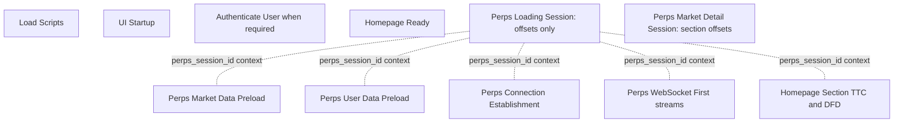

# Perps performance Sentry contract

This maps the approved event model to Sentry. It contains no performance values.

## Rule

Reuse existing startup, preload, connection, first-data, Homepage-section, and critical-user-flow traces. Add only missing attributes, targeted child measurements, and one slim bootstrap-relative loading session. No boundary may have two producers.

## Trace topology

These remain independent root transactions. The session is not a synthetic parent and does not copy their durations.

The market-detail session is also an independent root. It shares bounded
lifecycle/provider/network/mode attributes with the reused traces but does not
join or copy them.

`Perps Connection Establishment` belongs to the singleton connection plane,
not to the screen that happens to be visible when an attempt runs. The
wallet-root lifecycle owner and any guarded screen recovery request converge on
the same manager. One attempt may serve Wallet Homepage, Perps Home, Market
Detail, and later flows. Do not add a screen attribute to reinterpret that
duration. Each screen keeps the user-perceived trace whose start and end it
owns.

## Existing authoritative traces

| Stage                  | Existing trace                                                     | Minimal change                                                                |
| ---------------------- | ------------------------------------------------------------------ | ----------------------------------------------------------------------------- |
| Script load            | `Load Scripts`                                                     | Query by release/platform/app-start type                                      |
| UI mount               | `UI Startup`                                                       | Query by release/platform/app-start type                                      |
| Authentication         | `Authenticate User`                                                | Query only where authentication occurs                                        |
| Homepage readiness     | `Homepage Ready`                                                   | Reuse unchanged; aggregate separately by release/platform                     |
| Global market preload  | `Perps Market Data Preload`                                        | Add source, counts, snapshot status, and targeted Terminal child measurements |
| User preload           | `Perps User Data Preload`                                          | Remove raw address; add bounded cache identity/source attributes              |
| Connection             | `Perps Connection Establishment`                                   | Reuse provider-init, health, socket, and subscription measurements            |
| First live streams     | `Perps WebSocket First Price/Positions/Orders/Account`             | Add lifecycle/source/session context to all four                              |
| Homepage Perps TTC/DFD | `Homepage Section Time To Content` / `Homepage Section Data Fetch` | Add lifecycle, market source, account source, content variant                 |
| Critical flows         | Existing Perps CUF traces                                          | Query by release/platform/network/provider                                    |

## Measurements by authoritative trace

### `Perps Market Data Preload`

- `terminal_request_duration_ms`
- `terminal_parse_validate_duration_ms`
- `terminal_mobile_adoption_duration_ms`

These measurements are emitted once by Core and written to the explicit market-preload span handle through the Mobile tracing adapter. They do not appear on the loading session.

### `Perps Loading Session`

All measurements are non-negative bootstrap-relative offsets:

- `process_to_perps_bootstrap_start_ms`
- `process_to_perps_controller_constructed_ms`
- `markets_ready_ms`
- `account_cache_ready_ms`
- `account_live_ms`
- `positions_live_ms`
- `orders_live_ms`
- `prices_live_ms`

The mounted Homepage Perps surface starts the session at `perps_bootstrap_start`. It ends when the surface-specific resolved requirement and any lifecycle-required live streams are recorded, or at a bounded error/timeout. Context changes, backgrounding, and unmount cancel the session without a success/content outcome. Homepage trending does not wait for live prices.

### Existing Homepage section traces

Do not add another Homepage TTC or DFD transaction.

- Existing TTC remains the resolved-content duration.
- Existing DFD remains the loading duration.
- Add `surface_initial_ui_ms` and `surface_live_content_ms` as measurements on that existing surface trace only where applicable.
- Keep `socket_to_visible_ms` recipe-only until on-device evidence justifies promotion.
- Keep socket→subscriber→commit→frame components recipe-only.

Visible errors retain the existing event shape for compatibility. Successful-latency widgets must filter `content_state != error`; error-rate widgets use `content_state = error`.

Dashboard cohort queries use span attributes. The section hook writes bounded
cohort values as start attributes and refreshes them on the same span before
completion; Sentry event tags are compatibility metadata, not the dashboard
source of truth.

## Attributes

### Indexed, bounded cohort attributes

- `release`
- `environment`
- `platform`
- `app_start_type`
- `surface`
- `content_variant`
- `lifecycle`
- `provider`
- `network`
- `market_source`: `terminal_v2`, `provider`, `memory_cache`, `disk_cache`
- `account_source`: `provider_snapshot`, `memory_cache`, `disk_cache`, `fresh_socket`
- `terminal_snapshot_status`: `accepted`, `stale`, `invalid`, `http_error`, `not_attempted`
- `cache_identity_valid`
- `cache_age_bucket`
- `data_ready_at_demand`
- `required_live_streams_complete`
- `content_state`
- `success`
- `failure_stage`

### Trace data/context, never dashboard group-by tags

- `perps_session_id`
- `account_generation`
- `context_generation`
- `enabled_dex_fingerprint`
- market coverage counts

`hip3_config_version` may be indexed only if its production value space is demonstrably bounded.

Never attach wallet addresses, account names, order IDs, position IDs, balances, or raw upstream error bodies. The existing raw `userAddress` on `Perps User Data Preload` must be removed before this contract ships.

## Correlation

Mobile creates one random `perps_session_id` per lifecycle/context generation at `perps_bootstrap_start`. It passes the identifier through the existing tracing infrastructure to Core and attaches it as trace data/context to reused Perps and Homepage-section traces. It is for individual-run drill-down, not aggregation.

This Mobile stack attaches the identifier to the loading session, Homepage
section, connection, first-live, and Core market/user preload traces. The
released Core trace-targeting API provides the post-hydration controller
construction timestamp and routes preload measurements to their explicit trace
IDs; no values are inferred from ambient spans.

`disk_cache` and the `cold_disk_cache` lifecycle remain reserved until Core
exposes durable-cache provenance to Mobile. Cold-disk-cache recipe evidence is
currently excluded, so production widgets must not label memory-hydrated rows
as disk cache.

Dashboards aggregate each authoritative transaction independently using the same bounded release/platform/lifecycle/source attributes. Bootstrap-relative Perps widgets query the slim loading session; app startup and Homepage Ready remain separate release/platform cohorts.

Connection widgets query `Perps Connection Establishment`. The contract
requires release, platform, provider, network, lifecycle, and outcome cohorts;
until an identifiable release emits a field, the dashboard must leave it
unknown rather than infer it from the visible screen. Screen widgets query
their own trace names. A screen can legitimately be fast when it consumes an
already ready connection, and a connection can complete without any Perps
screen being visible.

## Dashboard proposal

The production dashboards answer two different questions:

- Product trend: are the key Perps screens and user flows improving or
  regressing over time? Plot each authoritative duration as a release-aware
  p50/p75/p95 time series, split by platform. Keep Perps Home, market-list,
  Lite/Pro detail, and open/limit/close/cancel flows visible without combining
  their different anchors.
- Engineering bottleneck: which lifecycle or section explains a regression?
  Drill from the high-level row into the matching Homepage/detail waterfall,
  source/cache cohort, reliability row, and individual session context.

The development dashboards mirror these definitions before release. A local
report may validate emission, but only an identifiable production release can
populate a production trend.

### Startup

- Load Scripts p50/p75/p95.
- UI Startup p50/p75/p95.
- Authenticate User p50/p75/p95 when present.
- Existing Authenticate User and Homepage Ready distributions, shown separately.

### Cold Perps

- Controller construction and existing controller-init measurements.
- Terminal network versus parse/adoption from market-preload trace.
- Bootstrap-relative markets/account-cache/live readiness from loading session.
- Existing Homepage TTC/DFD split by `content_variant` and filtered to `content_state != error`.
- Visible error rate in its own widget.
- Market coverage and Terminal acceptance rate.

### Cached/resume

- Resident return TTC.
- Disk-cache hydration and cache-to-visible recipe result.
- Short resume TTC and continuity.
- Reconnect cached visibility then live takeover.
- Cache identity rejection rate.

### Critical Perps flows

- Market-list entry.
- Market detail live.
- Open position rendered.
- Limit order rendered.
- Close confirmation.
- Cancel confirmation.

### Market detail

- `Perps Market Detail Live` p50/p75/p95 split by `detail_mode`.
- A release/platform time series for the minimum-useful Lite and Pro durations,
  linked to the section waterfall used to explain each regression.
- One waterfall table from `Perps Market Detail Session`, with count and
  p50/p75/p95 for each applicable `*_resolved_ms` measurement.
- A section p75 time series and slowest-section table so market, chart, stats,
  insights, account, order-book, and positions/orders bottlenecks can be ranked
  over time.
- Split market metadata by `market_source`; route metadata and stream enrichment
  are different cohorts.
- Split every waterfall by `lifecycle_context`; do not pool
  `background_resume` resident rows with cold or warm navigation.
- Navigation waterfalls filter `generation_trigger=initial`. Market, account,
  mode, network, background, and configuration changes are separate cohorts.
- Lite filters for market, price, chart, stats, insights, account, and
  positions/orders.
- Pro filters for market, price, chart, stats, account, order book, and
  positions/orders.
- Trade-control/order-form readiness derives from the max of market, price, and
  account offsets; there is no duplicate emitted duration.
- Section-error and session-timeout counts in separate reliability widgets.
- `Perps Market Detail Live` reliability groups bounded unsuccessful reasons:
  `generation_changed` for a superseded context and `stats_error` for explicit
  stats subscription setup failure. Neither reason enters latency widgets.
- Chart rows split by configured `chart_strategy` and rendered
  `chart_library`; fallback rows must not be pooled with native Advanced rows.
- No grouping by market symbol or session id. Drill down by symbol only on an
  individual event.

Reuse the four mirrored Perps dashboards:

- Product summaries add minimum-useful Lite/Pro and fully-resolved trend rows.
- Engineering dashboards add the section waterfall and failure table.
- Development mirrors production definitions before release.
- Production rows remain `release pending` until an identifiable Mobile release
  contains the detail-session instrumentation.

Every latency widget splits by platform and identifiable release. Android and iOS are never pooled for a performance conclusion.

## Implementation gates

1. Validate the released Core→Mobile tracing bridge: Core reports constructor/hydration monotonic timestamps and explicit preload trace IDs; Mobile writes them only to the named session/preload spans.
2. Confirm Core user-preload traces contain no wallet address.
3. Use the canonical recipe stage names from `ARCHITECTURE.md`.
4. Correlate one Android and one iOS recipe run with development Sentry events.
5. Create or update a separate development validation dashboard.
6. Populate production widgets only from an identifiable release containing the instrumentation.
7. Keep dashboard 3948326 unchanged until its owner approves a separate proposed diff.
8. Correlate one Lite and one Pro detail session on Android and iOS before
   enabling the market-detail widgets.

## Delivery status

- Core snapshot and atomic user-data behavior is released in `@metamask/perps-controller` 12.0.0.
- Explicit preload span targeting, controller-construction timing, and user-address removal are released in `@metamask/perps-controller` 12.1.0 and wired by this Mobile change.
- Terminal snapshot availability hardening from [terminal-backend#49](https://github.com/consensys-vertical-apps/terminal-backend/pull/49) is deployed to Dev and UAT; PRD remains approval pending.
- Production dashboard widgets remain `release pending` until an identifiable Mobile release contains this instrumentation; absence of data is not a zero-duration result.

## Status vocabulary

Every report/dashboard value is labelled exactly one of:

- `validated`: correlated device/recipe evidence exists;
- `recipe pending`: instrumentation or on-device reproduction remains;
- `release pending`: device proof exists but no identifiable production release contains it;
- `excluded`: the value is invalid, incomparable, or outside the claim.
