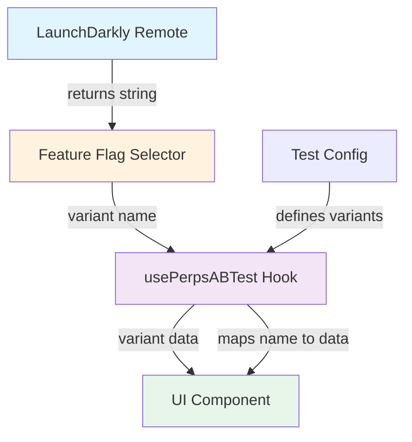
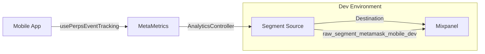

# Perps A/B Testing Framework

## Overview

Simplified A/B testing framework for Perps that leverages LaunchDarkly for user identification, variant assignment, and persistence. The implementation focuses on reading variants and applying them in UI, while LaunchDarkly handles all complex logic.

**Key Design Principles:**

- LaunchDarkly is the single source of truth for variant assignment
- Simple string flags (not JSON) for variant names
- Fallback to first variant when flag is disabled
- Type-safe hook API for UI components
- No client-side assignment logic or storage

## Architecture



## Layer Responsibilities

### Test Configuration (`tests.ts`)

**Owns:**

- Variant definitions (control, treatment, etc.)
- Variant data (button colors, text, behavior flags)
- Test metadata (ID, description, min version)

**Example:**

```typescript
export const BUTTON_COLOR_TEST: ABTestConfig<ButtonColorTestVariants> = {
  testId: 'button_color_test',
  featureFlagKey: 'perpsAbtestButtonColor',
  description: 'Tests impact of button colors on trading behavior',
  variants: {
    control: {
      weight: 50, // Informational only
      data: { long: 'green', short: 'red' },
    },
    monochrome: {
      weight: 50, // Informational only
      data: { long: 'white', short: 'white' },
    },
  },
};
```

**Note:** Weights are informational only. LaunchDarkly controls actual distribution via percentage rollout rules.

---

### Feature Flag Selector (`selectors/featureFlags/index.ts`)

**Owns:**

- Reading LaunchDarkly flag value from Redux
- Returning variant name as string or null

**Example:**

```typescript
export const selectPerpsButtonColorTestVariant = createSelector(
  selectRemoteFeatureFlags,
  (remoteFeatureFlags): string | null => {
    const flag = remoteFeatureFlags?.perpsAbtestButtonColor;
    return flag || null; // Returns 'control' | 'monochrome' | null
  },
);
```

**Redux State:**

```typescript
{
  RemoteFeatureFlagController: {
    remoteFeatureFlags: {
      perpsAbtestButtonColor: 'control'; // String value from LaunchDarkly
    }
  }
}
```

---

### Hook (`usePerpsABTest`)

**Owns:**

- Mapping variant name to variant data
- Fallback logic (first variant when flag is null)
- `isEnabled` state (true if LaunchDarkly returned a variant)

**Returns:**

```typescript
{
  variant: T; // Typed variant data (e.g., { long: 'green', short: 'red' })
  variantName: string; // Variant name (e.g., 'control')
  isEnabled: boolean; // true if LaunchDarkly assigned variant, false if using fallback
}
```

**Usage in Component:**

```typescript
import { usePerpsABTest } from '../../utils/abTesting/usePerpsABTest';
import { BUTTON_COLOR_TEST } from '../../utils/abTesting/tests';
import { selectPerpsButtonColorTestVariant } from '../../selectors/featureFlags';

const MyComponent = () => {
  const { variant, variantName, isEnabled } = usePerpsABTest({
    test: BUTTON_COLOR_TEST,
    featureFlagSelector: selectPerpsButtonColorTestVariant,
  });

  const buttonColors = variant as ButtonColorVariant;

  // Track screen view with AB test context (baseline exposure)
  usePerpsEventTracking({
    eventName: MetaMetricsEvents.PERPS_SCREEN_VIEWED,
    properties: {
      [PerpsEventProperties.SCREEN_TYPE]:
        PerpsEventValues.SCREEN_TYPE.ASSET_DETAILS,
      [PerpsEventProperties.ASSET]: market.symbol,
      // AB test context - only included when test is enabled
      ...(isEnabled && {
        [PerpsEventProperties.AB_TEST_BUTTON_COLOR]: variantName,
      }),
    },
  });

  // Get imperative track function for button press tracking
  const { track } = usePerpsEventTracking();

  const handleButtonPress = (direction: 'long' | 'short') => {
    // Track AB test on button press (engagement)
    if (isEnabled) {
      track(MetaMetricsEvents.PERPS_UI_INTERACTION, {
        [PerpsEventProperties.INTERACTION_TYPE]:
          PerpsEventValues.INTERACTION_TYPE.TAP,
        [PerpsEventProperties.ASSET]: market.symbol,
        [PerpsEventProperties.DIRECTION]: direction === 'long'
          ? PerpsEventValues.DIRECTION.LONG
          : PerpsEventValues.DIRECTION.SHORT,
        [PerpsEventProperties.AB_TEST_BUTTON_COLOR]: variantName,
      });
    }

    // Navigate or perform action
    // ...
  };

  return (
    <ButtonSemantic
      onPress={() => handleButtonPress('long')}
      severity={getButtonSeverityForDirection('long', buttonColors)}
    />
  );
};
```

---

## File Structure

```
app/components/UI/Perps/
├── utils/abTesting/
│   ├── types.ts              # TypeScript interfaces
│   ├── usePerpsABTest.ts     # Main hook
│   └── tests.ts              # Test configurations
├── selectors/featureFlags/
│   └── index.ts              # Feature flag selectors
├── constants/
│   └── eventNames.ts         # AB test event properties
└── Views/
    └── PerpsOrderView/       # Example usage
```

---

## Adding New Tests

### 1. Define Variant Data Type

**File:** `app/components/UI/Perps/utils/abTesting/types.ts`

```typescript
export interface MyTestVariant {
  property: string;
  anotherProperty: number;
}
```

### 2. Create Test Configuration

**File:** `app/components/UI/Perps/utils/abTesting/tests.ts`

```typescript
export const MY_TEST: ABTestConfig<{
  control: ABTestVariant<MyTestVariant>;
  treatment: ABTestVariant<MyTestVariant>;
}> = {
  testId: 'my_test',
  featureFlagKey: 'perpsAbtestMyTest',
  description: 'Test description',
  variants: {
    control: {
      weight: 50,
      data: { property: 'value1', anotherProperty: 1 },
    },
    treatment: {
      weight: 50,
      data: { property: 'value2', anotherProperty: 2 },
    },
  },
};
```

**Note:** LaunchDarkly flag name would be `perps-abtest-my-test` (kebab-case), which becomes `perpsAbtestMyTest` (camelCase) in Redux state.

### 3. Add Feature Flag Selector

**File:** `app/components/UI/Perps/selectors/featureFlags/index.ts`

```typescript
export const selectPerpsMyTestVariant = createSelector(
  selectRemoteFeatureFlags,
  (flags): string | null => flags?.perpsAbtestMyTest || null,
);
```

### 4. Add Event Constants

**File:** `app/components/UI/Perps/constants/eventNames.ts`

```typescript
AB_TEST: {
  BUTTON_COLOR_TEST: 'button_color_test',
  MY_TEST: 'my_test', // Add new test ID
}
```

### 5. Use in Component

```typescript
const { variant, variantName, isEnabled } = usePerpsABTest({
  test: MY_TEST,
  featureFlagSelector: selectPerpsMyTestVariant,
});
```

---

## Multiple Concurrent Tests

### Why Flat Properties?

To support multiple AB tests running simultaneously (e.g., TAT-1937 button colors, TAT-1940 asset CTA, TAT-1827 homepage CTA), we use **flat properties per test** instead of generic properties.

> **Note:** For the complete event property definitions and tracking patterns, see [Perps MetaMetrics Reference](./perps-metametrics-reference.md#multiple-concurrent-tests).

**❌ Generic Pattern (doesn't scale):**

```typescript
{
  ab_test_id: 'button_color_test',
  ab_test_variant: 'control',
  ab_test_enabled: true
}
// Problem: Only supports ONE test per event
```

**✅ Flat Pattern (scales to 3+ tests):**

```typescript
{
  ab_test_button_color: 'control',
  ab_test_asset_cta: 'variant_a',
  ab_test_homepage_cta: 'treatment'
}
// ✓ Supports multiple concurrent tests in same event
// Note: Only include properties when test is enabled (don't send event if disabled)
```

### Naming Convention

**Pattern:** `ab_test_{test_name}` (no `_enabled` suffix needed)

**Why no `_enabled` property?**

- Events are only sent when test is enabled
- Including the property means the test is active
- No need for redundant `_enabled` flag

**Examples:**

- Button color test: `ab_test_button_color`
- Asset CTA test: `ab_test_asset_cta`
- Homepage CTA test: `ab_test_homepage_cta`

### Implementation

**1. Add properties to `eventNames.ts`:**

```typescript
export const PerpsEventProperties = {
  // ... existing properties ...

  // A/B testing properties (flat per test for multiple concurrent tests)
  // Only include AB test properties when test is enabled (event not sent when disabled)
  // Button color test (TAT-1937)
  AB_TEST_BUTTON_COLOR: 'ab_test_button_color',
  // Asset CTA test (TAT-1940)
  AB_TEST_ASSET_CTA: 'ab_test_asset_cta',
  // Future tests: add as AB_TEST_{TEST_NAME} (no _ENABLED property needed)
} as const;
```

**2. Use in component tracking:**

```typescript
const { variant, variantName, isEnabled } = usePerpsABTest({
  test: BUTTON_COLOR_TEST,
  featureFlagSelector: selectPerpsButtonColorTestVariant,
});

// Track screen view (baseline exposure)
usePerpsEventTracking({
  eventName: MetaMetricsEvents.PERPS_SCREEN_VIEWED,
  properties: {
    [PerpsEventProperties.SCREEN_TYPE]:
      PerpsEventValues.SCREEN_TYPE.ASSET_DETAILS,
    [PerpsEventProperties.ASSET]: market.symbol,
    ...(isEnabled && {
      [PerpsEventProperties.AB_TEST_BUTTON_COLOR]: variantName,
    }),
  },
});

// Get imperative track function for button press tracking
const { track } = usePerpsEventTracking();

// In button press handler
const handleLongPress = () => {
  // Track AB test on button press (engagement)
  if (isEnabled) {
    track(MetaMetricsEvents.PERPS_UI_INTERACTION, {
      [PerpsEventProperties.INTERACTION_TYPE]:
        PerpsEventValues.INTERACTION_TYPE.TAP,
      [PerpsEventProperties.ASSET]: market.symbol,
      [PerpsEventProperties.DIRECTION]: PerpsEventValues.DIRECTION.LONG,
      [PerpsEventProperties.AB_TEST_BUTTON_COLOR]: variantName,
    });
  }

  // Navigate to order screen
  navigation.navigate(/* ... */);
};
```

### Where to Track

**Best Practice:** Track AB test context in **both screen view and button press** events to enable engagement rate calculation.

**Dual Tracking Approach:**

1. **PERPS_SCREEN_VIEWED** (baseline exposure):
   - Tracks when user views the asset details screen
   - Establishes how many users were exposed to each variant
   - Only includes AB test property when test is enabled

2. **PERPS_UI_INTERACTION** (engagement):
   - Tracks when user presses Long/Short button
   - Measures which variant drives more button presses
   - Only sent when test is enabled

**Why Both Events?**

- **Engagement Rate** = Button presses / Screen views per variant
- Answers: "Which button color makes users more likely to press the button?"
- Screen views alone = exposure but not engagement
- Button presses alone = engagement but no baseline for comparison

**Example Flow (TAT-1937):**

1. User views PerpsMarketDetailsView → `PERPS_SCREEN_VIEWED` with `ab_test_button_color: 'control'` (baseline)
2. User taps Long button → `PERPS_UI_INTERACTION` with `ab_test_button_color: 'control'`, `interaction_type: 'tap'` (engagement)
3. User navigates to PerpsOrderView (order screen) - button colors applied, no tracking
4. User completes trade → `PERPS_TRADE_TRANSACTION` event (no AB test context needed)

**Calculating Engagement Rate:**

Compare button presses to screen views for each variant to determine which color drives higher engagement.

---

## E2E Validation Workflow

This section describes the complete flow from triggering an A/B test event in code to verifying it appears in analytics dashboards.

### Overview Diagram



**Event Flow:**

1. **Component** → Calls `usePerpsEventTracking` hook with A/B test properties
2. **MetaMetrics** → `AnalyticsController` processes event via platform adapter
3. **Segment SDK** → Batches and sends to Segment source
4. **Segment** → Routes to Mixpanel destination based on source configuration

### Prerequisites Checklist

Before testing A/B events locally, ensure:

- [ ] `IS_TEST` is NOT set to `true` in `.js.env` (events won't send if true)
- [ ] `SEGMENT_WRITE_KEY` is configured for dev environment
- [ ] User has opted into analytics in the app
- [ ] Feature flag is enabled (LaunchDarkly or local override)

### Quick Flush Configuration

By default, Segment batches events (every 30s or 20 events). For immediate visibility during development:

```bash
# Add to .js.env for instant flush during dev
export SEGMENT_FLUSH_INTERVAL="1"
export SEGMENT_FLUSH_EVENT_LIMIT="1"
```

> **Important:** Remove these overrides before committing. See [MetaMetrics Debugging Guide](../readme/metametrics-debugging.md#segment-flush-policy-override) for details.

### Step-by-Step Validation

#### Step 1: Enable Test Locally

**Option A - LaunchDarkly (recommended for QA):**

- Ensure `perpsAbtestButtonColor` flag returns your desired variant in LaunchDarkly
- Verify flag is targeting your user/environment

**Option B - Local Override (for development):**

```typescript
// Temporarily hardcode variant - REMOVE BEFORE COMMIT!
const buttonColorVariant = 'monochrome';

// Comment out actual hook:
// const { variant, variantName } = usePerpsABTest({...});
```

#### Step 2: Get Your Metrics ID

Your metrics ID is required to filter events in Segment and Mixpanel.

**Development:**

Check console logs for:

```
[MetaMask DEBUG]: MetaMetrics configured with ID: [Your Metrics ID]
```

**QA/Production:**

1. Lock the app
2. Touch the MetaMask fox logo for 10+ seconds
3. Export state and find `metametricsId` in JSON

> See [MetaMetrics Debugging Guide](../readme/metametrics-debugging.md#step-2-get-your-metrics-id) for detailed instructions.

#### Step 3: Trigger Test Exposure

1. Navigate to any Perps asset details screen
2. Observe button colors:
   - **Control:** Green (Long) / Red (Short)
   - **Monochrome:** White (Long) / White (Short)
3. Tap Long or Short button to trigger engagement event

**Expected Events:**

| Action                | Event Name             | Key Property           |
| --------------------- | ---------------------- | ---------------------- |
| View asset details    | `Perps Screen Viewed`  | `ab_test_button_color` |
| Tap Long/Short button | `Perps UI Interaction` | `ab_test_button_color` |

#### Step 4: Verify in Segment Debugger

1. Open Segment Debugger:
   - **Dev:** https://app.segment.com/consensys-analytics/sources/raw_segment_metamask_mobile_dev/debugger
   - **QA:** Request URL from analytics team
2. Filter by your Metrics ID (user identifier)
3. Look for events:
   - `Perps Screen Viewed` with `ab_test_button_color` property
   - `Perps UI Interaction` with `ab_test_button_color` property
4. Verify property value matches your expected variant

**Example Segment Event:**

```json
{
  "event": "Perps Screen Viewed",
  "properties": {
    "screen_type": "asset_details",
    "asset": "BTC",
    "ab_test_button_color": "control"
  }
}
```

#### Step 5: Verify in Mixpanel

1. Open Mixpanel → Events → Live View
2. Filter by your Metrics ID
3. Verify `ab_test_button_color` property appears with correct variant value
4. Note: There may be a 1-2 minute delay from Segment to Mixpanel

### Troubleshooting

| Issue                           | Likely Cause          | Solution                                                                                              |
| ------------------------------- | --------------------- | ----------------------------------------------------------------------------------------------------- |
| Events not in console           | `IS_TEST=true`        | Set `IS_TEST=false` in `.js.env`                                                                      |
| Events not in Segment           | User not opted in     | Enable analytics in app settings                                                                      |
| No `ab_test_*` property         | Test not enabled      | Check LaunchDarkly flag or `isEnabled` value                                                          |
| Property in `protocols.omitted` | Not in Segment schema | Add property to segment-schema repo (see [Segment Schema Requirements](#segment-schema-requirements)) |
| Wrong variant                   | Hardcoded override    | Remove temporary hardcode                                                                             |
| Delayed events                  | Default flush policy  | Add flush override env vars                                                                           |

> For more troubleshooting, see [MetaMetrics Debugging Guide](../readme/metametrics-debugging.md).

---

## Segment Schema Requirements

**Critical:** Before deploying a new A/B test, you must ensure the A/B test property is defined in the Segment tracking plan. Without this, Segment will **strip the property** from events, and your test data will be lost.

### Why This Matters

Segment uses a Tracking Plan (schema) to validate incoming events. Properties not defined in the schema are automatically removed by Segment Protocols. This is a data governance feature, not a bug.

**Real Example (TAT-1937 Button Color Test):**

The app correctly sent events with `ab_test_button_color`:

```json
{
  "event": "Perp UI Interaction",
  "properties": {
    "asset": "BTC",
    "direction": "long",
    "interaction_type": "tap",
    "ab_test_button_color": "monochrome"
  }
}
```

But Segment stripped the property because it wasn't in the schema:

```json
{
  "event": "Perp UI Interaction",
  "properties": {
    "asset": "BTC",
    "direction": "long",
    "interaction_type": "tap"
  },
  "protocols": {
    "omitted": ["ab_test_button_color"]
  }
}
```

The `protocols.omitted` array confirms the property was sent but rejected by schema validation.

### How to Add A/B Test Properties to Segment Schema

**Repository:** `Consensys/segment-schema`

**Steps:**

1. **Clone the segment-schema repo** (if not already):

   ```bash
   gh repo clone Consensys/segment-schema
   cd segment-schema
   ```

2. **Add property to the event schema** (`libraries/events/metamask-mobile-perps/perp-ui-interaction.yaml`):

   ```yaml
   ab_test_button_color:
     type: string
     description: 'Button color A/B test variant (TAT-1937)'
     required: false
     enum:
       - control
       - monochrome
   ```

3. **Add property to global definitions** (`libraries/properties/metamask-mobile-perps-globals.yaml`):

   ```yaml
   ab_test_button_color:
     type: string
     description: 'Button color A/B test variant (TAT-1937). Values: control (green/red buttons) or monochrome (white/white buttons).'
     required: false
     enum:
       - control
       - monochrome
   ```

4. **Create PR and merge** to main branch

5. **Wait for deployment** - Schema changes are deployed automatically after merge

### Checklist for New A/B Tests

Before launching any new A/B test:

- [ ] **Property defined in segment-schema** - Add to both event YAML and globals YAML
- [ ] **PR merged** - Schema changes deployed to Segment
- [ ] **Verified in Segment Debugger** - Property appears in events (not in `protocols.omitted`)
- [ ] **LaunchDarkly flag configured** - Test can be enabled/disabled remotely

### Debugging Schema Violations

**Symptom:** A/B test property not appearing in Mixpanel despite correct app code.

**Diagnosis:**

1. Check Segment Debugger for your event
2. Look for `protocols.omitted` array in the event payload
3. If your property is in `omitted`, it's a schema issue

**Solution:**

1. Add property to segment-schema repo
2. Merge PR and wait for deployment
3. Verify property appears in subsequent events

### Property Naming Convention

For A/B test properties in Segment schema:

- **Pattern:** `ab_test_{test_name}`
- **Type:** `string`
- **Required:** `false` (optional, only present when test is enabled)
- **Enum:** List all valid variant names

**Examples:**

- `ab_test_button_color` - Button color test (TAT-1937)
- `ab_test_asset_cta` - Asset CTA test (TAT-1940)
- `ab_test_homepage_cta` - Homepage CTA test (TAT-1827)

---

## Mixpanel Dashboard for A/B Test Analysis

This section guides you through creating a Mixpanel dashboard to analyze A/B test results.

**Reference Dashboard:** [Perps A/B Test - Button Color (TAT-1937)](https://mixpanel.com/project/2697051/view/3233695/app/boards#id=10912360)

### Creating the Dashboard

#### 1. Create New Dashboard

- Navigate to Mixpanel → Boards → + New Board
- **Name:** `Perps A/B Test - Button Color (TAT-1937)`
- **Description:** `Measures impact of button colors on trading engagement`

#### 2. Add Exposure Report (Baseline)

Create an Insights report showing how many users were exposed to each variant:

- **Type:** Insights (+ Add → Report → Insights)
- **Event:** `Perp Screen Viewed`
- **Filters:**
  - `screen_type` equals `asset_details`
  - `ab_test_button_color` is set (ensures only test participants are counted)
- **Breakdown:** `ab_test_button_color`
- **Time Range:** Select test duration

This establishes your baseline: how many users saw control vs monochrome buttons.

#### 3. Add Engagement Report

Create an Insights report showing button taps per variant:

- **Type:** Insights
- **Event:** `Perp UI Interaction`
- **Filters:**
  - `interaction_type` equals `tap`
  - `ab_test_button_color` is set
- **Breakdown:** `ab_test_button_color`
- **Time Range:** Match exposure report

#### 4. Add Engagement Rate Funnel

Create a funnel to calculate engagement rate per variant:

- **Type:** Funnels (+ Add → Report → Funnels)
- **Step 1:** `Perp Screen Viewed`
  - Filter: `screen_type` equals `asset_details`
  - Filter: `ab_test_button_color` is set
- **Step 2:** `Perp UI Interaction`
  - Filter: `interaction_type` equals `tap`
  - Filter: `direction` is set (ensures only Long/Short button taps, excludes other UI interactions)
- **Breakdown:** `ab_test_button_color`
- **Conversion Window:** 1 session

This shows: "Of users who saw the screen, what percentage tapped a Long/Short button?"

> **Note:** The `direction is set` filter on Step 2 ensures only Long/Short button taps are counted, excluding taps from other screens like Order Book that also track the A/B test property.

#### 5. Enable Statistical Significance

In the funnel report settings:

- Enable **Statistical Significance** calculation
- Set confidence level: **95%**
- Compare control vs treatment variants

### Key Metrics Table

| Metric                   | Formula                                        | Purpose                      |
| ------------------------ | ---------------------------------------------- | ---------------------------- |
| Exposure Count           | `COUNT(Perps Screen Viewed)` per variant       | Sample size for each variant |
| Engagement Count         | `COUNT(Perps UI Interaction)` per variant      | Raw button taps              |
| Engagement Rate          | Engagement / Exposure per variant              | Primary success metric       |
| Lift                     | (Treatment Rate - Control Rate) / Control Rate | Improvement percentage       |
| Statistical Significance | Mixpanel built-in                              | Confidence in results        |

### Interpreting Results

**Minimum Sample Size:**

- Aim for 1,000+ exposures per variant for reliable results
- Statistical significance typically requires 2-4 weeks of data collection

**What to Look For:**

- **95% confidence:** Results are statistically significant
- **Positive lift:** Treatment variant outperforms control
- **Consistent trend:** Results stable over time (not just initial spike)

**Decision Framework:**

| Result                          | Action                                     |
| ------------------------------- | ------------------------------------------ |
| Treatment wins (95% confidence) | Roll out treatment to 100%                 |
| Control wins (95% confidence)   | Keep control, remove test code             |
| No significant difference       | Consider extending test or keeping control |

---

## Local Development

### Testing Variants

**Production:** LaunchDarkly assigns variants automatically based on user ID and targeting rules.

**Local Testing:** Temporarily hardcode the variant in your component:

```typescript
// Temporarily override for testing - REMOVE BEFORE COMMIT!
const buttonColorVariant = 'monochrome';

// Comment out the actual hook call while testing:
// const { variant, variantName } = usePerpsABTest({...});
```

**Dev Banner:** In `__DEV__` builds, a read-only banner shows:

- Current variant name
- Source: "LaunchDarkly" or "Fallback"
- Raw flag value from Redux

**Important:** Always remove hardcoded overrides before committing.

---

## LaunchDarkly User Context & Bucketing

**How User Identification Works:**

Mobile sends user context to LaunchDarkly for per-user A/B testing via the `RemoteFeatureFlagController`:

- **MetaMetrics ID** (when enabled): Used as the primary LaunchDarkly user key
- **Fallback identification**: LaunchDarkly seem to maintain its own user segmentation even when MetaMetrics is disabled
- **Bucketing**: Users are consistently assigned to variants based on their identifier

---

## LaunchDarkly Configuration

### Backend Team Setup

**Flag Type:** Use **String** flag (not Boolean or JSON) for AB tests.

**Naming Convention:** `perps-abtest-{test-name}`

**Examples:**

- Button color test: `perps-abtest-button-color`
- Asset details test: `perps-abtest-asset-details`
- Homepage test: `perps-abtest-homepage`

**Why this pattern?**

- `perps-` = Feature area (Perps trading)
- `abtest-` = Identifies it as an AB test (vs feature flag)
- `{test-name}` = What's being tested
- No `-enabled` suffix needed (LaunchDarkly has ON/OFF toggle)

**Configuration Steps:**

1. **Create flag:** `perps-abtest-button-color` (kebab-case in LaunchDarkly UI)
2. **Flag type:** String (from dropdown)
3. **String variations:**
   - Variation 0: Name=`Control`, Value=`control` (default)
   - Variation 1: Name=`Monochrome`, Value=`monochrome` (treatment)

4. **Default rule (for all traffic):**
   - **Serve:** A percentage rollout
   - **Split:** 50% → `control`, 50% → `monochrome` (adjust percentages as needed)
   - **By:** `user | key` (buckets users by their LaunchDarkly user key, which is the MetaMetrics ID)

5. **Targeting rules:** Optional - leave empty for simple A/B test, or add custom rules for gradual rollout

6. **Default variations:**
   - **When ON:** Serves default rule (percentage rollout)
   - **When OFF:** Serves `control` (variation 0)

**Example config:**

```json
{
  "variations": [
    { "name": "Control", "value": "control" },
    { "name": "Monochrome", "value": "monochrome" }
  ],
  "offVariation": 0,
  "fallthrough": {
    "rollout": {
      "variations": [
        { "variation": 0, "weight": 50000 },
        { "variation": 1, "weight": 50000 }
      ],
      "bucketBy": "key"
    }
  }
}
```

**Note:** Weights are in basis points (50000 = 50%).

### What the App Receives

```typescript
// Redux state structure (kebab-case converted to camelCase)
{
  RemoteFeatureFlagController: {
    remoteFeatureFlags: {
      perpsAbtestButtonColor: 'control'; // Simple string value
    }
  }
}
```

**Selector behavior:**

- `"control"` → Returns control variant data
- `"treatment"` → Returns treatment variant data
- `null` (flag OFF) → Returns first variant (fallback), `isEnabled: false`
- Invalid value → Warns, returns first variant, `isEnabled: true`

---

## Design Rationale

### Why String Flags (Not JSON)?

- **Simpler:** LaunchDarkly handles assignment, app just reads variant name
- **Type-safe:** Variant data defined in TypeScript config, not JSON
- **Cleaner:** No version-gating complexity in flag payload
- **Use JSON when:** Per-variant version requirements needed (feature flags, not AB tests)

### Why No Client-Side Storage?

- **LaunchDarkly handles persistence:** User ID determines assignment deterministically
- **No stale data:** Always fresh from remote
- **Fewer bugs:** No sync issues between local storage and LaunchDarkly
- **Simpler code:** No storage management logic needed

### Why Fallback to First Variant?

- **Graceful degradation:** App works even if LaunchDarkly is down
- **Predictable behavior:** Always show control variant as fallback
- **No blank states:** User experience never breaks

---

## Related Files

- **Hook:** `app/components/UI/Perps/utils/abTesting/usePerpsABTest.ts`
- **Types:** `app/components/UI/Perps/utils/abTesting/types.ts`
- **Test configs:** `app/components/UI/Perps/utils/abTesting/tests.ts`
- **Selectors:** `app/components/UI/Perps/selectors/featureFlags/index.ts`
- **Event constants:** `app/components/UI/Perps/constants/eventNames.ts`
- **Button colors:** `app/components/UI/Perps/constants/buttonColors.ts`

---

## FAQ

**Q: What if LaunchDarkly is down?**
A: Selector returns `null`, hook falls back to first variant, `isEnabled` is `false`.

**Q: How are users assigned to variants?**
A: LaunchDarkly uses user ID (wallet address) with deterministic hashing. Same user always gets same variant.

**Q: Can I test both variants locally?**
A: Yes, temporarily hardcode the variant name in your component (see Local Development section).

**Q: Why are weights informational only?**
A: LaunchDarkly controls actual distribution via percentage rollout rules, not client-side weights.

**Q: How do I track AB test in analytics?**
A: Use `isEnabled`, `variantName` in `usePerpsEventTracking` properties (see Usage example above).

**Q: How do I verify my events are reaching analytics?**
A: Follow the [E2E Validation Workflow](#e2e-validation-workflow) section to verify events flow from app → Segment → Mixpanel.

**Q: How do I create a dashboard to analyze test results?**
A: See [Mixpanel Dashboard for A/B Test Analysis](#mixpanel-dashboard-for-ab-test-analysis) for step-by-step instructions.

**Q: My A/B test property is being stripped from events. Why?**
A: Segment's Tracking Plan is filtering out properties not defined in the schema. Check the Segment Debugger for `protocols.omitted` in your event. Add the property to the `segment-schema` repo. See [Segment Schema Requirements](#segment-schema-requirements).

**Q: Do I need to update the Segment schema for every new A/B test?**
A: Yes. Each A/B test property (e.g., `ab_test_button_color`, `ab_test_asset_cta`) must be added to the Segment schema before deployment, or the property will be silently dropped.

---

## Related Documentation

### Perps-Specific Docs

- **[Perps MetaMetrics Reference](./perps-metametrics-reference.md)** - Event property definitions, tracking patterns, and multiple concurrent test support
- **[Perps Feature Flags Framework](./perps-feature-flags.md)** - LaunchDarkly integration for feature toggles (vs A/B tests)

### General MetaMetrics Docs

- **[MetaMetrics Debugging Guide](../readme/metametrics-debugging.md)** - Troubleshooting events, Segment debugger URLs, getting your metrics ID

### External Resources

- **Segment Debugger (Dev):** https://app.segment.com/consensys-analytics/sources/raw_segment_metamask_mobile_dev/debugger
- **Mixpanel:** Request access via helpdesk
- **LaunchDarkly:** Request access via helpdesk
