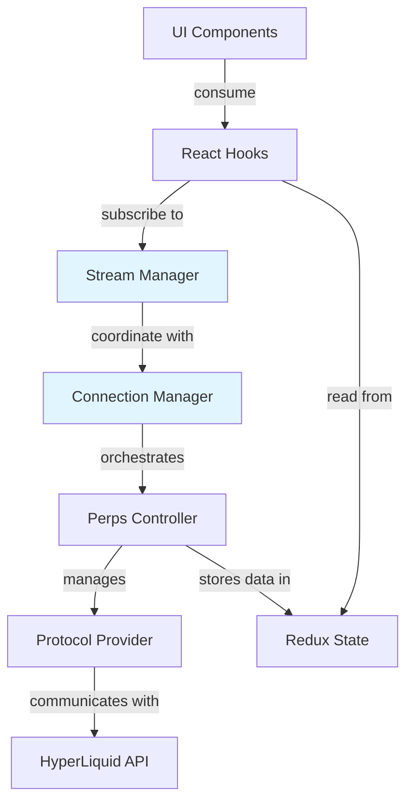

# Perps Architecture

## Overview

The Perps feature enables perpetual futures trading in MetaMask Mobile. This document provides a high-level architectural overview of the codebase structure, key patterns, and references to detailed documentation.

**Location**: `app/components/UI/Perps/`

## Quick Navigation

- **[Connection Architecture](./perps-connection-architecture.md)** - Connection lifecycle, reconnection logic, WebSocket management
- **[Screen Documentation](./perps-screens.md)** - Detailed view documentation
- **[Sentry Integration](./perps-sentry-reference.md)** - Error tracking and monitoring
- **[MetaMetrics Events](./perps-metametrics-reference.md)** - Analytics events
- **[Protocol Documentation](./hyperliquid/)** - HyperLiquid protocol specifics

## Layer Architecture

The Perps system uses a layered architecture where each layer has clear responsibilities:



### Layer Responsibilities

| Layer                  | Purpose                                           | Examples                                           |
| ---------------------- | ------------------------------------------------- | -------------------------------------------------- |
| **UI Components**      | Presentational components, user interactions      | PerpsOrderView, PerpsMarketList, PerpsPositionCard |
| **React Hooks**        | Data access, business logic, state management     | usePerpsTrading, usePerpsMarkets, useLivePrices    |
| **Stream Manager**     | WebSocket subscription management, real-time data | PerpsStreamManager, component-level throttling     |
| **Connection Manager** | Connection lifecycle, reconnection orchestration  | PerpsConnectionManager (singleton)                 |
| **Perps Controller**   | Business logic, provider management, Redux state  | PerpsController (Redux controller)                 |
| **Protocol Provider**  | Exchange-specific API implementation              | HyperLiquidProvider (REST + WebSocket)             |

**See [perps-connection-architecture.md](./perps-connection-architecture.md) for detailed connection flow.**

## Directory Structure

```
/Perps
├── components/       - Reusable UI components
├── Views/           - Main screen-level components
├── hooks/           - React hooks for data access and logic
│   └── stream/      - WebSocket subscription hooks (real-time data)
├── controllers/     - Business logic and Redux state
│   └── providers/   - Protocol-specific implementations
├── providers/       - React context providers
├── services/        - External integrations (WebSocket, HTTP, wallet)
├── utils/           - Pure utility functions
├── types/           - TypeScript type definitions
├── constants/       - Configuration values
├── contexts/        - React contexts
├── selectors/       - Redux selectors by domain
├── styles/          - Shared style utilities
├── Debug/           - Developer tools
├── animations/      - Rive animation files
└── __mocks__/       - Test mocks and fixtures
```

### Components

Reusable UI components organized by feature:

- **Display Components**: LivePriceDisplay, PerpsAmountDisplay, PerpsBadge, PerpsProgressBar, PerpsLoader
- **Form Components**: PerpsSlider, PerpsOrderTypeBottomSheet, PerpsLeverageBottomSheet, PerpsLimitPriceBottomSheet
- **Card Components**: PerpsCard, PerpsPositionCard, PerpsOpenOrderCard, PerpsMarketStatisticsCard
- **List Components**: PerpsMarketList, PerpsRecentActivityList, PerpsWatchlistMarkets
- **Modal Components**: PerpsCancelAllOrdersModal, PerpsCloseAllPositionsModal, PerpsGTMModal
- **Header Components**: PerpsHomeHeader, PerpsMarketHeader, PerpsOrderHeader, PerpsTabControlBar
- **Navigation**: PerpsNavigationCard, PerpsMarketTabs
- **Tooltips**: PerpsBottomSheetTooltip (with content registry), PerpsNotificationTooltip
- **Charts**: TradingViewChart, PerpsCandlestickChartIntervalSelector, FundingCountdown
- **Developer Tools**: PerpsDeveloperOptionsSection

### Views

Main screen-level components representing full pages:

- **PerpsTabView** - Main tab container with navigation
- **PerpsHomeView** - Landing/dashboard screen
- **PerpsMarketListView** - Market browser with search/filters
- **PerpsMarketDetailsView** - Individual market with chart
- **PerpsOrderView** - Order entry form
- **PerpsPositionsView** - Active positions list
- **PerpsClosePositionView** - Single position close flow
- **PerpsCloseAllPositionsView** - Close all positions flow
- **PerpsCancelAllOrdersView** - Cancel all orders flow
- **PerpsTPSLView** - Take profit/stop loss management
- **PerpsTransactionsView** - Transaction history
- **PerpsWithdrawView** - Withdrawal flow
- **PerpsHeroCardView** - Hero/banner cards
- **PerpsEmptyState** - Empty state screens
- **PerpsRedirect** - Routing/redirect logic
- **HIP3DebugView** - Developer debug interface

**See [perps-screens.md](./perps-screens.md) for detailed view documentation.**

### Hooks

React hooks organized by category:

#### Controller Access

- `usePerpsTrading` - Trading operations (place/cancel/close)
- `usePerpsDeposit` - Deposit flow
- `usePerpsDepositQuote` - Deposit quotes
- `usePerpsMarkets` - Market data
- `usePerpsNetwork` - Network configuration
- `usePerpsWithdrawQuote` - Withdrawal quotes

#### State Management

- `usePerpsAccount` - Redux account state
- `usePerpsConnection` - Connection provider context
- `usePerpsPositions` - Position list
- `usePerpsNetworkConfig` - Network state
- `usePerpsOpenOrders` - Open orders list

#### Live Data (Stream Architecture)

- `useLivePrices` - Real-time prices with component-level throttling
- `usePerpsLiveAccount` - Account state updates
- `usePerpsLiveFills` - Order fill notifications
- `usePerpsLiveOrders` - Order updates
- `usePerpsLivePositions` - Position updates
- `usePerpsTopOfBook` - Top-of-book data
- `usePerpsPositionData` - Position data aggregation

#### Calculations

- `usePerpsLiquidationPrice` - Liquidation price calculation
- `usePerpsOrderFees` - Fee calculation
- `useMinimumOrderAmount` - Minimum order calculation
- `usePerpsMarketData` - Market-specific data
- `usePerpsMarketStats` - Market statistics
- `usePerpsFunding` - Funding rate data

#### Validation

- `usePerpsOrderValidation` - Order validation (protocol + UI rules)
- `usePerpsClosePositionValidation` - Close validation
- `useWithdrawValidation` - Withdrawal validation

#### Form Management

- `usePerpsOrderForm` - Order form state
- `usePerpsOrderExecution` - Order execution flow
- `usePerpsClosePosition` - Close position flow
- `usePerpsTPSLForm` - TP/SL form management
- `usePerpsTPSLUpdate` - TP/SL updates

#### UI Utilities

- `useColorPulseAnimation` - Price change animations
- `useBalanceComparison` - Balance comparison
- `useHasExistingPosition` - Position existence check
- `useStableArray` - Array reference stability
- `usePerpsNavigation` - Navigation utilities
- `usePerpsToasts` - Toast notifications

#### Assets/Tokens

- `usePerpsAssetsMetadata` - Asset metadata
- `usePerpsPaymentTokens` - Payment tokens
- `useWithdrawTokens` - Withdrawal tokens

#### Monitoring & Tracking

- `usePerpsEventTracking` - Analytics events
- `usePerpsDataMonitor` - Data monitoring
- `usePerpsMeasurement` - Performance measurement
- `usePerpsDepositStatus` - Deposit status tracking
- `usePerpsWithdrawStatus` - Withdrawal status tracking

### Controllers

Business logic and Redux state management:

- **PerpsController** (`controllers/PerpsController.ts`) - Main controller managing providers, orders, positions, market data
- **PerpsProvider** (`controllers/providers/HyperLiquidProvider.ts`) - HyperLiquid protocol implementation
- **Selectors** (`controllers/selectors.ts`) - Redux state selectors
- **Error Codes** (`controllers/perpsErrorCodes.ts`) - Error code definitions

### Services

External integrations and infrastructure:

- **HyperLiquidClientService** - HTTP client for REST API
- **HyperLiquidSubscriptionService** - WebSocket subscription management
- **HyperLiquidWalletService** - Wallet operations
- **PerpsConnectionManager** - Connection lifecycle orchestration (singleton)

### Providers

React context providers:

- **PerpsConnectionProvider** - Connection state and methods for UI
- **PerpsStreamManager** - WebSocket stream management with caching
- **PerpsOrderContext** - Order form context

### Utils

Pure utility functions organized by domain:

- **Calculations**: orderCalculations, positionCalculations, pnlCalculations
- **Formatting**: formatUtils, amountConversion, textUtils
- **Validation**: hyperLiquidValidation, tpslValidation
- **Transforms**: marketDataTransform, transactionTransforms, arbitrumWithdrawalTransforms
- **Market Utils**: marketUtils, marketHours, sortMarkets
- **Error Handling**: perpsErrorHandler, translatePerpsError
- **Protocol**: hyperLiquidAdapter, hyperLiquidOrderBookProcessor
- **Blockchain**: idUtils, tokenIconUtils

## Key Patterns

### Validation Flow

Protocol validation (provider) → UI validation (hook) → Display errors (component)

```typescript
// Provider validates protocol rules
provider.validateOrder(order) // throws if invalid

// Hook adds UI-specific rules
usePerpsOrderValidation(orderParams) // returns { isValid, errors }

// Component displays errors
{errors.amount && <ErrorMessage>{errors.amount}</ErrorMessage>}
```

### Data Flow

Controller → Redux Store → Hooks → Components

```typescript
// Controller fetches and stores
await controller.getAccountState() // updates Redux

// Hook reads from Redux
const account = usePerpsAccount() // subscribes to Redux

// Component renders
<Text>{account.balance}</Text>
```

### Real-time Updates

WebSocket → Stream Manager → Hooks → Components

```typescript
// Stream Manager maintains single WebSocket connection
streamManager.subscribeToPrices(['BTC', 'ETH'])

// Hook throttles updates at component level
const prices = useLivePrices({
  symbols: ['BTC', 'ETH'],
  throttleMs: 2000, // 2s updates
})

// Component renders with throttled data
<Text>{prices.BTC?.price}</Text>
```

**See [perps-connection-architecture.md](./perps-connection-architecture.md) for WebSocket architecture details.**

### Form Management

Component input → Hook state → Validation → Controller action

```typescript
// Component captures input
<Input onChangeText={setAmount} />

// Hook manages form state
const { amount, setAmount, errors } = usePerpsOrderForm()

// Hook validates
const validation = usePerpsOrderValidation({ amount, ... })

// Hook executes when valid
if (validation.isValid) {
  await controller.placeOrder(params)
}
```

### ReadOnly Mode (Lightweight Queries)

For discovery use cases that need perps data without full initialization:

```typescript
// Check if perps market exists for an asset (usePerpsMarketForAsset hook)
const markets = await perpsController.getMarkets({
  symbols: ['ETH'],
  readOnly: true,
});

// Query positions for any address without WebSocket, wallet setup, etc.
const positions = await perpsController.getPositions({
  readOnly: true,
  userAddress: '0x...',
});

// Check if user has perps funds (for discovery banners)
const accountState = await perpsController.getAccountState({
  readOnly: true,
  userAddress: '0x...',
});
```

**Supported methods:** `getMarkets`, `getPositions`, `getAccountState`

**When to use:**

- Spot token detail pages checking for perps market availability (see `usePerpsMarketForAsset`)
- Token detail pages showing perps positions
- Discovery banners checking if user has perps funds
- Portfolio analytics without entering perps context

**How it works:**

1. Bypasses `getActiveProvider()` check (works even when controller is not initialized)
2. Creates standalone HTTP client via `createStandaloneInfoClient` (see `utils/standaloneInfoClient.ts`)
3. No WebSocket, wallet, or account setup required
4. Main DEX only (no HIP-3 multi-DEX aggregation in readOnly mode)

**Limitations:**

- No TP/SL data on positions (would require additional API calls)
- No spot balance aggregation on account state
- No real-time updates (HTTP only, no WebSocket)

### Cache Invalidation

ReadOnly queries use client-side caching for performance (e.g., 30s TTL for positions).
The `PerpsCacheInvalidator` service provides loosely-coupled cache invalidation when
data changes in the perps environment:

**Hook side (consumers):**

```typescript
import { PerpsCacheInvalidator } from '../services/PerpsCacheInvalidator';

// Subscribe to invalidation events
useEffect(() => {
  const unsubPositions = PerpsCacheInvalidator.subscribe('positions', () => {
    clearMyCache();
    refetch();
  });
  const unsubAccount = PerpsCacheInvalidator.subscribe('accountState', () => {
    clearMyCache();
    refetch();
  });
  return () => {
    unsubPositions();
    unsubAccount();
  };
}, []);
```

**Service side (producers):**

```typescript
// After successful position change (TradingService)
PerpsCacheInvalidator.invalidate('positions');
PerpsCacheInvalidator.invalidate('accountState');

// After successful withdrawal (AccountService)
PerpsCacheInvalidator.invalidate('accountState');
```

**Cache types:**

- `positions` - Position data caches (invalidated on order placement, position close)
- `accountState` - Account balance/state caches (invalidated on trades, withdrawals)
- `markets` - Market data caches (rarely changes)

This pattern allows token detail pages to show accurate position status even after
the user closes positions in the perps environment, without polling or WebSocket overhead.

## Stream Architecture

**Single WebSocket connections shared across all components with component-level debouncing.**

### Benefits

- **90% fewer WebSocket connections** - One subscription per data type (not per component)
- **No subscription interference** - Each component controls its own update rate
- **Component-level control** - Different throttle rates for different views
- **Instant first render** - Pre-warmed connections provide cached data immediately
- **Zero parent re-renders** - Updates go directly to subscribers

### How It Works

1. **PerpsConnectionManager** pre-warms critical subscriptions on connection
2. **PerpsStreamManager** maintains single WebSocket subscriptions with reference counting
3. **Stream Hooks** provide component-level throttling:

```typescript
// Order view: stable prices (10s throttle)
const prices = useLivePrices({ symbols: ['BTC'], throttleMs: 10000 });

// Market list: responsive updates (2s throttle)
const prices = useLivePrices({ symbols: allSymbols, throttleMs: 2000 });

// Charts: near real-time (100ms throttle)
const prices = useLivePrices({ symbols: ['BTC'], throttleMs: 100 });
```

4. **Shared cache** ensures instant data availability for all subscribers

**See [perps-connection-architecture.md](./perps-connection-architecture.md) for detailed stream architecture.**

## Quick Reference

| Need           | Use Hook                                     | Use Component             |
| -------------- | -------------------------------------------- | ------------------------- |
| Place order    | `usePerpsTrading` + `usePerpsOrderExecution` | PerpsOrderView            |
| Validate order | `usePerpsOrderValidation`                    | -                         |
| Get prices     | `useLivePrices`                              | LivePriceDisplay          |
| Manage form    | `usePerpsOrderForm`                          | -                         |
| Calculate fees | `usePerpsOrderFees`                          | PerpsFeesDisplay          |
| Check position | `useHasExistingPosition`                     | -                         |
| Close position | `usePerpsClosePosition` + validation         | PerpsClosePositionView    |
| Get account    | `usePerpsAccount`                            | -                         |
| Deposit funds  | `usePerpsDeposit`                            | PerpsMarketBalanceActions |
| Withdraw funds | `usePerpsWithdrawQuote` + validation         | PerpsWithdrawView         |
| Show market    | -                                            | PerpsMarketDetailsView    |
| List markets   | `usePerpsMarkets`                            | PerpsMarketListView       |

## Error Handling

Perps uses a multi-layered error handling approach:

1. **Provider Layer** - Protocol-specific errors, logs to Sentry
2. **Controller Layer** - Business logic errors, updates Redux, logs to Sentry
3. **Manager Layer** - Connection errors, sets local state, logs to DevLogger
4. **Hook Layer** - Exposes errors to UI
5. **Component Layer** - Displays errors to user

**See [perps-sentry-reference.md](./perps-sentry-reference.md) for error tracking details.**

## Analytics

All user interactions are tracked via MetaMetrics events:

- Trading actions (orders, closes, cancels)
- Market interactions (views, searches, filters)
- Connection events (connect, disconnect, errors)
- Deposit/withdrawal flows

**See [perps-metametrics-reference.md](./perps-metametrics-reference.md) for complete event catalog.**

## Development Guidelines

### Adding a New Hook

1. Determine category (Controller Access, State Management, Live Data, etc.)
2. Follow naming convention: `usePerps[Feature][Action]`
3. Keep single responsibility
4. Add comprehensive tests
5. Document in this file

### Adding a New Component

1. Create in appropriate subdirectory under `components/`
2. Include `.styles.ts` file for styles
3. Add tests in `__tests__/` subdirectory
4. Export from component directory's `index.ts`
5. Use existing shared components where possible

### Adding a New View

1. Create in `Views/` directory
2. Follow naming: `Perps[Feature]View`
3. Use hooks for data access (not direct controller calls)
4. Add to navigation in `routes/index.tsx`
5. Document in [perps-screens.md](./perps-screens.md)

### Before Committing

```bash
# Format code
yarn prettier --write 'app/components/UI/Perps/**/*.{ts,tsx}'

# Check for errors
yarn eslint app/components/UI/Perps/**/*.{ts,tsx}

# Run tests
yarn jest app/components/UI/Perps/ --no-coverage
```

## Testing

- **Test Coverage**: ~95% across hooks, components, and utilities
- **Test Location**: Co-located `__tests__/` directories or `.test.ts` files
- **Mock System**: Centralized mocks in `__mocks__/` directory

Key testing utilities:

- `perpsHooksMocks.ts` - Mock hooks
- `perpsComponentMocks.ts` - Mock components
- `providerMocks.ts` - Mock providers
- `streamHooksMocks.ts` - Mock stream hooks

## Code Quality

The codebase maintains high quality standards:

- **Test Coverage**: ~95% across hooks, components, and utilities
- **Architecture**: Tight cohesion with 59% of files used only internally
- **Patterns**: Consistent use of hooks, components, and utilities
- **Documentation**: Comprehensive inline and external documentation

## Protocol Integration

Currently integrated with HyperLiquid protocol:

- **REST API** - Account queries, order placement, market data
- **WebSocket** - Real-time prices, order fills, position updates
- **Wallet Integration** - Ethereum signing for orders

**See [hyperliquid/](./hyperliquid/) directory for protocol-specific documentation.**

## Migration Notes

### HIP-3 Upgrade (Nov 2024)

Major protocol upgrade with webData3 migration:

- Single WebSocket connection for positions + orders
- Improved performance and reliability
- See HIP3DebugView for debugging tools

### Stream Architecture (Oct 2024)

Migrated from per-component subscriptions to shared streams:

- Old: `usePerpsPrices` (deprecated)
- New: `useLivePrices` with component-level throttling
- 90% reduction in WebSocket connections

## Additional Resources

- **[Perps Screens](./perps-screens.md)** - Detailed view documentation
- **[Connection Architecture](./perps-connection-architecture.md)** - Connection management deep dive
- **[Sentry Integration](./perps-sentry-reference.md)** - Error tracking
- **[MetaMetrics Events](./perps-metametrics-reference.md)** - Analytics events
- **[HyperLiquid Docs](./hyperliquid/)** - Protocol documentation

## Questions?

For architecture questions or contributions, refer to the specific documentation linked above or consult the team.
