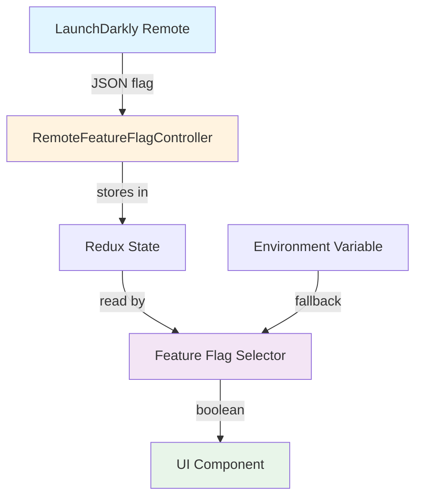

# Perps Feature Flags Framework

## Overview

Framework for controlling Perps feature availability through LaunchDarkly with local fallback support. Supports version-gated rollouts and gradual feature releases.

**Key Design Principles:**

- LaunchDarkly is the single source of truth for feature enablement
- Version-gated flags ensure features only activate on compatible app versions
- Local environment variables provide development/testing fallback
- Graceful degradation when LaunchDarkly is unavailable

## Architecture



## Flag Types

### Version-Gated Boolean Flags

Used for feature on/off toggles with version requirements.

**Interface:**

```typescript
interface VersionGatedFeatureFlag {
  enabled: boolean;
  minimumVersion: string;
}
```

**Example LaunchDarkly JSON:**

```json
{
  "enabled": true,
  "minimumVersion": "7.60.0"
}
```

**Behavior:**

- `enabled: true` + version >= `minimumVersion` = feature ON
- `enabled: true` + version < `minimumVersion` = feature OFF
- `enabled: false` = feature OFF (regardless of version)
- Invalid/missing flag = fallback to local environment variable

### String Flags (for A/B Tests)

See [Perps A/B Testing Framework](./perps-ab-testing.md) for variant-based flags.

---

## Implementation Guide

### Adding a New Feature Flag

#### 1. Define the Selector

**File:** `app/components/UI/Perps/selectors/featureFlags/index.ts`

```typescript
/**
 * Selector for My Feature flag
 * Controls visibility of My Feature in the UI
 *
 * @returns boolean - true if feature should be shown, false otherwise
 */
export const selectMyFeatureEnabledFlag = createSelector(
  selectRemoteFeatureFlags,
  (remoteFeatureFlags) => {
    // Choose default behavior:
    // - Use `=== 'true'` for disabled by default (must explicitly enable)
    // - Use `!== 'false'` for enabled by default (must explicitly disable)
    const localFlag = process.env.MM_PERPS_MY_FEATURE_ENABLED === 'true';
    const remoteFlag =
      remoteFeatureFlags?.perpsMyFeatureEnabled as unknown as VersionGatedFeatureFlag;

    // Remote takes precedence, fallback to local
    return validatedVersionGatedFeatureFlag(remoteFlag) ?? localFlag;
  },
);
```

**Default Behavior Options:**

| Pattern       | Default  | Use Case                                              |
| ------------- | -------- | ----------------------------------------------------- |
| `=== 'true'`  | Disabled | New experimental features                             |
| `!== 'false'` | Enabled  | Features that should be on unless explicitly disabled |

#### 2. Add Mock Flag

**File:** `app/components/UI/Perps/mocks/remoteFeatureFlagMocks.ts`

```typescript
export const mockedPerpsFeatureFlagsEnabledState: Record<
  string,
  VersionGatedFeatureFlag
> = {
  // ... existing flags ...
  perpsMyFeatureEnabled: mockEnabledPerpsLDFlag,
};
```

#### 3. Add Environment Variable

**File:** `.js.env.example`

```bash
export MM_PERPS_MY_FEATURE_ENABLED="true"
```

#### 4. Use in Component

```typescript
import { useSelector } from 'react-redux';
import { selectMyFeatureEnabledFlag } from '../../selectors/featureFlags';

const MyComponent = () => {
  const isMyFeatureEnabled = useSelector(selectMyFeatureEnabledFlag);

  if (!isMyFeatureEnabled) {
    return null; // or alternative UI
  }

  return <MyFeature />;
};
```

#### 5. Add Unit Tests

**File:** `app/components/UI/Perps/selectors/featureFlags/index.test.ts`

Follow existing test patterns covering:

- Default behavior (when env var not set)
- Remote flag takes precedence over local
- Version gating validation
- Fallback to local when remote is invalid/unavailable

---

## Available Flags Reference

### Version-Gated Boolean Flags

| Redux Property                                     | LaunchDarkly Key                                         | Env Variable                                   | Default | Purpose                   |
| -------------------------------------------------- | -------------------------------------------------------- | ---------------------------------------------- | ------- | ------------------------- |
| `perpsPerpTradingEnabled`                          | `perps-perp-trading-enabled`                             | `MM_PERPS_ENABLED`                             | false   | Main Perps feature toggle |
| `perpsPerpTradingServiceInterruptionBannerEnabled` | `perps-perp-trading-service-interruption-banner-enabled` | `MM_PERPS_SERVICE_INTERRUPTION_BANNER_ENABLED` | false   | Service disruption banner |
| `perpsPerpGtmOnboardingModalEnabled`               | `perps-perp-gtm-onboarding-modal-enabled`                | `MM_PERPS_GTM_MODAL_ENABLED`                   | false   | GTM onboarding modal      |
| `perpsOrderBookEnabled`                            | `perps-order-book-enabled`                               | `MM_PERPS_ORDER_BOOK_ENABLED`                  | false   | Order Book feature        |
| `perpsFeedbackEnabled`                             | `perps-feedback-enabled`                                 | `MM_PERPS_FEEDBACK_ENABLED`                    | false   | Feedback button on home   |

### A/B Test Flags

| Redux Property           | LaunchDarkly Key            | Variants                | Purpose                          |
| ------------------------ | --------------------------- | ----------------------- | -------------------------------- |
| `perpsAbtestButtonColor` | `perps-abtest-button-color` | `control`, `monochrome` | Button color A/B test (TAT-1937) |

### Configuration Flags

These flags are managed via `FeatureFlagConfigurationService` and control runtime configuration:

| Redux Property                          | LaunchDarkly Key                              | Env Variable                      | Purpose                     |
| --------------------------------------- | --------------------------------------------- | --------------------------------- | --------------------------- |
| `perpsHip3Enabled`                      | `perps-hip3-enabled`                          | `MM_PERPS_HIP3_ENABLED`           | HIP-3 markets master switch |
| `perpsHip3AllowlistMarkets`             | `perps-hip3-allowlist-markets`                | `MM_PERPS_HIP3_ALLOWLIST_MARKETS` | HIP-3 market allowlist      |
| `perpsHip3BlocklistMarkets`             | `perps-hip3-blocklist-markets`                | `MM_PERPS_HIP3_BLOCKLIST_MARKETS` | HIP-3 market blocklist      |
| `perpsPerpTradingGeoBlockedCountriesV2` | `perps-perp-trading-geo-blocked-countries-v2` | `MM_PERPS_BLOCKED_REGIONS`        | Geo-blocking regions list   |

> **Note:** `perpsPerpTradingGeoBlockedCountries` (without V2) is deprecated. Use the V2 variant.

---

## LaunchDarkly Configuration

### Naming Convention

| Format                    | Example                    |
| ------------------------- | -------------------------- |
| LaunchDarkly (kebab-case) | `perps-order-book-enabled` |
| Redux state (camelCase)   | `perpsOrderBookEnabled`    |

### Flag Structure (JSON type)

```json
{
  "variations": [
    {
      "name": "Enabled",
      "value": {
        "enabled": true,
        "minimumVersion": "7.60.0"
      }
    },
    {
      "name": "Disabled",
      "value": {
        "enabled": false,
        "minimumVersion": "0.0.0"
      }
    }
  ],
  "offVariation": 1,
  "fallthrough": {
    "variation": 0
  }
}
```

### Version Gating

The `minimumVersion` field ensures features only activate on compatible app versions:

- **Format:** Semantic version string (e.g., `"7.60.0"`)
- **Comparison:** Uses `compare-versions` library with `>=` operator
- **Use case:** Prevent feature activation on older app versions that lack required code

---

## Troubleshooting

### Flag Not Taking Effect

1. **Check Redux state:** Verify flag exists in `RemoteFeatureFlagController.remoteFeatureFlags`
2. **Check version:** Ensure app version meets `minimumVersion` requirement
3. **Check selector:** Verify selector is imported and used correctly

### Version Gating Not Working

1. **Verify `minimumVersion` format:** Must be valid semver string
2. **Check app version:** `getVersion()` from `react-native-device-info`
3. **Check comparison:** Uses `>=` operator

### Local Flag Not Overriding

1. **Restart Metro bundler** after changing `.js.env`
2. **Check override setting:** `isRemoteFeatureFlagOverrideActivated` must be true
3. **Verify spelling:** Environment variable names are case-sensitive

---

## Related Files

- **Selectors:** `app/components/UI/Perps/selectors/featureFlags/index.ts`
- **Mocks:** `app/components/UI/Perps/mocks/remoteFeatureFlagMocks.ts`
- **Tests:** `app/components/UI/Perps/selectors/featureFlags/index.test.ts`
- **Version validation:** `app/util/remoteFeatureFlag/index.ts`
- **Controller init:** `app/core/Engine/controllers/remote-feature-flag-controller-init.ts`
- **Configuration service:** `app/components/UI/Perps/controllers/services/FeatureFlagConfigurationService.ts`

---

## Related Documentation

- [Perps A/B Testing Framework](./perps-ab-testing.md)
- [Perps Connection Architecture](./perps-connection-architecture.md)
- [Perps MetaMetrics Reference](./perps-metametrics-reference.md)
