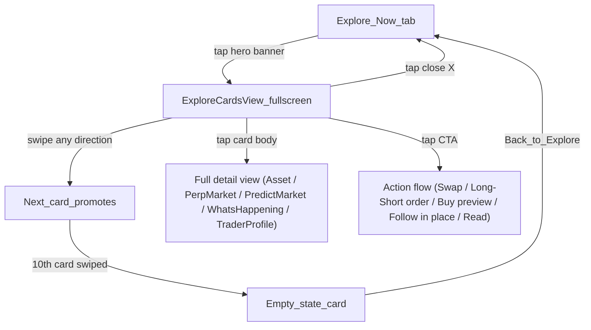

# Explore Cards — Swipeable Trending Deck (POC Spec)

Status: POC spec, branch-only (no feature flag, no remote gating).
Owner: Assets/Explore experimentation.
Target surface: Explore tab > Now sub-tab.

---

## 1. Overview and goals

Normies get decision fatigue. The Explore > Now feed is dense: five sections, dozens of tappable rows, lots of choices. This POC replaces "scan and choose" with "swipe and react": a full-screen, card-swiping-style deck of the top ~10 trending things right now, one card at a time, each with a single obvious action under the thumb.

Goals:

- One-tap entry from the Now tab into a focused, swipeable card experience.
- A jumbled mix of five content types: spot crypto, perps, news, top trader, predictions.
- Every card has a CTA zone at the bottom (easy thumb placement) that triggers a real, existing flow (swap, long/short, bet, follow, read).
- Tapping the card body opens the full detail view for that item.
- Delightful animations: card-swiping-style swipe physics, staggered deck entrance, satisfying empty state.
- When the deck is exhausted: "You're all caught up — come back in an hour."

Non-goals (POC): feature flag plumbing, server-driven deck composition, persistence across app restarts, meaningful swipe directions (left/right are both "next"), copy trading.

## 2. UX flow



Key interaction rules:

- Swipes are **purely navigational**: swiping left or right (or flinging) advances to the next card. There is no like/dislike semantic.
- CTA taps navigate into the **real** flows and leave the deck (except Follow, which is in-place). Returning via back returns to the deck at the same position (the deck screen stays on the stack).
- Deck content is keyed to the current hour. Completing the deck and reopening within the same hour shows the empty state immediately. A new hour rebuilds the deck (in-memory only — see section 8).

## 3. Entry point: hero banner on the Now tab

A new section rendered **first** in the Now tab's section list.

- File: new component `ExploreCardsBanner` under the feature folder (section 9), wired into the `sections` `useMemo` in `app/components/Views/TrendingView/tabs/NowTab.tsx` as the first item (before the `predict` section), with section key `explore_cards`.
- Visual: a wide banner (full content width, ~96–110pt tall, radius 16) wrapped
  in the same `AnimatedGradientBorder` as the deck cards, containing:
  - Left: a mini stacked-cards motif — 3 small rounded rectangles fanned at
    slight rotations (-10°, 0°, 10°), each filled with a deck accent gradient
    (perp / trader / crypto); the front card wears a small inverse sparkle.
  - Middle: title "Fresh picks, dealt for you" and subtitle "Tokens, perps,
    predictions, news & traders" — intentionally vague, no counts (locale
    keys, section 9).
  - Right: arrow in a muted circular chip.
- Subtle idle animation: the mini-stack gently oscillates rotation (±2°) on a slow `withRepeat(withTiming(...))` loop. Cheap and eye-catching.
- Tap: `navigation.navigate(Routes.EXPLORE_CARDS)` + analytics event (section 11).
- The banner renders unconditionally (no gating). If all five upstream feeds fail/are empty at deck-open time, the deck screen shows its error/empty state — the banner does not need its own data awareness.

## 4. Deck screen: `ExploreCardsView`

New full-screen route, registered as a root `NativeStack.Screen` sibling in `app/components/Nav/Main/MainNavigator.js` (same pattern as `Routes.WHATS_HAPPENING_DETAIL`), with `fullScreenModalSlideFromBottomNativeOptions` from `app/constants/navigation/clearStackNavigatorOptions.ts` so it slides up over the tab bar like the Card root does.

- Route constant: add `EXPLORE_CARDS: 'ExploreCards'` to `app/constants/navigation/Routes.ts` near `TRENDING_VIEW` / `WHATS_HAPPENING_DETAIL`.
- **Wrap the screen component in its own `PredictPreviewSheetProvider`** (from `app/components/UI/Predict/contexts`). The provider in `MainNavigator` is mounted above the home `Tab.Navigator` only, so this root-level sibling screen does not inherit it. Without this, the prediction card's Yes/No CTA (`usePredictPreviewSheet().openBuySheet`) will throw.

Layout (top to bottom):

1. **Header row**: close button (X, top-left, `navigation.goBack()`), centered title "Trending now", progress label "3 of 10" top-right. Below it, a thin segmented progress bar (10 segments, filled segments animate width/opacity with `withTiming` as cards are consumed).
2. **Card stage**: fills remaining space. Cards are `screenWidth - 32` wide, aspect ~3:4 (capped so the CTA zone stays above the home indicator). Up to 3 cards visible: the active card plus two behind it at decreasing scale/increasing translateY (see section 7).
3. Everything else is on the cards themselves — no bottom chrome, keeping the CTA zone the lowest touch target.

Loading state: while the deck is composing (feeds in flight), render a shimmering skeleton stack — 3 stacked grey rounded cards with the standard skeleton pulse, plus disabled header. Compose the deck as soon as **at least 6 cards** worth of data across any types is available or a 4s timeout elapses (build with whatever arrived); if literally nothing arrives, show an inline error card with a Retry button.

## 5. Card types

All cards share a common frame:

- `rounded-3xl`, `bg-default` surface, `border border-muted`, generous padding, subtle shadow.
- **Top row**: content-type pill (label + tint: Crypto / Perp / News / Trader / Prediction) and the card's deck rank ("#3").
- **Body**: type-specific, defined below. The entire body is tappable → full detail view.
- **CTA zone**: bottom-anchored, min height 56pt, full-width button(s) — the easiest thumb target on the card. Buttons use design-system `Button` / `Box` + `useTailwind`; dual-CTA layouts are a two-column row with 12pt gap.

Data hooks are called once at the deck level inside `useExploreCardsDeck` (section 6) — the card components are pure/presentational and receive a typed `DeckCard` item.

### 5.1 Crypto (spot token) card

- Data: `useTrendingRequest` (`app/components/UI/Trending/hooks/useTrendingRequest/useTrendingRequest.ts`) with `sort: 'h1_trending'`, `filterLowQuality: true`. Item type: `TrendingAsset` from `@metamask/assets-controllers`.
- Body: large token avatar (`getTrendingTokenImageUrl(assetId)` via `RemoteImage`/DS `AvatarToken`), symbol + name, price, **1h change** (`priceChangePct.h1`) as the hero stat (big, green/red), 24h change + volume (`aggregatedUsdVolume`) + market cap as secondary stats.
- Body tap → Asset detail: reuse the param mapping from `useTrendingTokenPress` / `getAssetNavigationParams` (see `TrendingTokenRowItem`) and push `Routes.WALLET.ASSET` with `isFromTrending: true`, `source: 'explore_cards'`.
- CTA: single **Swap** button → `useSwapBridgeNavigation` (`app/components/UI/Bridge/hooks/useSwapBridgeNavigation`) `goToSwaps(undefined, destToken)` with the card's token as the destination (buy intent).

### 5.2 Perp card

- Data: `usePerpsTopMovers` (`app/components/UI/Perps/hooks/usePerpsTopMovers.ts`) — take top gainers. Item type: `PerpsMarketData`.
- Body: `PerpsTokenLogo`, symbol + name, price, 24h change % as hero stat, leverage badge (`maxLeverage`, e.g. "40x"), volume + funding rate as secondary stats.
- Body tap → `navigate(Routes.PERPS.ROOT, { screen: Routes.PERPS.MARKET_DETAILS, params: { market, source, source_section: 'explore_cards' } })`.
- CTA: dual **Long** / **Short** buttons (green/red) → `navigate(Routes.PERPS.ROOT, { screen: Routes.PERPS.ORDER_REDIRECT, params: { direction, asset: market.symbol } })`.
- Both must nest through `PERPS.ROOT` because this screen is outside the Perps
  stack — `usePerpsNavigation`'s direct `navigate(Routes.PERPS.MARKET_DETAILS)`
  only resolves inside that stack and is silently dropped elsewhere; orders go
  via `ORDER_REDIRECT` so the perps WebSocket connects before
  `depositWithOrder` (same pattern as TokenDetails' `usePerpsActions`).

### 5.3 Prediction card

- Data: `usePredictMarketData({ category: 'trending' })` (`app/components/UI/Predict/hooks/usePredictMarketData.tsx`). Item type: `PredictMarket`. Filter to binary (Yes/No single-outcome) markets for a clean card; skip `market.game` sports markets in the POC.
- Body: market image, question (`title`, up to 3 lines), big "% chance" figure (`Math.round(yesToken.price * 100)`), volume as secondary stat.
- Body tap → `Routes.PREDICT.ROOT` / screen `Routes.PREDICT.MARKET_DETAILS` with `{ marketId, entryPoint: 'explore_cards' }` (mirror `FeaturedCarouselCard.handleCardPress`).
- CTA: dual **Yes N¢** / **No N¢** buttons → `usePredictPreviewSheet().openBuySheet({ market, outcome, outcomeToken, entryPoint })`, wrapped in `usePredictActionGuard().executeGuardedAction` exactly as `FeaturedCarouselCard.handleBuy` does. Opens as a sheet over the deck — the user keeps their deck position.

### 5.4 News card

- Data: `useWhatsHappening` (`app/components/UI/WhatsHappening/hooks/useWhatsHappening.ts`). Item type: `WhatsHappeningItem`. Note: `useWhatsHappening` internally checks `selectWhatsHappeningEnabled`; if the flag is off in the current environment the feed returns empty and its deck slots redistribute (section 6).
- Body: no hero image exists on these items — design text-first: category tag (`category`) + impact chip (`impact`: positive/negative/neutral tinting), headline (`title`, large type, up to 4 lines), `description` (2 lines), related-asset avatars row (`relatedAssets` → token avatars, up to 4).
- Body tap and CTA both → `Routes.WHATS_HAPPENING_DETAIL` with `{ initialIndex, source: 'explore_cards' }`.
- CTA: single **Read more** button.

### 5.5 Top trader card

- Data: `useTopTraders` (`app/components/Views/Homepage/Sections/TopTraders/hooks/useTopTraders.ts`) — take the #1 trader not already followed (fall back to #1 overall). Item shape: `TopTrader` (rank, username, avatarUri, percentageChange = 7d ROI, pnlValue = 7d PnL, isFollowing).
- Body: avatar (with `Identicon` fallback), username, rank badge ("#1 this week"), 7d ROI % as hero stat, 7d PnL as secondary.
- Body tap → `Routes.SOCIAL_LEADERBOARD.PROFILE` with `{ traderId, traderName, traderAddress, source: 'explore_cards', traderRank }`.
- CTA: single **Follow** button → `useFollowToggle(profileId).toggle({ source: 'explore_cards', ... })`. **In-place**: optimistic flip to "Following ✓" with a success haptic; the user stays on the card and can keep swiping. This is the one CTA that does not navigate away.

## 6. Deck composition

New hook `useExploreCardsDeck` — the only place that touches data.

Config (constants file, section 10):

```ts
export const DECK_SIZE = 20;
export const DECK_MIX: Record<DeckCardType, number> = {
  crypto: 6,
  perp: 3,
  prediction: 4,
  news: 4,
  trader: 3,
};
```

Algorithm:

1. Call the five hooks above. Map each feed's top items into a discriminated union `DeckCard = { type: 'crypto', data: TrendingAsset } | { type: 'perp', ... } | ...`, taking `DECK_MIX[type]` items per type (over-fetch nothing; slice the hook results).
2. **Redistribution**: if a type yields fewer items than its quota (feed empty, flag off, error), redistribute the shortfall to the other types in priority order crypto → perp → prediction → news → trader, pulling further down those feeds' lists. The deck may end up smaller than `DECK_SIZE` if everything is thin — that's fine.
3. **Jumble with constraints**: deterministic shuffle seeded by the current hour (`seed = Math.floor(Date.now() / 3_600_000)`, any small seeded PRNG like mulberry32 inlined as a util). After shuffling, do a single repair pass: walk the array and when `deck[i].type === deck[i-1].type`, swap `deck[i]` with the next element of a different type. Guarantees variety without true backtracking.
4. First card should preferably be a crypto card (most universally legible); if the shuffle puts another type first, swap the first crypto card into position 0.
5. Expose `{ deck, isLoading, isError, retry, reshuffle }`. The hour seed means everyone gets a stable deck for the hour and it naturally changes on the next hour; `reshuffle` swaps in a random seed and re-deals immediately (restart CTA).
6. **Freeze rule**: the deck is composed exactly once per seed — when every feed has settled (only trusted after a 500ms arming grace, since some hooks report not-loading on their first render) or when the 4s timeout elapses. Composing any earlier freezes a mono-type deck from whichever feed answers first (in practice the perps stream).

## 7. Animation and haptics spec

Stack: `react-native-reanimated` 4.x + `react-native-gesture-handler` 2.x — already installed, **no new dependencies**. Reference implementations to copy patterns from:

| Pattern                                                   | Steal from                                                              |
| --------------------------------------------------------- | ----------------------------------------------------------------------- |
| Pan gesture + threshold/velocity + `withSpring` snap-back | `app/component-library/components/Toast/Toast.tsx` (`swipeGesture`)     |
| Stacked card layers (scale/translateY/opacity/zIndex)     | `app/components/UI/Carousel/StackCard/StackCard.tsx`                    |
| Screen-level slide-up                                     | `fullScreenModalSlideFromBottomNativeOptions`                           |
| Haptics                                                   | `app/util/haptics` (`useHaptics`, `ImpactMoment`, `NotificationMoment`) |

### 7.1 Swipe (the core feel)

- `Gesture.Pan()` on the top card only. Shared values `translateX`, `translateY`.
- While dragging: card follows the finger 1:1; rotation = `interpolate(translateX, [-width, 0, width], [-12, 0, 12])` degrees, anchored feel via a small extra translateY.
- Behind cards react live: every layer derives its style from a single
  **cumulative** progress shared value (`deckIndex - progress`, where progress
  rests at the active card's index and animates to `+1` during a fly-off).
  Progress never resets — the earlier 0→1-with-JS-reset design raced the React
  commit and produced a one-frame "pop" on discard.
- Cards fill the stage (thumb-reach CTAs); the stack reveals at the top edge —
  each behind-card peeks `STACK_PEEK_STEP` above the one in front, with the
  center-origin scale counteracted using the measured stage height so bottoms
  stay tucked behind the active card.
- Release:
  - Commit if `|translateX| > 0.4 * width` **or** `|velocityX| > 800`.
  - Commit: `withTiming` the card off-screen in the drag direction (translateX to ±1.5 × width, continue the rotation, ~260ms, ease-out), fade opacity over the last 30%; on completion (`runOnJS`) pop the card from state so card-2 becomes the new gesture target. Medium impact haptic on commit.
  - Cancel: `withSpring` translateX/translateY back to 0 (config like `TOAST_SPRING_CONFIG` — snappy, minimal bounce). No haptic.
- Also support **tap-to-advance affordance**: none — swiping is the only advance gesture (keeps the mechanic pure); the progress bar communicates position.

### 7.2 Deck entrance

On mount (after data resolves): the 3 visible cards cascade in — each starts at `translateY: 40, opacity: 0, scale: 0.9` and springs to its stack position with `withDelay(index * 80, withSpring(...))`. Combined with the screen's slide-from-bottom, the whole thing feels layered.

### 7.3 Empty state

When the last card commits its fly-off:

- The empty-state card is already sitting at the back of the stack (it is a permanent last "card" rendered behind everything) and springs to full scale/position like any promotion — then plays a one-shot flourish: a slight overshoot scale pulse (`1 → 1.04 → 1`) plus success notification haptic.
- Ambient animation: the checkmark badge floats on a slow sine loop and three sparkle icons twinkle (opacity/scale/wiggle loops, staggered delays), inside a celebration-gradient border.
- Content: title "You're all caught up", body "Fresh picks arrive at the top of the hour", a live countdown ("New cards in 23 min" — derived from the hour seed, ticking every minute), a primary **Deal a new deck** button (clears the completion marker, reshuffles with a random seed, remounts the deck so the entrance cascade replays), and a secondary **Back to Explore** button (`navigation.goBack()`).
- No CTA-zone styling differences: the buttons sit in the same thumb zone as other cards' CTAs.

### 7.3b Card border treatment

Every card is wrapped in `AnimatedGradientBorder`: a 2pt gradient ring using a
per-type two-stop accent from the raw `brandColor` palette (crypto blue→purple,
perp orange→yellow, prediction purple→pink, news blue→indigo, trader
green→lime). A reversed copy of the gradient is stacked on top and cross-faded
in a 2.2s auto-reversing loop so the colours appear to travel around the frame.

### 7.4 Haptics summary

| Moment         | API                                                                                                                                                                                              |
| -------------- | ------------------------------------------------------------------------------------------------------------------------------------------------------------------------------------------------ |
| Swipe commit   | `playImpact` — reuse an existing `ImpactMoment` (e.g. `PageNavigation`) for the POC; note in code to add a proper catalog entry (`ExploreCardSwipe`) with design sign-off before productionizing |
| Follow success | success `NotificationMoment`                                                                                                                                                                     |
| Deck complete  | success `NotificationMoment`                                                                                                                                                                     |

## 8. Hourly refresh / completion behavior

In-memory only (module-level, not Redux, not persisted):

```ts
// exploreCardsSession.ts
let completedHourSeed: number | null = null;
```

- On deck completion, store the current hour seed.
- On `ExploreCardsView` mount: if `completedHourSeed === currentHourSeed`, skip straight to the empty state (with its countdown). Otherwise build/show the deck.
- App restart clears it — acceptable for a POC.
- Mid-session hour rollover while the deck is open: do nothing (don't yank cards); the next open gets the new deck.

## 9. File structure and touchpoints

New feature folder — `app/components/UI/ExploreCards/` (lives under `UI/`
rather than `Views/` because ADR 0020 route-isolation lint forbids
`Views/<Route>` folders from importing sibling routes — this feature reuses
code from `Views/Homepage` and `Views/TrendingView`, and is itself consumed
by `Views/TrendingView`):

```
ExploreCards/
├── ExploreCardsView.tsx          # Screen: provider wrapper, header, progress, stage, states
├── ExploreCardsBanner.tsx        # Now-tab hero banner (entry point)
├── components/
│   ├── CardDeck.tsx              # Stack rendering, gesture, promotion animations
│   ├── SwipeableCard.tsx         # Gesture + transforms wrapper for the top card
│   ├── DeckProgressBar.tsx       # Segmented progress + "n of 10"
│   ├── CardFrame.tsx             # Shared chrome: type pill, rank, body slot, CTA slot
│   └── cards/
│       ├── CryptoCard.tsx
│       ├── PerpCard.tsx
│       ├── PredictionCard.tsx
│       ├── NewsCard.tsx
│       ├── TraderCard.tsx
│       └── EmptyStateCard.tsx
├── hooks/
│   └── useExploreCardsDeck.ts    # Feed composition, redistribution, seeded shuffle
├── utils/
│   ├── seededShuffle.ts          # mulberry32 + shuffle + adjacency repair
│   └── exploreCardsSession.ts    # completedHourSeed module state
├── constants.ts                  # DECK_SIZE, DECK_MIX, thresholds, spring configs
└── types.ts                      # DeckCard discriminated union, DeckCardType
```

Existing files touched (all small):

- `app/constants/navigation/Routes.ts` — add `EXPLORE_CARDS: 'ExploreCards'`.
- `app/components/Nav/Main/MainNavigator.js` — register the screen with `fullScreenModalSlideFromBottomNativeOptions`.
- `app/components/Views/TrendingView/tabs/NowTab.tsx` — prepend the `explore_cards` section rendering `ExploreCardsBanner`.
- `locales/languages/en.json` — strings under a new `explore_cards` namespace: banner title/subtitle, screen title, progress label, CTA labels (swap/long/short/yes/no/follow/following/read_more), empty-state title/body/countdown/back button.

Conventions: TypeScript only, no `any`; design-system `Box`/`Text`/`Button` + `useTailwind()`; unit tests for `seededShuffle`/redistribution logic and the deck hook (mock the five feed hooks), basic render tests for card components.

## 10. Configuration

All tuning lives in `constants.ts`:

| Constant                        | Default                                              | Meaning                                              |
| ------------------------------- | ---------------------------------------------------- | ---------------------------------------------------- |
| `DECK_SIZE`                     | 20                                                   | Max cards per deck                                   |
| `DECK_MIX`                      | crypto 6 / perp 3 / prediction 4 / news 4 / trader 3 | Per-type quotas (sum = DECK_SIZE)                    |
| `SWIPE_COMMIT_DISTANCE_RATIO`   | 0.4                                                  | Fraction of screen width to commit                   |
| `SWIPE_COMMIT_VELOCITY`         | 800                                                  | px/s fling commit threshold                          |
| `MAX_ROTATION_DEG`              | 12                                                   | Rotation at full-width drag                          |
| `VISIBLE_STACK_SIZE`            | 3                                                    | Cards rendered in the stack                          |
| `STACK_PEEK_STEP`               | 12                                                   | Top-edge peek (pt) per stack level                   |
| `DECK_LOAD_TIMEOUT_MS`          | 4000                                                 | Build deck with whatever arrived                     |
| `SETTLE_GRACE_MS`               | 500                                                  | Ignore feeds' "settled" signal this long after mount |
| `CARD_BORDER_WIDTH`             | 2                                                    | Gradient border thickness (pt)                       |
| `CARD_BORDER_SHIFT_DURATION_MS` | 2200                                                 | One border-gradient cross-fade (looped)              |

## 11. Analytics (minimal for POC)

Reuse `trackExploreInteracted` from `app/components/Views/TrendingView/search/analytics.ts`; extend `ExploreSectionName` with `'explore_cards'`.

- Banner tap: `{ interaction_type: 'section_item_tapped', tab_name: 'Now', section_name: 'explore_cards' }`.
- CTA tap: same event with `section_name: 'explore_cards'` and add `item_type` (crypto/perp/prediction/news/trader) + `cta` (swap/long/short/yes/no/follow/read) properties.
- Deck completed: `section_item_tapped` with `cta: 'deck_completed'` (good enough for a POC; a dedicated event can come later).
- Deck restarted: `section_item_tapped` with `cta: 'deck_restarted'`.

## 12. Out of scope

- Feature flag / remote gating (branch-only; add `validatedVersionGatedFeatureFlag` selector before any wider rollout).
- Persistence of deck progress or completion across app restarts.
- Meaningful swipe directions (save/dismiss semantics), undo/rewind, tap-to-advance.
- Sports prediction markets and multi-outcome markets on prediction cards.
- Server-driven deck composition/ranking; personalization.
- E2E tests; full analytics taxonomy; new haptics catalog entries (needs design sign-off).
