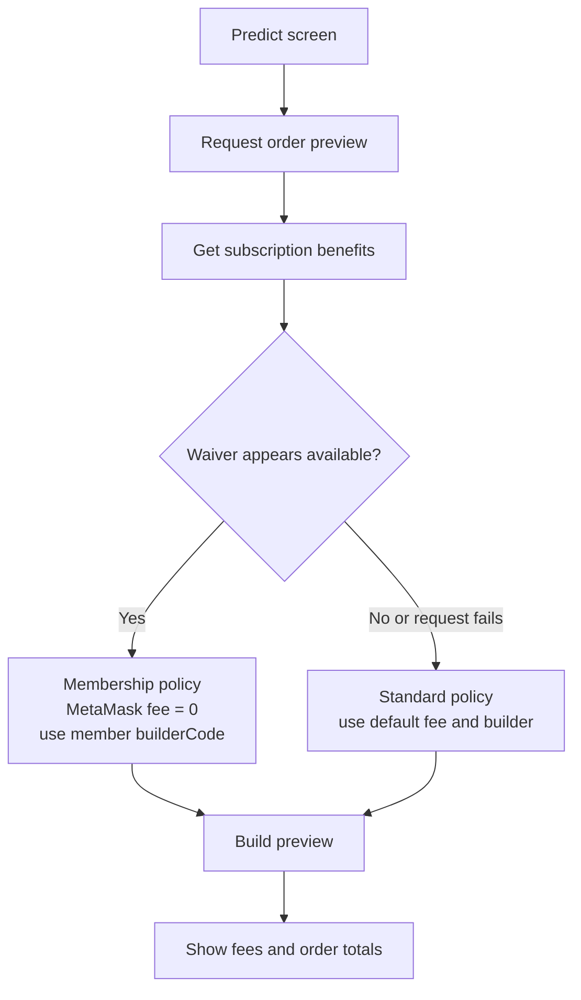
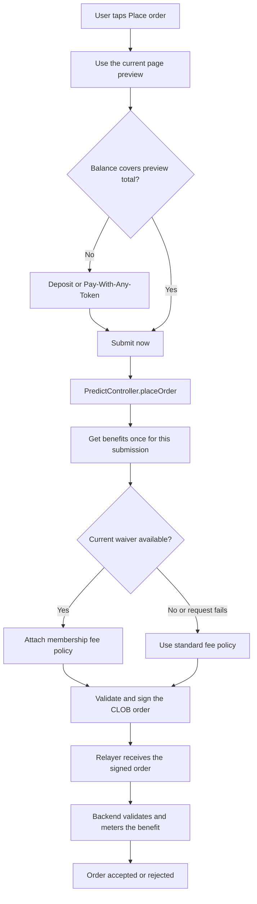
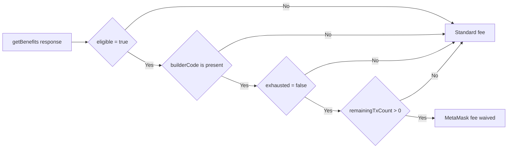

# Predict Pro membership in Predict

This describes the legacy Polymarket Predict flow. `PredictNext` is out of
scope.

## Core rule

Predict Pro is a fee-waiver benefit, not a client-side permission system.

- `SubscriptionController:getBenefits()` tells mobile whether it may show and prepare the waiver.
- Only the MetaMask service fee is waived.
- Provider fees, market fees, and Pay-With-Any-Token deposit fees remain.
- The `builderCode` is fetched from the Subscriptions Benefits API.
- The backend validates the benefit and owns allowance consumption.

## End-to-end flow

### Order Preview

### Order Place

For Pay-With-Any-Token, the post-deposit submission is a separate
`placeOrder` invocation and therefore gets its own benefits lookup. A retry
within the same invocation reuses the already selected policy.

## Membership decision

Mobile presents the waiver only when all of these are true:

`remainingTxCount` is only a preflight signal. Mobile does not decrement it,
reserve it, or decide whether a trade is ultimately entitled to the benefit.

## What is signed and submitted

When the membership route is selected:

1. Mobile builds the order with the member `builderCode`.
2. The user signs that order using the normal CLOB EIP-712 flow.
3. The relayer receives the signed order and submits it to the CLOB.
4. The benefits backend validates the order and the current benefit state.
5. The benefits backend consumes the allowance according to its contract and returns
   the order result.

The standard route uses the default builder code and normal MetaMask fee.

## Stale benefits and fees

The preview can become stale while the user remains on the page. The next
active-page preview refreshes the benefits snapshot. At submission, the
controller obtains one current benefits response before validation and signing.
The backend remains authoritative if the benefit changes between those steps.

The fee result is:

- eligible membership: MetaMask service fee waived;
- inactive, exhausted, missing, malformed, or unavailable benefit: standard
  MetaMask fee;
- all cases: provider, market, and deposit fees remain separate.
