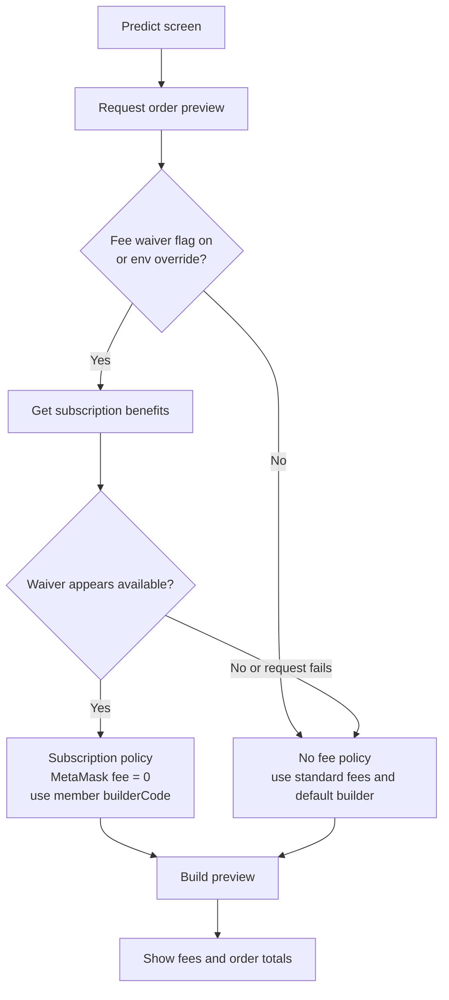
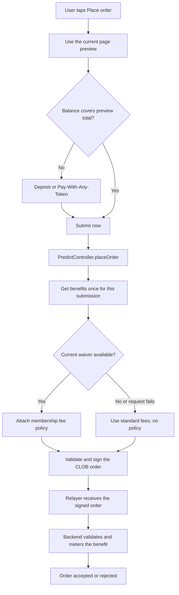
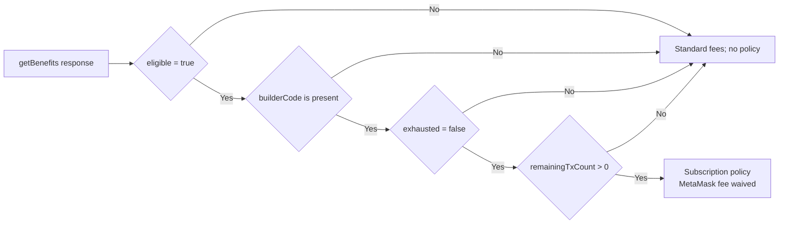

# Money Account Pro membership in Predict

This describes the legacy Polymarket Predict flow. `PredictNext` is out of
scope.

## Core rule

Pro membership is a fee-waiver benefit, not a client-side permission system.

- `SubscriptionController:getBenefits()` tells mobile whether it may show and prepare the waiver.
- Only the MetaMask service fee is waived.
- Provider fees, market fees, and Pay-With-Any-Token deposit fees are not changed
  by the membership waiver. Independent market-fee waiver rules may still apply.
- The `builderCode` is fetched from the Subscriptions Benefits API.
- An active Predict fee policy exists only for a valid subscription benefit and
  always carries `DiscountType.SUBSCRIPTION` plus a `builderCode`.
- Without that policy, the order uses the configured standard fees and the
  protocol's default builder code.
- The backend validates the benefit and owns allowance consumption.

## Feature flag

The waiver is gated by the version-gated remote flag
`predictSubscriptionFeeWaiverEnabled` (`{ enabled, minimumVersion }`). It is
resolved as `isMembershipFeeWaiverEnabled` in `resolvePredictFeatureFlags` and
defaults to off when missing, malformed, or below the minimum version.

When the flag is off, `PredictController` does not call
`SubscriptionController:getBenefits` and every order uses standard fees.

For local development, set `MM_PREDICT_SUBSCRIPTION_FEE_WAIVER_ENABLED="true"`
in `.js.env` and restart Metro to skip the remote flag check. The benefits
lookup and eligibility rules still apply.

## End-to-end flow

### Order Preview

### Order Place

For Pay-With-Any-Token, the post-deposit submission is a separate
`placeOrder` invocation and therefore gets its own benefits lookup. A retry
within the same invocation reuses the already selected policy.

If the page preview carried a subscription policy but the submission-time
lookup no longer qualifies, the controller removes the stale policy and
restores `originalFees` before submitting. This prevents a stale zero-fee
preview from being used with the standard builder.

## Membership decision

Mobile presents the waiver only when all of these are true:

`remainingTxCount` is only a preflight signal. Mobile does not decrement it,
reserve it, or decide whether a trade is ultimately entitled to the benefit.

## Fee display

When a subscription policy is active and standard fees are available in
`originalFees`, the legacy Predict UI shows:

- the current waived total;
- the original total with a strikethrough;
- the existing Rewards member badge beside the original total.

This is display-only. The fee policy and `builderCode` still come from the
controller/provider path used for signing and submission.

## What is signed and submitted

When the membership route is selected:

1. Mobile builds the order with the member `builderCode`.
2. The user signs that order using the normal CLOB EIP-712 flow.
3. The relayer receives the signed order and submits it to the CLOB.
4. The benefits backend validates the order and the current benefit state.
5. The benefits backend consumes the allowance according to its contract and returns
   the order result.

The standard route has no `feePolicy`; it uses the configured MetaMask fee and
the protocol default builder code.

## Stale benefits and fees

Legacy Buy and Sell preview screens refresh the preview about once per second
while active, so the benefits snapshot and fee display are refreshed while the
user remains on the page. The preview query is also debounced to avoid requests
during rapid input changes.

At submission, the controller obtains one current benefits response before
market validation and signing. The backend remains authoritative if the benefit
changes between those steps.

The fee result is:

- eligible membership: MetaMask service fee waived;
- inactive, exhausted, missing, malformed, or unavailable benefit: standard
  MetaMask fee;
- all cases: provider, market, and deposit fees remain separate.
