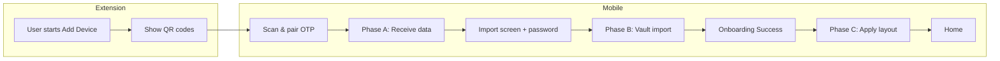
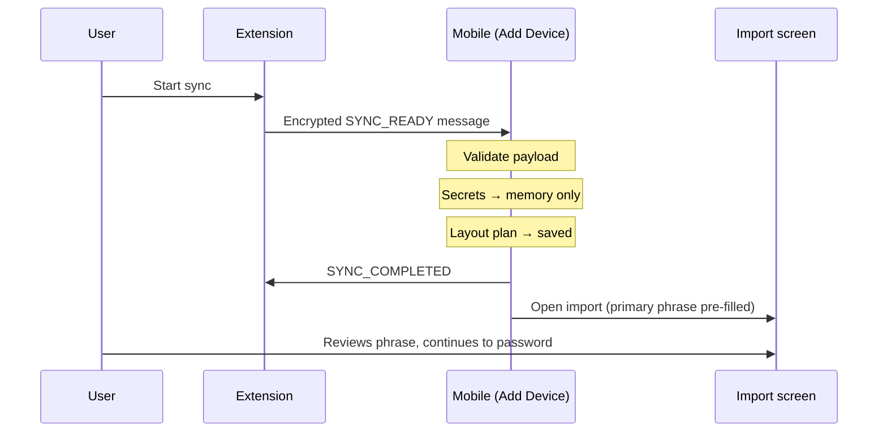
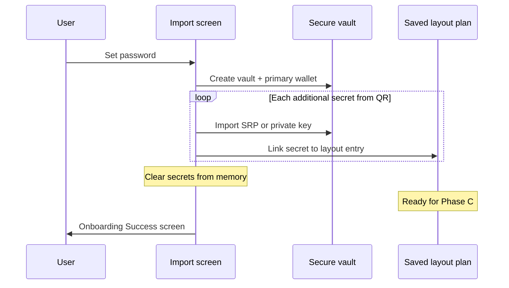
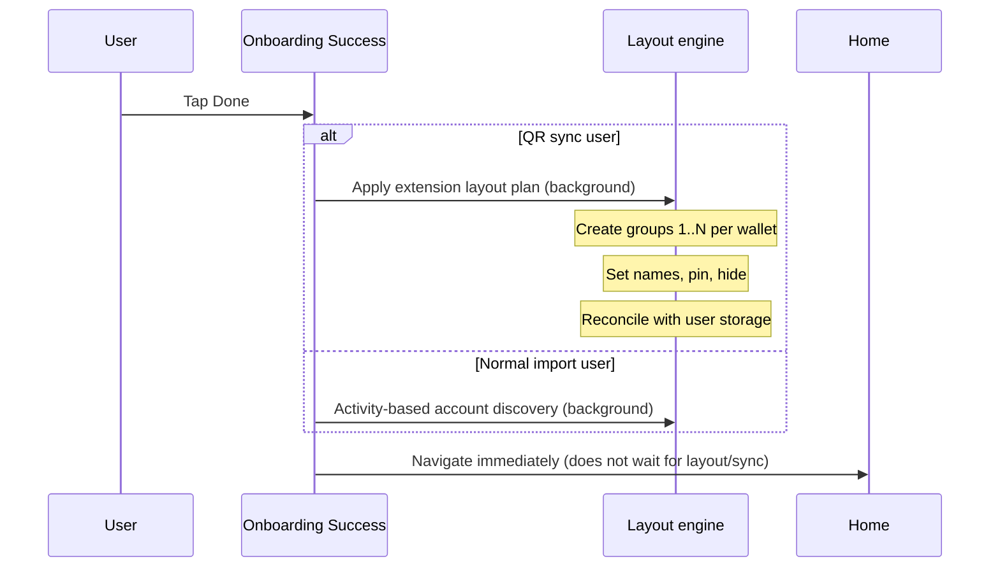

# QR Sync — Provisioning overview

**For implementation detail:** see [Provisioning technical reference](./provisioning-technical.md).

---

## What this feature does

QR Sync lets a **MetaMask Mobile user** copy their extension wallet onto mobile by scanning QR codes. The extension exports:

- One or more Secret Recovery Phrases (SRPs / “mnemonics”)
- Optional imported private-key accounts
- How accounts are organized: wallet names, account groups, pinned/hidden state

Mobile imports the secrets securely, then rebuilds the **same account layout** the user had in the extension — instead of guessing which accounts to show based on on-chain activity.

**Primary flow today:** Add Device → OTP pairing → password + import → Onboarding Success → Home.

**Not in scope yet:** Adding a device via QR for users who already completed mobile onboarding.

---

## Why provisioning is split into phases

Secrets cannot all be imported at scan time. Mobile needs a **password first** to create the encrypted vault. Layout metadata (names, groups) is applied **after** secrets exist in the vault.

| Phase | User-visible step                  | What happens                                                                                                  |
| ----- | ---------------------------------- | ------------------------------------------------------------------------------------------------------------- |
| **A** | Scan QR codes on Add Device        | Receive and validate extension data; open import screen with primary phrase pre-filled                        |
| **B** | Create password on import screen   | Create vault; import remaining SRPs and private keys                                                          |
| **C** | Tap **Done** on Onboarding Success | Create account groups, apply names / pin / hide from extension, then reconcile with user storage (background) |
| **D** | Use the app after Home             | Existing mobile behaviour (cloud backup, unlock-time account checks)                                          |

---

## End-to-end journey

---

## Phase A — Receive extension data

**When:** User finishes scanning QR codes during Add Device (before password).

**Goal:** Accept the extension export, keep secrets only in memory, save the account **layout plan** for later, and send the user to the import screen.

**User sees:** Import screen with the primary recovery phrase already filled in (QR path only).

**Extension must provide:** At least one primary mnemonic for new-user onboarding.

---

## Phase B — Password and vault import

**When:** User submits password on the import screen.

**Goal:** Create the encrypted vault with the primary wallet, then import every other SRP and private key from the QR session.

**User sees:** Brief loading, then Onboarding Success. No account renaming or grouping yet — that is Phase C.

**Important:** Phase B does **not** run account discovery or cloud sync. It only puts secrets into the vault.

---

## Phase C — Match extension layout

**When:** User taps **Done** on Onboarding Success.

**Goal:** Build account groups and apply wallet names, account names, pinned, and hidden flags exactly as exported from the extension.

**User sees:** Navigates to Home **immediately** after tapping Done. Phase C (layout + user-storage reconciliation) runs in the background and does not block navigation. Account names, groups, and cloud merge may finish updating moments later.

**Extension is ground truth for HD layout:** For QR users, mobile **does not** use “find accounts with activity” on this screen. After layout is applied, user storage is reconciled so Snap accounts and other cloud-backed tree data can merge in, and the extension layout can be pushed to Backup & Sync when enabled.

---

## Phase D — After Home (unchanged for QR)

**When:** User is a normal app user on Home and on later app opens.

**Goal:** Existing mobile features continue as today.

| Behaviour                       | When it runs                    | QR-specific?                  |
| ------------------------------- | ------------------------------- | ----------------------------- |
| Backup & Sync (cloud)           | After Home if user enables it   | No change                     |
| Account discovery on **unlock** | Every time user unlocks the app | **See conflicts below**       |
| Manual “Add SRP” in settings    | User action                     | Separate path; not used by QR |

No new QR work is implemented in Phase D.

---

## How QR sync differs from normal mobile onboarding

Normal seed-phrase import and QR sync share the same screens but diverge on **how accounts are set up after the password step**.

| Step                                  | Normal import                                                           | QR sync                                                            |
| ------------------------------------- | ----------------------------------------------------------------------- | ------------------------------------------------------------------ |
| Password creates vault + first wallet | Same                                                                    | Same                                                               |
| Additional secrets                    | User typically has one SRP                                              | All SRPs + private keys from extension                             |
| Onboarding Success **Done**           | **Activity-based discovery** — find accounts that had on-chain activity | **Extension layout** — deterministic groups and labels             |
| During import                         | May use standard “Add SRP” flows later                                  | Uses a dedicated import path (no activity discovery during import) |

**Product intent:** Extension export is the source of truth for QR users. Mobile should mirror what they already organized in the extension.

---

## Conflicts and impacts on existing account sync / discovery

These are the main touchpoints with systems that already exist on mobile. Coordinate with owning teams when changing behaviour.

### 1. Onboarding Success — discovery replaced for QR users

| System                                     | Normal behaviour                        | With QR sync                                                     |
| ------------------------------------------ | --------------------------------------- | ---------------------------------------------------------------- |
| **Account discovery** (`discoverAccounts`) | Runs when user taps Done                | **Skipped** for QR users; replaced by extension layout (Phase C) |
| **Impact**                                 | Accounts appear based on chain activity | Accounts and groups match extension export                       |

**Teams:** Mobile onboarding, Accounts / Multichain.

### 2. Unlock-time discovery — still runs today

| System                                                | Behaviour                                                          | QR conflict                                                                                                                                   |
| ----------------------------------------------------- | ------------------------------------------------------------------ | --------------------------------------------------------------------------------------------------------------------------------------------- |
| **Post-login discovery** (`postLoginAsyncOperations`) | On **unlock**, scans for accounts with activity across all wallets | Runs for **all** users, including QR                                                                                                          |
| **When it matters**                                   | Every app reopen after unlock                                      | If Phase C has **not** run yet, unlock discovery is **not** a substitute for Phase C — it does not apply extension names, groups, or pin/hide |

**Teams:** Authentication, Accounts / Multichain.  
**Status:** Known gap — [resume after app kill](#known-limitations-deferred).

### 3. Manual “Add SRP” — separate code path

| System                                            | Normal behaviour                                               | QR sync                                                 |
| ------------------------------------------------- | -------------------------------------------------------------- | ------------------------------------------------------- |
| **Add new SRP** (`importNewSecretRecoveryPhrase`) | Used from settings; triggers discovery and optional cloud sync | **Not used** by QR; QR has its own vault import service |
| **Impact**                                        | Changes to Add SRP should not be assumed to fix QR             | QR Phase B must stay isolated                           |

**Teams:** Mobile settings / Multi-SRP, Accounts.

### 4. Backup & Sync / user storage

| System                                                       | Normal behaviour                                                                | QR sync                                                                                                  |
| ------------------------------------------------------------ | ------------------------------------------------------------------------------- | -------------------------------------------------------------------------------------------------------- |
| **Cloud sync** (`syncWithUserStorage`, `useIdentityEffects`) | `discoverAccounts` pulls once on Done; `useIdentityEffects` may sync after Home | Phase C calls `syncWithUserStorage` **after** extension layout (background); Phase B still does not sync |
| **After Home**                                               | `useIdentityEffects` may sync again                                             | Same — may overlap with in-flight Phase C sync                                                           |

**Teams:** Identity / Backup & Sync. Sync is deferred until extension layout is complete so cloud is not updated with a half-built tree. Sync failures are logged and do not block onboarding or mark provisioning failed.

### 5. Account tree initialization

| System           | When                                           | QR sync                                             |
| ---------------- | ---------------------------------------------- | --------------------------------------------------- |
| **Tree init**    | Password step creates wallet + default group 0 | Same                                                |
| **Extra groups** | Discovery or user action                       | Phase C creates groups 1..N from extension metadata |

**Teams:** Accounts / Multichain, Account tree.

### Cross-team impact summary

| Team / area                  | What to know                                                                                                      |
| ---------------------------- | ----------------------------------------------------------------------------------------------------------------- |
| **Extension**                | v1 `SYNC_READY` payload; primary mnemonic; contiguous group indices 0..N per wallet; names and pin/hide on export |
| **Mobile onboarding**        | Add Device, pre-filled import, Onboarding Success branch                                                          |
| **Accounts / Multichain**    | Wallet and group creation APIs used in Phases B and C; `alignWallet` after group creation                         |
| **Account tree**             | Names, pin, hide applied in Phase C                                                                               |
| **Authentication**           | Vault creation, unlock flow; post-login discovery interaction (deferred fix)                                      |
| **Identity / Backup & Sync** | No sync during Phase B; Phase C reconciles user storage after layout (background, non-blocking)                   |
| **QA**                       | Happy path, multi-SRP, private keys, app-kill before Done, Phase C failure (no retry)                             |

---

## Provisioning status (product view)

Simple states mobile tracks during onboarding:

| Status               | Meaning for the user                         |
| -------------------- | -------------------------------------------- |
| Waiting for password | QR received; user must set password          |
| Secrets imported     | Vault ready; layout not applied yet          |
| Completed            | Layout applied; normal app use               |
| Failed               | Layout step failed; no automatic retry today |

---

## Known limitations (deferred)

Documented for a future release — **not** fixed in the current implementation.

### App closed after password, before tapping Done on Onboarding Success

| Today                                                                 | Risk                                     |
| --------------------------------------------------------------------- | ---------------------------------------- |
| User reopens app at **unlock** (they are already “onboarded”)         | Expected                                 |
| Unlock runs **activity-based discovery**, not extension layout        | Account tree may **not match** extension |
| Phase C only runs if user returns to Onboarding Success and taps Done | User may never get correct names/groups  |

**Planned later:** Resume extension layout automatically after unlock or Home when layout is still pending.

### Phase C failure

| Today                                                                 | Risk                                             |
| --------------------------------------------------------------------- | ------------------------------------------------ |
| Layout step fails → status **failed**                                 | User may see incomplete or generic account names |
| **No automatic retry**                                                | User is not prompted to try again                |
| If they reach Onboarding Success again, normal discovery runs instead | Not a true “retry layout”                        |

**Decision for now:** Keep no auto-retry; metadata is kept so engineering can add recovery later.

### Post-onboarding QR (existing mobile users)

Add Device QR for users who already use mobile is **not** wired end-to-end yet (UI and Phase C trigger).

---

## What is done vs what is next

| Done                                                                  | Deferred                              |
| --------------------------------------------------------------------- | ------------------------------------- |
| Phases A, B, C for **new-user** onboarding happy path                 | Resume layout after app kill          |
| Extension layout instead of discovery on Onboarding Success (QR only) | Post-onboarding QR for existing users |
| User-storage reconciliation at end of Phase C (background)            | E2E / device QA for full QR journey   |
| Unit test coverage for core QR provisioning                           | Phase C failure recovery UX           |

---

## Glossary

| Term                            | Meaning                                                                                 |
| ------------------------------- | --------------------------------------------------------------------------------------- |
| **Primary mnemonic**            | The SRP used to create the vault first                                                  |
| **Account group**               | A set of accounts under one HD wallet index (group 0, 1, 2, …)                          |
| **Activity-based discovery**    | Mobile finds accounts that had on-chain activity                                        |
| **Extension layout**            | Names, groups, pin/hide copied from extension export                                    |
| **User-storage reconciliation** | Bidirectional account-tree sync with cloud after Phase C layout (`syncWithUserStorage`) |
