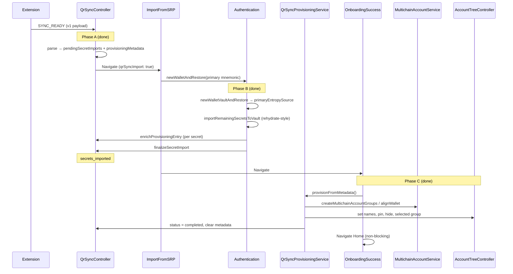

# QR Sync — New-User Onboarding Provisioning

Implementation reference for importing wallets and accounts from the MetaMask extension via QR Sync during **new-user onboarding**.

**Scope:** New users (`isOnboardingCompleted === false`) who complete Add Device → OTP → password import.

**Out of scope:** Login-time discovery (`postLoginAsyncOperations`), Home cloud sync (`useIdentityEffects`), manual SRP import, existing-user QR sync (separate follow-up).

---

## How to resume this work

Read this section first if you are picking the task up after time away.

| Question             | Answer                                                                                                          |
| -------------------- | --------------------------------------------------------------------------------------------------------------- |
| What is done?        | **Phases A, B, and C** (rehydrate-aligned Phase B complete)                                                     |
| What is next?        | Optional [app-launch resume](#step-c4--app-launch-resume-optional-follow-up) for Phase C; manual device QA      |
| Canonical types      | `app/core/QrSync/types.ts` (wire + provisioning + protocol in one file)                                         |
| Canonical validation | `app/core/QrSync/services/qr-sync-validation.ts` → `parseQrSyncSyncReadyMessage`                                |
| Provisioning service | `app/core/QrSync/services/qr-sync-provisioning-service.ts` — **Phase C only** (`provisionFromMetadata`)         |
| Vault secret import  | `app/core/Authentication/Authentication.ts` — Phase B vault ops + direct `QrSyncController` metadata enrichment |
| Tests to run         | `yarn jest app/core/QrSync app/selectors/qrSyncController app/core/Authentication/Authentication.test.ts`       |

**Do not re-introduce:** legacy wire format (`{ type, value, metadata }`), `importPlan`, `provisioning-types.ts`, or a separate payload splitter module. Mapping happens inside `parseQrSyncSyncReadyMessage`.

---

## Table of contents

1. [Implementation status](#implementation-status)
2. [Goals and constraints](#goals-and-constraints)
3. [End-to-end flow](#end-to-end-flow)
4. [Controller state](#controller-state)
5. [Types reference](#types-reference)
6. [Phase A — SYNC_READY (done)](#phase-a--sync_ready-done)
7. [Phase B — Password submit](#phase-b--password-submit)
8. [Phase B refactor — rehydrate-aligned](#phase-b-refactor-rehydrate-aligned)
9. [Phase C — OnboardingSuccess](#phase-c--onboardingsuccess)
10. [Phase D — After Home](#phase-d--after-home)
11. [Metadata → AccountTree mapping](#metadata--accounttree-mapping)
12. [Failure handling](#failure-handling)
13. [Implementation checklist](#implementation-checklist)
14. [Testing plan](#testing-plan)
15. [Related code](#related-code)

---

## Implementation status

| Phase | Description                                                      | Status                 |
| ----- | ---------------------------------------------------------------- | ---------------------- |
| **A** | Parse `SYNC_READY`, store secrets + metadata, navigate to import | **Done**               |
| **B** | Import remaining secrets at password; enrich metadata            | **Done**               |
| **C** | Create groups + apply names/pin/hide on OnboardingSuccess        | **Done**               |
| **D** | Post-home cloud sync / unlock discovery                          | Unchanged (no QR work) |

### Phase A deliverables (verified)

- [x] `pendingSecretImports` + `provisioningMetadata` + `provisioningStatus` on `QrSyncController`
- [x] `parseQrSyncSyncReadyMessage` in `qr-sync-validation.ts`
- [x] `routeIncomingQrSyncMessage` returns flat `pendingSecretImports` / `provisioningMetadata`
- [x] Persistence: metadata + status persisted; secrets never persisted
- [x] Selectors: `selectQrSyncPrimaryMnemonic`, `selectQrSyncShouldNavigateToImport`, etc.
- [x] `ImportFromSecretRecoveryPhrase` pre-fills primary mnemonic when `qrSyncImport: true`
- [x] Unit tests: `QrSyncController`, `qr-sync-validation`

### Phase B deliverables (verified)

- [x] `skipDiscovery` option on `importNewSecretRecoveryPhrase` (`app/actions/multiSrp/index.ts`) — manual Add SRP only; **QR does not use this**
- [x] Vault imports in `Authentication` (`importMnemonicToVault`, `importAccountFromPrivateKey`, shared `importRemainingSecretsToVault` loop)
- [x] Metadata enrichment via `QrSyncController.enrichProvisioningEntry` / `finalizeSecretImport` (called directly from `Authentication`)
- [x] Controller methods `enrichProvisioningEntry`, `finalizeSecretImport` (Phase B hot path); `completeSecretImport` retained for tests/legacy batch API
- [x] Wired via `Authentication.newWalletAndRestore` → `importRemainingSecrets(primaryEntropySource)`
- [x] `ImportFromSecretRecoveryPhrase` does **not** call `QrSyncController.resetState()` after QR import
- [x] Engine init + messenger for `QrSyncProvisioningService`
- [x] Unit tests: provisioning service, controller mutations, `Authentication`, `ImportFromSecretRecoveryPhrase`

See [Phase B — Password submit](#phase-b--password-submit) and [Phase B refactor](#phase-b-refactor--rehydrate-aligned) for architecture detail.

### Phase C deliverables (verified)

- [x] `selectQrSyncNeedsProvisioning` selector
- [x] `completeProvisioning` controller method (status → `completed`, clear metadata)
- [x] Expand provisioning service messenger (MultichainAccountService, AccountTreeController)
- [x] `QrSyncProvisioningService.provisionFromMetadata`
- [x] `OnboardingSuccess` branches to `provisionFromMetadata` vs `discoverAccounts`
- [ ] App-launch resume for `provisioningStatus === 'secrets_imported'`

---

## Goals and constraints

| Goal                                   | Approach                                                                                                                               |
| -------------------------------------- | -------------------------------------------------------------------------------------------------------------------------------------- |
| Multi-SRP + private-key import         | `Authentication` vault APIs (`importMnemonicToVault`, `importAccountFromPrivateKey`) — same boundary as seedless `rehydrateSeedPhrase` |
| Correct names, pin, hide               | `AccountTreeController` after accounts exist (Phase C)                                                                                 |
| Explicit account groups from extension | Replace **only** OnboardingSuccess `discoverAccounts` with deterministic provisioning                                                  |
| No secret staleness in memory          | Wipe `pendingSecretImports` after Phase B; keep metadata for Phase C                                                                   |
| No `@metamask/*` package bumps         | Use APIs already in current mobile dependencies                                                                                        |
| Extension export is ground truth       | Skip activity-based `discoverAccounts` for QR onboarding users                                                                         |

**Hard constraints:**

- Secrets cannot be imported before the vault exists (password step).
- `newWalletAndRestore` must run first for the **primary** mnemonic (`isPrimary: true`).
- **Phase B secondary mnemonics** must use `Authentication.importMnemonicToVault` — **not** `importNewSecretRecoveryPhrase` (`app/actions/multiSrp`). That action is for post-onboarding “Add SRP” and triggers discovery / user-storage sync unless `skipDiscovery` is set.
- Phase B must **not** call `discoverAccounts`, `AccountTreeController.syncWithUserStorage`, or seedless backup APIs.
- Per-secret import errors during Phase B follow **seedless rehydrate** policy: log and continue (do not block password / onboarding navigation).
- Group `0` per HD wallet is created automatically by restore/import; Phase C creates indices `1..N` where `N` is the max `groupIndex` in extension metadata (extension exports the full contiguous wallet `0..N`).
- Wire format is **v1 only**: `{ version: 1, deadline, data: [Mnemonic \| PrivateKey, ...] }`.

---

## End-to-end flow



### What existing onboarding already does (QR does not replace)

On password submit, `Authentication.newWalletAndRestore` → `MultichainAccountService.createMultichainAccountWallet({ type: 'restore' })` → `dispatchLogin` → `AccountTreeInitService.initializeAccountTree()`.

That creates the vault, primary HD wallet, and **group 0**. No `discoverAccounts` runs here.

### What QR replaces

`OnboardingSuccess` `handleOnDone` currently always calls `discoverAccounts(keyrings[0])`. For QR users with `provisioningStatus === 'secrets_imported'`, call `QrSyncProvisioningService.provisionFromMetadata()` instead — for **all** wallets in the persisted metadata plan.

---

## Controller state

```typescript
// app/core/QrSync/controller-types.ts

pendingSecretImports: QrSyncSecretImportEntry[] | null;  // never persisted
provisioningMetadata: QrSyncProvisioningMetadata | null; // persisted
provisioningStatus: QrSyncProvisioningStatus | null;     // persisted
// + phase, connectionStatus, otp, error (session lifecycle)
```

### `provisioningStatus` values (implemented)

| Value               | Meaning                                                            |
| ------------------- | ------------------------------------------------------------------ |
| `null`              | No active provisioning pipeline                                    |
| `awaiting_password` | Secrets in memory; user must set password (Phase A sets this)      |
| `secrets_imported`  | Vault + all secrets imported; metadata enriched; ready for Phase C |
| `completed`         | Phase C finished; metadata cleared                                 |
| `failed`            | Provisioning failed; set status only (no extra retry UI in scope)  |

We intentionally keep this enum small. Do not add `importing_secrets` / `applying_metadata` unless a product requirement appears.

### Persistence policy

| Field                                       | `persist` |
| ------------------------------------------- | --------- |
| `pendingSecretImports`                      | `false`   |
| `provisioningMetadata`                      | `true`    |
| `provisioningStatus`                        | `true`    |
| `phase`, `otp`, `connectionStatus`, `error` | `false`   |

After Phase B, mnemonic entries in `provisioningMetadata` gain `entropySource`; private-key entries gain `accountAddress`. These are not secrets and enable Phase C without re-scanning QR.

---

## Types reference

All types live in **`app/core/QrSync/types.ts`**.

### Wire payload (extension → mobile)

```typescript
// Envelope: QrSyncSyncReadyMessage { type: 'sync-ready', version: '1.0.0', data: QrSyncReadyPayload }

type QrSyncReadyPayload = {
  version: 1; // QrSyncSchemaVersion
  deadline: number;
  data: QrSyncReadyData[];
};

// Mnemonic entry — only `mnemonic` is required on wire
type QrSyncReadyMnemonicData = {
  type: 'Mnemonic';
  mnemonic: string;
  name?: string; // wallet name → AccountTreeWalletMetadata.name
  groups?: QrSyncAccountGroup[];
  isPrimary?: boolean;
};

// Private-key entry
type QrSyncReadyPrivateKeyData = {
  type: 'PrivateKey';
  privateKey: string;
  name: string; // account group name → AccountTreeGroupMetadata.name
  pinned?: boolean;
  hidden?: boolean;
};

type QrSyncAccountGroup = {
  groupIndex: number;
  name: string; // account group name → AccountTreeGroupMetadata.name
  pinned?: boolean;
  hidden?: boolean;
};
```

### Mobile state shapes

```typescript
// Ephemeral (memory only)
type QrSyncSecretImportEntry = {
  index: number;
  type: 'MNEMONIC' | 'PRIVATE_KEY';
  value: string; // base64-decoded secret
  isPrimary?: boolean; // mnemonics only
};

// Persisted (no secrets)
type QrSyncProvisioningMnemonicEntry = {
  index: number;
  type: 'MNEMONIC';
  isPrimary?: boolean;
  name?: string;
  groups?: QrSyncAccountGroup[];
  entropySource?: EntropySourceId; // filled in Phase B
};

type QrSyncProvisioningPrivateKeyEntry = {
  index: number;
  type: 'PRIVATE_KEY';
  name: string;
  pinned?: boolean;
  hidden?: boolean;
  accountAddress?: string; // filled in Phase B
};

type QrSyncProvisioningMetadata = {
  version: 1;
  entries: QrSyncProvisioningEntry[];
};
```

`index` on secrets and metadata entries always matches the wire `data[]` order.

---

## Phase A — SYNC_READY (done)

**Trigger:** Extension sends `sync-ready` over encrypted MWP session.

**Flow:**

1. `routeIncomingQrSyncMessage` → `parseQrSyncSyncReadyMessage`
2. Validate envelope + v1 payload + per-entry wire shape
3. Map wire → `pendingSecretImports` + `provisioningMetadata` (pass-through `name` / `groups`; no field renaming)
4. If onboarding not completed: require a primary mnemonic in `pendingSecretImports`
5. Store state; `provisioningStatus = 'awaiting_password'`; `phase` → `reviewing-import` → `completed`
6. Send `SYNC_COMPLETED` to extension; tear down session
7. UI navigates to `ImportFromSecretRecoveryPhrase` with `qrSyncImport: true` (via `selectQrSyncShouldNavigateToImport`)

**Key files:** `QrSyncController.ts`, `qr-sync-message-router.ts`, `qr-sync-validation.ts`, `AddDeviceToWallet/index.tsx`

---

## Phase B — Password submit

**Status:** **Done** (rehydrate-aligned; see [Phase B refactor](#phase-b-refactor--rehydrate-aligned)).

**Trigger:** User submits password on `ImportFromSecretRecoveryPhrase` when `route.params.qrSyncImport === true`. Vault import runs inside `Authentication.newWalletAndRestore` after the vault is created (not in the import screen directly).

**Goal:** Import every secret from `pendingSecretImports` into the vault, enrich `provisioningMetadata` with runtime IDs (`entropySource` / `accountAddress`), wipe secrets from memory.

**Do not** create account groups or apply display metadata here — that is Phase C.

**Separation of concerns:**

| Layer                       | Responsibility                                                                                       |
| --------------------------- | ---------------------------------------------------------------------------------------------------- |
| `Authentication`            | Vault imports + Phase B metadata updates on `QrSyncController` (errors logged, onboarding continues) |
| `QrSyncController`          | Persisted plan state — `enrichProvisioningEntry`, `finalizeSecretImport`                             |
| `QrSyncProvisioningService` | Phase C only — `provisionFromMetadata`                                                               |

### Step B1 — `skipDiscovery` on multi-SRP import (manual Add SRP only)

**File:** `app/actions/multiSrp/index.ts`

Used by **post-onboarding** `ImportNewSecretRecoveryPhrase` screen. QR onboarding does **not** call this.

### Step B2 — `QrSyncProvisioningService` (Phase C only)

**File:** `app/core/QrSync/services/qr-sync-provisioning-service.ts`

Phase C: `provisionFromMetadata()` — creates groups and applies extension metadata on the account tree.

Phase B metadata is updated by **`Authentication` calling `QrSyncController` directly** (not via the provisioning service).

### Step B3 — Controller provisioning mutations (done)

**File:** `app/core/QrSync/QrSyncController.ts`

Public methods (registered as messenger actions in `qr-sync-controller-init.ts`):

| Method                                       | Phase | Effect                                                                                                                      |
| -------------------------------------------- | ----- | --------------------------------------------------------------------------------------------------------------------------- |
| `enrichProvisioningEntry(index, enrichment)` | B     | Merge `entropySource` or `accountAddress` into persisted metadata entry                                                     |
| `finalizeSecretImport()`                     | B     | `pendingSecretImports = null`, `provisioningStatus = 'secrets_imported'` (metadata left as-is, possibly partially enriched) |
| `completeSecretImport(enrichedMetadata)`     | —     | Batch API retained for tests; **not used on the production hot path**                                                       |
| `markProvisioningFailed()`                   | C     | `provisioningStatus = 'failed'`, clear `pendingSecretImports`                                                               |

### Step B4 — Wire Authentication (done)

**File:** `app/core/Authentication/Authentication.ts`

After `newWalletVaultAndRestore` inside `newWalletAndRestore`:

```typescript
const primaryEntropySource = await this.newWalletVaultAndRestore(
  password,
  parsedSeed,
  clearEngine,
);
await this.importRemainingSecrets(primaryEntropySource);
```

`importRemainingSecrets` is private; it no-ops unless `provisioningStatus === 'awaiting_password'`.

`ImportFromSecretRecoveryPhrase` passes the primary mnemonic via pre-filled phrase (`qrSyncImport: true` + `selectQrSyncPrimaryMnemonic`). It must **not** call `QrSyncController.resetState()` after import — that wipes persisted provisioning metadata and breaks OnboardingSuccess Phase C.

### Phase B acceptance criteria

- [x] Secondary mnemonics imported via `Authentication.importMnemonicToVault` (not `importNewSecretRecoveryPhrase`)
- [x] Private keys imported via `Authentication.importAccountFromPrivateKey` with `shouldCreateSocialBackup: false`, `shouldSelectAccount: false`
- [x] No `discoverAccounts` or `syncWithUserStorage` during Phase B
- [x] Per-secret vault failures logged and skipped (rehydrate policy); onboarding continues
- [x] `entropySource` / `accountAddress` written to persisted metadata for successfully imported secrets (returned from vault methods)
- [x] `pendingSecretImports` cleared; `provisioningStatus === 'secrets_imported'` on finalize path
- [x] Metadata enrichment / finalize errors logged and swallowed (onboarding not blocked)
- [x] Non-QR import path unchanged

---

## Phase B refactor — rehydrate-aligned

**Status:** **Done.**

**Why:** Vault secret imports during onboarding must use the same **Authentication** boundary as seedless `rehydrateSeedPhrase`, not the UI-oriented `app/actions/multiSrp` layer. Metadata enrichment stays in QrSync (controller + service); Authentication must not import `QrSyncProvisioningService` for vault work (avoids circular dependency).

**Reference implementation:** `Authentication.rehydrateSeedPhrase` — primary via `newWalletVaultAndRestore`, remaining secrets via `importRemainingSecretsToVault` with `importSeedlessMnemonicToVault` / `importAccountFromPrivateKey`, per-item `try/catch` with `Logger.error` (login continues).

QR uses the **non-seedless** vault primitive `importMnemonicToVault` (same MAS + keyring ops as `importSeedlessMnemonicToVault`, without `SeedlessOnboardingController` backup).

### Final architecture

```
Authentication.newWalletAndRestore
  → newWalletVaultAndRestore (primary mnemonic) → returns primaryEntropySource
  → importRemainingSecrets(primaryEntropySource)   // no-op when not QR
       → enrich primary: QrSyncController.enrichProvisioningEntry
       → importRemainingSecretsToVault (shared with rehydrate)
            → secondary mnemonic: importMnemonicToVault → enrichProvisioningEntry
            → private key: importAccountFromPrivateKey → enrichProvisioningEntry
       → QrSyncController.finalizeSecretImport

QrSyncProvisioningService
  → provisionFromMetadata (Phase C only)
```

### Refactor steps

| Step     | Description                                                                                                       | Status |
| -------- | ----------------------------------------------------------------------------------------------------------------- | ------ |
| **B-R1** | Add `Authentication.importMnemonicToVault`; refactor `importSeedlessMnemonicToVault` to call it                   | Done   |
| **B-R2** | Add shared `importRemainingSecretsToVault`; extract rehydrate loop                                                | Done   |
| **B-R3** | Add `importRemainingSecrets`; wire from `newWalletAndRestore`; remove vault logic from provisioning service       | Done   |
| **B-R4** | Add incremental controller enrich/finalize; service metadata-only helpers                                         | Done   |
| **B-R5** | Update tests (`Authentication.test.ts`, `qr-sync-provisioning-service.test.ts`, `ImportFromSecretRecoveryPhrase`) | Done   |
| **B-R6** | Fix `ImportFromSecretRecoveryPhrase` — stop calling `QrSyncController.resetState()` after QR import               | Done   |

### `importMnemonicToVault`

**File:** `app/core/Authentication/Authentication.ts`

Vault-only secondary mnemonic import (no discovery, no user-storage sync, no seedless backup):

```typescript
importMnemonicToVault(seed: string): Promise<EntropySourceId>
```

```
mnemonic = mnemonicPhraseToBytes(seed)
wallet = MultichainAccountService.createMultichainAccountWallet({ type: 'import', mnemonic })
entropySource = wallet.entropySource
KeyringController.withKeyringV2({ id: entropySource }, getAccounts)
return entropySource
```

`importSeedlessMnemonicToVault` delegates to `importMnemonicToVault`, then `SeedlessOnboardingController.updateBackupMetadataState` (with rollback via `removeMultichainAccountWallet` on failure).

`importAccountFromPrivateKey` returns `string | false` — formatted address on success (used for private-key metadata enrichment).

### `importRemainingSecrets` (private)

**File:** `app/core/Authentication/Authentication.ts`

```
IF provisioningStatus !== 'awaiting_password' OR no pendingSecretImports: return

enrichQrSyncProvisioningEntry(primary.index, { entropySource: primaryEntropySource })
  // wraps QrSyncController.enrichProvisioningEntry in try/catch

FOR each non-primary secret in pendingSecretImports (sorted by index):
  TRY:
    IF MNEMONIC:
      entropySource = importMnemonicToVault(value)
      enrichQrSyncProvisioningEntry(index, { entropySource })
    ELSE IF PRIVATE_KEY:
      accountAddress = importAccountFromPrivateKey(...)
      IF accountAddress: enrichQrSyncProvisioningEntry(index, { accountAddress })
  CATCH:
    Logger.error — continue (rehydrate policy)

finalizeQrSyncSecretImport()   // wraps QrSyncController.finalizeSecretImport in try/catch
```

Do **not** call `markProvisioningFailed` during Phase B. Enrichment and finalize failures are logged only.

### Provisioning service (Phase B + C)

**Removed from `QrSyncProvisioningService` (legacy):**

- `importRemainingSecrets()` (vault orchestration)
- `enrichProvisioningEntrySafely` / `finalizeSecretImportSafely` (unnecessary pass-through to controller)

**Kept:** `provisionFromMetadata()` and Phase C messenger delegates.

---

## Phase C — OnboardingSuccess

**Trigger:** User taps Done on `OnboardingSuccess` after QR onboarding.

**Goal:** Create explicit account groups from extension metadata and apply names, pin, hide — instead of `discoverAccounts`.

### Step C0 — `completeProvisioning` controller method (done)

**File:** `app/core/QrSync/QrSyncController.ts`

Messenger action for Phase C completion:

| Method                   | Effect                                                            |
| ------------------------ | ----------------------------------------------------------------- |
| `completeProvisioning()` | `provisioningStatus = 'completed'`, `provisioningMetadata = null` |

Reuse `markProvisioningFailed()` on Phase C failure (metadata retained for retry).

### Step C1 — Selector (done)

**File:** `app/selectors/qrSyncController/index.ts`

```typescript
export const selectQrSyncNeedsProvisioning = createSelector(
  selectQrSyncControllerState,
  (state) =>
    state.provisioningStatus === 'secrets_imported' &&
    state.provisioningMetadata !== null,
);
```

### Step C2 — `provisionFromMetadata()` (done)

**File:** `app/core/QrSync/services/qr-sync-provisioning-service.ts`

**Preconditions:** `provisioningStatus === 'secrets_imported'`, enriched metadata present.

**Algorithm (background, non-blocking navigation):**

```
FOR each MNEMONIC entry in provisioningMetadata.entries:
  entropySource = entry.entropySource (required after Phase B)
  walletId = resolve from AccountTreeController (Entropy wallet where metadata.entropy.id === entropySource)

  maxGroupIndex = max(entry.groups[].groupIndex)
  IF maxGroupIndex >= 1:
    IF maxGroupIndex === 1: createMultichainAccountGroup({ entropySource, groupIndex: 1 })
    ELSE: createMultichainAccountGroups({ entropySource, fromGroupIndex: 1, toGroupIndex: maxGroupIndex })

  alignWallet(entropySource)

  IF entry.name: setAccountWalletName(walletId, entry.name)
  FOR each group: setAccountGroupName / setAccountGroupPinned / setAccountGroupHidden on resolved groupId

FOR each PRIVATE_KEY entry:
  groupId = resolve from entry.accountAddress
  setAccountGroupName(groupId, entry.name)
  apply pin/hide if present

provisioningStatus = 'completed'
provisioningMetadata = null
```

**On failure:** `provisioningStatus = 'failed'`; keep metadata for potential retry.

### Step C3 — Wire OnboardingSuccess (done)

**File:** `app/components/Views/OnboardingSuccess/index.tsx`

```typescript
const needsQrProvisioning = useSelector(selectQrSyncNeedsProvisioning);

const handleOnDone = useCallback(() => {
  // ... existing wallet home onboarding eligibility ...

  if (needsQrProvisioning) {
    void QrSyncProvisioningService.provisionFromMetadata();
  } else {
    void runDiscoverAccounts(); // existing path
  }
  queueMicrotask(() => onDone());
}, [needsQrProvisioning, ...]);
```

Navigation to Home must remain non-blocking (provisioning runs in background).

### Step C4 — App launch resume (optional follow-up)

**Status:** Not implemented.

If the app is killed after Phase B with `secrets_imported`, Phase C runs when the user reaches `OnboardingSuccess` and taps Done (`selectQrSyncNeedsProvisioning` is true). There is **no** app-launch hook today — if the user never returns to OnboardingSuccess, Phase C may not run. Document exact trigger when implementing.

### Phase C acceptance criteria

- [x] QR users never call `discoverAccounts` on OnboardingSuccess
- [x] Group 0 metadata applied but not re-created
- [x] Groups `1..N` created in one batch from max `groupIndex` (extension exports contiguous `0..N`)
- [x] `provisioningStatus === 'completed'` and metadata cleared on success
- [x] Failure sets `provisioningStatus === 'failed'`

---

## Phase D — After Home

No QR-specific work. Existing behaviour:

- `useIdentityEffects` cloud sync when Backup & Sync enabled
- `postLoginAsyncOperations` discovery on **unlock** (not first onboard)

---

## Metadata → AccountTree mapping

Account tree uses **`name`** on both wallet and group metadata (not `walletName` / `accountName` in code).

### MNEMONIC entries

| Metadata field            | Consumer                 | API                                            |
| ------------------------- | ------------------------ | ---------------------------------------------- |
| `entropySource` (Phase B) | MultichainAccountService | `createMultichainAccountGroups`, `alignWallet` |
| `groups[].groupIndex`     | MultichainAccountService | group creation                                 |
| `name`                    | AccountTreeController    | `setAccountWalletName(walletId, name)`         |
| `groups[].name`           | AccountTreeController    | `setAccountGroupName(groupId, name)`           |
| `groups[].pinned`         | AccountTreeController    | `setAccountGroupPinned`                        |
| `groups[].hidden`         | AccountTreeController    | `setAccountGroupHidden`                        |

**Resolve `walletId`:** `AccountTreeController.getAccountWalletObjects()` → Entropy wallet where `metadata.entropy.id === entropySource`.

**Resolve `groupId`:** Group under that wallet where `metadata.entropy.groupIndex === groupIndex`.

**Group 0:** Exists after restore/import — skip creation; only apply metadata.

### PRIVATE_KEY entries

| Metadata field             | Consumer              | API                                               |
| -------------------------- | --------------------- | ------------------------------------------------- |
| `accountAddress` (Phase B) | AccountTreeController | Locate SingleAccount group                        |
| `name`                     | AccountTreeController | `setAccountGroupName(groupId, name)`              |
| `pinned` / `hidden`        | AccountTreeController | `setAccountGroupPinned` / `setAccountGroupHidden` |

### External APIs (no package bump)

**MultichainAccountService:** `createMultichainAccountWallet`, `createMultichainAccountGroups`, `createMultichainAccountGroup`, `getMultichainAccountGroup`, `alignWallet`

**AccountTreeController:** `setAccountWalletName`, `setAccountGroupName`, `setAccountGroupPinned`, `setAccountGroupHidden`

---

## Failure handling

| Scenario                                           | `provisioningStatus`                              | Recovery                                                                       |
| -------------------------------------------------- | ------------------------------------------------- | ------------------------------------------------------------------------------ |
| Invalid `SYNC_READY` during onboarding             | `failed` (session)                                | User re-scans QR                                                               |
| User abandons before password                      | `awaiting_password`                               | Secrets ephemeral; metadata persisted                                          |
| Phase B vault import fails (single secret in loop) | unchanged until finalize                          | Logged; onboarding continues; metadata reflects only successful imports        |
| Phase B metadata enrichment / finalize fails       | `secrets_imported` (if finalize ran) or unchanged | Logged only; onboarding continues — **no** `markProvisioningFailed` in Phase B |
| App kill after Phase B                             | `secrets_imported`                                | Resume Phase C on OnboardingSuccess Done (if user returns)                     |
| Phase C failure                                    | `failed`                                          | Metadata kept; retry provisioning                                              |
| Success                                            | `completed`                                       | Metadata cleared                                                               |

No retry/TTL UI in scope. `markProvisioningFailed` is used for **Phase C** failures only.

---

## Implementation checklist

Execute in order. Each step should be mergeable with tests before moving on.

| #        | Step                                                                     | Phase      | Status   | Files                                                            |
| -------- | ------------------------------------------------------------------------ | ---------- | -------- | ---------------------------------------------------------------- |
| 1        | Add `skipDiscovery` to `importNewSecretRecoveryPhrase`                   | B          | Done     | `app/actions/multiSrp/index.ts`, tests                           |
| 2        | Add controller provisioning mutations                                    | B          | Done     | `QrSyncController.ts`, `QrSyncController.test.ts`                |
| 3        | Wire `Authentication.newWalletAndRestore` + Phase B vault/metadata split | B          | Done     | `Authentication.ts`, `qr-sync-provisioning-service.ts`, tests    |
| 4        | Add `selectQrSyncNeedsProvisioning`                                      | C          | Done     | `selectors/qrSyncController/index.ts`, tests                     |
| 5        | Add `completeProvisioning` controller method                             | C          | Done     | `QrSyncController.ts`, messenger, tests                          |
| 6        | Implement `provisionFromMetadata`                                        | C          | Done     | `qr-sync-provisioning-service.ts`, tests                         |
| 7        | Branch OnboardingSuccess Done handler                                    | C          | Done     | `OnboardingSuccess/index.tsx`, `index.test.tsx`                  |
| 8        | App-launch / resume for `secrets_imported`                               | C          | **Next** | TBD                                                              |
| **B-R1** | Add `Authentication.importMnemonicToVault`; refactor seedless helper     | B-refactor | Done     | `Authentication.ts`, `Authentication.test.ts`                    |
| **B-R2** | Shared `importRemainingSecretsToVault`; QR `importRemainingSecrets`      | B-refactor | Done     | `Authentication.ts`                                              |
| **B-R3** | Service metadata-only Phase B; remove vault orchestration from service   | B-refactor | Done     | `qr-sync-provisioning-service.ts`                                |
| **B-R4** | Incremental `enrichProvisioningEntry` / `finalizeSecretImport`           | B-refactor | Done     | `QrSyncController.ts`, messenger                                 |
| **B-R5** | Phase B tests                                                            | B-refactor | Done     | `Authentication.test.ts`, `qr-sync-provisioning-service.test.ts` |
| **B-R6** | Fix QR `resetState` after import screen                                  | B-refactor | Done     | `ImportFromSecretRecoveryPhrase/index.js`, `index.test.tsx`      |

---

## Testing plan

| Area                                                 | What to test                                                                          |
| ---------------------------------------------------- | ------------------------------------------------------------------------------------- |
| `importMnemonicToVault`                              | MAS import + keyring; returns `entropySource`; no discovery                           |
| `importRemainingSecretsToVault`                      | Shared rehydrate loop; log-and-continue per secret                                    |
| `importRemainingSecrets` (via `newWalletAndRestore`) | QR path enriches via `QrSyncController`; calls `finalizeSecretImport`                 |
| `enrichProvisioningEntry` / `finalizeSecretImport`   | Controller state transitions (called from Authentication)                             |
| `provisionFromMetadata`                              | Group creation, name/pin/hide, selection policy                                       |
| `selectQrSyncNeedsProvisioning`                      | True only when `secrets_imported` + metadata present                                  |
| OnboardingSuccess                                    | QR branch vs default `discoverAccounts`                                               |
| ImportFromSecretRecoveryPhrase                       | QR import does not call `resetState`; preserves provisioning state                    |
| Controller                                           | Status transitions: `awaiting_password` → `secrets_imported` → `completed` / `failed` |
| Regression                                           | Manual SRP import and non-QR onboarding unchanged                                     |

Run: `yarn jest app/core/QrSync app/selectors/qrSyncController app/core/Authentication/Authentication.test.ts app/components/Views/ImportFromSecretRecoveryPhrase/index.test.tsx`

**Not yet covered:** Detox/E2E QR onboarding; dedicated unit test for QR private-key path through `importRemainingSecrets`.

---

## Related code

| Area                           | Path                                                                                              |
| ------------------------------ | ------------------------------------------------------------------------------------------------- |
| Types (single file)            | `app/core/QrSync/types.ts`                                                                        |
| Controller state               | `app/core/QrSync/controller-types.ts`                                                             |
| QR Sync controller             | `app/core/QrSync/QrSyncController.ts`                                                             |
| Provisioning service           | `app/core/QrSync/services/qr-sync-provisioning-service.ts` (Phase C)                              |
| QR Phase B metadata            | `QrSyncController.enrichProvisioningEntry`, `finalizeSecretImport` (called from `Authentication`) |
| QR Phase B orchestration       | `Authentication.importRemainingSecrets` (private)                                                 |
| Seedless rehydrate (reference) | `Authentication.rehydrateSeedPhrase`, `importSeedlessMnemonicToVault`                             |
| Shared vault import loop       | `Authentication.importRemainingSecretsToVault`                                                    |
| Vault mnemonic import          | `Authentication.importMnemonicToVault`                                                            |
| Vault private-key import       | `Authentication.importAccountFromPrivateKey` (returns `string \| false`)                          |
| Validation + parse             | `app/core/QrSync/services/qr-sync-validation.ts`                                                  |
| Message router                 | `app/core/QrSync/services/qr-sync-message-router.ts`                                              |
| Selectors                      | `app/selectors/qrSyncController/index.ts`                                                         |
| Password + secret import       | `app/core/Authentication/Authentication.ts`                                                       |
| Add device UI                  | `app/components/Views/AddDeviceToWallet/`                                                         |
| Onboarding import              | `app/components/Views/ImportFromSecretRecoveryPhrase/`                                            |
| Onboarding success             | `app/components/Views/OnboardingSuccess/`                                                         |
| Multi-SRP action               | `app/actions/multiSrp/index.ts`                                                                   |
| Discovery (replaced for QR)    | `app/multichain-accounts/discovery.ts`                                                            |
| Tree init                      | `app/multichain-accounts/AccountTreeInitService/`                                                 |
