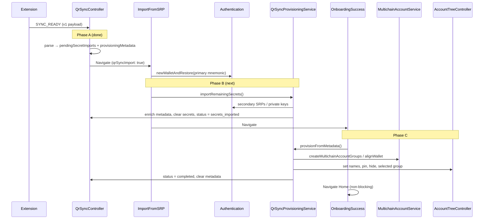

# QR Sync — New-User Onboarding Provisioning

Implementation reference for importing wallets and accounts from the MetaMask extension via QR Sync during **new-user onboarding**.

**Scope:** New users (`isOnboardingCompleted === false`) who complete Add Device → OTP → password import.

**Out of scope:** Login-time discovery (`postLoginAsyncOperations`), Home cloud sync (`useIdentityEffects`), manual SRP import, existing-user QR sync (separate follow-up).

---

## How to resume this work

Read this section first if you are picking the task up after time away.

| Question             | Answer                                                                                       |
| -------------------- | -------------------------------------------------------------------------------------------- |
| What is done?        | **Phase A** — wire payload validation, controller state split, navigation to password import |
| What is next?        | **Phase B** — import remaining secrets after password, enrich metadata                       |
| Canonical types      | `app/core/QrSync/types.ts` (wire + provisioning + protocol in one file)                      |
| Canonical validation | `app/core/QrSync/services/qr-sync-validation.ts` → `parseQrSyncSyncReadyMessage`             |
| Tests to run         | `yarn jest app/core/QrSync`                                                                  |

**Do not re-introduce:** legacy wire format (`{ type, value, metadata }`), `importPlan`, `provisioning-types.ts`, or a separate payload splitter module. Mapping happens inside `parseQrSyncSyncReadyMessage`.

---

## Table of contents

1. [Implementation status](#implementation-status)
2. [Goals and constraints](#goals-and-constraints)
3. [End-to-end flow](#end-to-end-flow)
4. [Controller state](#controller-state)
5. [Types reference](#types-reference)
6. [Phase A — SYNC_READY (done)](#phase-a--sync_ready-done)
7. [Phase B — Password submit (next)](#phase-b--password-submit-next)
8. [Phase C — OnboardingSuccess](#phase-c--onboardingsuccess)
9. [Phase D — After Home](#phase-d--after-home)
10. [Metadata → AccountTree mapping](#metadata--accounttree-mapping)
11. [Failure handling](#failure-handling)
12. [Implementation checklist](#implementation-checklist)
13. [Testing plan](#testing-plan)
14. [Related code](#related-code)

---

## Implementation status

| Phase | Description                                                      | Status                 |
| ----- | ---------------------------------------------------------------- | ---------------------- |
| **A** | Parse `SYNC_READY`, store secrets + metadata, navigate to import | **Done**               |
| **B** | Import remaining secrets at password; enrich metadata            | **Not started**        |
| **C** | Create groups + apply names/pin/hide on OnboardingSuccess        | **Not started**        |
| **D** | Post-home cloud sync / unlock discovery                          | Unchanged (no QR work) |

### Phase A deliverables (verified)

- [x] `pendingSecretImports` + `provisioningMetadata` + `provisioningStatus` on `QrSyncController`
- [x] `parseQrSyncSyncReadyMessage` in `qr-sync-validation.ts`
- [x] `routeIncomingQrSyncMessage` returns flat `pendingSecretImports` / `provisioningMetadata`
- [x] Persistence: metadata + status persisted; secrets never persisted
- [x] Selectors: `selectQrSyncPrimaryMnemonic`, `selectQrSyncShouldNavigateToImport`, etc.
- [x] `ImportFromSecretRecoveryPhrase` pre-fills primary mnemonic when `qrSyncImport: true`
- [x] Unit tests: `QrSyncController`, `qr-sync-validation`

### Not built yet (Phase B+)

- [ ] `QrSyncProvisioningService`
- [ ] `skipDiscovery` option on `importNewSecretRecoveryPhrase`
- [ ] `ImportFromSecretRecoveryPhrase` calls provisioning after `newWalletAndRestore`
- [ ] `selectQrSyncNeedsProvisioning` selector
- [ ] `OnboardingSuccess` branches to `provisionFromMetadata` vs `discoverAccounts`
- [ ] Controller public APIs to mutate provisioning state from the service
- [ ] App-launch resume for `provisioningStatus === 'secrets_imported'`

---

## Goals and constraints

| Goal                                   | Approach                                                                              |
| -------------------------------------- | ------------------------------------------------------------------------------------- |
| Multi-SRP + private-key import         | `newWalletAndRestore`, `importNewSecretRecoveryPhrase`, `importAccountFromPrivateKey` |
| Correct names, pin, hide               | `AccountTreeController` after accounts exist (Phase C)                                |
| Explicit account groups from extension | Replace **only** OnboardingSuccess `discoverAccounts` with deterministic provisioning |
| No secret staleness in memory          | Wipe `pendingSecretImports` after Phase B; keep metadata for Phase C                  |
| No `@metamask/*` package bumps         | Use APIs already in current mobile dependencies                                       |
| Extension export is ground truth       | Skip activity-based `discoverAccounts` for QR onboarding users                        |

**Hard constraints:**

- Secrets cannot be imported before the vault exists (password step).
- `newWalletAndRestore` must run first for the **primary** mnemonic (`isPrimary: true`).
- `importNewSecretRecoveryPhrase` currently fires `discoverAccounts` in the background — QR flow **must** pass `skipDiscovery: true` to avoid racing Phase C.
- Group `0` per HD wallet is created automatically by restore/import; Phase C only creates indices `≥ 1` (or non-contiguous indices individually).
- Wire format is **v1 only**: `{ version: 1, deadline, data: [Mnemonic \| PrivateKey, ...] }`.

---

## End-to-end flow



### What existing onboarding already does (QR does not replace)

On password submit, `Authentication.newWalletAndRestore` → `MultichainAccountService.createMultichainAccountWallet({ type: 'restore' })` → `dispatchLogin` → `AccountTreeInitService.initializeAccountTree()`.

That creates the vault, primary HD wallet, and **group 0**. No `discoverAccounts` runs here.

### What QR replaces

`OnboardingSuccess` `handleOnDone` currently always calls `discoverAccounts(keyrings[0])`. For QR users with `provisioningStatus === 'secrets_imported'`, call `QrSyncProvisioningService.provisionFromMetadata()` instead — for **all** wallets in the persisted metadata plan.

---

## Controller state

```typescript
// app/core/QrSync/controller-types.ts

pendingSecretImports: QrSyncSecretImportEntry[] | null;  // never persisted
provisioningMetadata: QrSyncProvisioningMetadata | null; // persisted
provisioningStatus: QrSyncProvisioningStatus | null;     // persisted
// + phase, connectionStatus, otp, error (session lifecycle)
```

### `provisioningStatus` values (implemented)

| Value               | Meaning                                                            |
| ------------------- | ------------------------------------------------------------------ |
| `null`              | No active provisioning pipeline                                    |
| `awaiting_password` | Secrets in memory; user must set password (Phase A sets this)      |
| `secrets_imported`  | Vault + all secrets imported; metadata enriched; ready for Phase C |
| `completed`         | Phase C finished; metadata cleared                                 |
| `failed`            | Provisioning failed; set status only (no extra retry UI in scope)  |

We intentionally keep this enum small. Do not add `importing_secrets` / `applying_metadata` unless a product requirement appears.

### Persistence policy

| Field                                       | `persist` |
| ------------------------------------------- | --------- |
| `pendingSecretImports`                      | `false`   |
| `provisioningMetadata`                      | `true`    |
| `provisioningStatus`                        | `true`    |
| `phase`, `otp`, `connectionStatus`, `error` | `false`   |

After Phase B, mnemonic entries in `provisioningMetadata` gain `entropySource`; private-key entries gain `accountAddress`. These are not secrets and enable Phase C without re-scanning QR.

---

## Types reference

All types live in **`app/core/QrSync/types.ts`**.

### Wire payload (extension → mobile)

```typescript
// Envelope: QrSyncSyncReadyMessage { type: 'sync-ready', version: '1.0.0', data: QrSyncReadyPayload }

type QrSyncReadyPayload = {
  version: 1; // QrSyncSchemaVersion
  deadline: number;
  data: QrSyncReadyData[];
};

// Mnemonic entry — only `mnemonic` is required on wire
type QrSyncReadyMnemonicData = {
  type: 'Mnemonic';
  mnemonic: string;
  name?: string; // wallet name → AccountTreeWalletMetadata.name
  groups?: QrSyncAccountGroup[];
  isPrimary?: boolean;
};

// Private-key entry
type QrSyncReadyPrivateKeyData = {
  type: 'PrivateKey';
  privateKey: string;
  name: string; // account group name → AccountTreeGroupMetadata.name
  pinned?: boolean;
  hidden?: boolean;
};

type QrSyncAccountGroup = {
  groupIndex: number;
  name: string; // account group name → AccountTreeGroupMetadata.name
  pinned?: boolean;
  hidden?: boolean;
};
```

### Mobile state shapes

```typescript
// Ephemeral (memory only)
type QrSyncSecretImportEntry = {
  index: number;
  type: 'MNEMONIC' | 'PRIVATE_KEY';
  value: string; // base64-decoded secret
  isPrimary?: boolean; // mnemonics only
};

// Persisted (no secrets)
type QrSyncProvisioningMnemonicEntry = {
  index: number;
  type: 'MNEMONIC';
  isPrimary?: boolean;
  name?: string;
  groups?: QrSyncAccountGroup[];
  entropySource?: EntropySourceId; // filled in Phase B
};

type QrSyncProvisioningPrivateKeyEntry = {
  index: number;
  type: 'PRIVATE_KEY';
  name: string;
  pinned?: boolean;
  hidden?: boolean;
  accountAddress?: string; // filled in Phase B
};

type QrSyncProvisioningMetadata = {
  version: 1;
  entries: QrSyncProvisioningEntry[];
};
```

`index` on secrets and metadata entries always matches the wire `data[]` order.

---

## Phase A — SYNC_READY (done)

**Trigger:** Extension sends `sync-ready` over encrypted MWP session.

**Flow:**

1. `routeIncomingQrSyncMessage` → `parseQrSyncSyncReadyMessage`
2. Validate envelope + v1 payload + per-entry wire shape
3. Map wire → `pendingSecretImports` + `provisioningMetadata` (pass-through `name` / `groups`; no field renaming)
4. If onboarding not completed: require a primary mnemonic in `pendingSecretImports`
5. Store state; `provisioningStatus = 'awaiting_password'`; `phase` → `reviewing-import` → `completed`
6. Send `SYNC_COMPLETED` to extension; tear down session
7. UI navigates to `ImportFromSecretRecoveryPhrase` with `qrSyncImport: true` (via `selectQrSyncShouldNavigateToImport`)

**Key files:** `QrSyncController.ts`, `qr-sync-message-router.ts`, `qr-sync-validation.ts`, `AddDeviceToWallet/index.tsx`

---

## Phase B — Password submit (next)

**Trigger:** User submits password on `ImportFromSecretRecoveryPhrase` when `route.params.qrSyncImport === true`.

**Goal:** Import every secret from `pendingSecretImports` into the vault, enrich `provisioningMetadata` with runtime IDs, wipe secrets from memory.

**Do not** create account groups or apply display metadata here — that is Phase C.

### Step B1 — `skipDiscovery` on multi-SRP import

**File:** `app/actions/multiSrp/index.ts`

Add to `ImportNewSecretRecoveryPhraseOptions`:

```typescript
skipDiscovery?: boolean;  // default false; QR sets true
```

When `skipDiscovery === true`, skip the background IIFE that calls `discoverAccounts(entropySource)` (lines ~107–131 today). Still return `{ address, discoveredAccountsCount: 0 }`.

**Tests:** unit test in `app/actions/multiSrp/index.test.ts` (or existing test file).

### Step B2 — `QrSyncProvisioningService`

**New file:** `app/core/QrSync/services/QrSyncProvisioningService.ts`

Export a small service (class or plain functions) used by UI layers. Reads/writes via `Engine.context.QrSyncController`.

#### `importRemainingSecrets(): Promise<void>`

**Preconditions:**

- `provisioningStatus === 'awaiting_password'`
- `pendingSecretImports` is non-empty
- `provisioningMetadata` is non-null
- Primary mnemonic was already imported by `newWalletAndRestore` (not repeated here)

**Algorithm:**

```
FOR each entry in pendingSecretImports (in index order):
  IF type === 'MNEMONIC' AND isPrimary === true:
    SKIP (already restored)
  ELSE IF type === 'MNEMONIC':
  importNewSecretRecoveryPhrase(value, { shouldSelectAccount: false, skipDiscovery: true })
  resolve entropySource from KeyringController / MultichainAccountService
  write entropySource → provisioningMetadata.entries[index]
  ELSE IF type === 'PRIVATE_KEY':
  Authentication.importAccountFromPrivateKey(value, { shouldSelectAccount: false, shouldCreateSocialBackup: false })
  resolve accountAddress from import result / AccountsController
  write accountAddress → provisioningMetadata.entries[index]

pendingSecretImports = null
provisioningStatus = 'secrets_imported'
persist enriched provisioningMetadata
```

**On any failure:**

- `provisioningStatus = 'failed'`
- Do not leave partial secrets in `pendingSecretImports` if avoidable; document behaviour in tests
- Re-throw or surface error to ImportFromSRP UI (existing error handling)

#### Entropy source resolution (mnemonic)

After each non-primary mnemonic import, map `index` → `entropySource`:

- Prefer return value from `MultichainAccountService.createMultichainAccountWallet` during import, or
- Match new keyring in `KeyringController.state.keyrings` by import order / metadata

Persist on `QrSyncProvisioningMnemonicEntry.entropySource`.

#### Account address resolution (private key)

After `importAccountFromPrivateKey`, read the created account address and persist on `QrSyncProvisioningPrivateKeyEntry.accountAddress`.

### Step B3 — Controller provisioning mutations

**File:** `app/core/QrSync/QrSyncController.ts`

Add public methods (or messenger actions) for the service:

| Method                                   | Effect                                                                                                  |
| ---------------------------------------- | ------------------------------------------------------------------------------------------------------- |
| `completeSecretImport(enrichedMetadata)` | `pendingSecretImports = null`, `provisioningMetadata = enrichedMetadata`, `status = 'secrets_imported'` |
| `markProvisioningFailed()`               | `provisioningStatus = 'failed'`, clear `pendingSecretImports`                                           |

The service must not mutate controller state directly.

### Step B4 — Wire ImportFromSRP

**File:** `app/components/Views/ImportFromSecretRecoveryPhrase/index.js`

After successful `newWalletAndRestore` when `isQrSyncImport`:

```javascript
if (isQrSyncImport) {
  await QrSyncProvisioningService.importRemainingSecrets();
}
// then existing navigation to OnboardingSuccess (unchanged)
```

Keep existing flow: primary mnemonic still goes through `newWalletAndRestore` with `parsedSeed` from pre-filled phrase (or `selectQrSyncPrimaryMnemonic`).

**Tests:** extend `index.test.tsx` QR sync describe block — mock provisioning service, assert call after restore.

### Phase B acceptance criteria

- [ ] Secondary mnemonics imported with `skipDiscovery: true`
- [ ] Private keys imported without selecting account
- [ ] `entropySource` / `accountAddress` written to persisted metadata
- [ ] `pendingSecretImports` cleared; `provisioningStatus === 'secrets_imported'`
- [ ] Failure sets `provisioningStatus === 'failed'`
- [ ] Non-QR import path unchanged

---

## Phase C — OnboardingSuccess

**Trigger:** User taps Done on `OnboardingSuccess` after QR onboarding.

**Goal:** Create explicit account groups from extension metadata and apply names, pin, hide — instead of `discoverAccounts`.

### Step C1 — Selector

**File:** `app/selectors/qrSyncController/index.ts`

```typescript
export const selectQrSyncNeedsProvisioning = createSelector(
  selectQrSyncControllerState,
  (state) =>
    state.provisioningStatus === 'secrets_imported' &&
    state.provisioningMetadata !== null,
);
```

### Step C2 — `provisionFromMetadata()`

**File:** `app/core/QrSync/services/QrSyncProvisioningService.ts`

**Preconditions:** `provisioningStatus === 'secrets_imported'`, enriched metadata present.

**Algorithm (background, non-blocking navigation):**

```
await Engine.getSnapKeyring()

FOR each MNEMONIC entry in provisioningMetadata.entries:
  entropySource = entry.entropySource (required after Phase B)
  walletId = resolve from AccountTreeController (Entropy wallet where metadata.entropy.id === entropySource)

  FOR each group in entry.groups ?? []:
    IF groupIndex === 0: SKIP creation (exists from restore/import)
    ELSE IF indices contiguous: createMultichainAccountGroups({ entropySource, fromGroupIndex, toGroupIndex })
    ELSE: createMultichainAccountGroup({ entropySource, groupIndex }) per index

  alignWallet(entropySource)

  IF entry.name: setAccountWalletName(walletId, entry.name)
  FOR each group: setAccountGroupName / setAccountGroupPinned / setAccountGroupHidden on resolved groupId

FOR each PRIVATE_KEY entry:
  groupId = resolve from entry.accountAddress
  setAccountGroupName(groupId, entry.name)
  apply pin/hide if present

setSelectedAccountGroup(first pinned group in plan order, else primary wallet group 0)

provisioningStatus = 'completed'
provisioningMetadata = null
```

**On failure:** `provisioningStatus = 'failed'`; keep metadata for potential retry.

### Step C3 — Wire OnboardingSuccess

**File:** `app/components/Views/OnboardingSuccess/index.tsx`

```typescript
const needsQrProvisioning = useSelector(selectQrSyncNeedsProvisioning);

const handleOnDone = useCallback(() => {
  // ... existing wallet home onboarding eligibility ...

  if (needsQrProvisioning) {
    void QrSyncProvisioningService.provisionFromMetadata();
  } else {
    void runDiscoverAccounts(); // existing path
  }
  queueMicrotask(() => onDone());
}, [needsQrProvisioning, ...]);
```

Navigation to Home must remain non-blocking (provisioning runs in background).

### Step C4 — App launch resume (optional follow-up)

If app is killed after Phase B with `secrets_imported`, resume Phase C on next `OnboardingSuccess` visit or at app launch when status is `secrets_imported`. Document exact trigger when implementing.

### Phase C acceptance criteria

- [ ] QR users never call `discoverAccounts` on OnboardingSuccess
- [ ] Group 0 metadata applied but not re-created
- [ ] Non-contiguous `groupIndex` values handled
- [ ] `provisioningStatus === 'completed'` and metadata cleared on success
- [ ] Failure sets `provisioningStatus === 'failed'`

---

## Phase D — After Home

No QR-specific work. Existing behaviour:

- `useIdentityEffects` cloud sync when Backup & Sync enabled
- `postLoginAsyncOperations` discovery on **unlock** (not first onboard)

---

## Metadata → AccountTree mapping

Account tree uses **`name`** on both wallet and group metadata (not `walletName` / `accountName` in code).

### MNEMONIC entries

| Metadata field             | Consumer                 | API                                            |
| -------------------------- | ------------------------ | ---------------------------------------------- |
| `entropySource` (Phase B)  | MultichainAccountService | `createMultichainAccountGroups`, `alignWallet` |
| `groups[].groupIndex`      | MultichainAccountService | group creation                                 |
| `name`                     | AccountTreeController    | `setAccountWalletName(walletId, name)`         |
| `groups[].name`            | AccountTreeController    | `setAccountGroupName(groupId, name)`           |
| `groups[].pinned`          | AccountTreeController    | `setAccountGroupPinned`                        |
| `groups[].hidden`          | AccountTreeController    | `setAccountGroupHidden`                        |
| First `pinned: true` group | AccountTreeController    | `setSelectedAccountGroup`                      |

**Resolve `walletId`:** `AccountTreeController.getAccountWalletObjects()` → Entropy wallet where `metadata.entropy.id === entropySource`.

**Resolve `groupId`:** Group under that wallet where `metadata.entropy.groupIndex === groupIndex`.

**Group 0:** Exists after restore/import — skip creation; only apply metadata.

### PRIVATE_KEY entries

| Metadata field             | Consumer              | API                                               |
| -------------------------- | --------------------- | ------------------------------------------------- |
| `accountAddress` (Phase B) | AccountTreeController | Locate SingleAccount group                        |
| `name`                     | AccountTreeController | `setAccountGroupName(groupId, name)`              |
| `pinned` / `hidden`        | AccountTreeController | `setAccountGroupPinned` / `setAccountGroupHidden` |

### External APIs (no package bump)

**MultichainAccountService:** `createMultichainAccountWallet`, `createMultichainAccountGroups`, `createMultichainAccountGroup`, `getMultichainAccountGroup`, `alignWallet`

**AccountTreeController:** `setAccountWalletName`, `setAccountGroupName`, `setAccountGroupPinned`, `setAccountGroupHidden`, `setSelectedAccountGroup`

---

## Failure handling

| Scenario                               | `provisioningStatus` | Recovery                              |
| -------------------------------------- | -------------------- | ------------------------------------- |
| Invalid `SYNC_READY` during onboarding | `failed` (session)   | User re-scans QR                      |
| User abandons before password          | `awaiting_password`  | Secrets ephemeral; metadata persisted |
| Phase B secret import fails            | `failed`             | User re-scans QR                      |
| App kill after Phase B                 | `secrets_imported`   | Resume Phase C on OnboardingSuccess   |
| Phase C partial failure                | `failed`             | Metadata kept; retry provisioning     |
| Success                                | `completed`          | Metadata cleared                      |

No retry/TTL UI in scope. On failure, update `provisioningStatus` to `failed` only.

---

## Implementation checklist

Execute in order. Each step should be mergeable with tests before moving on.

| #   | Step                                                                    | Phase | Files                                                       |
| --- | ----------------------------------------------------------------------- | ----- | ----------------------------------------------------------- |
| 1   | Add `skipDiscovery` to `importNewSecretRecoveryPhrase`                  | B     | `app/actions/multiSrp/index.ts`, tests                      |
| 2   | Add controller methods `completeSecretImport`, `markProvisioningFailed` | B     | `QrSyncController.ts`, `QrSyncController.test.ts`           |
| 3   | Create `QrSyncProvisioningService.importRemainingSecrets`               | B     | `services/QrSyncProvisioningService.ts`, tests              |
| 4   | Wire ImportFromSRP after `newWalletAndRestore`                          | B     | `ImportFromSecretRecoveryPhrase/index.js`, `index.test.tsx` |
| 5   | Add `selectQrSyncNeedsProvisioning`                                     | C     | `selectors/qrSyncController/index.ts`, tests                |
| 6   | Implement `provisionFromMetadata`                                       | C     | `QrSyncProvisioningService.ts`, tests                       |
| 7   | Branch OnboardingSuccess Done handler                                   | C     | `OnboardingSuccess/index.tsx`, `index.test.tsx`             |
| 8   | App-launch / resume for `secrets_imported`                              | C     | TBD (engine init or OnboardingSuccess guard)                |

---

## Testing plan

| Area                     | What to test                                                                          |
| ------------------------ | ------------------------------------------------------------------------------------- |
| `skipDiscovery`          | `discoverAccounts` not called when flag true                                          |
| `importRemainingSecrets` | Primary skipped; secondary SRP + PK imported; metadata enriched; secrets cleared      |
| ImportFromSRP            | Provisioning service invoked only when `qrSyncImport`                                 |
| `provisionFromMetadata`  | Group creation, name/pin/hide, selection policy                                       |
| OnboardingSuccess        | QR branch vs default `discoverAccounts`                                               |
| Controller               | Status transitions: `awaiting_password` → `secrets_imported` → `completed` / `failed` |
| Regression               | Manual SRP import and non-QR onboarding unchanged                                     |

Run: `yarn jest app/core/QrSync app/actions/multiSrp` (expand as files are added).

---

## Related code

| Area                        | Path                                                   |
| --------------------------- | ------------------------------------------------------ |
| Types (single file)         | `app/core/QrSync/types.ts`                             |
| Controller state            | `app/core/QrSync/controller-types.ts`                  |
| QR Sync controller          | `app/core/QrSync/QrSyncController.ts`                  |
| Validation + parse          | `app/core/QrSync/services/qr-sync-validation.ts`       |
| Message router              | `app/core/QrSync/services/qr-sync-message-router.ts`   |
| Selectors                   | `app/selectors/qrSyncController/index.ts`              |
| Add device UI               | `app/components/Views/AddDeviceToWallet/`              |
| Onboarding import           | `app/components/Views/ImportFromSecretRecoveryPhrase/` |
| Onboarding success          | `app/components/Views/OnboardingSuccess/`              |
| Multi-SRP action            | `app/actions/multiSrp/index.ts`                        |
| Discovery (replaced for QR) | `app/multichain-accounts/discovery.ts`                 |
| Tree init                   | `app/multichain-accounts/AccountTreeInitService/`      |
