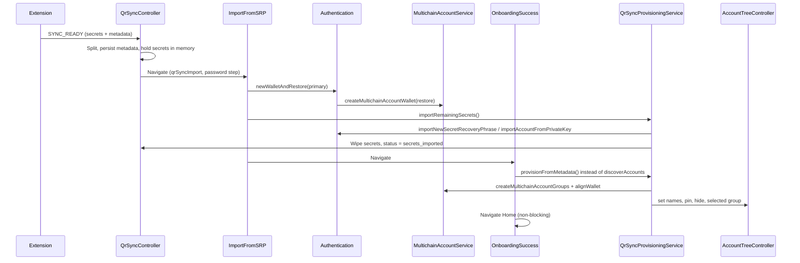

# QR Sync — New-User Onboarding Provisioning

Implementation reference for importing wallets and accounts from the MetaMask extension via QR Sync during **new-user onboarding**. This document consolidates protocol flow, controller responsibilities, state design, and integration points agreed in design review.

**Scope:** New users (`isOnboardingCompleted === false`) who complete Add Device → OTP → password import.

**Out of scope (unchanged):** Login-time discovery (`postLoginAsyncOperations`), Home cloud sync (`useIdentityEffects`), manual SRP import, existing-user QR sync (separate follow-up).

---

## Table of contents

1. [Goals and constraints](#goals-and-constraints)
2. [High-level flow](#high-level-flow)
3. [Controller state design](#controller-state-design)
4. [Phase-by-phase behaviour](#phase-by-phase-behaviour)
5. [External dependencies](#external-dependencies)
6. [Metadata interface](#metadata-interface)
7. [Metadata → controller mapping](#metadata--controller-mapping)
8. [Interface sufficiency review](#interface-sufficiency-review)
9. [Integration touchpoints (non-QrSync files)](#integration-touchpoints-non-qrsync-files)
10. [Failure handling and retry](#failure-handling-and-retry)
11. [Implementation order](#implementation-order)

---

## Goals and constraints

| Goal                                   | Approach                                                                                           |
| -------------------------------------- | -------------------------------------------------------------------------------------------------- |
| Multi-SRP + private-key import         | Use existing `newWalletAndRestore`, `importNewSecretRecoveryPhrase`, `importAccountFromPrivateKey` |
| Correct names, pin, hide               | Apply via `AccountTreeController` after accounts exist                                             |
| Explicit account groups from extension | Replace **only** `OnboardingSuccess` `discoverAccounts` with deterministic group creation          |
| No secret staleness in memory          | Wipe ephemeral secrets after vault import; persist metadata for retry                              |
| No `@metamask/*` package bumps         | Use APIs already in current mobile dependencies                                                    |
| Extension export is ground truth       | User selected accounts on extension; skip activity-based discovery at onboarding success           |

**Constraints:**

- Secrets cannot be imported before the vault exists (password step).
- `newWalletAndRestore` must run first for the primary mnemonic.
- `importNewSecretRecoveryPhrase` fires background `discoverAccounts` today — QR flow must pass `skipDiscovery: true` to avoid racing provisioning.
- Group `0` per HD wallet is created automatically by restore/import; provisioning only creates indices `≥ 1` (or non-contiguous indices individually).

---

## High-level flow



### What existing onboarding already does (QR does not replace)

On password submit, `Authentication.newWalletAndRestore` → `MultichainAccountService.createMultichainAccountWallet({ type: 'restore' })` → `dispatchLogin` → `AccountTreeInitService.initializeAccountTree()` (`AccountsController.updateAccounts`, `AccountTreeController.init`, `MultichainAccountService.init`).

That creates the vault, primary HD wallet, and **group 0**. No `discoverAccounts` runs here.

### What QR replaces

`OnboardingSuccess` `handleOnDone` currently calls `discoverAccounts(keyrings[0])`. For QR users, call `QrSyncProvisioningService.provisionFromMetadata()` instead — for **all** wallets in the persisted metadata plan, not only the primary keyring.

---

## Controller state design

Split secrets from durable metadata in `QrSyncController`.

### State fields

```typescript
/** Ephemeral — never persisted */
pendingSecretImports: QrSyncSecretImportEntry[] | null;

/** Persisted — no secret material */
provisioningMetadata: QrSyncProvisioningMetadata | null;

provisioningStatus:
  | 'idle'
  | 'awaiting_password'
  | 'importing_secrets'
  | 'secrets_imported'
  | 'applying_metadata'
  | 'completed'
  | 'failed';

error: QrSyncError | null;
// ... existing phase, connectionStatus, otp
```

### Persistence policy

| Field                              | `persist`          |
| ---------------------------------- | ------------------ |
| `pendingSecretImports`             | `false`            |
| `provisioningMetadata`             | `true`             |
| `provisioningStatus`               | `true`             |
| `phase`, `otp`, `connectionStatus` | `false` (existing) |

After secret import succeeds, enrich mnemonic entries in `provisioningMetadata` with resolved `entropySource` (see [Metadata interface](#metadata-interface)). This is not secret material and enables retry without re-scanning QR.

### Deprecation

Replace monolithic `importPlan` with `pendingSecretImports` + `provisioningMetadata`. Update selectors (`selectQrSyncPrimaryMnemonic`, etc.) accordingly.

---

## Phase-by-phase behaviour

### Phase A — `SYNC_READY` (QrSyncController)

1. Validate and normalize wire payload (`qr-sync-validation.ts`).
2. Split into `pendingSecretImports` and `provisioningMetadata`.
3. Set `provisioningStatus = 'awaiting_password'`, `phase = reviewing-import`.
4. Send `SYNC_COMPLETED` to extension (protocol unchanged).
5. Navigate to `ImportFromSecretRecoveryPhrase` with `qrSyncImport: true` (existing).

### Phase B — Password submit (`ImportFromSecretRecoveryPhrase`)

1. `Authentication.newWalletAndRestore(password, authData, primaryMnemonic, true)` — **unchanged**.
2. `QrSyncProvisioningService.importRemainingSecrets()`:
   - For each non-primary mnemonic: `importNewSecretRecoveryPhrase(seed, { shouldSelectAccount: false, skipDiscovery: true })`.
   - For each private key: `Authentication.importAccountFromPrivateKey(pk, { shouldSelectAccount: false, shouldCreateSocialBackup: false })`.
3. Resolve `entropySource` per mnemonic entry; write back to `provisioningMetadata.entries[]`.
4. For each private-key entry, resolve `accountAddress` (or `groupId`) post-import; write back to metadata.
5. Clear `pendingSecretImports`, set `provisioningStatus = 'secrets_imported'`.
6. Navigate to `OnboardingSuccess` — **unchanged**.

No account group creation or metadata application in this phase.

### Phase C — `OnboardingSuccess` Done

```typescript
if (selectQrSyncNeedsProvisioning(state)) {
  void QrSyncProvisioningService.provisionFromMetadata();
} else {
  void discoverAccounts(keyrings[0].metadata.id);
}
queueMicrotask(() => onDone());
```

`provisionFromMetadata()` (background, non-blocking navigation):

1. `await Engine.getSnapKeyring()` (existing pattern).
2. For each **MNEMONIC** entry in metadata:
   - Compute `maxGroupIndex` from `groups[]`.
   - If `maxGroupIndex > 0`: `MultichainAccountService.createMultichainAccountGroups({ entropySource, fromGroupIndex: 1, toGroupIndex: maxGroupIndex })` when indices are contiguous; otherwise `createMultichainAccountGroup` per index (see [Interface sufficiency](#interface-sufficiency-review)).
   - `MultichainAccountService.alignWallet(entropySource)` for Snap/multichain alignment.
   - `AccountTreeController.setAccountWalletName(walletId, walletName)`.
   - Per group: `setAccountGroupName`, `setAccountGroupPinned`, `setAccountGroupHidden`.
3. For each **PRIVATE_KEY** entry:
   - Resolve `groupId` from stored `accountAddress` / import order.
   - `setAccountGroupName(groupId, accountName)` (+ pin/hide if present).
4. `setSelectedAccountGroup` for first `pinned: true` group across plan, else primary group 0.
5. Set `provisioningStatus = 'completed'`, clear `provisioningMetadata`.

### Phase D — After Home (unchanged)

- `useIdentityEffects` cloud sync when Backup & Sync enabled.
- `postLoginAsyncOperations` discovery on **unlock** (not first onboard).

---

## External dependencies

### By phase

| Phase | Service / controller            | Package                                | Purpose                                        |
| ----- | ------------------------------- | -------------------------------------- | ---------------------------------------------- |
| A     | `WalletClient`, `KeyManager`    | MWP packages                           | Encrypted QR session                           |
| B     | `Authentication`                | app core                               | Vault restore, PK import                       |
| B     | `MultichainAccountService`      | `@metamask/multichain-account-service` | `createMultichainAccountWallet`                |
| B     | `importNewSecretRecoveryPhrase` | `app/actions/multiSrp`                 | Secondary SRP import                           |
| B     | `AccountTreeInitService`        | app                                    | Tree init via `dispatchLogin`                  |
| C     | `MultichainAccountService`      | same                                   | `createMultichainAccountGroups`, `alignWallet` |
| C     | `AccountTreeController`         | `@metamask/account-tree-controller`    | Names, pin, hide, selection                    |
| C     | `Engine.getSnapKeyring`         | app                                    | Snap init before account ops                   |

### Key APIs (current versions, no bump required)

**MultichainAccountService** (`@metamask/multichain-account-service`):

- `createMultichainAccountWallet({ type: 'restore' | 'import', ... })`
- `createMultichainAccountGroups({ entropySource, fromGroupIndex?, toGroupIndex })`
- `createMultichainAccountGroup({ entropySource, groupIndex })`
- `getMultichainAccountGroup({ entropySource, groupIndex })`
- `alignWallet(entropySource)`

**AccountTreeController** (`@metamask/account-tree-controller@7.5.3`):

- `setAccountWalletName(walletId, name)`
- `setAccountGroupName(groupId, name, autoHandleConflict?)`
- `setAccountGroupPinned(groupId, pinned)`
- `setAccountGroupHidden(groupId, hidden)`
- `setSelectedAccountGroup(groupId)`

---

## Metadata interface

### Extension wire example

```json
{
  "version": 1,
  "data": [
    {
      "type": "Mnemonic",
      "mnemonic": "test test ... junk",
      "name": "Wallet 1",
      "groups": [
        { "groupIndex": 0, "name": "Account 1", "pinned": true },
        { "groupIndex": 1, "name": "Account 2" },
        { "groupIndex": 2, "name": "Savings", "hidden": true }
      ]
    },
    {
      "type": "PrivateKey",
      "privateKey": "0xac09...",
      "name": "Imported Account 1"
    }
  ]
}
```

### Mobile persisted type (`QrSyncProvisioningMetadata`)

```typescript
/** Schema version for persisted provisioning metadata */
export type QrSyncProvisioningMetadataVersion = 1;

export type QrSyncProvisioningGroupMetadata = {
  groupIndex: number;
  name: string;
  pinned?: boolean;
  hidden?: boolean;
};

export type QrSyncProvisioningMnemonicEntry = {
  /** Matches import order / wire payload index */
  index: number;
  type: 'MNEMONIC';
  isPrimary: boolean;
  walletName: string;
  groups: QrSyncProvisioningGroupMetadata[];
  /**
   * Filled by mobile after secret import (Phase B).
   * Maps this entry to MultichainAccountService / AccountTreeController.
   */
  entropySource?: EntropySourceId;
};

export type QrSyncProvisioningPrivateKeyEntry = {
  index: number;
  type: 'PRIVATE_KEY';
  accountName: string;
  pinned?: boolean;
  hidden?: boolean;
  /**
   * Filled by mobile after secret import (Phase B).
   * Used to resolve AccountTree groupId.
   */
  accountAddress?: string;
};

export type QrSyncProvisioningEntry =
  | QrSyncProvisioningMnemonicEntry
  | QrSyncProvisioningPrivateKeyEntry;

export type QrSyncProvisioningMetadata = {
  version: QrSyncProvisioningMetadataVersion;
  receivedAt: number;
  entries: QrSyncProvisioningEntry[];
};
```

### Ephemeral secret type (`QrSyncSecretImportEntry`)

```typescript
export type QrSyncSecretImportEntry = {
  index: number;
  type: 'MNEMONIC' | 'PRIVATE_KEY';
  value: string;
  isPrimary: boolean;
};
```

Secrets and metadata share `index` for correlation across Phase B enrichment.

---

## Metadata → controller mapping

### MNEMONIC entries

| Metadata field                  | Consumer                 | API                                                                         |
| ------------------------------- | ------------------------ | --------------------------------------------------------------------------- |
| `entropySource` (enriched)      | MultichainAccountService | `createMultichainAccountGroups`, `alignWallet`                              |
| `groups[].groupIndex`           | MultichainAccountService | `createMultichainAccountGroup` or range via `createMultichainAccountGroups` |
| `walletName`                    | AccountTreeController    | `setAccountWalletName(walletId, walletName)`                                |
| `groups[].name`                 | AccountTreeController    | `setAccountGroupName(groupId, name)`                                        |
| `groups[].pinned`               | AccountTreeController    | `setAccountGroupPinned(groupId, pinned)`                                    |
| `groups[].hidden`               | AccountTreeController    | `setAccountGroupHidden(groupId, hidden)`                                    |
| First pinned group (or group 0) | AccountTreeController    | `setSelectedAccountGroup(groupId)`                                          |

**Resolve `walletId`:** `AccountTreeController.getAccountWalletObjects()` → find `type === Entropy` where `metadata.entropy.id === entropySource`.

**Resolve `groupId`:** Find group under that wallet where `metadata.entropy.groupIndex === groupIndex`. Alternatively: `MultichainAccountService.getMultichainAccountGroup({ entropySource, groupIndex })` then map to tree group id.

**Group 0:** Already exists after restore/import — skip creation, only apply metadata.

### PRIVATE_KEY entries

| Metadata field              | Consumer              | API                                               |
| --------------------------- | --------------------- | ------------------------------------------------- |
| `accountAddress` (enriched) | AccountTreeController | Locate `SingleAccount` group containing address   |
| `accountName`               | AccountTreeController | `setAccountGroupName(groupId, accountName)`       |
| `pinned` / `hidden`         | AccountTreeController | `setAccountGroupPinned` / `setAccountGroupHidden` |

Private-key accounts live under `AccountWalletType.Keyring` / `SingleAccount` groups — no `MultichainAccountService` calls.

---

## Interface sufficiency review

### Verdict

The designed metadata interface is **sufficient** for `MultichainAccountService` and `AccountTreeController`, provided:

1. Phase B **enriches** mnemonic entries with `entropySource` and PK entries with `accountAddress`.
2. Provisioning uses **per-index** group creation when `groupIndex` values are non-contiguous.
3. Pin/hide on PK entries are optional fields (extension may omit them).

No dependency updates required.

### Field-by-field coverage

| Controller need                   | Metadata supplies?                                              | Notes                                                              |
| --------------------------------- | --------------------------------------------------------------- | ------------------------------------------------------------------ |
| `entropySource` for MAS           | After enrichment                                                | Not in extension wire; derived from KeyringController after import |
| `fromGroupIndex` / `toGroupIndex` | Derived from `groups[].groupIndex`                              | `min`/`max` of indices; skip `0`                                   |
| `groupIndex` (single)             | `groups[].groupIndex`                                           | Direct                                                             |
| `walletId`                        | Derived from `entropySource`                                    | Not stored in metadata                                             |
| `groupId`                         | Derived from `entropySource` + `groupIndex` or `accountAddress` | Not stored in metadata                                             |
| Wallet display name               | `walletName`                                                    | Maps to `AccountTreeWalletMetadata.name`                           |
| Group display name                | `groups[].name` / `accountName`                                 | Maps to `AccountTreeGroupMetadata.name`                            |
| Pinned                            | `groups[].pinned`                                               | Maps to `AccountTreeGroupMetadata.pinned`                          |
| Hidden                            | `groups[].hidden`                                               | Maps to `AccountTreeGroupMetadata.hidden`                          |
| Selected account                  | First `pinned: true`                                            | Policy in provisioning service                                     |

### AccountTreeController metadata alignment

From `@metamask/account-tree-controller`:

- **Wallet:** `AccountTreeWalletMetadata` = `{ name }` (+ `entropy.id` on entropy wallets).
- **Group:** `AccountTreeGroupMetadata` = `{ name, pinned, hidden, lastSelected }` (+ `entropy.groupIndex` on multichain groups).

The proposed interface covers every **user-writable** tree field exposed by setter APIs. `lastSelected` is local-only and should be set implicitly by `setSelectedAccountGroup`, not from extension.

### MultichainAccountService alignment

MAS does not consume display metadata (names, pin, hide). It only needs:

- `entropySource`
- `groupIndex` (via range or single create)

Metadata `groups[]` array is the correct input. After `createMultichainAccountGroups`, call `alignWallet(entropySource)` to replace the Snap-alignment portion of `discoverAccounts`.

### Gaps and mitigations

| Gap                                                                      | Severity  | Mitigation                                                                                 |
| ------------------------------------------------------------------------ | --------- | ------------------------------------------------------------------------------------------ |
| `entropySource` not in extension payload                                 | Expected  | Enrich in Phase B; persist in metadata                                                     |
| Non-contiguous `groupIndex` (e.g. 0, 2)                                  | Medium    | Use `createMultichainAccountGroup` per index, not range API                                |
| PK `groupId` not in payload                                              | Expected  | Enrich with `accountAddress` in Phase B                                                    |
| Multiple `pinned: true`                                                  | Low       | Document policy: first in plan order wins                                                  |
| `setAccountGroupName` duplicate names                                    | Low       | Pass `autoHandleConflict: true` or handle errors                                           |
| Seedless onboarding + QR                                                 | Edge case | Existing `SeedlessOnboardingController` paths in `importNewSecretRecoveryPhrase` still run |
| Legacy wire `QrSyncSecretMetadata` (`hiddenIndexes`, flat `accountName`) | Migration | Normalizer maps to `groups[]` in splitter                                                  |

### Not required in metadata

| Field                                         | Why omitted                                            |
| --------------------------------------------- | ------------------------------------------------------ |
| `walletId` / `groupId`                        | Runtime-derived from entropy + indices                 |
| Per-chain account addresses                   | Created by MAS providers during group creation + align |
| `waitForAllProvidersToFinishCreatingAccounts` | Provisioning policy default; not extension data        |
| Cloud sync flags                              | Out of scope at onboarding success                     |

---

## Integration touchpoints (non-QrSync files)

| File                                                           | Change                                                                        |
| -------------------------------------------------------------- | ----------------------------------------------------------------------------- |
| `app/core/QrSync/**`                                           | Controller state, splitter, provisioning service, validation updates          |
| `app/selectors/qrSyncController/index.ts`                      | `selectQrSyncNeedsProvisioning`, primary mnemonic from `pendingSecretImports` |
| `app/components/Views/ImportFromSecretRecoveryPhrase/index.js` | Call `importRemainingSecrets` after `newWalletAndRestore` when `qrSyncImport` |
| `app/components/Views/OnboardingSuccess/index.tsx`             | Branch: provision vs `discoverAccounts`                                       |
| `app/actions/multiSrp/index.ts`                                | Add `skipDiscovery?: boolean` to options                                      |
| Tests                                                          | Controller, provisioning service, OnboardingSuccess, ImportFromSRP QR path    |

---

## Failure handling and retry

| Scenario                        | `provisioningStatus` | Recovery                                                           |
| ------------------------------- | -------------------- | ------------------------------------------------------------------ |
| User abandons before password   | `awaiting_password`  | Session timeout clears ephemeral secrets; metadata TTL cleanup     |
| Secret import fails             | `failed`             | Show error; user re-scans QR                                       |
| App kill after secrets imported | `secrets_imported`   | Resume `provisionFromMetadata` on next launch or OnboardingSuccess |
| Metadata apply partial failure  | `failed`             | Keep `provisioningMetadata`, retry provisioning                    |
| Success                         | `completed`          | Clear metadata                                                     |

---

## Implementation order

1. Types: `QrSyncProvisioningMetadata`, state split, persistence config.
2. `qr-sync-payload-splitter.ts` on `SYNC_READY`.
3. `QrSyncProvisioningService.importRemainingSecrets` + Phase B enrichment.
4. `skipDiscovery` in `importNewSecretRecoveryPhrase`.
5. `QrSyncProvisioningService.provisionFromMetadata` + OnboardingSuccess gate.
6. Selectors + ImportFromSRP wiring.
7. Retry on app launch for `secrets_imported`.
8. Unit tests per module; integration test for full QR onboarding path.

---

## Related code

| Area                        | Path                                                   |
| --------------------------- | ------------------------------------------------------ |
| QR Sync controller          | `app/core/QrSync/QrSyncController.ts`                  |
| Validation                  | `app/core/QrSync/services/qr-sync-validation.ts`       |
| Add device UI               | `app/components/Views/AddDeviceToWallet/`              |
| Onboarding import           | `app/components/Views/ImportFromSecretRecoveryPhrase/` |
| Onboarding success          | `app/components/Views/OnboardingSuccess/`              |
| Multi-SRP action            | `app/actions/multiSrp/index.ts`                        |
| Discovery (replaced for QR) | `app/multichain-accounts/discovery.ts`                 |
| Tree init                   | `app/multichain-accounts/AccountTreeInitService/`      |
