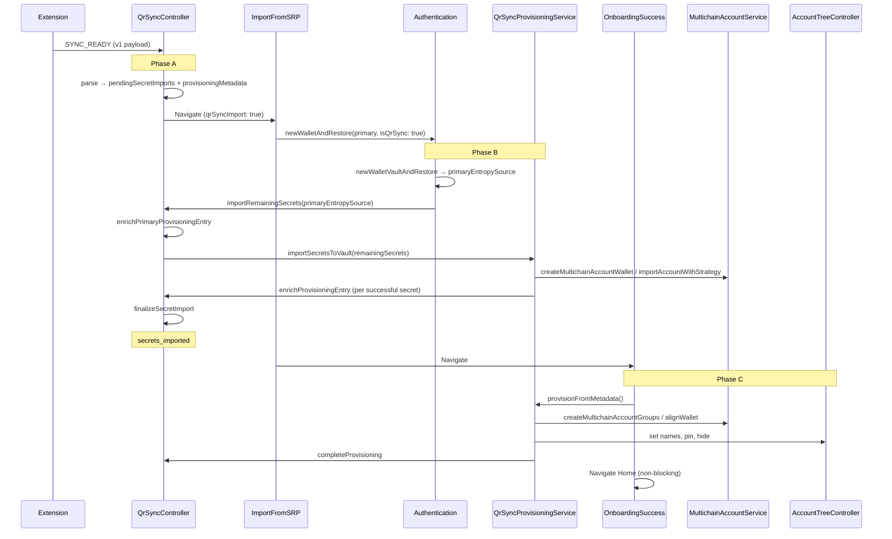

# QR Sync — Onboarding Provisioning

Implementation reference for importing wallets and accounts from the MetaMask extension via QR Sync.

**Primary documented flow:** New users (`isOnboardingCompleted === false`) who complete Add Device → OTP → password import → OnboardingSuccess.

**Phase B is reusable:** Vault secret import (`QrSyncController.importRemainingSecrets` → `QrSyncProvisioningService.importSecretsToVault`) is **not** limited to new-user onboarding. It only requires `provisioningStatus === 'awaiting_password'` and pending secrets (`isQrSyncReadyForSecretImport`). Today it is wired from `Authentication.newWalletAndRestore(..., isQrSync: true)` during onboarding; the same controller API can be called after onboarding once a primary wallet exists (UI / Phase C trigger for existing users is separate follow-up).

**Out of scope (for now):** Post-onboarding QR entry UI and Phase C trigger for existing users; login-time discovery (`postLoginAsyncOperations`); Home cloud sync (`useIdentityEffects`); manual SRP import via `app/actions/multiSrp`.

---

## How to resume this work

Read this section first if you are picking the task up after time away.

| Question              | Answer                                                                                                                                                                            |
| --------------------- | --------------------------------------------------------------------------------------------------------------------------------------------------------------------------------- |
| What is done?         | **Phases A, B, and C** for new-user onboarding                                                                                                                                    |
| What is next?         | Optional [app-launch resume](#step-c4--app-launch-resume-optional-follow-up) for Phase C; post-onboarding QR UI; manual device QA                                                 |
| Canonical types       | `app/core/QrSync/types.ts` (wire + provisioning + protocol in one file)                                                                                                           |
| Canonical validation  | `app/core/QrSync/services/qr-sync-validation.ts` — Phase A: `parseQrSyncSyncReadyMessage`; Phase B: `isQrSyncReadyForSecretImport`, `resolveQrSyncProvisioningEntryForEnrichment` |
| Phase B orchestration | `app/core/QrSync/QrSyncController.ts` → `importRemainingSecrets`                                                                                                                  |
| Phase B vault import  | `app/core/QrSync/services/qr-sync-provisioning-service.ts` → `importSecretsToVault`                                                                                               |
| Phase C metadata      | `app/core/QrSync/services/qr-sync-provisioning-service.ts` → `provisionFromMetadata`                                                                                              |
| Onboarding wiring     | `Authentication.newWalletAndRestore(..., isQrSync)` delegates to `QrSyncController.importRemainingSecrets`                                                                        |
| Tests to run          | `yarn jest app/core/QrSync app/selectors/qrSyncController app/core/Authentication/Authentication.test.ts`                                                                         |

**Do not re-introduce:** legacy wire format (`{ type, value, metadata }`), `importPlan`, `provisioning-types.ts`, vault orchestration inside `Authentication`, removed controller APIs (`canImportRemainingSecrets`, `assertReadyForSecretImport`, `getRemainingSecretImports`, `completeSecretImport`), or a separate payload splitter module. Mapping happens inside `parseQrSyncSyncReadyMessage`.

---

## Table of contents

1. [Implementation status](#implementation-status)
2. [Goals and constraints](#goals-and-constraints)
3. [End-to-end flow](#end-to-end-flow)
4. [Controller state](#controller-state)
5. [Types reference](#types-reference)
6. [Phase A — SYNC_READY (done)](#phase-a--sync_ready-done)
7. [Phase B — Vault secret import (done)](#phase-b--vault-secret-import-done)
8. [Phase C — OnboardingSuccess](#phase-c--onboardingsuccess)
9. [Phase D — After Home](#phase-d--after-home)
10. [Metadata → AccountTree mapping](#metadata--accounttree-mapping)
11. [Failure handling](#failure-handling)
12. [Implementation checklist](#implementation-checklist)
13. [Testing plan](#testing-plan)
14. [Related code](#related-code)

---

## Implementation status

| Phase | Description                                                      | Status                  |
| ----- | ---------------------------------------------------------------- | ----------------------- |
| **A** | Parse `SYNC_READY`, store secrets + metadata, navigate to import | **Done**                |
| **B** | Import remaining secrets into vault; enrich metadata             | **Done** (reusable API) |
| **C** | Create groups + apply names/pin/hide on OnboardingSuccess        | **Done** (onboarding)   |
| **D** | Post-home cloud sync / unlock discovery                          | Unchanged (no QR work)  |

### Phase A deliverables (verified)

- [x] `pendingSecretImports` + `provisioningMetadata` + `provisioningStatus` on `QrSyncController`
- [x] `parseQrSyncSyncReadyMessage` in `qr-sync-validation.ts`
- [x] `routeIncomingQrSyncMessage` returns flat `pendingSecretImports` / `provisioningMetadata`
- [x] Persistence: metadata + status persisted; secrets never persisted
- [x] Selectors: `selectQrSyncPrimaryMnemonic`, `selectQrSyncShouldNavigateToImport`, etc.
- [x] `ImportFromSecretRecoveryPhrase` pre-fills primary mnemonic when `qrSyncImport: true`
- [x] Primary-mnemonic validation only when `isOnboardingCompleted === false`
- [x] Unit tests: `QrSyncController`, `qr-sync-validation`

### Phase B deliverables (verified)

- [x] `skipDiscovery` option on `importNewSecretRecoveryPhrase` (`app/actions/multiSrp/index.ts`) — manual Add SRP only; **QR does not use this**
- [x] `QrSyncController.importRemainingSecrets` — orchestration entrypoint (reusable; guards via `isQrSyncReadyForSecretImport`)
- [x] `QrSyncProvisioningService.importSecretsToVault` — vault imports via messenger (MAS + KeyringController)
- [x] Metadata enrichment via private `enrichPrimaryProvisioningEntry` / `finalizeSecretImport` and public `enrichProvisioningEntry`
- [x] Onboarding wired via `Authentication.newWalletAndRestore(..., isQrSync: true)` → `QrSyncController.importRemainingSecrets`
- [x] `ImportFromSecretRecoveryPhrase` does **not** call `QrSyncController.resetState()` after successful QR import (only on back)
- [x] Engine init + messengers for controller ↔ provisioning service
- [x] Unit tests: `QrSyncController`, `qr-sync-provisioning-service`, `Authentication`, `ImportFromSecretRecoveryPhrase`

### Phase C deliverables (verified)

- [x] `selectQrSyncNeedsProvisioning` selector
- [x] `completeProvisioning` controller method (status → `completed`, clear metadata)
- [x] Expand provisioning service messenger (MultichainAccountService, AccountTreeController)
- [x] `QrSyncProvisioningService.provisionFromMetadata`
- [x] `OnboardingSuccess` branches to `provisionFromMetadata` vs `discoverAccounts`
- [ ] App-launch resume for `provisioningStatus === 'secrets_imported'`
- [ ] Post-onboarding Phase C trigger (reuse `provisionFromMetadata` when wired)

---

## Goals and constraints

| Goal                                   | Approach                                                                                                                                   |
| -------------------------------------- | ------------------------------------------------------------------------------------------------------------------------------------------ |
| Multi-SRP + private-key import         | `QrSyncProvisioningService.importSecretsToVault` (MAS + KeyringController via messenger) — log-and-continue policy like seedless rehydrate |
| Correct names, pin, hide               | `AccountTreeController` after accounts exist (Phase C)                                                                                     |
| Explicit account groups from extension | Replace **only** OnboardingSuccess `discoverAccounts` with deterministic provisioning (onboarding today)                                   |
| No secret staleness in memory          | Wipe `pendingSecretImports` after Phase B; keep metadata for Phase C                                                                       |
| No `@metamask/*` package bumps         | Use APIs already in current mobile dependencies                                                                                            |
| Extension export is ground truth       | Skip activity-based `discoverAccounts` for QR onboarding users                                                                             |
| Reusable Phase B                       | Controller + service pipeline is onboarding-agnostic; callers may pass `primaryEntropySource` when enriching the primary mnemonic entry    |

**Hard constraints:**

- Secrets cannot be imported before the vault exists (password / primary wallet step).
- The **primary** mnemonic must be restored or imported first before remaining secrets; pass its `entropySource` into `importRemainingSecrets` when enriching primary metadata (onboarding always does; post-onboarding callers may omit if primary was enriched elsewhere).
- **Phase B secondary mnemonics** must use `QrSyncProvisioningService.#importMnemonicToVault` — **not** `importNewSecretRecoveryPhrase` (`app/actions/multiSrp`). That action is for post-onboarding “Add SRP” and triggers discovery / user-storage sync unless `skipDiscovery` is set.
- Phase B must **not** call `discoverAccounts`, `AccountTreeController.syncWithUserStorage`, or seedless backup APIs.
- Per-secret import errors during Phase B follow **seedless rehydrate** policy: log and continue (do not block the caller).
- `Authentication` must **not** import `QrSyncProvisioningService` directly — controller mediates via messenger (avoids circular dependency).
- Group `0` per HD wallet is created automatically by restore/import; Phase C creates indices `1..N` where `N` is the max `groupIndex` in extension metadata (extension exports the full contiguous wallet `0..N`).
- Wire format is **v1 only**: `{ version: 1, deadline, data: [Mnemonic \| PrivateKey, ...] }`.

---

## End-to-end flow

### New-user onboarding (implemented)



### Phase B callers

| Context                      | Primary wallet                            | Phase B trigger                                                                                                             |
| ---------------------------- | ----------------------------------------- | --------------------------------------------------------------------------------------------------------------------------- |
| **New-user onboarding**      | `Authentication.newWalletVaultAndRestore` | `Authentication.newWalletAndRestore(..., isQrSync: true)` → `QrSyncController.importRemainingSecrets(primaryEntropySource)` |
| **Post-onboarding** (future) | TBD (existing vault + primary entropy)    | Call `QrSyncController.importRemainingSecrets(primaryEntropySource?)` when `isQrSyncReadyForSecretImport(state)`            |

Phase B itself does not check `isOnboardingCompleted`. Runtime guards live in `qr-sync-validation.ts`: `isQrSyncReadyForSecretImport` requires `provisioningStatus === 'awaiting_password'` and non-empty `pendingSecretImports`.

### What existing onboarding already does (QR does not replace)

On password submit, `Authentication.newWalletAndRestore` → `MultichainAccountService.createMultichainAccountWallet({ type: 'restore' })` → `dispatchLogin` → `AccountTreeInitService.initializeAccountTree()`.

That creates the vault, primary HD wallet, and **group 0**. No `discoverAccounts` runs here.

### What QR replaces (onboarding)

`OnboardingSuccess` `handleOnDone` currently always calls `discoverAccounts(keyrings[0])`. For QR users with `provisioningStatus === 'secrets_imported'`, call `QrSyncProvisioningService.provisionFromMetadata()` instead — for **all** wallets in the persisted metadata plan.

---

## Controller state

```typescript
// app/core/QrSync/controller-types.ts

pendingSecretImports: QrSyncSecretImportEntry[] | null;  // never persisted
provisioningMetadata: QrSyncProvisioningMetadata | null; // persisted
provisioningStatus: QrSyncProvisioningStatus | null;     // persisted
// + phase, connectionStatus, otp, error (session lifecycle)
```

### `provisioningStatus` values (implemented)

| Value               | Meaning                                                                         |
| ------------------- | ------------------------------------------------------------------------------- |
| `null`              | No active provisioning pipeline                                                 |
| `awaiting_password` | Secrets in memory; caller must complete primary wallet step (Phase A sets this) |
| `secrets_imported`  | Vault + all secrets imported; metadata enriched; ready for Phase C              |
| `completed`         | Phase C finished; metadata cleared                                              |
| `failed`            | Provisioning failed; set status only (no extra retry UI in scope)               |

We intentionally keep this enum small. Do not add `importing_secrets` / `applying_metadata` unless a product requirement appears.

### Persistence policy

| Field                                       | `persist` |
| ------------------------------------------- | --------- |
| `pendingSecretImports`                      | `false`   |
| `provisioningMetadata`                      | `true`    |
| `provisioningStatus`                        | `true`    |
| `phase`, `otp`, `connectionStatus`, `error` | `false`   |

After Phase B, mnemonic entries in `provisioningMetadata` gain `entropySource`; private-key entries gain `accountAddress`. These are not secrets and enable Phase C without re-scanning QR.

---

## Types reference

All types live in **`app/core/QrSync/types.ts`**.

### Wire payload (extension → mobile)

```typescript
// Envelope: QrSyncSyncReadyMessage { type: 'sync-ready', version: '1.0.0', data: QrSyncReadyPayload }

type QrSyncReadyPayload = {
  version: 1; // QrSyncSchemaVersion
  deadline: number;
  data: QrSyncReadyData[];
};

// Mnemonic entry — only `mnemonic` is required on wire
type QrSyncReadyMnemonicData = {
  type: 'Mnemonic';
  mnemonic: string;
  name?: string; // wallet name → AccountTreeWalletMetadata.name
  groups?: QrSyncAccountGroup[];
  isPrimary?: boolean;
};

// Private-key entry
type QrSyncReadyPrivateKeyData = {
  type: 'PrivateKey';
  privateKey: string;
  name: string; // account group name → AccountTreeGroupMetadata.name
  pinned?: boolean;
  hidden?: boolean;
};

type QrSyncAccountGroup = {
  groupIndex: number;
  name: string; // account group name → AccountTreeGroupMetadata.name
  pinned?: boolean;
  hidden?: boolean;
};
```

### Mobile state shapes

```typescript
// Ephemeral (memory only)
type QrSyncSecretImportEntry = {
  index: number;
  type: 'MNEMONIC' | 'PRIVATE_KEY';
  value: string; // base64-decoded secret
  isPrimary?: boolean; // mnemonics only
};

// Persisted (no secrets)
type QrSyncProvisioningMnemonicEntry = {
  index: number;
  type: 'MNEMONIC';
  isPrimary?: boolean;
  name?: string;
  groups?: QrSyncAccountGroup[];
  entropySource?: EntropySourceId; // filled in Phase B
};

type QrSyncProvisioningPrivateKeyEntry = {
  index: number;
  type: 'PRIVATE_KEY';
  name: string;
  pinned?: boolean;
  hidden?: boolean;
  accountAddress?: string; // filled in Phase B
};

type QrSyncProvisioningMetadata = {
  version: 1;
  entries: QrSyncProvisioningEntry[];
};
```

`index` on secrets and metadata entries always matches the wire `data[]` order.

### Phase B validation shapes

```typescript
// Preconditions for importRemainingSecrets (subset of controller state)
interface QrSyncSecretImportPreconditions {
  provisioningStatus: QrSyncProvisioningStatus | null;
  pendingSecretImports: QrSyncSecretImportEntry[] | null;
}

// enrichProvisioningEntry input (adds persisted metadata)
interface QrSyncProvisioningEntryEnrichmentContext
  extends QrSyncSecretImportPreconditions {
  provisioningMetadata: QrSyncProvisioningMetadata | null;
}

// resolveQrSyncProvisioningEntryForEnrichment return value
interface QrSyncProvisioningEntryResolution {
  entryIndex: number;
  entry: QrSyncProvisioningEntry;
}
```

Phase B guard and enrichment-resolution logic lives in **`qr-sync-validation.ts`** (`isQrSyncReadyForSecretImport`, `resolveQrSyncProvisioningEntryForEnrichment`), not on the controller.

---

## Phase A — SYNC_READY (done)

**Trigger:** Extension sends `sync-ready` over encrypted MWP session.

**Flow:**

1. `routeIncomingQrSyncMessage` → `parseQrSyncSyncReadyMessage`
2. Validate envelope + v1 payload + per-entry wire shape
3. Map wire → `pendingSecretImports` + `provisioningMetadata` (pass-through `name` / `groups`; no field renaming)
4. If onboarding **not** completed: require a primary mnemonic in `pendingSecretImports` (`validateQrSyncSecretImportsForOnboarding`)
5. Store state; `provisioningStatus = 'awaiting_password'`; `phase` → `reviewing-import` → `completed`
6. Send `SYNC_COMPLETED` to extension; tear down session
7. UI navigates to `ImportFromSecretRecoveryPhrase` with `qrSyncImport: true` (via `selectQrSyncShouldNavigateToImport`)

When onboarding **is** completed, step 4 is skipped — the same Phase A state machine runs, enabling post-onboarding QR flows to reach Phase B once a caller wires the primary-wallet step.

**Key files:** `QrSyncController.ts`, `qr-sync-message-router.ts`, `qr-sync-validation.ts`, `AddDeviceToWallet/index.tsx`

---

## Phase B — Vault secret import (done)

**Status:** **Done.** Reusable controller + service pipeline; onboarding is the first wired consumer.

**Goal:** Import every non-primary secret from `pendingSecretImports` into the vault, enrich `provisioningMetadata` with runtime IDs (`entropySource` / `accountAddress`), wipe secrets from memory.

**Do not** create account groups or apply display metadata here — that is Phase C.

### Separation of concerns

| Layer                       | Responsibility                                                                                                           |
| --------------------------- | ------------------------------------------------------------------------------------------------------------------------ |
| `Authentication`            | Onboarding only: create primary vault, then delegate when `isQrSync === true`                                            |
| `qr-sync-validation`        | Phase B preconditions (`isQrSyncReadyForSecretImport`) and enrichment entry resolution                                   |
| `QrSyncController`          | Orchestration — enrich primary (optional), delegate vault work, finalize (private helpers)                               |
| `QrSyncProvisioningService` | Vault imports (`importSecretsToVault`) + per-secret metadata enrichment via messenger; Phase C (`provisionFromMetadata`) |

### Architecture

```
Authentication.newWalletAndRestore(..., isQrSync)     // onboarding caller
  → newWalletVaultAndRestore (primary) → primaryEntropySource
  → if isQrSync: QrSyncController.importRemainingSecrets(primaryEntropySource)

QrSyncController.importRemainingSecrets(primaryEntropySource?)   // reusable entrypoint
  → isQrSyncReadyForSecretImport(state) — no-op unless awaiting_password + pending secrets
  → if primaryEntropySource: enrichPrimaryProvisioningEntry (private)
  → filter non-primary secrets from pendingSecretImports
  → QrSyncProvisioningService.importSecretsToVault(remainingSecrets)  // may be []
       → #importMnemonicToVault / #importPrivateKeyToVault (via messenger)
       → QrSyncController.enrichProvisioningEntry (per successful secret)
  → finalizeSecretImport() (private)

QrSyncProvisioningService.provisionFromMetadata()     // Phase C
```

**Why layered:** Vault work lives in the provisioning service (messenger-based, no `Engine.context` from Authentication). `Authentication` does not import the provisioning service. The controller owns persisted plan state and is the single Phase B orchestration API for onboarding and future post-onboarding callers.

**Rehydrate reference:** `Authentication.rehydrateSeedPhrase` uses a separate inline loop (`importSeedlessMnemonicToVault` / `importAccountFromPrivateKey`) with the same log-and-continue policy. QR Phase B does **not** share that code path but follows the same operational semantics (no discovery, no seedless backup for QR imports).

### Step B1 — `skipDiscovery` on multi-SRP import (manual Add SRP only)

**File:** `app/actions/multiSrp/index.ts`

Used by **post-onboarding** `ImportNewSecretRecoveryPhrase` screen. QR sync does **not** call this.

### Step B2 — `QrSyncProvisioningService.importSecretsToVault`

**File:** `app/core/QrSync/services/qr-sync-provisioning-service.ts`

For each non-primary secret (passed from the controller):

```
FOR each secret:
  TRY:
    IF MNEMONIC:
      entropySource = #importMnemonicToVault(value)
        → MultichainAccountService.createMultichainAccountWallet({ type: 'import', mnemonic })
        → KeyringController.withKeyringV2 → getAccounts
      QrSyncController.enrichProvisioningEntry(index, { entropySource })
    ELSE IF PRIVATE_KEY:
      accountAddress = #importPrivateKeyToVault(value)
        → KeyringController.importAccountWithStrategy(privateKey)
      IF accountAddress: QrSyncController.enrichProvisioningEntry(index, { accountAddress })
  CATCH:
    Logger.error — continue (rehydrate policy)
```

No seedless backup, no discovery, no account selection.

### Step B3 — Controller and validation API (done)

**Files:** `app/core/QrSync/QrSyncController.ts`, `app/core/QrSync/services/qr-sync-validation.ts`

**Validation helpers** (`qr-sync-validation.ts`):

| Function                                                      | Purpose                                                           |
| ------------------------------------------------------------- | ----------------------------------------------------------------- |
| `isQrSyncReadyForSecretImport(preconditions)`                 | `true` when `awaiting_password` and pending secrets exist         |
| `resolveQrSyncProvisioningEntryForEnrichment(context, index)` | Asserts enrichment preconditions; returns `{ entryIndex, entry }` |

**Public controller methods** (registered as messenger actions in `qr-sync-controller-init.ts`):

| Method                                          | Phase | Effect                                                                                                                                  |
| ----------------------------------------------- | ----- | --------------------------------------------------------------------------------------------------------------------------------------- |
| `importRemainingSecrets(primaryEntropySource?)` | B     | Orchestrates Phase B; no-ops when `!isQrSyncReadyForSecretImport(state)`; enriches primary only when `primaryEntropySource` is provided |
| `enrichProvisioningEntry(index, enrichment)`    | B     | Merge `entropySource` or `accountAddress` into persisted metadata (uses `resolveQrSyncProvisioningEntryForEnrichment`)                  |
| `markProvisioningFailed()`                      | C     | `provisioningStatus = 'failed'`, clear `pendingSecretImports`                                                                           |
| `completeProvisioning()`                        | C     | `provisioningStatus = 'completed'`, clear metadata                                                                                      |

**Private controller helpers** (not messenger actions):

| Method                                          | Effect                                                                   |
| ----------------------------------------------- | ------------------------------------------------------------------------ |
| `enrichPrimaryProvisioningEntry(entropySource)` | Enrich primary mnemonic metadata after primary vault restore             |
| `finalizeSecretImport()`                        | `pendingSecretImports = null`, `provisioningStatus = 'secrets_imported'` |

**Removed** (do not re-introduce): `canImportRemainingSecrets`, `assertReadyForSecretImport`, `getRemainingSecretImports`, `completeSecretImport`.

### Step B4 — Onboarding wiring (done)

**File:** `app/core/Authentication/Authentication.ts`

```typescript
const primaryEntropySource = await this.newWalletVaultAndRestore(
  password,
  parsedSeed,
  clearEngine,
);

if (isQrSync) {
  await Engine.context.QrSyncController.importRemainingSecrets(
    primaryEntropySource,
  );
}
```

`ImportFromSecretRecoveryPhrase` passes `isQrSyncImport` as the fifth argument. It must **not** call `QrSyncController.resetState()` after a successful import — that wipes persisted provisioning metadata and breaks OnboardingSuccess Phase C. `resetState()` is only called on **back** during QR import.

### Messenger wiring

- **Controller messenger** delegates `QrSyncProvisioningService:importSecretsToVault` (`qr-sync-controller-messenger/index.ts`)
- **Provisioning service messenger** delegates vault + tree actions (`qr-sync-provisioning-service-messenger/index.ts`)

### Phase B acceptance criteria

- [x] Secondary mnemonics imported via provisioning service (not `importNewSecretRecoveryPhrase`)
- [x] Private keys imported via `KeyringController.importAccountWithStrategy` (not `Authentication.importAccountFromPrivateKey`)
- [x] No `discoverAccounts` or `syncWithUserStorage` during Phase B
- [x] Per-secret vault failures logged and skipped (rehydrate policy); caller continues
- [x] `entropySource` / `accountAddress` written to persisted metadata for successfully imported secrets
- [x] `pendingSecretImports` cleared; `provisioningStatus === 'secrets_imported'` on finalize path
- [x] Enrichment / finalize failures logged and swallowed — **no** `markProvisioningFailed` in Phase B
- [x] Non-QR `newWalletAndRestore` path unchanged (`isQrSync` defaults to `false`)
- [x] `importRemainingSecrets` API reusable beyond onboarding (status-gated via `isQrSyncReadyForSecretImport`, not onboarding-gated)
- [x] `primaryEntropySource` optional on `importRemainingSecrets` (enrichment skipped when omitted)

Do **not** call `markProvisioningFailed` during Phase B.

---

## Phase C — OnboardingSuccess

**Trigger:** User taps Done on `OnboardingSuccess` after QR onboarding.

**Goal:** Create explicit account groups from extension metadata and apply names, pin, hide — instead of `discoverAccounts`.

`provisionFromMetadata` is also status-gated (`secrets_imported`) and can be reused for post-onboarding once a trigger is wired.

### Step C0 — `completeProvisioning` controller method (done)

**File:** `app/core/QrSync/QrSyncController.ts`

| Method                   | Effect                                                            |
| ------------------------ | ----------------------------------------------------------------- |
| `completeProvisioning()` | `provisioningStatus = 'completed'`, `provisioningMetadata = null` |

Reuse `markProvisioningFailed()` on Phase C failure (metadata retained for retry).

### Step C1 — Selector (done)

**File:** `app/selectors/qrSyncController/index.ts`

```typescript
export const selectQrSyncNeedsProvisioning = createSelector(
  selectQrSyncControllerState,
  (state) =>
    state.provisioningStatus === 'secrets_imported' &&
    state.provisioningMetadata !== null,
);
```

### Step C2 — `provisionFromMetadata()` (done)

**File:** `app/core/QrSync/services/qr-sync-provisioning-service.ts`

**Preconditions:** `provisioningStatus === 'secrets_imported'`, enriched metadata present.

**Algorithm (background, non-blocking navigation):**

```
FOR each MNEMONIC entry in provisioningMetadata.entries:
  entropySource = entry.entropySource (required after Phase B)
  walletId = resolve from AccountTreeController (Entropy wallet where metadata.entropy.id === entropySource)

  maxGroupIndex = max(entry.groups[].groupIndex)
  IF maxGroupIndex >= 1:
    IF maxGroupIndex === 1: createMultichainAccountGroup({ entropySource, groupIndex: 1 })
    ELSE: createMultichainAccountGroups({ entropySource, fromGroupIndex: 1, toGroupIndex: maxGroupIndex })

  alignWallet(entropySource)

  IF entry.name: setAccountWalletName(walletId, entry.name)
  FOR each group: setAccountGroupName / setAccountGroupPinned / setAccountGroupHidden on resolved groupId

FOR each PRIVATE_KEY entry:
  groupId = resolve from entry.accountAddress
  setAccountGroupName(groupId, entry.name)
  apply pin/hide if present

QrSyncController.completeProvisioning()
```

**On failure:** `markProvisioningFailed()`; keep metadata for potential retry.

### Step C3 — Wire OnboardingSuccess (done)

**File:** `app/components/Views/OnboardingSuccess/index.tsx`

```typescript
const needsQrProvisioning = useSelector(selectQrSyncNeedsProvisioning);

const handleOnDone = useCallback(() => {
  // ... existing wallet home onboarding eligibility ...

  if (needsQrProvisioning) {
    void QrSyncProvisioningService.provisionFromMetadata();
  } else {
    void runDiscoverAccounts(); // existing path
  }
  queueMicrotask(() => onDone());
}, [needsQrProvisioning, ...]);
```

Navigation to Home must remain non-blocking (provisioning runs in background).

### Step C4 — App launch resume (optional follow-up)

**Status:** Not implemented.

If the app is killed after Phase B with `secrets_imported`, Phase C runs when the user reaches `OnboardingSuccess` and taps Done (`selectQrSyncNeedsProvisioning` is true). There is **no** app-launch hook today — if the user never returns to OnboardingSuccess, Phase C may not run. Document exact trigger when implementing.

### Phase C acceptance criteria

- [x] QR users never call `discoverAccounts` on OnboardingSuccess
- [x] Group 0 metadata applied but not re-created
- [x] Groups `1..N` created in one batch from max `groupIndex` (extension exports contiguous `0..N`)
- [x] `provisioningStatus === 'completed'` and metadata cleared on success
- [x] Failure sets `provisioningStatus === 'failed'`

---

## Phase D — After Home

No QR-specific work. Existing behaviour:

- `useIdentityEffects` cloud sync when Backup & Sync enabled
- `postLoginAsyncOperations` discovery on **unlock** (not first onboard)

---

## Metadata → AccountTree mapping

Account tree uses **`name`** on both wallet and group metadata (not `walletName` / `accountName` in code).

### MNEMONIC entries

| Metadata field            | Consumer                 | API                                            |
| ------------------------- | ------------------------ | ---------------------------------------------- |
| `entropySource` (Phase B) | MultichainAccountService | `createMultichainAccountGroups`, `alignWallet` |
| `groups[].groupIndex`     | MultichainAccountService | group creation                                 |
| `name`                    | AccountTreeController    | `setAccountWalletName(walletId, name)`         |
| `groups[].name`           | AccountTreeController    | `setAccountGroupName(groupId, name)`           |
| `groups[].pinned`         | AccountTreeController    | `setAccountGroupPinned`                        |
| `groups[].hidden`         | AccountTreeController    | `setAccountGroupHidden`                        |

**Resolve `walletId`:** `AccountTreeController.getAccountWalletObjects()` → Entropy wallet where `metadata.entropy.id === entropySource`.

**Resolve `groupId`:** Group under that wallet where `metadata.entropy.groupIndex === groupIndex`.

**Group 0:** Exists after restore/import — skip creation; only apply metadata.

### PRIVATE_KEY entries

| Metadata field             | Consumer              | API                                               |
| -------------------------- | --------------------- | ------------------------------------------------- |
| `accountAddress` (Phase B) | AccountTreeController | Locate SingleAccount group                        |
| `name`                     | AccountTreeController | `setAccountGroupName(groupId, name)`              |
| `pinned` / `hidden`        | AccountTreeController | `setAccountGroupPinned` / `setAccountGroupHidden` |

### External APIs (no package bump)

**MultichainAccountService:** `createMultichainAccountWallet`, `createMultichainAccountGroups`, `createMultichainAccountGroup`, `getMultichainAccountGroup`, `alignWallet`

**AccountTreeController:** `setAccountWalletName`, `setAccountGroupName`, `setAccountGroupPinned`, `setAccountGroupHidden`

---

## Failure handling

| Scenario                                           | `provisioningStatus`                              | Recovery                                                            |
| -------------------------------------------------- | ------------------------------------------------- | ------------------------------------------------------------------- |
| Invalid `SYNC_READY` during onboarding             | `failed` (session)                                | User re-scans QR                                                    |
| User abandons before primary wallet step           | `awaiting_password`                               | Secrets ephemeral; metadata persisted                               |
| Phase B vault import fails (single secret in loop) | unchanged until finalize                          | Logged; caller continues; metadata reflects only successful imports |
| Phase B metadata enrichment / finalize fails       | `secrets_imported` (if finalize ran) or unchanged | Logged only — **no** `markProvisioningFailed` in Phase B            |
| App kill after Phase B                             | `secrets_imported`                                | Resume Phase C on OnboardingSuccess Done (if user returns)          |
| Phase C failure                                    | `failed`                                          | Metadata kept; retry provisioning                                   |
| Success                                            | `completed`                                       | Metadata cleared                                                    |

No retry/TTL UI in scope. `markProvisioningFailed` is used for **Phase C** failures only.

---

## Implementation checklist

| #   | Step                                                             | Phase | Status   | Files                                                           |
| --- | ---------------------------------------------------------------- | ----- | -------- | --------------------------------------------------------------- |
| 1   | Add `skipDiscovery` to `importNewSecretRecoveryPhrase`           | B     | Done     | `app/actions/multiSrp/index.ts`, tests                          |
| 2   | Add controller provisioning mutations                            | B     | Done     | `QrSyncController.ts`, `QrSyncController.test.ts`               |
| 3   | Layered Phase B: controller orchestration + service vault import | B     | Done     | `QrSyncController.ts`, `qr-sync-provisioning-service.ts`, tests |
| 4   | Wire `Authentication.newWalletAndRestore` with `isQrSync` gate   | B     | Done     | `Authentication.ts`, `Authentication.test.ts`                   |
| 5   | Add `selectQrSyncNeedsProvisioning`                              | C     | Done     | `selectors/qrSyncController/index.ts`, tests                    |
| 6   | Add `completeProvisioning` controller method                     | C     | Done     | `QrSyncController.ts`, messenger, tests                         |
| 7   | Implement `provisionFromMetadata`                                | C     | Done     | `qr-sync-provisioning-service.ts`, tests                        |
| 8   | Branch OnboardingSuccess Done handler                            | C     | Done     | `OnboardingSuccess/index.tsx`, `index.test.tsx`                 |
| 9   | Fix QR `resetState` — back only, not after successful import     | B     | Done     | `ImportFromSecretRecoveryPhrase/index.js`, `index.test.tsx`     |
| 10  | Move Phase B guards to `qr-sync-validation.ts`                   | B     | Done     | `qr-sync-validation.ts`, `types.ts`, `QrSyncController.ts`      |
| 11  | App-launch / resume for `secrets_imported`                       | C     | **Next** | TBD                                                             |
| 12  | Post-onboarding QR UI + Phase B/C wiring for existing users      | B/C   | **Next** | TBD                                                             |

---

## Testing plan

| Area                                             | What to test                                                                                           |
| ------------------------------------------------ | ------------------------------------------------------------------------------------------------------ |
| `isQrSyncReadyForSecretImport`                   | True only for `awaiting_password` + pending secrets                                                    |
| `resolveQrSyncProvisioningEntryForEnrichment`    | Resolves entry; throws on invalid state / missing metadata / unknown index                             |
| `QrSyncController.importRemainingSecrets`        | Delegates to provisioning service; enriches primary when entropy provided; finalizes; no-ops when idle |
| `QrSyncProvisioningService.importSecretsToVault` | MAS + keyring import; enriches metadata; log-and-continue per secret                                   |
| `Authentication.newWalletAndRestore` (isQrSync)  | Calls `importRemainingSecrets` when `isQrSync: true`; skips when `false`                               |
| `enrichProvisioningEntry`                        | Metadata merge via validation helper; exercised via controller + provisioning service tests            |
| `provisionFromMetadata`                          | Group creation, name/pin/hide                                                                          |
| `selectQrSyncNeedsProvisioning`                  | True only when `secrets_imported` + metadata present                                                   |
| OnboardingSuccess                                | QR branch vs default `discoverAccounts`                                                                |
| ImportFromSecretRecoveryPhrase                   | QR import does not call `resetState` on success; preserves provisioning state                          |
| Controller                                       | Status transitions: `awaiting_password` → `secrets_imported` → `completed` / `failed`                  |
| Regression                                       | Manual SRP import and non-QR onboarding unchanged                                                      |

Run: `yarn jest app/core/QrSync app/selectors/qrSyncController app/core/Authentication/Authentication.test.ts app/components/Views/ImportFromSecretRecoveryPhrase/index.test.tsx`

**Not yet covered:** Detox/E2E QR onboarding; post-onboarding Phase B caller; dedicated E2E for QR private-key path.

---

## Related code

| Area                            | Path                                                                                                     |
| ------------------------------- | -------------------------------------------------------------------------------------------------------- |
| Types (single file)             | `app/core/QrSync/types.ts`                                                                               |
| Controller state                | `app/core/QrSync/controller-types.ts`                                                                    |
| QR Sync controller              | `app/core/QrSync/QrSyncController.ts`                                                                    |
| Phase B orchestration           | `QrSyncController.importRemainingSecrets`                                                                |
| Phase B guards + entry resolve  | `isQrSyncReadyForSecretImport`, `resolveQrSyncProvisioningEntryForEnrichment` in `qr-sync-validation.ts` |
| Phase B vault import            | `QrSyncProvisioningService.importSecretsToVault`                                                         |
| Phase C metadata                | `QrSyncProvisioningService.provisionFromMetadata`                                                        |
| Controller ↔ service messenger | `app/core/Engine/messengers/qr-sync-controller-messenger/`, `qr-sync-provisioning-service-messenger/`    |
| Onboarding delegation           | `Authentication.newWalletAndRestore` (`isQrSync` gate)                                                   |
| Seedless rehydrate (reference)  | `Authentication.rehydrateSeedPhrase`, `importSeedlessMnemonicToVault` (separate code path)               |
| Validation + parse              | `app/core/QrSync/services/qr-sync-validation.ts`                                                         |
| Message router                  | `app/core/QrSync/services/qr-sync-message-router.ts`                                                     |
| Selectors                       | `app/selectors/qrSyncController/index.ts`                                                                |
| Add device UI                   | `app/components/Views/AddDeviceToWallet/`                                                                |
| Onboarding import               | `app/components/Views/ImportFromSecretRecoveryPhrase/`                                                   |
| Onboarding success              | `app/components/Views/OnboardingSuccess/`                                                                |
| Multi-SRP action (not QR)       | `app/actions/multiSrp/index.ts`                                                                          |
| Discovery (replaced for QR)     | `app/multichain-accounts/discovery.ts`                                                                   |
| Tree init                       | `app/multichain-accounts/AccountTreeInitService/`                                                        |
