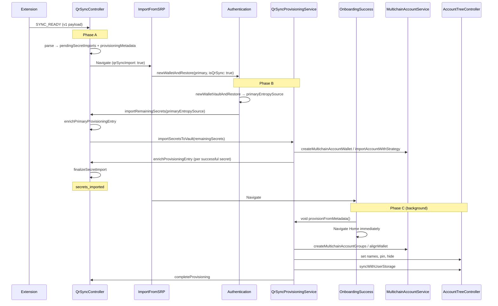
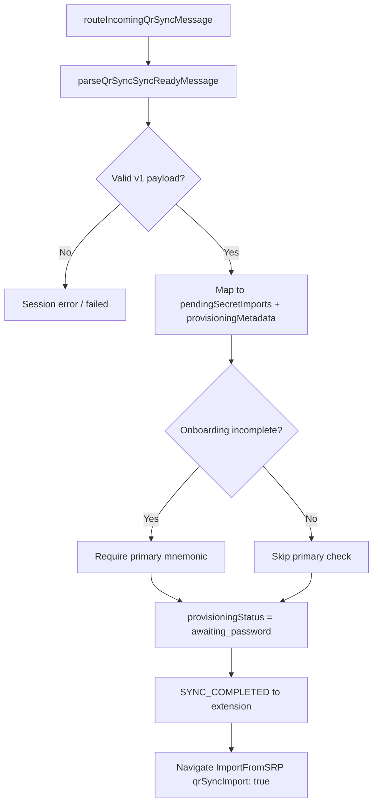
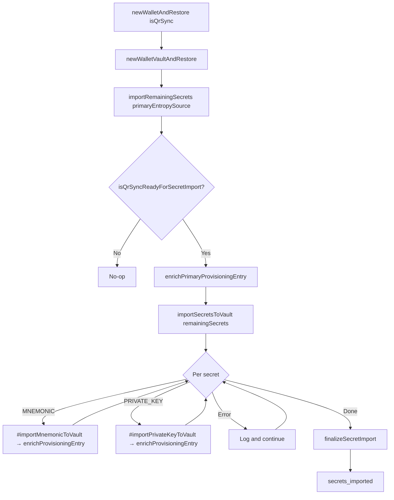
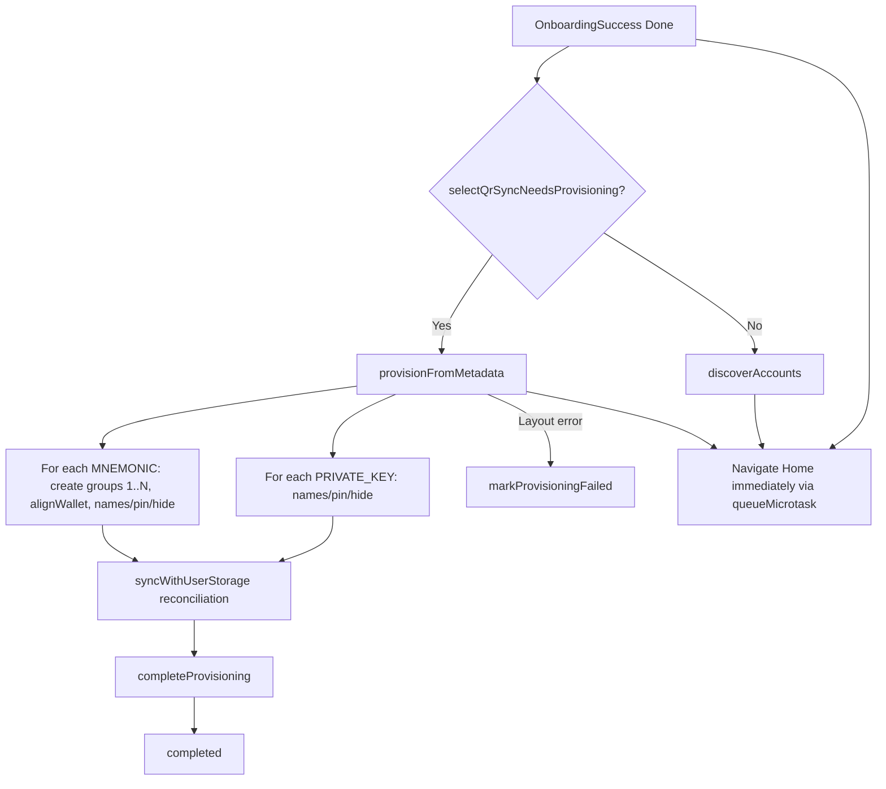

# QR Sync — Provisioning technical reference

**Primary flow:** New users (`isOnboardingCompleted === false`) — Add Device → OTP → password import → OnboardingSuccess.

**Phase B is reusable:** `QrSyncController.importRemainingSecrets` is not onboarding-only; it requires `provisioningStatus === 'awaiting_password'` and pending secrets (`isQrSyncReadyForSecretImport`). Today wired from `Authentication.newWalletAndRestore(..., isQrSync: true)`.

---

## How to resume this work

| Question              | Answer                                                                                                    |
| --------------------- | --------------------------------------------------------------------------------------------------------- |
| What is done?         | **Phases A, B, and C** for new-user onboarding                                                            |
| What is next?         | [Known gaps](#known-gaps-deferred); Step C4 app-launch resume; post-onboarding QR UI                      |
| Canonical types       | `app/core/QrSync/types.ts`                                                                                |
| Canonical validation  | `app/core/QrSync/services/qr-sync-validation.ts`                                                          |
| Phase B orchestration | `QrSyncController.importRemainingSecrets`                                                                 |
| Phase B vault import  | `QrSyncProvisioningService.importSecretsToVault`                                                          |
| Phase C metadata      | `QrSyncProvisioningService.provisionFromMetadata`                                                         |
| Onboarding wiring     | `Authentication.newWalletAndRestore(..., isQrSync)`                                                       |
| Tests to run          | `yarn jest app/core/QrSync app/selectors/qrSyncController app/core/Authentication/Authentication.test.ts` |

---

## Table of contents

1. [Implementation status](#implementation-status)
2. [Goals and constraints](#goals-and-constraints)
3. [End-to-end flow](#end-to-end-flow)
4. [Phase A — SYNC_READY](#phase-a--sync_ready)
5. [Phase B — Vault secret import](#phase-b--vault-secret-import)
6. [Phase C — OnboardingSuccess](#phase-c--onboardingsuccess)
7. [Phase D — After Home](#phase-d--after-home)
8. [Discovery / sync conflicts](#discovery--sync-conflicts)
9. [Controller state](#controller-state)
10. [Types reference](#types-reference)
11. [Metadata → AccountTree mapping](#metadata--accounttree-mapping)
12. [Failure handling](#failure-handling)
13. [Known gaps (deferred)](#known-gaps-deferred)
14. [Implementation checklist](#implementation-checklist)
15. [Testing plan](#testing-plan)
16. [Related code](#related-code)

---

## Implementation status

| Phase | Description                                                      | Status                  |
| ----- | ---------------------------------------------------------------- | ----------------------- |
| **A** | Parse `SYNC_READY`, store secrets + metadata, navigate to import | **Done**                |
| **B** | Import remaining secrets into vault; enrich metadata             | **Done** (reusable API) |
| **C** | Create groups + apply names/pin/hide on OnboardingSuccess        | **Done** (onboarding)   |
| **D** | Post-home cloud sync / unlock discovery                          | Unchanged (no QR work)  |

### Phase A deliverables

- [x] `pendingSecretImports` + `provisioningMetadata` + `provisioningStatus` on `QrSyncController`
- [x] `parseQrSyncSyncReadyMessage` in `qr-sync-validation.ts`
- [x] `routeIncomingQrSyncMessage` returns flat `pendingSecretImports` / `provisioningMetadata`
- [x] Persistence: metadata + status persisted; secrets never persisted
- [x] Selectors: `selectQrSyncPrimaryMnemonic`, `selectQrSyncShouldNavigateToImport`, etc.
- [x] `ImportFromSecretRecoveryPhrase` pre-fills primary mnemonic when `qrSyncImport: true`
- [x] Primary-mnemonic validation only when `isOnboardingCompleted === false`
- [x] Unit tests: `QrSyncController`, `qr-sync-validation`

### Phase B deliverables

- [x] `skipDiscovery` on `importNewSecretRecoveryPhrase` — used by existing-user QR so Phase C owns layout/sync
- [x] `QrSyncController.importRemainingSecrets` — orchestration (guards via `isQrSyncReadyForSecretImport`)
- [x] `QrSyncProvisioningService.importSecretsToVault` — vault imports via messenger
- [x] Metadata enrichment via `enrichPrimaryProvisioningEntry` / `finalizeSecretImport` / `enrichProvisioningEntry`
- [x] Onboarding wired via `Authentication.newWalletAndRestore(..., isQrSync: true)`
- [x] `ImportFromSecretRecoveryPhrase` does **not** call `resetState()` after successful QR import
- [x] Engine init + messengers for controller ↔ provisioning service
- [x] Unit tests: `QrSyncController`, `qr-sync-provisioning-service`, `Authentication`, `ImportFromSecretRecoveryPhrase`

### Phase C deliverables

- [x] `selectQrSyncNeedsProvisioning` selector
- [x] `completeProvisioning` controller method
- [x] `QrSyncProvisioningService.provisionFromMetadata`
- [x] User-storage reconciliation at end of Phase C (`syncWithUserStorage`, non-blocking)
- [x] `OnboardingSuccess` branches to `provisionFromMetadata` vs `discoverAccounts`
- [ ] App-launch resume for `provisioningStatus === 'secrets_imported'`
- [x] Post-onboarding Phase C trigger

---

## Goals and constraints

| Goal                             | Approach                                                                                    |
| -------------------------------- | ------------------------------------------------------------------------------------------- |
| Multi-SRP + private-key import   | `QrSyncProvisioningService.importSecretsToVault` — log-and-continue like seedless rehydrate |
| Correct names, pin, hide         | `AccountTreeController` in Phase C                                                          |
| Explicit account groups          | Replace **only** OnboardingSuccess `discoverAccounts` for QR users                          |
| No secret staleness              | Wipe `pendingSecretImports` after Phase B; keep metadata for Phase C                        |
| No `@metamask/*` bumps           | Use APIs already in mobile dependencies                                                     |
| Extension export is ground truth | Skip activity-based `discoverAccounts` for QR onboarding on OnboardingSuccess               |
| Cloud tree reconciliation        | `syncWithUserStorage` at end of Phase C after layout; failures logged, non-fatal            |
| Reusable Phase B                 | Status-gated; optional `primaryEntropySource` for primary enrichment                        |

**Hard constraints:**

- Secrets cannot be imported before the vault exists.
- Primary mnemonic must be restored first; pass `entropySource` into `importRemainingSecrets` when enriching primary metadata.
- Phase B secondary mnemonics use `QrSyncProvisioningService.#importMnemonicToVault` — **not** `importNewSecretRecoveryPhrase`.
- Phase B must **not** call `discoverAccounts`, `syncWithUserStorage`, or seedless backup APIs.
- Phase C may call `syncWithUserStorage` only **after** extension layout is applied; sync failure must not block onboarding or mark provisioning failed.
- Per-secret Phase B errors: log and continue.
- `Authentication` must **not** import `QrSyncProvisioningService` directly.
- Group `0` created by restore/import; Phase C creates `1..N` from max `groupIndex`.
- Wire format **v1 only**: `{ version: 1, deadline, data: [Mnemonic | PrivateKey, ...] }`.

---

## End-to-end flow



### Phase B callers

| Context                      | Primary wallet             | Phase B trigger                                                                     |
| ---------------------------- | -------------------------- | ----------------------------------------------------------------------------------- |
| **New-user onboarding**      | `newWalletVaultAndRestore` | `newWalletAndRestore(..., isQrSync: true)` → `importRemainingSecrets`               |
| **Post-onboarding** (future) | Existing vault             | `importRemainingSecrets(primaryEntropySource?)` when `isQrSyncReadyForSecretImport` |

### What existing onboarding already does (QR does not replace)

`newWalletAndRestore` → `createMultichainAccountWallet({ type: 'restore' })` → `dispatchLogin` → `AccountTreeInitService.initializeAccountTree()` — vault, primary HD wallet, **group 0**. No `discoverAccounts` here.

### What QR replaces (onboarding only)

`OnboardingSuccess` `handleOnDone`: QR users with `secrets_imported` call `provisionFromMetadata()` instead of `discoverAccounts`.

---

## Phase A — SYNC_READY

**Trigger:** Extension sends `sync-ready` over encrypted MWP session.



**Steps:**

1. `routeIncomingQrSyncMessage` → `parseQrSyncSyncReadyMessage`
2. Validate envelope + v1 payload + per-entry wire shape
3. Map wire → `pendingSecretImports` + `provisioningMetadata`
4. If onboarding incomplete: `validateQrSyncSecretImportsForOnboarding`
5. `provisioningStatus = 'awaiting_password'`; tear down session
6. Navigate via `selectQrSyncShouldNavigateToImport`

**Key files:** `QrSyncController.ts`, `qr-sync-message-router.ts`, `qr-sync-validation.ts`, `AddDeviceToWallet/index.tsx`

---

## Phase B — Vault secret import

**Goal:** Import non-primary secrets; enrich metadata with `entropySource` / `accountAddress`; wipe secrets from memory.



### Architecture

```
Authentication.newWalletAndRestore(..., isQrSync)
  → newWalletVaultAndRestore → primaryEntropySource
  → if isQrSync: QrSyncController.importRemainingSecrets(primaryEntropySource)

QrSyncController.importRemainingSecrets(primaryEntropySource?)
  → isQrSyncReadyForSecretImport(state)
  → enrichPrimaryProvisioningEntry (if entropy provided)
  → QrSyncProvisioningService.importSecretsToVault(remainingSecrets)
  → finalizeSecretImport()

QrSyncProvisioningService.provisionFromMetadata()  // Phase C
```

### Separation of concerns

| Layer                       | Responsibility                                        |
| --------------------------- | ----------------------------------------------------- |
| `Authentication`            | Primary vault; delegate when `isQrSync`               |
| `qr-sync-validation`        | `isQrSyncReadyForSecretImport`, enrichment resolution |
| `QrSyncController`          | Orchestration, finalize                               |
| `QrSyncProvisioningService` | Vault import + Phase C                                |

### Public controller API

| Method                                          | Phase | Effect                                      |
| ----------------------------------------------- | ----- | ------------------------------------------- |
| `importRemainingSecrets(primaryEntropySource?)` | B     | Orchestrates Phase B; no-ops when not ready |
| `enrichProvisioningEntry(index, enrichment)`    | B     | Merge runtime IDs into metadata             |
| `markProvisioningFailed()`                      | C     | `failed`; clear `pendingSecretImports`      |
| `completeProvisioning()`                        | C     | `completed`; clear metadata                 |

**Private:** `enrichPrimaryProvisioningEntry`, `finalizeSecretImport`.

### Onboarding wiring

```typescript
const primaryEntropySource = await this.newWalletVaultAndRestore(
  password,
  parsedSeed,
  clearEngine,
);

if (isQrSync) {
  await Engine.context.QrSyncController.importRemainingSecrets(
    primaryEntropySource,
  );
}
```

`ImportFromSecretRecoveryPhrase` must **not** call `resetState()` after successful QR import (only on back).

### Phase B acceptance criteria

- [x] Secondary mnemonics via provisioning service (not `importNewSecretRecoveryPhrase`)
- [x] Private keys via `KeyringController.importAccountWithStrategy`
- [x] No `discoverAccounts` or `syncWithUserStorage` during Phase B
- [x] Log-and-continue per secret
- [x] `entropySource` / `accountAddress` in persisted metadata
- [x] `secrets_imported` on finalize
- [x] No `markProvisioningFailed` in Phase B
- [x] `importRemainingSecrets` reusable beyond onboarding

---

## Phase C — OnboardingSuccess

**Trigger:** User taps Done; `selectQrSyncNeedsProvisioning` is true.



### Selector

```typescript
export const selectQrSyncNeedsProvisioning = createSelector(
  selectQrSyncControllerState,
  (state) =>
    state.provisioningStatus === 'secrets_imported' &&
    state.provisioningMetadata !== null,
);
```

### `provisionFromMetadata` algorithm

```
FOR each MNEMONIC entry:
  resolve walletId from entropySource
  create groups 1..max(groupIndex) if needed
  alignWallet(entropySource)
  setAccountWalletName, setAccountGroupName/Pinned/Hidden

FOR each PRIVATE_KEY entry:
  resolve groupId from accountAddress
  setAccountGroupName, pin/hide

syncWithUserStorage()   // user-storage reconciliation; failures logged, non-fatal

completeProvisioning()
```

**Non-blocking onboarding:** `OnboardingSuccess` fires `provisionFromMetadata()` with `void` and navigates Home on the next microtask without awaiting Phase C. User-storage sync therefore runs in the background and does not block the Done → Home transition. Layout errors mark provisioning `failed`; sync errors are logged only.

### OnboardingSuccess wiring

```typescript
if (needsQrProvisioning) {
  void QrSyncProvisioningService.provisionFromMetadata();
} else {
  void runDiscoverAccounts();
}
queueMicrotask(() => onDone());
```

### Step C4 — App launch resume (deferred)

See [Known gaps](#known-gaps-deferred).

### Phase C acceptance criteria

- [x] QR users skip `discoverAccounts` on OnboardingSuccess
- [x] Group 0 not re-created; groups 1..N from extension
- [x] User-storage reconciliation via `syncWithUserStorage` after layout (log-and-continue on failure)
- [x] Phase C does not block navigation to Home (`void` + `queueMicrotask`)
- [x] `completed` + metadata cleared on success
- [x] Layout failure → `failed`

---

## Phase D — After Home

- `useIdentityEffects` — cloud sync when Backup & Sync enabled
- `postLoginAsyncOperations` → `discoverAccounts` on **unlock** (not first onboard)

See [Discovery / sync conflicts](#discovery--sync-conflicts) and [Known gaps](#known-gaps-deferred).

---

## Discovery / sync conflicts

| System               | Location                                     | Normal behaviour                                                 | QR behaviour                                                                          | Conflict                                      |
| -------------------- | -------------------------------------------- | ---------------------------------------------------------------- | ------------------------------------------------------------------------------------- | --------------------------------------------- |
| Onboarding discovery | `OnboardingSuccess`                          | `discoverAccounts`                                               | `provisionFromMetadata`                                                               | Intentional replacement                       |
| Unlock discovery     | `Authentication.postLoginAsyncOperations`    | `discoverAccounts` per entropy source                            | **Same** — still runs                                                                 | **Gap** if Phase C pending                    |
| Add SRP              | `importNewSecretRecoveryPhrase`              | Discovery + optional sync                                        | Existing-user QR uses it with `skipDiscovery`; new-user QR uses `newWalletAndRestore` | Keep new-user path separate                   |
| Cloud sync           | `syncWithUserStorage` / `useIdentityEffects` | `discoverAccounts` uses `syncWithUserStorageAtLeastOnce` on Done | Phase C calls `syncWithUserStorage` after layout (background); Phase B still no sync  | Intentional — sync only after layout complete |
| Tree init            | `newWalletAndRestore`                        | Group 0                                                          | Same                                                                                  | Phase C adds 1..N                             |

**First onboard (no kill):** `newWalletAndRestore` does not call `postLoginAsyncOperations`; user goes Import → OnboardingSuccess → Phase C on Done.

**App kill after Phase B:** User unlocks → `postLoginAsyncOperations` runs discovery, **not** Phase C.

---

## Controller state

```typescript
pendingSecretImports: QrSyncSecretImportEntry[] | null;  // never persisted
provisioningMetadata: QrSyncProvisioningMetadata | null; // persisted
provisioningStatus: QrSyncProvisioningStatus | null;  // persisted
```

### `provisioningStatus`

| Value               | Meaning                          |
| ------------------- | -------------------------------- |
| `null`              | No active pipeline               |
| `awaiting_password` | Secrets in memory; need password |
| `secrets_imported`  | Vault ready; Phase C pending     |
| `completed`         | Phase C done                     |
| `failed`            | Phase C failed; no auto-retry    |

### Persistence

| Field                                 | Persist |
| ------------------------------------- | ------- |
| `pendingSecretImports`                | `false` |
| `provisioningMetadata`                | `true`  |
| `provisioningStatus`                  | `true`  |
| Session fields (`phase`, `otp`, etc.) | `false` |

---

## Types reference

All in `app/core/QrSync/types.ts`.

### Wire payload

```typescript
type QrSyncReadyPayload = {
  version: 1;
  deadline: number;
  data: QrSyncReadyData[];
};

type QrSyncReadyMnemonicData = {
  type: 'Mnemonic';
  mnemonic: string;
  name?: string;
  groups?: QrSyncAccountGroup[];
  isPrimary?: boolean;
};

type QrSyncReadyPrivateKeyData = {
  type: 'PrivateKey';
  privateKey: string;
  name: string;
  pinned?: boolean;
  hidden?: boolean;
};

type QrSyncAccountGroup = {
  groupIndex: number;
  name: string;
  pinned?: boolean;
  hidden?: boolean;
};
```

### Mobile state

```typescript
type QrSyncSecretImportEntry = {
  index: number;
  type: 'MNEMONIC' | 'PRIVATE_KEY';
  value: string;
  isPrimary?: boolean;
};

type QrSyncProvisioningMnemonicEntry = {
  index: number;
  type: 'MNEMONIC';
  isPrimary?: boolean;
  name?: string;
  groups?: QrSyncAccountGroup[];
  entropySource?: EntropySourceId;
};

type QrSyncProvisioningPrivateKeyEntry = {
  index: number;
  type: 'PRIVATE_KEY';
  name: string;
  pinned?: boolean;
  hidden?: boolean;
  accountAddress?: string;
};
```

Phase B validation: `QrSyncSecretImportPreconditions`, `QrSyncProvisioningEntryEnrichmentContext`, `QrSyncProvisioningEntryResolution` — see `types.ts` and `qr-sync-validation.ts`.

---

## Metadata → AccountTree mapping

Account tree uses **`name`** on wallet and group metadata.

### MNEMONIC

| Field                        | API                                            |
| ---------------------------- | ---------------------------------------------- |
| `entropySource`              | `createMultichainAccountGroups`, `alignWallet` |
| `groups[].groupIndex`        | Group creation                                 |
| `name`                       | `setAccountWalletName`                         |
| `groups[].name`              | `setAccountGroupName`                          |
| `groups[].pinned` / `hidden` | `setAccountGroupPinned` / `Hidden`             |

Resolve `walletId`: Entropy wallet where `metadata.entropy.id === entropySource`.  
Resolve `groupId`: `metadata.entropy.groupIndex === groupIndex`.  
**Group 0:** exists after restore — metadata only.

### PRIVATE_KEY

| Field                      | API                                         |
| -------------------------- | ------------------------------------------- |
| `accountAddress`           | Locate SingleAccount group                  |
| `name`, `pinned`, `hidden` | `setAccountGroupName` / `Pinned` / `Hidden` |

---

## Failure handling

| Scenario                          | Status                          | Recovery                                                                              |
| --------------------------------- | ------------------------------- | ------------------------------------------------------------------------------------- |
| Invalid `SYNC_READY` (onboarding) | `failed` (session)              | Re-scan QR                                                                            |
| Abandon before password           | `awaiting_password`             | Secrets ephemeral; metadata persisted                                                 |
| Phase B single secret fails       | Until finalize                  | Logged; continue                                                                      |
| Phase B enrichment/finalize fails | `secrets_imported` or unchanged | Logged only                                                                           |
| App kill after Phase B            | `secrets_imported`              | Unlock + discovery; Phase C only via OnboardingSuccess — [gaps](#known-gaps-deferred) |
| Phase C failure                   | `failed`                        | No auto-retry; OnboardingSuccess falls back to `discoverAccounts`                     |
| Success                           | `completed`                     | Metadata cleared                                                                      |

`markProvisioningFailed` — Phase C only. No retry loop in code.

---

## Known gaps (deferred)

### 1. App kill after Phase B (`secrets_imported`)

| Today                                                       | Planned                                          |
| ----------------------------------------------------------- | ------------------------------------------------ |
| `existingUser` + `completedOnboarding` → unlock on relaunch | OK                                               |
| `postLoginAsyncOperations` → `discoverAccounts`             | Not Phase C                                      |
| Phase C only from OnboardingSuccess Done                    | Resume `provisionFromMetadata` after unlock/Home |

**Fix:** Hook when `selectQrSyncNeedsProvisioning`; coordinate with unlock discovery.

### 2. Phase C failure — no retry

- `markProvisioningFailed` → `failed`; metadata retained
- `selectQrSyncNeedsProvisioning` false for `failed`
- No unlock/launch retry
- Revisit OnboardingSuccess → `discoverAccounts` (not true retry)

**Decision:** Keep no auto-retry for now.

### 3. Unlock discovery vs QR provisioning

Resolve gap #1 before or instead of running `discoverAccounts` when `secrets_imported`.

---

## Implementation checklist

| #   | Step                                               | Phase | Status                                        |
| --- | -------------------------------------------------- | ----- | --------------------------------------------- |
| 1   | `skipDiscovery` on `importNewSecretRecoveryPhrase` | B     | Done                                          |
| 2   | Controller provisioning mutations                  | B     | Done                                          |
| 3   | Layered Phase B controller + service               | B     | Done                                          |
| 4   | `Authentication.newWalletAndRestore` `isQrSync`    | B     | Done                                          |
| 5   | `selectQrSyncNeedsProvisioning`                    | C     | Done                                          |
| 6   | `completeProvisioning`                             | C     | Done                                          |
| 7   | `provisionFromMetadata`                            | C     | Done                                          |
| 8   | OnboardingSuccess branch                           | C     | Done                                          |
| 9   | QR `resetState` back only                          | B     | Done                                          |
| 10  | Phase B guards in `qr-sync-validation.ts`          | B     | Done                                          |
| 11  | User-storage reconciliation in Phase C             | C     | Done                                          |
| 12  | App-launch / unlock resume                         | C     | **Deferred**                                  |
| 13  | Post-onboarding QR UI + B/C                        | B/C   | Done (Phase C wired for existing-user import) |
| 14  | Phase C failure recovery                           | C     | **Deferred**                                  |

---

## Testing plan

| Area                                          | What to test                                                      |
| --------------------------------------------- | ----------------------------------------------------------------- |
| `isQrSyncReadyForSecretImport`                | `awaiting_password` + pending secrets only                        |
| `resolveQrSyncProvisioningEntryForEnrichment` | Valid/invalid state                                               |
| `importRemainingSecrets`                      | Delegate, enrich, finalize, no-op                                 |
| `importSecretsToVault`                        | MAS + keyring; log-and-continue                                   |
| `newWalletAndRestore` (isQrSync)              | Calls / skips `importRemainingSecrets`                            |
| `provisionFromMetadata`                       | Groups, names, pin/hide, user-storage reconciliation              |
| `selectQrSyncNeedsProvisioning`               | `secrets_imported` + metadata                                     |
| OnboardingSuccess                             | QR vs `discoverAccounts`                                          |
| ImportFromSecretRecoveryPhrase                | No `resetState` on success                                        |
| Status transitions                            | `awaiting_password` → `secrets_imported` → `completed` / `failed` |

```bash
yarn jest app/core/QrSync app/selectors/qrSyncController app/core/Authentication/Authentication.test.ts app/components/Views/ImportFromSecretRecoveryPhrase/index.test.tsx
```

**Not yet covered:** E2E QR onboarding; post-onboarding Phase B; app-kill resume; Phase C failure; unlock + `secrets_imported` interaction.

---

## Related code

| Area                                   | Path                                                                                          |
| -------------------------------------- | --------------------------------------------------------------------------------------------- |
| Types                                  | `app/core/QrSync/types.ts`                                                                    |
| Controller                             | `app/core/QrSync/QrSyncController.ts`                                                         |
| Validation                             | `app/core/QrSync/services/qr-sync-validation.ts`                                              |
| Vault import / Phase C                 | `app/core/QrSync/services/qr-sync-provisioning-service.ts`                                    |
| Messengers                             | `app/core/Engine/messengers/qr-sync-*-messenger/`                                             |
| Onboarding                             | `Authentication.newWalletAndRestore`, `ImportFromSecretRecoveryPhrase/`, `OnboardingSuccess/` |
| Selectors                              | `app/selectors/qrSyncController/index.ts`                                                     |
| Discovery (replaced for QR on Success) | `app/multichain-accounts/discovery.ts`                                                        |
| Multi-SRP (not QR)                     | `app/actions/multiSrp/index.ts`                                                               |
