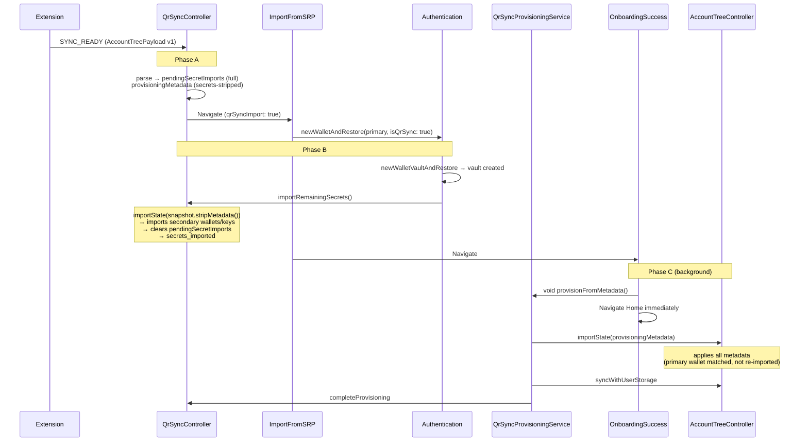
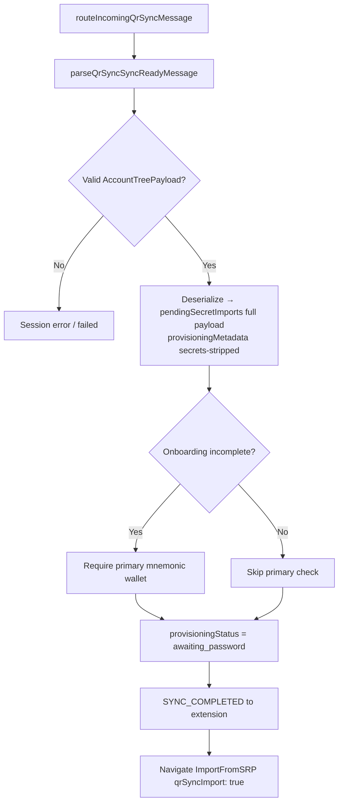
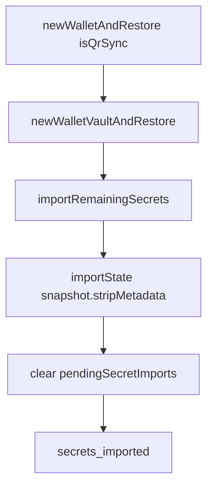
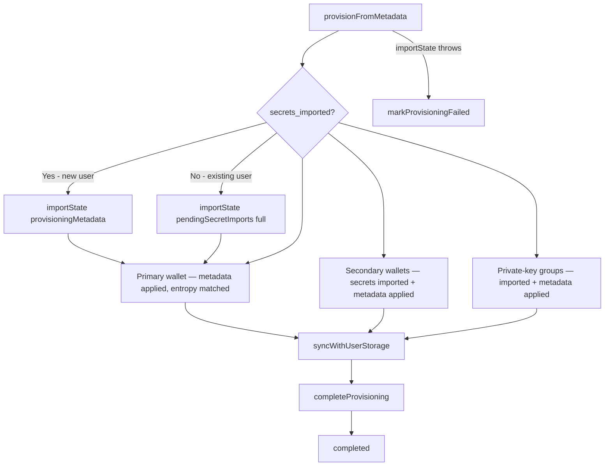

# QR Sync — Provisioning technical reference

**Primary flow:** New users (`isOnboardingCompleted === false`) — Add Device → OTP → password import → OnboardingSuccess.

**Phase B** (`QrSyncController.importRemainingSecrets`) imports secondary secrets right after vault creation, then marks `secrets_imported`. Phase C (`provisionFromMetadata`) applies all metadata via `AccountTreeController:importState` for both new and existing users.

---

## How to resume this work

| Question              | Answer                                                                                                    |
| --------------------- | --------------------------------------------------------------------------------------------------------- |
| What is done?         | **Phases A, B, and C** for new-user onboarding and existing-user Add Device                               |
| What is next?         | [Known gaps](#known-gaps-deferred); Step C4 app-launch resume                                             |
| Canonical types       | `app/core/QrSync/types.ts`                                                                                |
| Canonical validation  | `app/core/QrSync/services/qr-sync-validation.ts`                                                          |
| Phase B marker        | `QrSyncController.importRemainingSecrets`                                                                 |
| Phase C orchestration | `QrSyncProvisioningService.provisionFromMetadata`                                                         |
| Phase C import engine | `AccountTreeController:importState`                                                                       |
| Onboarding wiring     | `Authentication.newWalletAndRestore(..., isQrSync)`                                                       |
| Tests to run          | `yarn jest app/core/QrSync app/selectors/qrSyncController app/core/Authentication/Authentication.test.ts` |

---

## Table of contents

1. [Implementation status](#implementation-status)
2. [Goals and constraints](#goals-and-constraints)
3. [End-to-end flow](#end-to-end-flow)
4. [Phase A — SYNC_READY](#phase-a--sync_ready)
5. [Phase B — Vault creation](#phase-b--vault-creation)
6. [Phase C — importState](#phase-c--importstate)
7. [Phase D — After Home](#phase-d--after-home)
8. [Discovery / sync conflicts](#discovery--sync-conflicts)
9. [Controller state](#controller-state)
10. [Types reference](#types-reference)
11. [Failure handling](#failure-handling)
12. [Known gaps (deferred)](#known-gaps-deferred)
13. [Implementation checklist](#implementation-checklist)
14. [Testing plan](#testing-plan)
15. [Related code](#related-code)

---

## Implementation status

| Phase | Description                                                          | Status                 |
| ----- | -------------------------------------------------------------------- | ---------------------- |
| **A** | Parse `SYNC_READY`, store payload, navigate to import                | **Done**               |
| **B** | Create vault from primary SRP; mark `secrets_imported`               | **Done**               |
| **C** | `AccountTreeController:importState` — secrets + metadata in one call | **Done**               |
| **D** | Post-home cloud sync / unlock discovery                              | Unchanged (no QR work) |

### Phase A deliverables

- [x] `pendingSecretImports` on `QrSyncController` (full payload with secrets — never persisted)
- [x] `provisioningMetadata` on `QrSyncController` (secrets-stripped payload — persisted for Phase C resume)
- [x] `parseQrSyncSyncReadyMessage` in `qr-sync-validation.ts`
- [x] `routeIncomingQrSyncMessage` deserializes `AccountTreePayload`, stores full payload as `pendingSecretImports` and `snapshot.stripSecrets()` as `provisioningMetadata`
- [x] Selectors: `selectQrSyncPrimaryMnemonic`, `selectQrSyncShouldNavigateToImport`, etc.
- [x] `ImportFromSecretRecoveryPhrase` pre-fills primary mnemonic when `qrSyncImport: true`
- [x] Primary-mnemonic validation only when `isOnboardingCompleted === false`
- [x] Unit tests: `QrSyncController`, `qr-sync-validation`

### Phase B deliverables

- [x] `QrSyncController.importRemainingSecrets` — imports secondary secrets via `AccountTreeController:importState`, then sets `provisioningStatus = secrets_imported`
- [x] Onboarding wired via `Authentication.newWalletAndRestore(..., isQrSync: true)`
- [x] `ImportFromSecretRecoveryPhrase` does **not** call `resetState()` after successful QR import
- [x] Engine init + messengers

### Phase C deliverables

- [x] `selectQrSyncNeedsProvisioning` selector
- [x] `completeProvisioning` controller method
- [x] `QrSyncProvisioningService.provisionFromMetadata` → `AccountTreeController:importState`
- [x] User-storage reconciliation at end of Phase C (`syncWithUserStorage`, non-blocking)
- [x] OnboardingSuccess branches to `provisionFromMetadata` vs `discoverAccounts`
- [x] Post-onboarding Phase C trigger (existing-user Add Device)
- [ ] App-launch resume for `provisioningStatus === 'secrets_imported'`

---

## Goals and constraints

| Goal                             | Approach                                                                                    |
| -------------------------------- | ------------------------------------------------------------------------------------------- |
| Multi-SRP + private-key import   | `AccountTreeController:importState` — handles secrets + metadata in one call                |
| Correct names, pin, hide         | `AccountTreeController:importState` applies metadata alongside secret import                |
| Explicit account groups          | Replace **only** OnboardingSuccess `discoverAccounts` for QR users                          |
| No secret staleness              | `pendingSecretImports` not persisted; cleared after `importRemainingSecrets` / `resetState` |
| Extension export is ground truth | Skip activity-based `discoverAccounts` for QR onboarding on OnboardingSuccess               |
| Cloud tree reconciliation        | `syncWithUserStorage` at end of Phase C after layout; failures logged, non-fatal            |

**Hard constraints:**

- Secrets cannot be imported before the vault exists.
- Primary mnemonic must be restored first (`newWalletAndRestore`); Phase C `importState` matches it by entropy source ID — no re-import of the primary secret.
- Phase B must **not** call `discoverAccounts`, `syncWithUserStorage`, or seedless backup APIs.
- Phase C may call `syncWithUserStorage` only **after** `importState` completes; sync failure must not block onboarding or mark provisioning failed.
- `Authentication` must **not** import `QrSyncProvisioningService` directly.
- `pendingSecretImports` must never be persisted (contains secret material).

---

## End-to-end flow


```mermaid
sequenceDiagram
    participant Ext as Extension
    participant QC as QrSyncController
    participant Import as ImportFromSRP
    participant Auth as Authentication
    participant Prov as QrSyncProvisioningService
    participant Success as OnboardingSuccess
    participant ATC as AccountTreeController

    Ext->>QC: SYNC_READY (AccountTreePayload v1)
    Note over QC: Phase A
    QC->>QC: parse → pendingSecretImports (full)<br/>provisioningMetadata (secrets-stripped)
    QC->>Import: Navigate (qrSyncImport: true)

    Import->>Auth: newWalletAndRestore(primary, isQrSync: true)
    Note over Auth,QC: Phase B
    Auth->>Auth: newWalletVaultAndRestore → vault created
    Auth->>QC: importRemainingSecrets()
    Note over QC: importState(snapshot.stripMetadata())<br/>→ imports secondary wallets/keys<br/>→ clears pendingSecretImports<br/>→ secrets_imported
    Import->>Success: Navigate

    Note over Success,ATC: Phase C (background)
    Success->>Prov: void provisionFromMetadata()
    Success->>Success: Navigate Home immediately
    Prov->>ATC: importState(provisioningMetadata)
    Note over ATC: applies all metadata<br/>(primary wallet matched, not re-imported)
    Prov->>ATC: syncWithUserStorage
    Prov->>QC: completeProvisioning
```

### Phase B callers

| Context                             | Primary wallet             | Phase B trigger                                                                                                    |
| ----------------------------------- | -------------------------- | ------------------------------------------------------------------------------------------------------------------ |
| **New-user onboarding**             | `newWalletVaultAndRestore` | `newWalletAndRestore(..., isQrSync: true)` → `importRemainingSecrets` → `secrets_imported`                         |
| **Post-onboarding** (existing user) | Existing vault             | `provisionFromMetadata` called directly; reads `pendingSecretImports` (full snapshot); accepts `awaiting_password` |

### What existing onboarding already does (QR does not replace)

`newWalletAndRestore` → `createMultichainAccountWallet({ type: 'restore' })` → `dispatchLogin` → `AccountTreeInitService.initializeAccountTree()` — vault, primary HD wallet, **group 0**. No `discoverAccounts` here.

### What QR replaces (onboarding only)

`OnboardingSuccess` `handleOnDone`: QR users with `secrets_imported` call `provisionFromMetadata()` instead of `discoverAccounts`.

---

## Phase A — SYNC_READY

**Trigger:** Extension sends `sync-ready` over encrypted MWP session.


```mermaid
flowchart TD
    A[routeIncomingQrSyncMessage] --> B[parseQrSyncSyncReadyMessage]
    B --> C{Valid AccountTreePayload?}
    C -->|No| F[Session error / failed]
    C -->|Yes| D[Deserialize → pendingSecretImports full payload<br/>provisioningMetadata secrets-stripped]
    D --> E{Onboarding incomplete?}
    E -->|Yes| G[Require primary mnemonic wallet]
    E -->|No| H[Skip primary check]
    G --> I[provisioningStatus = awaiting_password]
    H --> I
    I --> J[SYNC_COMPLETED to extension]
    J --> K[Navigate ImportFromSRP qrSyncImport: true]
```

**Steps:**

1. `routeIncomingQrSyncMessage` → `parseQrSyncSyncReadyMessage`
2. Validate envelope + `AccountTreePayload` shape
3. Deserialize payload → store full payload as `pendingSecretImports` (ephemeral) and `snapshot.stripSecrets().serialize()` as `provisioningMetadata` (persisted)
4. If onboarding incomplete: validate that `wallets[0]` is a mnemonic with a `value`
5. `provisioningStatus = 'awaiting_password'`; tear down session
6. Navigate via `selectQrSyncShouldNavigateToImport`

**Key files:** `QrSyncController.ts`, `qr-sync-message-router.ts`, `qr-sync-validation.ts`, `AddDeviceToWallet/index.tsx`

---

## Phase B — Vault creation + secondary secret import

**Goal:** Create the vault from the primary SRP, import all secondary secrets immediately (to keep secret material in memory for as short a time as possible), then mark provisioning ready for Phase C metadata application.


```mermaid
flowchart TD
    A[newWalletAndRestore isQrSync] --> B[newWalletVaultAndRestore]
    B --> C[importRemainingSecrets]
    C --> D[importState snapshot.stripMetadata]
    D --> E[clear pendingSecretImports]
    E --> F[secrets_imported]
```

### Architecture

```
Authentication.newWalletAndRestore(..., isQrSync)
  → newWalletVaultAndRestore           — primary vault created
  → if isQrSync: QrSyncController.importRemainingSecrets()
      → AccountTreeController:importState(snapshot.stripMetadata())
        — primary wallet matched by entropy source ID, not re-imported
        — secondary wallets + private-key groups imported
        — no metadata applied (Phase C's job)
      → pendingSecretImports = null
      → provisioningStatus = secrets_imported

QrSyncProvisioningService.provisionFromMetadata()  // Phase C
```

### Separation of concerns

| Layer                       | Responsibility                                                                                 |
| --------------------------- | ---------------------------------------------------------------------------------------------- |
| `Authentication`            | Primary vault; delegates `importRemainingSecrets` when QR                                      |
| `QrSyncController`          | Secondary secret import + status transition (`importRemainingSecrets`)                         |
| `QrSyncProvisioningService` | Metadata-only import via `importState` (Phase C new-user); full import (Phase C existing-user) |

### Public controller API

| Method                      | Phase | Effect                                                                         |
| --------------------------- | ----- | ------------------------------------------------------------------------------ |
| `importRemainingSecrets()`  | B     | Imports secondary secrets; clears `pendingSecretImports`; → `secrets_imported` |
| `hasPendingSecretImports()` | B/C   | `pendingSecretImports !== null`; used by UI messenger                          |
| `markProvisioningFailed()`  | C     | `failed`                                                                       |
| `completeProvisioning()`    | C     | `completed`; clears `provisioningMetadata`                                     |

### Onboarding wiring

```typescript
const primaryEntropySource = await this.newWalletVaultAndRestore(
  password,
  parsedSeed,
  clearEngine,
);

if (isQrSync) {
  await Engine.context.QrSyncController.importRemainingSecrets();
}
```

`ImportFromSecretRecoveryPhrase` must **not** call `resetState()` after successful QR import (only on back).

### Phase B acceptance criteria

- [x] Vault created from primary SRP only
- [x] Secondary secrets imported immediately after vault creation (non-fatal if import fails)
- [x] `pendingSecretImports` cleared after import
- [x] `secrets_imported` set on `importRemainingSecrets`
- [x] No `discoverAccounts` or `syncWithUserStorage` during Phase B

---

## Phase C — importState

**Trigger:** `selectQrSyncNeedsProvisioning` is true (new user: OnboardingSuccess Done; existing user: `useQrSyncImportNavigation`).


```mermaid
flowchart TD
    A[provisionFromMetadata] --> B{secrets_imported?}
    B -->|Yes - new user| B2[importState provisioningMetadata]
    B -->|No - existing user| B3[importState pendingSecretImports full]
    B2 --> C
    B3 --> C
    B --> C[Primary wallet — metadata applied, entropy matched]
    B --> D[Secondary wallets — secrets imported + metadata applied]
    B --> E[Private-key groups — imported + metadata applied]
    C --> R[syncWithUserStorage]
    D --> R
    E --> R
    R --> G[completeProvisioning]
    G --> I[completed]
    A -->|importState throws| H[markProvisioningFailed]
```

### `provisionFromMetadata` algorithm

```
1. Read pendingSecretImports and provisioningMetadata from QrSyncController state
2. Assert provisioningStatus is awaiting_password or secrets_imported
3a. If secrets_imported (new-user path, Phase B already ran):
      AccountTreeController:importState(deserialize(provisioningMetadata))
      — provisioningMetadata is secrets-stripped; applies all metadata only
3b. If awaiting_password (existing-user path):
      AccountTreeController:importState(deserialize(pendingSecretImports))
      — full snapshot; imports any missing secrets and applies all metadata in one call
4. AccountTreeController:syncWithUserStorage
   — reconcile with cloud; failures logged, non-fatal
5. QrSyncController:completeProvisioning
```

`AccountTreeController:importState` handles all cases internally:

- Primary wallet: matched by entropy source ID, metadata applied, secret not re-imported
- Secondary wallets: secrets imported if missing, groups created, metadata applied
- Private-key accounts: imported if missing, metadata applied

**Non-blocking onboarding:** `OnboardingSuccess` fires `provisionFromMetadata()` with `void` and navigates Home on the next microtask without awaiting Phase C.

### OnboardingSuccess wiring

```typescript
if (needsQrProvisioning) {
  void QrSyncProvisioningService.provisionFromMetadata();
} else {
  void runDiscoverAccounts();
}
queueMicrotask(() => onDone());
```

### Existing-user wiring

`useQrSyncImportNavigation` → `finishExistingUserSyncWithoutMnemonic` → `messenger.call('QrSyncProvisioningService:provisionFromMetadata')`. Accepts both `awaiting_password` (existing-user — full snapshot with secrets used) and `secrets_imported` (new-user — secrets-stripped `provisioningMetadata` used).

### Step C4 — App launch resume (deferred)

See [Known gaps](#known-gaps-deferred).

### Phase C acceptance criteria

- [x] QR users skip `discoverAccounts` on OnboardingSuccess
- [x] `AccountTreeController:importState` handles primary + secondary wallets + private keys
- [x] User-storage reconciliation via `syncWithUserStorage` after `importState` (log-and-continue on failure)
- [x] Phase C does not block navigation to Home (`void` + `queueMicrotask`)
- [x] `completed` + `provisioningMetadata` cleared on success
- [x] Import failure → `failed`

---

## Phase D — After Home

- `useIdentityEffects` — cloud sync when Backup & Sync enabled
- `postLoginAsyncOperations` → `discoverAccounts` on **unlock** (not first onboard)

See [Discovery / sync conflicts](#discovery--sync-conflicts) and [Known gaps](#known-gaps-deferred).

---

## Discovery / sync conflicts

| System               | Location                                     | Normal behaviour                                                 | QR behaviour                                                                                 | Conflict                                      |
| -------------------- | -------------------------------------------- | ---------------------------------------------------------------- | -------------------------------------------------------------------------------------------- | --------------------------------------------- |
| Onboarding discovery | `OnboardingSuccess`                          | `discoverAccounts`                                               | `provisionFromMetadata` → `importState`                                                      | Intentional replacement                       |
| Unlock discovery     | `Authentication.postLoginAsyncOperations`    | `discoverAccounts` per entropy source                            | **Same** — still runs                                                                        | **Gap** if Phase C pending                    |
| Add SRP              | `importNewSecretRecoveryPhrase`              | Discovery + optional sync                                        | Not used by QR; existing-user QR uses `provisionFromMetadata` directly                       | Keep paths separate                           |
| Cloud sync           | `syncWithUserStorage` / `useIdentityEffects` | `discoverAccounts` uses `syncWithUserStorageAtLeastOnce` on Done | Phase C calls `syncWithUserStorage` after `importState` (background); no sync during Phase B | Intentional — sync only after import complete |
| Tree init            | `newWalletAndRestore`                        | Group 0                                                          | Same; Phase C `importState` adds groups 1..N                                                 | Phase C adds 1..N                             |

**First onboard (no kill):** `newWalletAndRestore` does not call `postLoginAsyncOperations`; user goes Import → OnboardingSuccess → Phase C on Done.

**App kill after Phase B:** User unlocks → `postLoginAsyncOperations` runs discovery, **not** Phase C.

---

## Controller state

```typescript
pendingSecretImports: AccountTreePayload | null; // never persisted — contains secret material
provisioningMetadata: AccountTreePayload | null; // persisted — secrets-stripped, used in Phase C
provisioningStatus: QrSyncProvisioningStatus | null; // persisted
```

### `provisioningStatus`

| Value               | Meaning                                              |
| ------------------- | ---------------------------------------------------- |
| `null`              | No active pipeline                                   |
| `awaiting_password` | Payload in memory; need password                     |
| `secrets_imported`  | Secondary secrets imported; Phase C metadata pending |
| `completed`         | Phase C done                                         |
| `failed`            | Phase C failed; no auto-retry                        |

### Persistence

| Field                                 | Persist |
| ------------------------------------- | ------- |
| `pendingSecretImports`                | `false` |
| `provisioningMetadata`                | `true`  |
| `provisioningStatus`                  | `true`  |
| Session fields (`phase`, `otp`, etc.) | `false` |

---

## Types reference

### Wire payload

`SYNC_READY` carries an `AccountTreePayload` from `@metamask/account-tree-controller`:

```typescript
type AccountTreePayload = {
  version: 1;
  wallets: (AccountWalletMnemonicPayload | AccountWalletPrivateKeyPayload)[];
};

type AccountWalletMnemonicPayload = {
  id: AccountWalletPayloadId; // 'wallet:<uuid>'
  type: 'mnemonic';
  value: EncodedBytes; // uint16 BIP-39 word indices — decode via encodeMnemonicWords()
  metadata: { name: string };
  groups: AccountGroupEntry[];
};

type AccountWalletPrivateKeyPayload = {
  id: AccountWalletPayloadId;
  type: 'private-key';
  groups: AccountPrivateKeyGroupEntry[];
};
```

`EncodedBytes = number[]` — decoded to a mnemonic string via `encodeMnemonicWords(new Uint8Array(value))` from `@metamask/keyring-sdk`.

The first `mnemonic` entry in `wallets` is always the primary wallet.

### Selectors

| Selector                             | Returns                                                              |
| ------------------------------------ | -------------------------------------------------------------------- |
| `selectQrSyncPrimaryMnemonic`        | Decoded mnemonic string from `pendingSecretImports.wallets[0].value` |
| `selectQrSyncShouldNavigateToImport` | `provisioningStatus === 'awaiting_password'`                         |
| `selectQrSyncNeedsProvisioning`      | `provisioningStatus === 'secrets_imported'`                          |
| `selectQrSyncHasPendingSecrets`      | `pendingSecretImports !== null`                                      |

---

## Failure handling

| Scenario                          | Status              | Recovery                                                                              |
| --------------------------------- | ------------------- | ------------------------------------------------------------------------------------- |
| Invalid `SYNC_READY` (onboarding) | `failed` (session)  | Re-scan QR                                                                            |
| Abandon before password           | `awaiting_password` | `pendingSecretImports` ephemeral (lost on kill); `provisioningMetadata` persisted     |
| `importRemainingSecrets` fails    | `secrets_imported`  | Non-fatal; error logged; `pendingSecretImports` still cleared                         |
| `importState` throws (Phase C)    | `failed`            | No auto-retry; `markProvisioningFailed` called                                        |
| `syncWithUserStorage` fails       | `completed` (still) | Logged only; does not mark failed                                                     |
| App kill after Phase B            | `secrets_imported`  | Unlock + discovery; Phase C only via OnboardingSuccess — [gaps](#known-gaps-deferred) |
| Success                           | `completed`         | `provisioningMetadata` cleared                                                        |

---

## Known gaps (deferred)

### 1. App kill after Phase B (`secrets_imported`)

| Today                                                       | Planned                                          |
| ----------------------------------------------------------- | ------------------------------------------------ |
| `existingUser` + `completedOnboarding` → unlock on relaunch | OK                                               |
| `postLoginAsyncOperations` → `discoverAccounts`             | Not Phase C                                      |
| Phase C only from OnboardingSuccess Done                    | Resume `provisionFromMetadata` after unlock/Home |

**Fix:** Hook when `selectQrSyncNeedsProvisioning`; coordinate with unlock discovery.

### 2. Phase C failure — no retry

- `markProvisioningFailed` → `failed`; `provisioningMetadata` retained (for potential future retry)
- `selectQrSyncNeedsProvisioning` false for `failed`
- No unlock/launch retry

**Decision:** Keep no auto-retry for now.

### 3. Unlock discovery vs QR provisioning

Resolve gap #1 before or instead of running `discoverAccounts` when `secrets_imported`.

---

## Implementation checklist

| #   | Step                                                                                  | Phase | Status       |
| --- | ------------------------------------------------------------------------------------- | ----- | ------------ |
| 1   | Parse `AccountTreePayload`; store as `pendingSecretImports` + `provisioningMetadata`  | A     | Done         |
| 2   | `importRemainingSecrets` controller method (secondary secrets import + status marker) | B     | Done         |
| 3   | `Authentication.newWalletAndRestore` `isQrSync`                                       | B     | Done         |
| 4   | `selectQrSyncNeedsProvisioning`                                                       | C     | Done         |
| 5   | `completeProvisioning`                                                                | C     | Done         |
| 6   | `provisionFromMetadata` → `importState`                                               | C     | Done         |
| 7   | OnboardingSuccess branch                                                              | C     | Done         |
| 8   | QR `resetState` back only                                                             | B     | Done         |
| 9   | User-storage reconciliation in Phase C                                                | C     | Done         |
| 10  | Existing-user route messenger wiring                                                  | B/C   | Done         |
| 11  | App-launch / unlock resume                                                            | C     | **Deferred** |
| 12  | Phase C failure recovery                                                              | C     | **Deferred** |

---

## Testing plan

| Area                             | What to test                                                                                                               |
| -------------------------------- | -------------------------------------------------------------------------------------------------------------------------- |
| `parseQrSyncSyncReadyMessage`    | Valid/invalid `AccountTreePayload`; missing primary mnemonic                                                               |
| `importRemainingSecrets`         | Imports secondary secrets via `importState(snapshot.stripMetadata())`; clears `pendingSecretImports`; → `secrets_imported` |
| `provisionFromMetadata`          | New-user: `importState(provisioningMetadata)`; existing-user: `importState(pendingSecretImports)`; sync failure non-fatal  |
| `newWalletAndRestore` (isQrSync) | Calls `importRemainingSecrets` after vault creation                                                                        |
| `selectQrSyncNeedsProvisioning`  | `secrets_imported` only                                                                                                    |
| `selectQrSyncPrimaryMnemonic`    | Decodes `EncodedBytes` via `encodeMnemonicWords`                                                                           |
| OnboardingSuccess                | QR vs `discoverAccounts`                                                                                                   |
| ImportFromSecretRecoveryPhrase   | No `resetState` on success                                                                                                 |
| Status transitions               | `awaiting_password` → `secrets_imported` → `completed` / `failed`                                                          |

```bash
yarn jest app/core/QrSync app/selectors/qrSyncController app/core/Authentication/Authentication.test.ts app/components/Views/ImportFromSecretRecoveryPhrase/index.test.tsx
```

**Not yet covered:** E2E QR onboarding; app-kill resume; Phase C failure; unlock + `secrets_imported` interaction.

---

## Related code

| Area                                   | Path                                                                                          |
| -------------------------------------- | --------------------------------------------------------------------------------------------- |
| Types                                  | `app/core/QrSync/types.ts`                                                                    |
| Controller                             | `app/core/QrSync/QrSyncController.ts`                                                         |
| Validation                             | `app/core/QrSync/services/qr-sync-validation.ts`                                              |
| Phase C orchestration                  | `app/core/QrSync/services/qr-sync-provisioning-service.ts`                                    |
| Messengers                             | `app/core/Engine/messengers/qr-sync-*-messenger/`                                             |
| Route messenger capabilities           | `app/core/QrSync/route-messenger.ts`                                                          |
| Onboarding                             | `Authentication.newWalletAndRestore`, `ImportFromSecretRecoveryPhrase/`, `OnboardingSuccess/` |
| Selectors                              | `app/selectors/qrSyncController/index.ts`                                                     |
| Discovery (replaced for QR on Success) | `app/multichain-accounts/discovery.ts`                                                        |
