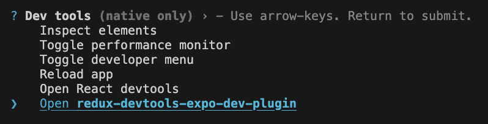

# Debugging

The following tools are used for debugging the MetaMask mobile app:

- [Redux DevTools](https://github.com/matt-oakes/redux-devtools-expo-dev-plugin) - A redux devtools plugin in Expo for debugging Redux
- [Safari Browser](https://github.com/react-native-webview/react-native-webview/blob/master/docs/Debugging.md#debugging-webview-contents) - For debugging the in-app browser for the mobile app
- [Google Chrome](https://github.com/react-native-webview/react-native-webview/blob/master/docs/Debugging.md#debugging-webview-contents) - For debugging the in-app browser for the mobile app

## Debugging Redux with Redux DevTools

To open `Redux DevTools` on either platforms, press `shift+m` in the watcher window and select `redux-devtools-expo-dev-plugin`.



This will open a browser window with the `Redux DevTools` UI, which you can use to inspect the actions that are dispatched to the Redux store.

For reference on how to use `Redux DevTools`, refer to [Redux DevTools](https://github.com/reduxjs/redux-devtools/?tab=readme-ov-file) project.

## Debugging the WebView (in-app browser)

### Android

- Run the app in debug mode (for example, in a simulator)
- Open Chrome on your desktop
- Go to `chrome://inspect/#devices`
- Look for the device and click inspect

### iOS

- Run the app in debug mode (for example, in a simulator)
- Make sure the value of `webviewDebuggingEnabled` prop on the Webview component is `true`
- Open Safari on your desktop
- Go to the menu Develop -> [Your device] -> [Website]

## Debugging Network Requests using Reactotron

Reactotron is already configured in the app and can be used to monitor API calls

### Install the Reactotron Desktop App

```bash
brew install --cask reactotron
```

### Start monitoring

- Open Reactotron
- Refresh simulator
- API logs should appear under Timeline tab in Reactotron.

### Troubleshooting (Android)

If Reactotron isn’t picking up connections on Android, run:

```bash
adb reverse tcp:9090 tcp:9090
```

Then refresh the app again.

## Debugging with React Native DevTools

React Native DevTools is useful for viewing logs, inspecting components, and profiling the app.

### Open DevTools on iOS

- In the Metro bundler terminal, press `Shift + M`.
- Select **Toggle Developer Menu**.
- In the iOS Simulator, choose **Open JS Debugger**.

### Open DevTools on Android

- In the Metro bundler terminal, press `Shift + M`.
- Select **Toggle Developer Menu**.
- In the Android emulator, choose **Open Developer Menu**.
- Select **Open DevTools**.
