# Deeplink Processing Visual Diagrams

> 📚 **[Back to Main Deeplink Guide](./deeplinking.md)** for detailed explanations, implementation steps, and code examples

## Quick Navigation

- [Complete Deeplink Flow](#complete-deeplink-flow-with-signature-verification) - Main processing pipeline
- [Signature Creation & Verification](#signature-creation-and-verification-detail) - How signing works
- [Dynamic Parameters](#dynamic-parameters-example) - Adding unsigned params
- [Common Scenarios](#common-scenarios) - Real-world examples

---

## Complete Deeplink Flow with Signature Verification

**Related Documentation:** [How Link Processing Works](./deeplinking.md#how-link-processing-works)

```mermaid
flowchart TD
    Start[User Clicks Deeplink<br/>https://link.metamask.io/perps?...] --> EarlyIntercept{SDKConnectV2<br/>MWP Deeplink?}

    EarlyIntercept -->|Yes| MWP[SDKConnectV2.handleMwpDeeplink<br/>Early WebSocket connection]
    EarlyIntercept -->|No| Parse[DeeplinkManager.parse<br/>Extract URL components and params]

    Parse --> Protocol{Protocol?}
    Protocol -->|HTTPS/HTTP/metamask| Universal[handleUniversalLink<br/>metamask:// converted to https://]
    Protocol -->|wc://| WCHandler[connectWithWC<br/>WalletConnect handler]
    Protocol -->|ethereum://| EthHandler[handleEthereumUrl<br/>EIP-681 handler]
    Protocol -->|dapp://| DappHandler[handleDappUrl<br/>In-app browser]

    Universal --> Domain{Domain Valid?<br/>link.metamask.io or<br/>link-test.metamask.io?}
    Domain -->|No| InvalidDomain[INVALID DOMAIN<br/>Show error modal]
    Domain -->|Yes| CheckSig{Has Signature?<br/>url.searchParams.has'sig'}

    CheckSig -->|Yes| VerifySig[Verify Signature]
    CheckSig -->|No| PublicLink1[PUBLIC LINK]

    VerifySig --> BuildCanonical[Build Canonical URL<br/>• Get params from sig_params list<br/>• Include sig_params itself<br/>• Sort alphabetically]
    BuildCanonical --> CryptoVerify[Verify with Public Key<br/>ECDSA P-256]

    CryptoVerify -->|VALID| PrivateLink[PRIVATE LINK<br/>Trusted source]
    CryptoVerify -->|INVALID| PublicLink3[PUBLIC LINK<br/>Demoted - invalid signature]
    CryptoVerify -->|MISSING| PublicLink2[PUBLIC LINK<br/>No signature]

    PrivateLink --> Modal
    PublicLink1 --> Modal
    PublicLink2 --> Modal
    PublicLink3 --> Modal
    InvalidDomain --> Modal

    Modal[Interstitial Modal Decision] --> BypassCheck{Bypass Conditions?}
    BypassCheck -->|Whitelisted Action| Skip[Skip modal<br/>WC, enable-card-button]
    BypassCheck -->|Whitelist URL| Skip
    BypassCheck -->|Private + In-App Source| Skip
    BypassCheck -->|None| ModalType

    ModalType{Link Type?}
    ModalType -->|Private| ShowPrivate[Show confirmation<br/>can remember choice]
    ModalType -->|Public| ShowPublic[Show security warning]
    ModalType -->|Invalid| ShowInvalid[Show 'Page doesn't exist' modal]
    ModalType -->|Unsupported| ShowUnsupported[Show 'Not supported' modal]

    ShowPrivate --> UserContinue{User Continues?}
    ShowPublic --> UserContinue
    ShowInvalid --> UserContinue
    ShowUnsupported --> UserContinue
    Skip --> Route

    UserContinue -->|Yes| Route[Action Routing]
    UserContinue -->|No| End[End]

    Route --> Action{Action Type?}
    Action -->|swap| HandleSwap[handleSwapUrl]
    Action -->|buy/sell| HandleRamp[handleRampUrl]
    Action -->|deposit| HandleDeposit[handleDepositCashUrl]
    Action -->|home| HandleHome[navigateToHomeUrl]
    Action -->|perps/perps-markets| HandlePerps[handlePerpsUrl]
    Action -->|perps-asset| NotImplemented[⚠️ NOT IMPLEMENTED]
    Action -->|predict| HandlePredict[handlePredictUrl]
    Action -->|rewards| HandleRewards[handleRewardsUrl]
    Action -->|dapp| HandleBrowser[handleBrowserUrl]
    Action -->|create-account| HandleAccount[handleCreateAccountUrl]
    Action -->|onboarding| HandleOnboard[handleFastOnboarding]
    Action -->|enable-card-button| HandleCard[handleEnableCardButton]
    Action -->|wc/send| HandleRecurse[Recursive parse call]
    Action -->|SDK actions| HandleSDK[handleMetaMaskDeeplink]

    HandleSwap --> Execute
    HandleRamp --> Execute
    HandleDeposit --> Execute
    HandleHome --> Execute
    HandlePerps --> Execute
    HandlePredict --> Execute
    HandleRewards --> Execute
    HandleBrowser --> Execute
    HandleAccount --> Execute
    HandleOnboard --> Execute
    HandleCard --> Execute
    HandleRecurse --> Execute
    HandleSDK --> Execute
    NotImplemented --> NoOp[No action taken]

    Execute[Handler Execution<br/>1. Parse parameters<br/>2. Navigate to screen<br/>3. Pass data to components<br/>4. Update app state]

    style Start fill:#e1f5ff
    style PrivateLink fill:#d4edda
    style PublicLink1 fill:#fff3cd
    style PublicLink2 fill:#fff3cd
    style PublicLink3 fill:#fff3cd
    style InvalidDomain fill:#f8d7da
    style Execute fill:#d4edda
    style MWP fill:#e1f5ff
    style NotImplemented fill:#f8d7da
    style NoOp fill:#f8d7da
```

## Signature Creation and Verification Detail

**Related Documentation:** [Signature Verification](./deeplinking.md#signature-verification)

### Server-Side (link-signer-api)

### Client-Side (MetaMask Mobile)

```mermaid
flowchart TD
    Input[INPUT:<br/>https://link.metamask.io/perps?screen=asset&<br/>sig_params=screen,symbol&symbol=BTC&sig=MEUCIQDx...]

    Input --> ExtractParams[Extract sig_params<br/>'screen,symbol' → screen, symbol]
    ExtractParams --> BuildCanonical[Build Canonical URL<br/>Include ONLY:<br/>• params in sig_params list<br/>• sig_params itself<br/>• Sort alphabetically]
    BuildCanonical --> Canonical[Canonical URL:<br/>?screen=asset&sig_params=screen,symbol&symbol=BTC]
    Canonical --> Verify[Verify Signature<br/>ECDSA P-256 with Public Key]

    Verify -->|✅| Valid[VALID<br/>Signature matches]
    Verify -->|❌| Invalid[INVALID<br/>Signature doesn't match]

    style Input fill:#e1f5ff
    style Valid fill:#d4edda
    style Invalid fill:#f8d7da
```

## Dynamic Parameters Example

**Related Documentation:** [Benefits of Dynamic Signing (sig_params)](./deeplinking.md#benefits-of-dynamic-signing-sig_params)

## Common Scenarios

**Related Documentation:** [Link Types](./deeplinking.md#link-types) | [Testing Links](./deeplinking.md#testing-links)

### Scenario 1: Marketing Campaign (Public Link)

### Scenario 2: Internal Testing (Private Link)

### Scenario 3: Tampered Link (Demoted to Public)

> ⚠️ **Important**: Invalid signatures do NOT show the "page doesn't exist" modal. Instead, the link is treated as an untrusted public link. Only invalid domains or unsupported actions show the INVALID modal.

### Scenario 4: WalletConnect (Whitelisted)

```mermaid
flowchart LR
    Click[User clicks<br/>https://link.metamask.io/wc?<br/>uri=wc:123...] --> Whitelist[WC action is whitelisted]
    Whitelist --> Skip[Skips interstitial<br/>completely]
    Skip --> WC[Recursive parse call<br/>→ connectWithWC]

    style Click fill:#e1f5ff
    style Whitelist fill:#d4edda
    style WC fill:#d4edda
```

### Scenario 5: In-App Private Link (Bypass Modal)

### Scenario 6: Prediction Markets

### Scenario 7: Swap with CAIP-19 (Modern Format)

### Scenario 8: Invalid Domain (Actually Invalid)

```mermaid
flowchart LR
    Click[User clicks<br/>https://fake.metamask.io/swap] --> Check[Domain check fails<br/>Not in allowed list]
    Check --> Invalid[INVALID LINK<br/>isInvalidLink = true]
    Invalid --> Modal[Shows 'This page<br/>doesn't exist' modal]
    Modal --> Options[Options:<br/>• Update app<br/>• Go to home]

    style Click fill:#e1f5ff
    style Check fill:#f8d7da
    style Invalid fill:#f8d7da
    style Modal fill:#f8d7da
```

### Scenario 9: Predict with Analytics (utm_source)

> 📝 **Note**: The `utm_source` parameter is appended to the entry point for analytics tracking.
