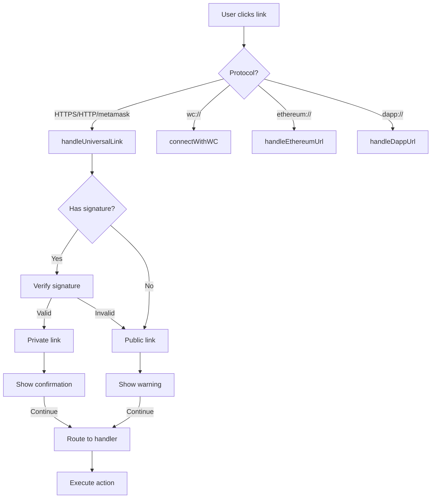

# MetaMask Mobile Deeplink Handling Guide

> 💡 **Visual Learner?** Check out the [Deeplink Visual Flowcharts](./deeplinking-diagrams.md) for interactive diagrams of the entire flow!

## Table of Contents

- [Overview](#overview)
- [Link Types](#link-types)
- [How Link Processing Works](#how-link-processing-works) → [See Visual Flow](./deeplinking-diagrams.md#complete-deeplink-flow-with-signature-verification)
- [Creating New Links](#creating-new-links)
- [Adding New Handlers](#adding-new-handlers)
- [Signature Verification](#signature-verification) → [See Verification Diagrams](./deeplinking-diagrams.md#signature-creation-and-verification-detail)
- [Analytics](#analytics) → [See Analytics Documentation](./deeplink-analytics.md)
- [Testing Links](#testing-links)
- [Security Considerations](#security-considerations)
- [Custom Schemes Explained](#custom-uri-schemes-explained)

Please note that custom `metamask://...` schemed links are being phased out in favor of universal links: `https://link.metamask.io/somePath?someParam=someValue`

## Overview

### In-app Support:

- UI element link routing
- In-app-browser web view selection
- QR code scanning

### External Support:

- External app link selection
- External browser website link selection
- External camera QR code link scan

### ⚠️ Does not support:

- Pasting link into external browser

MetaMask Mobile supports multiple deeplink protocols to enable various app interactions:

- **Universal Links** (iOS) / **App Links** (Android): `https://link.metamask.io/*`
- **Custom URI Schemes**: `metamask://`, `ethereum://`, `wc://`
- **Test Environment Links**: `https://link-test.metamask.io/*`

All deeplinks are processed through a unified pipeline that handles security verification, user consent, and routing to appropriate handlers.

## Link Types

> 📊 **[View Scenario Examples](./deeplinking-diagrams.md#common-scenarios)** - See visual flows for each link type

### 1. Public / Unsigned Links

Used for general marketing and public-facing features:

```
https://link.metamask.io/buy
https://link.metamask.io/swap?from=eip155:1/slip44:60
```

- **User Experience**: Shows interstitial warning about untrusted links
- **Use Cases**: Marketing campaigns, documentation, public features

### 2. Private / Signed Links

Cryptographically signed links for trusted internal use:

```
https://link.metamask.io/perps?sig=ABC123...&sig_params=screen,symbol
```

- **User Experience**: Shows confirmation dialog (can be disabled)
- **Use Cases**: Internal testing, controlled feature rollouts, trusted campaigns

### 3. Invalid Links

Links with invalid domains or unsupported actions (without valid signature):

- **User Experience**: Shows modal with "This page doesn't exist" message and option to update app or go home
- **Examples**: Wrong domain, malformed URL, unsupported action without signature

> ⚠️ **Note**: A tampered/invalid signature does NOT make a link "invalid". Instead, it demotes the link to a PUBLIC link (showing the security warning). Only invalid domains or unsupported actions result in the INVALID modal.

### 4. Unsupported Links

Links with valid signature but unsupported action in current app version:

- **User Experience**: Shows modal with "This page is not supported in current version" message
- **Examples**: New feature not yet available in user's app version

## Link Formats

| Type   | Format                                                                         | Example                                                          |
| ------ | ------------------------------------------------------------------------------ | ---------------------------------------------------------------- |
| Public | `https://link.metamask.io/{action}?{params}`                                   | `https://link.metamask.io/swap?from=eip155:1/slip44:60`          |
| Signed | `https://link.metamask.io/{action}?{params}&sig_params={list}&sig={signature}` | `https://link.metamask.io/swap?from=...&sig_params=from&sig=XXX` |
| Test   | `https://link-test.metamask.io/{action}?{params}`                              | `https://link-test.metamask.io/swap`                             |
| Legacy | `metamask://{action}?{params}`                                                 | `metamask://wc?uri=wc:123...`                                    |

## How Link Processing Works

> 📊 **[View Complete Flow Diagram](./deeplinking-diagrams.md#complete-deeplink-flow-with-signature-verification)** - Interactive Mermaid flowchart showing the entire process

### 1. Entry Points

```
User Clicks Link
       ↓
Branch.io / React Native Linking / FCM Notifications
       ↓
handleDeeplink() [Early SDKConnectV2/MWP interception]
       ↓
DeeplinkManager.parse()
       ↓
parseDeeplink()
```

### 2. URL Classification

```typescript
// In app/core/DeeplinkManager/utils/parseDeeplink.ts
const { urlObj, params } = extractURLParams(url);

// Determine protocol and route accordingly
switch (urlObj.protocol.replace(':', '')) {
  case PROTOCOLS.METAMASK:
  case PROTOCOLS.HTTP:
  case PROTOCOLS.HTTPS:
    // All converted to universal link format and handled uniformly
    → handleUniversalLink()
  case PROTOCOLS.WC:
    → connectWithWC()      // WalletConnect connections
  case PROTOCOLS.ETHEREUM:
    → handleEthereumUrl()  // EIP-681 payment requests
  case PROTOCOLS.DAPP:
    → handleDappUrl()      // In-app browser navigation
}
```

> **Note**: `metamask://` URLs are automatically converted to `https://link.metamask.io/` format before processing.

### 3. Signature Verification (for HTTPS links)

```typescript
// In app/core/DeeplinkManager/handlers/legacy/handleUniversalLink.ts
if (hasSignature(validatedUrl)) {
  const result = await verifyDeeplinkSignature(validatedUrl);

  switch (result) {
    case VALID: // Signature verified ✅
      isPrivateLink = true;
      break;
    case INVALID: // Signature failed ❌
    case MISSING: // No signature
      isPrivateLink = false;
      break;
  }
}
```

### 4. User Consent Modal

Unless the action is whitelisted or bypassed, users see an interstitial:

- **Public Links**: Security warning about untrusted source
- **Private Links**: Confirmation dialog (can remember choice)
- **Invalid Links**: "Page doesn't exist" modal with update/home options
- **Unsupported Links**: "Not supported in current version" modal

**Modal Bypass Conditions:**

- Action is in `WHITELISTED_ACTIONS` (WC, enable-card-button)
- URL starts with `interstitialWhitelistUrls` (e.g., perps-asset links)
- Link is private AND originated from in-app sources (carousel, notification, qr-code, in-app-browser)

### 5. Action Routing

```typescript
// In app/core/DeeplinkManager/handlers/legacy/handleUniversalLink.ts
switch (action) {
  case SUPPORTED_ACTIONS.SWAP:
    handleSwapUrl({ swapPath });
    break;
  case SUPPORTED_ACTIONS.PERPS:
  case SUPPORTED_ACTIONS.PERPS_MARKETS:
    handlePerpsUrl({ perpsPath });
    break;
  case SUPPORTED_ACTIONS.PREDICT:
    handlePredictUrl({ predictPath, origin });
    break;
  // ... other actions
}
```

## Creating New Links

### Basic Structure

```
https://link.metamask.io/{action}?{parameters}
```

### Examples

#### Public Link (Marketing)

```
https://link.metamask.io/buy?chain=1&token=ETH
```

#### Swap Link (CAIP-19 Format)

```
https://link.metamask.io/swap?from=eip155:1/erc20:0xa0b86991c6218b36c1d19d4a2e9eb0ce3606eb48&to=eip155:137/erc20:0x2791bca1f2de4661ed88a30c99a7a9449aa84174&amount=1000000
```

#### Private Link (Signed)

To create a signed link, use the `link-signer-api`:

1. **Server-Side Signing Process**:

```javascript
// The server takes your URL with parameters
const url = 'https://link.metamask.io/perps?screen=asset&symbol=BTC';

// Lists ALL parameters in sig_params
// sig_params = "screen,symbol"

// Signs the canonical URL including sig_params
// Adds signature as 'sig' parameter
// Final URL:
('https://link.metamask.io/perps?screen=asset&sig_params=screen,symbol&symbol=BTC&sig=ABC123...');
```

2. **Dynamic Parameters with sig_params**:

```
// Only 'screen' is signed, 'debug' can be added without breaking signature
https://link.metamask.io/perps?screen=asset&sig_params=screen&sig=XXX&debug=true
```

## Adding New Handlers

### Step 1: Define the Action

```typescript
// app/constants/deeplinks.ts
export enum ACTIONS {
  // ... existing actions
  YOUR_NEW_ACTION = 'your-new-action',
}
```

### Step 2: Add to Supported Actions

```typescript
// app/core/DeeplinkManager/handlers/legacy/handleUniversalLink.ts
enum SUPPORTED_ACTIONS {
  // ... existing actions
  YOUR_NEW_ACTION = ACTIONS.YOUR_NEW_ACTION,
}
```

### Step 3: Create Handler Function

```typescript
// app/core/DeeplinkManager/handlers/legacy/handleYourAction.ts
import NavigationService from '../../../NavigationService';
import Routes from '../../../../constants/navigation/Routes';
import DevLogger from '../../../SDKConnect/utils/DevLogger';

interface HandleYourActionParams {
  actionPath: string;
}

export const handleYourAction = async ({
  actionPath,
}: HandleYourActionParams) => {
  DevLogger.log('[handleYourAction] Starting with path:', actionPath);

  try {
    // Parse parameters from path
    const urlParams = new URLSearchParams(
      actionPath.includes('?') ? actionPath.split('?')[1] : '',
    );
    const someParam = urlParams.get('someParam');

    // Navigate or perform action
    NavigationService.navigation.navigate(Routes.YOUR_SCREEN, {
      someParam,
    });
  } catch (error) {
    DevLogger.log('Failed to handle your action deeplink:', error);
    // Fallback navigation on error
    NavigationService.navigation.navigate(Routes.WALLET.HOME);
  }
};
```

### Step 4: Import and Add Routing Logic

```typescript
// app/core/DeeplinkManager/handlers/legacy/handleUniversalLink.ts
import { handleYourAction } from './handleYourAction';

async function handleUniversalLink(/* ... */) {
  // ... existing code

  switch (action) {
    // ... existing cases
    case SUPPORTED_ACTIONS.YOUR_NEW_ACTION: {
      handleYourAction({
        actionPath: actionBasedRampPath,
      });
      break;
    }
  }
}
```

### Step 5: Add Tests

```typescript
// app/core/DeeplinkManager/handlers/legacy/__tests__/handleYourAction.test.ts
import { handleYourAction } from '../handleYourAction';
import NavigationService from '../../../../NavigationService';
import Routes from '../../../../../constants/navigation/Routes';

jest.mock('../../../../NavigationService', () => ({
  navigation: {
    navigate: jest.fn(),
  },
}));

describe('handleYourAction', () => {
  beforeEach(() => {
    jest.clearAllMocks();
  });

  it('navigates to YOUR_SCREEN with correct params', async () => {
    const actionPath = '?someParam=value';

    await handleYourAction({ actionPath });

    expect(NavigationService.navigation.navigate).toHaveBeenCalledWith(
      Routes.YOUR_SCREEN,
      { someParam: 'value' },
    );
  });
});
```

## Signature Verification

> 📊 **[View Signature Flow Diagrams](./deeplinking-diagrams.md#signature-creation-and-verification-detail)** - See how signing and verification work visually

### How It Works

1. **Server Signs URL**:
   - Includes all parameters listed in `sig_params`
   - Uses ECDSA with P-256 curve
   - Produces base64url-encoded signature

2. **Client (metamask-mobile) Verifies**:

   ```typescript
   // Canonicalization (with sig_params)
   if (params.has('sig_params')) {
     const signedParams = sigParamsList.split(',');
     // Only include params listed in sig_params
     signedParams.forEach((param) => {
       if (params.has(param)) {
         canonicalParams.set(param, params.get(param));
       }
     });
     // Always include sig_params itself
     canonicalParams.set('sig_params', sigParamsList);
   }

   // Verification
   const valid = await crypto.verify(
     algorithm,
     publicKey,
     signature,
     canonicalUrl,
   );
   ```

### Verification Results

- `MISSING`: No `sig` parameter (public link)
- `VALID`: Signature verified successfully
- `INVALID`: Signature present but verification failed

### Benefits of Dynamic Signing (sig_params)

> 📊 **[View Dynamic Parameters Diagram](./deeplinking-diagrams.md#dynamic-parameters-example)** - See how unsigned params can be added

- **Selective Signing**: Only critical params need signing
- **Forward Compatibility**: Add new unsigned params without breaking signatures
- **Flexible Testing**: Add debug params to signed production links

## Analytics

MetaMask Mobile tracks deep link usage through a consolidated `DEEP_LINK_USED` analytics event that captures:

- Route information and user actions
- App installation status (deferred vs. regular deep links via Branch.io)
- Signature validation results
- Interstitial modal interactions
- UTM parameters for attribution
- Route-specific sensitive properties

For comprehensive analytics documentation, see [Deep Link Analytics](./deeplink-analytics.md).

### Quick Overview

The analytics system:

- Fetches Branch.io parameters once per deep link to detect deferred deep links
- Creates analytics contexts with all relevant information
- Tracks a single `DEEP_LINK_USED` event with both standard and sensitive properties
- Handles errors gracefully without blocking deep link processing

## Testing Links

### Development Environment

```bash
# Test link format
https://link-test.metamask.io/{action}

# iOS Simulator
xcrun simctl openurl booted "https://link-test.metamask.io/swap"

# Android Emulator
adb shell am start -W -a android.intent.action.VIEW \
  -d "https://link-test.metamask.io/swap" \
  com.metamask.debug
```

### Testing Signed Links

1. **Generate Test Signature** (using link-signer-api):

   ```bash
   curl -X POST https://your-signer-api/sign \
     -d "url=https://link.metamask.io/perps?screen=asset"
   ```

2. **Verify Locally**:
   ```typescript
   // Add test in verifySignature.test.ts
   it('verifies production signed link', async () => {
     const url = new URL('your-signed-url-here');
     const result = await verifyDeeplinkSignature(url);
     expect(result).toBe(VALID);
   });
   ```

### Common Test Scenarios

- ✅ Valid signed link with all params
- ✅ Valid signed link with sig_params subset
- ✅ Public link without signature
- ✅ Tampered signature
- ✅ Missing parameters referenced in sig_params
- ✅ Expired signatures (if implemented)
- ✅ Wrong domain

## Security Considerations

### 1. Signature Verification

- **Always verify** signatures for sensitive actions
- **Never trust** client-provided sig_params without verification
- **Reject** if signature doesn't match canonical URL

### 2. Parameter Validation

```typescript
// Always validate and sanitize parameters
const symbol = params.get('symbol');
if (!isValidSymbol(symbol)) {
  throw new Error('Invalid symbol parameter');
}
```

### 3. Domain Validation

```typescript
const isSupportedDomain =
  urlObj.hostname === MM_UNIVERSAL_LINK_HOST ||
  urlObj.hostname === MM_IO_UNIVERSAL_LINK_HOST ||
  urlObj.hostname === MM_IO_UNIVERSAL_LINK_TEST_HOST;

if (!isSupportedDomain) {
  // Reject as invalid
}
```

### 4. Action Whitelisting

```typescript
// Some actions bypass interstitial for UX
const WHITELISTED_ACTIONS = [
  SUPPORTED_ACTIONS.WC, // WalletConnect needs immediate handling
  SUPPORTED_ACTIONS.ENABLE_CARD_BUTTON,
];

// Some URLs bypass interstitial regardless of action
const interstitialWhitelistUrls = [
  `${PROTOCOLS.HTTPS}://${MM_IO_UNIVERSAL_LINK_HOST}/${SUPPORTED_ACTIONS.PERPS_ASSET}`,
];

// In-app sources can bypass modal when combined with valid signature
const inAppLinkSources = [
  'carousel',
  'notifications',
  'qr-code',
  'in-app-browser',
];
```

## Best Practices

### Do's ✅

- **Test all link variations** before deploying
- **Use signed links** for internal/trusted features
- **Validate all parameters** before using them
- **Log deeplink events** for debugging
- **Handle errors gracefully** with user feedback
- **Document your handlers** with usage examples

### Don'ts ❌

- **Don't bypass** signature verification for convenience
- **Don't trust** user-provided parameters without validation
- **Don't expose** sensitive features via public links
- **Don't forget** to test edge cases (missing params, etc.)
- **Don't hardcode** URLs - use constants

## Troubleshooting

### Link Not Opening App

1. Check domain is correctly configured
2. Verify app association files (iOS/Android)
3. Ensure Branch.io is configured
4. Check if app is installed

### Signature Verification Failing

1. Verify public key configuration (metamask-mobile only uses production signatures)
2. Check sig_params includes all signed parameters
3. Ensure base64 encoding is correct
4. Verify canonical URL generation

### Handler Not Called

1. Check action is in SUPPORTED_ACTIONS
2. Verify routing logic in handleUniversalLink
3. Check for early returns or exceptions
4. Review interstitial modal behavior

## References

- [MetaMask Signer (Consensys employees only)](https://api.signer.link.metamask.consensys.io)
- [Signature Verification Implementation](../../app/core/DeeplinkManager/utils/verifySignature.ts)
- [Universal Link Handler](../../app/core/DeeplinkManager/handlers/legacy/handleUniversalLink.ts)
- [Deeplink Constants](../../app/constants/deeplinks.ts)
- [Test Suite](../../app/core/DeeplinkManager/handlers/legacy/__tests__/handleUniversalLink.test.ts)
- [Link Signer API](https://github.com/MetaMask/link-signer-api)

## Example: Complete Flow



# Deeplink Guide Appendix: Creating Signed Links

## Using the Link Signer API

The `link-signer-api` is a separate service that creates cryptographically signed deeplinks for MetaMask Mobile.

### How the Signer Works

1. **Input**: A URL with parameters
2. **Process**:
   - Lists all parameter keys in `sig_params`
   - Sorts parameters alphabetically
   - Signs the complete URL with ECDSA P-256
3. **Output**: URL with `sig_params` and `sig` added

### Server-Side Signing Process

MetaMask internal links can be signed [here](https://api.signer.link.metamask.consensys.io)

### Example: Creating a Signed Link

#### Step 1: Original URL

```
https://link.metamask.io/perps?screen=asset&symbol=BTC
```

#### Step 2: Server Processing

```
Parameters found: screen, symbol
Creates sig_params: "screen,symbol"
Signs: https://link.metamask.io/perps?screen=asset&sig_params=screen%2Csymbol&symbol=BTC
```

#### Step 3: Final Signed URL

```
https://link.metamask.io/perps?screen=asset&sig_params=screen,symbol&symbol=BTC&sig=MEUCIQDx...
```

## Dynamic Parameter Signing

### The Power of sig_params

The `sig_params` parameter enables flexible link creation:

```javascript
// Only 'action' and 'chainId' are signed
// 'debug' and 'timestamp' can be added later without breaking signature
const signedUrl =
  'https://link.metamask.io/swap?action=swap&chainId=1&sig_params=action,chainId&sig=XXX';

// Client can add unsigned parameters
const urlWithDebug = signedUrl + '&debug=true&timestamp=123456';
// ✅ Signature still valid!
```

### Use Cases

1. **A/B Testing**: Add tracking params to signed production links
2. **Debugging**: Add debug flags without re-signing
3. **Analytics**: Add UTM parameters post-signature
4. **Personalization**: Add user-specific params client-side

## Creating Links Programmatically

### For Development/Testing

```javascript
// Quick test link generator
function createTestLink(action, params = {}) {
  const url = new URL(`https://link-test.metamask.io/${action}`);

  Object.entries(params).forEach(([key, value]) => {
    url.searchParams.append(key, value);
  });

  return url.toString();
}

// Usage - Swap with CAIP-19 format
const swapLink = createTestLink('swap', {
  from: 'eip155:1/erc20:0xa0b86991c6218b36c1d19d4a2e9eb0ce3606eb48',
  to: 'eip155:137/erc20:0x2791bca1f2de4661ed88a30c99a7a9449aa84174',
  amount: '1000000',
});
```

### For Production (Requires Signing)

```javascript
// Using the link-signer-api
async function createSignedLink(action, params = {}) {
  const url = new URL(`https://link.metamask.io/${action}`);

  Object.entries(params).forEach(([key, value]) => {
    url.searchParams.append(key, value);
  });

  // Call your signing endpoint
  const response = await fetch('https://your-signer-api/sign', {
    method: 'POST',
    body: new URLSearchParams({ url: url.toString() }),
  });

  const { result } = await response.json();
  return result; // Signed URL
}
```

## Signature Verification Edge Cases

### Case 1: Missing Parameters in sig_params

```
URL: ?param1=value1&sig_params=param1,param2,param3&sig=XXX
```

- `param2` and `param3` listed but not present
- Canonical URL only includes `param1` and `sig_params`
- Signature will FAIL (different from what was signed)

### Case 2: Extra Parameters Not in sig_params

```
URL: ?param1=value1&param2=value2&sig_params=param1&sig=XXX
```

- `param2` not listed in sig_params
- Canonical URL only includes `param1` and `sig_params`
- Signature VALID (param2 ignored)

### Case 3: Empty sig_params

```
URL: ?sig_params=&sig=XXX
```

- No parameters are signed (except sig_params itself)
- Valid use case for simple signed confirmation

### Case 4: No sig_params (Legacy)

```
URL: ?param1=value1&param2=value2&sig=XXX
```

- Falls back to old behavior
- ALL parameters (except sig) are verified
- Maintains backward compatibility

## Security Implementation Details

### Client-Side Canonicalization

```typescript
function canonicalize(url: URL): string {
  const params = new URLSearchParams(url.searchParams);

  if (params.has('sig_params')) {
    // New behavior: selective parameter verification
    const sigParamsList = params.get('sig_params') || '';
    const signedParams = sigParamsList.split(',').filter(Boolean);
    const canonicalParams = new URLSearchParams();

    // Include only listed params
    signedParams.forEach((paramName) => {
      const value = params.get(paramName);
      if (value !== null) {
        canonicalParams.set(paramName, value);
      }
    });

    // Always include sig_params itself
    canonicalParams.set('sig_params', sigParamsList);
    canonicalParams.sort();

    const queryString = canonicalParams.toString();
    return url.origin + url.pathname + (queryString ? `?${queryString}` : '');
  }

  // Legacy behavior: verify all params except sig
  params.delete('sig');
  params.sort();
  const queryString = params.toString();
  return url.origin + url.pathname + (queryString ? `?${queryString}` : '');
}
```

### Why This Design?

1. **Forward Compatibility**: New parameters can be added without breaking old signatures
2. **Selective Security**: Choose which params need cryptographic protection
3. **Performance**: Only verify what matters
4. **Flexibility**: Mix signed and unsigned data

## Common Pitfalls

### ❌ Don't Include 'sig' in sig_params

```javascript
// WRONG - sig should never be in sig_params
'?sig_params=action,sig&sig=XXX';

// The server can't create this (sig doesn't exist yet when signing)
```

### ❌ Don't Modify Parameters Listed in sig_params

```javascript
// Original signed URL
'?action=swap&chainId=1&sig_params=action,chainId&sig=XXX';

// WRONG - Modifying signed parameter
'?action=send&chainId=1&sig_params=action,chainId&sig=XXX';
// ❌ Signature verification will fail
```

### ✅ Only Modify Unlisted Parameters

```javascript
// Original signed URL
'?action=swap&sig_params=action&sig=XXX';

// OK - Adding unsigned parameter
'?action=swap&chainId=1&sig_params=action&sig=XXX';
// ✅ Signature still valid (chainId not in sig_params)
```

## Testing Signature Verification

### Unit Test Examples

```typescript
describe('Dynamic signature verification', () => {
  it('verifies with sig_params subset', async () => {
    // Only param1 and param2 are signed
    const url = new URL(
      'https://link.metamask.io/test?param1=a&param2=b&param3=c&sig_params=param1,param2&sig=VALID_SIG',
    );

    const result = await verifyDeeplinkSignature(url);
    expect(result).toBe(VALID);
  });

  it('allows unsigned parameters', async () => {
    // debug is not in sig_params, so it's ignored
    const url = new URL(
      'https://link.metamask.io/test?action=swap&sig_params=action&debug=true&sig=VALID_SIG',
    );

    const result = await verifyDeeplinkSignature(url);
    expect(result).toBe(VALID);
  });

  it('fails when signed param is modified', async () => {
    // action is in sig_params, so changing it breaks signature
    const url = new URL(
      'https://link.metamask.io/test?action=send&sig_params=action&sig=SWAP_SIGNATURE',
    );

    const result = await verifyDeeplinkSignature(url);
    expect(result).toBe(INVALID);
  });
});
```

## Quick Reference

### Verification Results

| Result    | Meaning               | User Experience                                  |
| --------- | --------------------- | ------------------------------------------------ |
| `MISSING` | No signature present  | Shows public link warning                        |
| `VALID`   | Signature verified ✅ | Shows trusted link confirmation                  |
| `INVALID` | Signature failed ❌   | Shows public link warning (demoted from private) |

> ⚠️ **Important**: An invalid/tampered signature does NOT show an "invalid link" error. Instead, the link is treated as a public (unsigned) link. Only invalid domains or unsupported actions show the "invalid" modal.

### Supported Actions

| Action                 | Purpose                     | Handler Function         | Notes                                           |
| ---------------------- | --------------------------- | ------------------------ | ----------------------------------------------- |
| `swap`                 | Token swap/bridge (CAIP-19) | `handleSwapUrl`          | Params: `from`, `to`, `amount` (CAIP-19)        |
| `buy` / `buy-crypto`   | Buy crypto                  | `handleRampUrl`          |                                                 |
| `sell` / `sell-crypto` | Sell crypto                 | `handleRampUrl`          |                                                 |
| `deposit`              | Cash deposit                | `handleDepositCashUrl`   |                                                 |
| `send`                 | Send transaction            | Recursive `parse()` call |                                                 |
| `home`                 | Navigate home               | `navigateToHomeUrl`      | Params: `previewToken`, `openNetworkSelector`   |
| `dapp`                 | Open dApp browser           | `handleBrowserUrl`       |                                                 |
| `create-account`       | Create new account          | `handleCreateAccountUrl` |                                                 |
| `perps`                | Perpetuals trading          | `handlePerpsUrl`         | Params: `screen` (tabs/markets/asset), `symbol` |
| `perps-markets`        | Perps markets list          | `handlePerpsUrl`         |                                                 |
| `perps-asset`          | Perps specific asset        | ⚠️ NOT IMPLEMENTED       | Action defined but missing handler case         |
| `predict`              | Prediction markets          | `handlePredictUrl`       | Params: `market` or `marketId`, `utm_source`    |
| `rewards`              | Rewards program             | `handleRewardsUrl`       | Params: `referral` (referral code)              |
| `wc`                   | WalletConnect               | Recursive `parse()` call |                                                 |
| `onboarding`           | Fast onboarding             | `handleFastOnboarding`   |                                                 |
| `enable-card-button`   | Enable card feature         | `handleEnableCardButton` |                                                 |
| `bind`                 | Android SDK binding         | `handleMetaMaskDeeplink` |                                                 |
| `connect`              | SDK connection              | `handleMetaMaskDeeplink` |                                                 |
| `mmsdk`                | MetaMask SDK message        | `handleMetaMaskDeeplink` |                                                 |

> ⚠️ **Bug**: The `perps-asset` action is defined in `SUPPORTED_ACTIONS` and whitelisted, but **there is no case handler** for it in the switch statement. It will pass validation but silently do nothing.

## Custom URI Schemes Explained

MetaMask Mobile supports four custom URI schemes, each serving a specific purpose:

### `metamask://` - MetaMask App Actions

The primary custom scheme for MetaMask-specific actions and features. Used for:

- **App navigation**: `metamask://home`, `metamask://create-account`
- **Financial operations**: `metamask://swap`, `metamask://send?to=0x123`
- **Feature access**: `metamask://rewards`, `metamask://perps`
- **SDK connections**: `metamask://connect?channelId=abc&pubkey=xyz` (dapp-to-wallet pairing)

**Flow**: Converts to universal link format internally (`https://link.metamask.io/...`) → Routes through `handleUniversalLink` → Executes action

**Example**:

```
# Swap using CAIP-19 format
metamask://swap?from=eip155:1/erc20:0xa0b86991c6218b36c1d19d4a2e9eb0ce3606eb48&to=eip155:137/erc20:0x2791bca1f2de4661ed88a30c99a7a9449aa84174&amount=1000000
# Opens the swap/bridge screen with USDC (Ethereum) → USDC (Polygon) pre-filled
```

### `wc://` - WalletConnect Protocol

Industry-standard protocol for connecting MetaMask to dapps via WalletConnect v2. Used for:

- **QR code connections**: User scans WalletConnect QR code from a dapp
- **Deep link connections**: Dapp triggers connection via mobile deep link
- **Cross-app communication**: Establishes encrypted channel between dapp and wallet

**Flow**: WalletConnect URI → WC2Manager → Connection approval modal → Establishes session

**Example**:

```
wc:abc123def456@2?relay-protocol=irn&symKey=xyz789
# WalletConnect v2 pairing URI (typically from QR code)

metamask://wc?uri=wc:abc123def456@2?relay-protocol=irn&symKey=xyz789
# Same connection via deep link redirect
```

**Parameters**:

- `abc123def456` = Topic/Channel ID
- `@2` = WalletConnect protocol version
- `relay-protocol` = Relay server type
- `symKey` = Symmetric encryption key

### `ethereum://` - EIP-681 Payment Requests

[EIP-681](https://eips.ethereum.org/EIPS/eip-681) standard for Ethereum payment and transaction requests. Used for:

- **Simple transfers**: Send ETH to an address
- **Token approvals**: Approve token spending
- **Contract interactions**: Call contract functions with parameters
- **QR code payments**: Payment request QR codes

**Flow**: Parses EIP-681 format → Switches to correct network → Opens Send/Approval screen

**Examples**:

```
# Simple ETH transfer
ethereum:0x742d35Cc6634C0532925a3b844Bc9e7595f0bEb?value=1.5e18

# Token transfer (calls ERC-20 transfer function)
ethereum:0xA0b86991c6218b36c1d19D4a2e9Eb0cE3606eB48/transfer?address=0x123&uint256=1000000

# Contract function call with parameters
ethereum:0x123ABC@1/approve?address=0x456DEF&uint256=1000000000000000000
```

**Supported Actions** (from `eth-url-parser`):

- `transfer` - ERC-20 token transfers
- `approve` - Token spending approvals
- Generic sends (when only `value` parameter provided)

**Network Handling**: The `@1` suffix specifies chain ID (e.g., `@1` = Mainnet, `@137` = Polygon)

### `dapp://` - In-App Browser Navigation

Opens external websites in MetaMask's built-in browser (similar to opening links in the browser tab). Used for:

- **Direct dapp access**: Navigate to specific dapps
- **Deep paths**: Open specific pages within dapps
- **Trusted integrations**: Coinbase Commerce, payment flows

**Flow**: Converts `dapp://` → `https://` → Opens in MetaMask browser → No security modal

**Examples**:

```
# Basic dapp opening
dapp://uniswap.org
# → Opens https://uniswap.org in MetaMask browser

# With deep path
dapp://app.1inch.io/#/1/simple/swap/ETH/DAI
# → Opens https://app.1inch.io/#/1/simple/swap/ETH/DAI

# Via universal link (shows security modal)
https://metamask.app.link/dapp/commerce.coinbase.com
```

**Key Difference**: `dapp://` bypasses the interstitial warning modal, making it ideal for trusted payment flows and in-app navigation.
