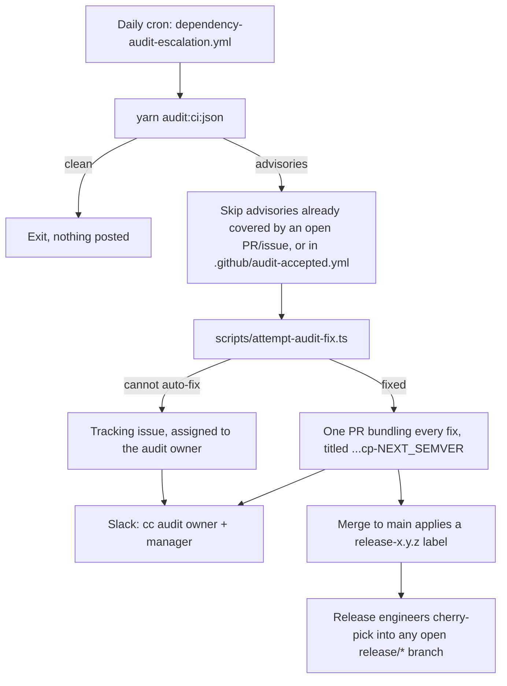

# Dependency Audit

How `yarn audit:ci` advisories are triaged after moving from a blocking CI check to an advisory-only warning plus a scheduled escalation loop.

## Summary

`yarn audit:ci` (`yarn npm audit --environment production --severity moderate --no-deprecations`) no longer blocks merges. The [`dependency-audit`](../../.github/workflows/ci.yml) job in `ci.yml` runs it on every PR and posts a `::warning::` and job summary when advisories exist, but always exits `0`.

Actual triage happens once a day in [`dependency-audit-escalation.yml`](../../.github/workflows/dependency-audit-escalation.yml):



## Why nothing blocks merges

Advisory data from the npm registry changes independently of any code change in this repository — a PR can go from "clean" to "advisory found" without a single line of diff. Gating merges on that is noisy and untraceable to the change under review. The daily schedule re-checks main directly instead, decoupled from the PR lifecycle.

There is deliberately no fallback blocking gate (e.g. on release branches). The only backstop is the escalation SLA below — a stale advisory can ship. If this proves leaky, escalation can attach a `blocks-release` label after the SLA expires, and the release PR can require its absence.

## The audit owner

[`.github/audit-owners.yml`](../../.github/audit-owners.yml) is the single source of truth for who is paged:

- `owner.github` — assigned as reviewer/assignee on every fix PR and tracking issue.
- `owner.slack_id` / `manager.slack_id` — Slack **member IDs** (not display names), mentioned in the escalation Slack message.
- `slack_channel` — a Slack **channel ID** (not a channel name).
- `sla_days` — business days before an open advisory PR/issue is considered stale (see below).

To rotate the owner or manager, edit that file directly and open a normal PR — no workflow or secret changes needed.

## What the escalation workflow does

1. Runs `yarn audit:ci:json` against `main`.
2. Builds a skip-list from advisory IDs already referenced by an open PR labeled `dependency-audit`, an open issue labeled `dependency-audit-manual`, or [`.github/audit-accepted.yml`](../../.github/audit-accepted.yml).
3. For every remaining advisory, [`scripts/attempt-audit-fix.ts`](../../scripts/attempt-audit-fix.ts) tries, in order:
   - `yarn up <pkg>` if it is a direct dependency.
   - A `resolutions` pin to the lowest published version outside the vulnerable range, for direct or transitive dependencies.
   - Each attempt is verified by re-running the audit for that advisory, then `yarn dedupe` and `yarn constraints`; anything that doesn't come back clean is reverted.
4. Advisories it could fix are bundled into **one PR** titled `fix: patch dependency audit advisories cp-<next-release>`, assigned to the owner.
5. Advisories it could not fix are filed as (or added to) **one open tracking issue** labeled `dependency-audit-manual`, assigned to the owner.
6. Slack posts a summary to the configured channel, tagging the owner and manager.

Run it manually via `workflow_dispatch` in the Actions tab to trigger triage outside the daily schedule.

## What `cp-` does (and does not do) here

The fix PR title includes a `cp-<next-release>` token purely so the existing [`add-release-label-to-pr-and-linked-issues.ts`](../../.github/scripts/add-release-label-to-pr-and-linked-issues.ts) automation applies a `release-x.y.z` label when the PR merges to `main`. **It does not trigger an automatic cherry-pick.** Cherry-picking into an already-open `release/*` branch is a manual step for release engineers (see [`create-cherry-pick-pr.yml`](../../.github/workflows/create-cherry-pick-pr.yml) / `scripts/create-cherry-pick-pr.sh`), same as any other hot-fix in this repo.

## Accepting a risk instead of fixing it

Some advisories are not worth an immediate fix (e.g. a dev-only tool, an unreachable code path, or a fix that is not published yet). Add an entry to [`.github/audit-accepted.yml`](../../.github/audit-accepted.yml):

```yaml
accepted:
  - id: 'GHSA-xxxx-xxxx-xxxx'
    reason: 'Only reachable from a dev-only script; not shipped to users.'
    accepted_by: 'gh-handle'
    accepted_on: '2026-08-31'
```

That advisory ID is skipped by the escalation loop until the entry is removed. Revisit accepted entries periodically — this file is not a way to silence an advisory forever without review.

## SLA

An open fix PR or tracking issue older than `sla_days` (default 5 business days) has gone past the intended review window. There is currently no automated re-ping; the owner and manager tagged in the original Slack message are expected to follow up. Treat repeated SLA misses as a signal to revisit whether the process needs a harder backstop (see "Why nothing blocks merges" above).
