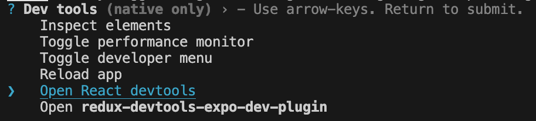
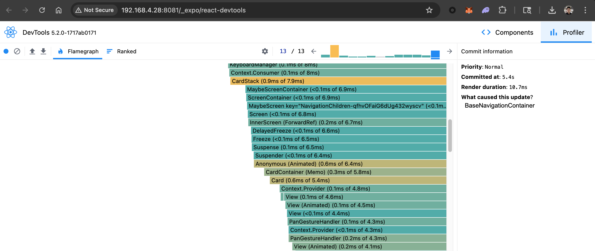
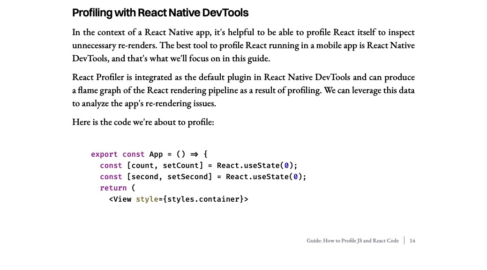
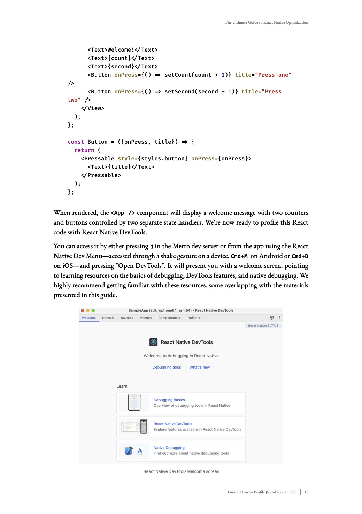
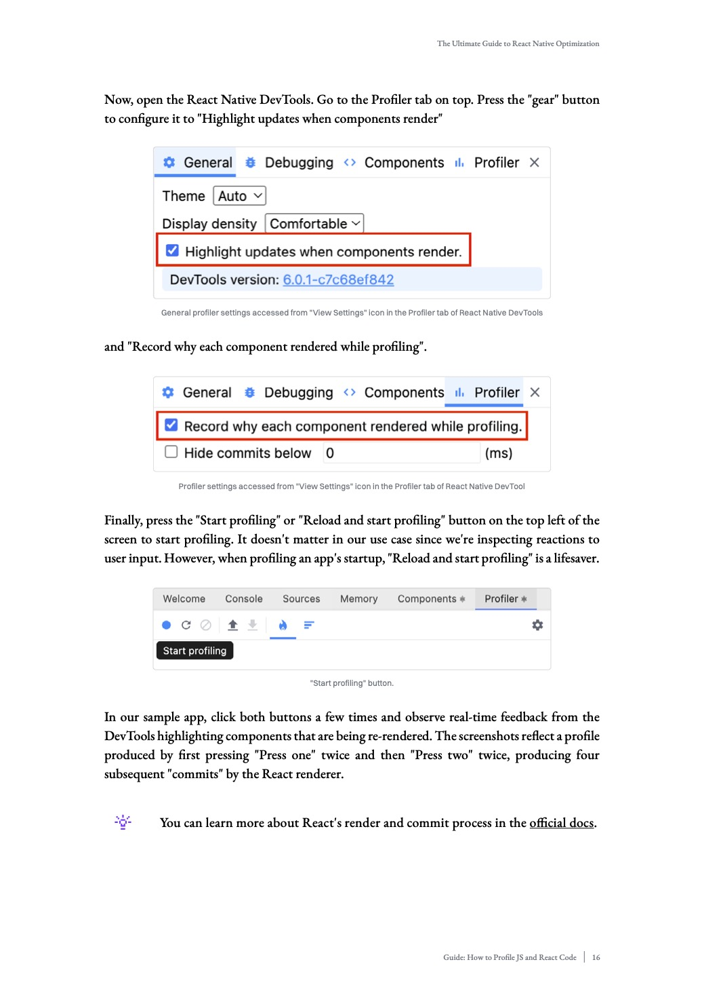
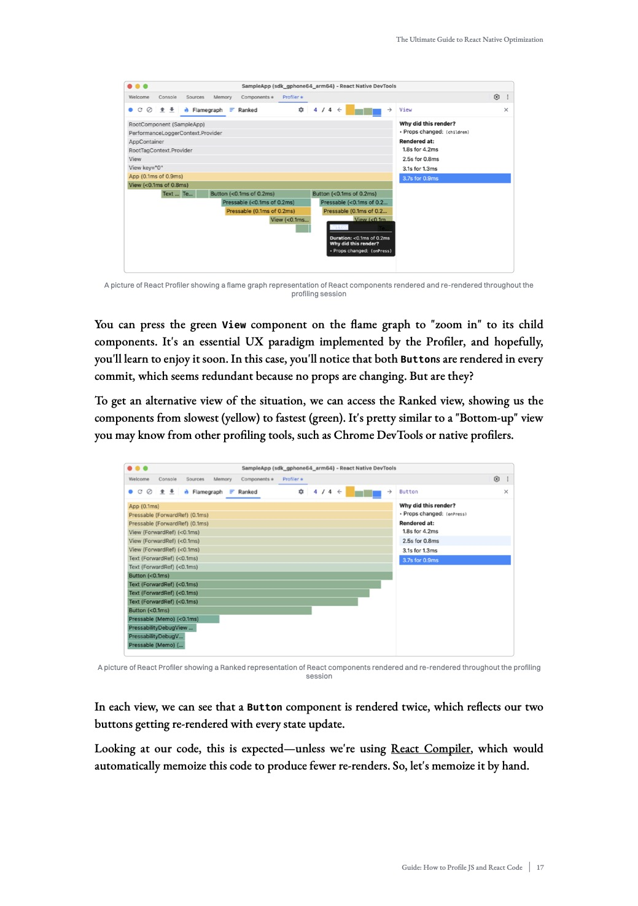
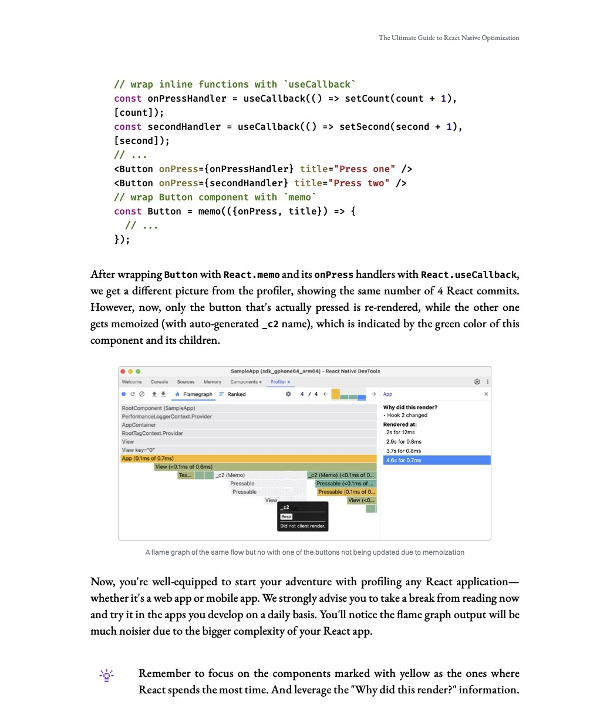

# Performance

Performance optimization in React Native applications is a complex and multifaceted challenge. It encompasses various aspects such as rendering efficiency, memory management, network operations, and native module interactions. Poor performance can manifest in different ways - from sluggish UI responses and excessive battery drain to memory leaks and app crashes.

This guide aims to help you navigate this complex landscape by providing best practices, common pitfalls to avoid, and the right tools to measure and improve performance. Some topics that we'll cover include:

- [Re-renders and component optimization](#re-renders-and-component-optimization)
- [Tool(s) for identifying re-renders](#tools-for-identifying-re-renders)
- [Automatically optimizing React](#automatically-optimizing-react)

By understanding these areas and applying the recommended practices, you can create a more efficient and responsive application that provides a better user experience.

## Re-renders and component optimization

> **Note on Over-Optimization**: While memoization is powerful, it's important to use it in moderation. Not every function or computed value needs to be memoized.
>
> Consider memoization when:
>
> - The computation is expensive (e.g., complex calculations, large array transformations)
> - The value is used in dependency arrays of other hooks
>
> No need to optimize when:
>
> - The calculation is cheap
> - You're just returning a primitive or constant
> - It's not causing unnecessary re-renders or performance issues
>
> Avoid premature optimization. Start without memoization and add it only when you observe performance issues.

Re-renders are a common source of performance issues in React Native applications. While some re-renders are necessary for updating the UI, unnecessary re-renders can significantly impact performance. Here are some areas that we've seen that can cause performance issues:

### Components

Components that aren't memoized can re-render even when their props haven't changed.

Best practices:

- **React.memo**: Use for functional components to prevent unnecessary re-renders

Example of component memoization:

```javascript
// Bad - re-renders on every parent update
const MyComponent = (props) => {
  /* ... */
};

// Good - only re-renders when props change
const MyComponent = React.memo((props) => {
  /* ... */
});
```

### Selectors

Selectors, especially in Redux or other state management solutions, can cause unnecessary re-renders if not properly optimized.

Best practices:

- **Memoize selectors**: Selectors that create new object references on each call can trigger re-renders even when the underlying data hasn't changed. Use memoized selectors such as [createSelector](https://reselect.js.org/api/createSelector) from [reselect](https://github.com/reduxjs/reselect) to prevent unnecessary re-renders.
- **Selector Composition**: Complex selector chains can lead to multiple re-renders. Keep selectors focused and simple.

Example of selector optimization:

```javascript
// Bad - creates new array every time
const getActiveItems = (state) => {
  return state.items.filter((item) => item.isActive);
};

const getAllItems = (state) => {
  return state.items;
};

// Good - memoized selector and only recomputes when state.items changes
const getActiveItems = createSelector(getAllItems, (items) =>
  items.filter((item) => item.isActive),
);
```

### Hooks and Functions

Hooks and functions that aren't properly memoized can cause unnecessary re-renders.

Best practices:

- [**useMemo**](https://react.dev/reference/react/useMemo): Computed values should be memoized to prevent recalculation on every render, especially for computed values that are expensive to compute.
- [**useCallback**](https://react.dev/reference/react/useCallback): Complex functions created inside components should be wrapped in `useCallback` to maintain referential equality.
- [**useEffect**](https://react.dev/reference/react/useEffect): Apply correct dependencies to `useEffect` to prevent unnecessary triggers and re-renders.

Example of memoizing a computed value using `useMemo`:

```javascript
// Bad - new array created every render
const items = data.map((item) => ({
  ...item,
  processed: processItem(item),
}));

// Good - memoized array transformation that changes only when data changes
const items = useMemo(
  () =>
    data.map((item) => ({
      ...item,
      processed: processItem(item),
    })),
  [data],
);
```

Example of memoizing a function using `useCallback`:

```javascript
// Bad - new function created every render
const onPress = () => {
  /* ... */
};

// Assume Button is memoized - still re-renders on parent update because onPress is a new function reference on each render
return <Button onPress={onPress} />;

// Good - function memoized with proper dependencies
const onPress = useCallback(() => {
  /* ... */
}, []);

// Assume Button is memoized - does not re-render on parent update because onPress is a memoized function reference
return <Button onPress={onPress} />;
```

Example of proper dependencies in `useEffect`:

```javascript
// Bad - missing dependencies and unnecessary effect runs on every re-render
useEffect(() => {
  processUserId(userId);
}); // Missing userId dependency

// Good - proper dependencies
useEffect(() => {
  processUserId(userId);
}, [userId]); // Effect runs only when userId changes
```

## Tools for identifying re-renders

> **Note on tool availability**: Since `React Native DevTools` is dependent on `Hermes` engine, it is not yet available for iOS since we're still using `JSC` engine. However, we are working on getting `Hermes` enabled on iOS. In the meantime, you can use `React DevTools` to achieve the same render profiling on iOS.

We recommend using [React Native DevTools](https://reactnative.dev/docs/react-native-devtools) on Android and [React DevTools](https://reactnative.dev/docs/0.76/react-native-devtools#react-profiler) on iOS to identify re-renders in your React Native app.

To open `React DevTools` on either platforms, press `shift+m` in the watcher window and select `React DevTools`.



`React DevTools`'s profiling view is set up the same way as `React Native DevTools`'s profiling view.



To illustrate how the tool can be used, we'll be referencing [Callstack](https://www.callstack.com/)'s recently released 2025 [guide](https://www.callstack.com/ebooks/the-ultimate-guide-to-react-native-optimization) to React Native performance optimization. In this guide, Callstack walks through how to use `React Native DevTools Profiler` to identify re-renders in your React Native app. This tutorial's instructions also applies to `React DevTools`'s profiling feature.







## Automatically optimizing React

In 2024, the React team announced a build time tool called [React Compiler](https://react.dev/learn/react-compiler) that we can leverage to automatically optimize React code. Under the hood, the compiler references the [Rules of React](https://react.dev/reference/rules) to memoize code whenever possible. More specifically, the tool uses React APIs such as `useMemo`, `useCallback`, and `React.memo` for memoization. React Compiler has already been integrated into MetaMask's build process, so you can start using it today. We've also added an ESLint plugin for React Compiler that will catch issues during linting based on the rules of React.

### Optimizing new code

Since the plan is to incrementally adopt React Compiler, only code files and paths that are specified by the team will be automatically optimized. To ensure that new code is automatically optimized by React Compiler, add the file path or directory to the `pathsToInclude` in `babel.config.js`. Once added, the new code will be automatically optimized during build time.

```javascript
// babel.config.js

module.exports = {
  /* ... */
  plugins: [
    [
      'react-compiler',
      {
        /* .. */
        sources: (filename) => {
          // Match file paths or directories to include in the React Compiler.
          const pathsToInclude = [
            // Example file path
            'app/components/ExampleDir/index',
            // Example directory
            'app/components/ExampleDir2',
          ];
          return pathsToInclude.some((path) => filename.includes(path));
        },
      },
    ],
  ];
};
```

### Troubleshooting React Compiler

By default, Metro may cache parts of the compiled code especially when using the `yarn watch` command. To perform a clean build, run `yarn watch:clean` instead. You can also verify that the file is picked up by React Compiler by adding a log in the `sources` function to confirm the match.
