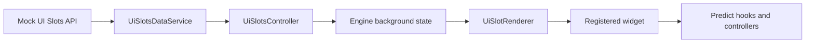

# UI Slots POC

This document explains the current Mobile UI Slots proof of concept.

UI Slots lets a fixed position in the app render remotely selected content
without allowing the backend to send executable code or arbitrary component
trees. The client still owns every supported slot position, widget, action, and
live-data integration.

The POC currently powers two Predict Home surfaces:

- A dismissible alert banner.
- The Predict market carousel.

LaunchDarkly content remains as the fallback when no compatible UI Slots
content is available. Once a compatible configuration is active, an omitted or
dismissed slot stays empty rather than revealing legacy content underneath it.

## Mental model

There are four important concepts:

| Concept          | Example                         | Owner        |
| ---------------- | ------------------------------- | ------------ |
| Screen           | `predict-home`                  | Client       |
| Slot position    | `predict-home.before-portfolio` | Feature team |
| Widget           | `alert-banner`                  | Feature team |
| Content instance | `predict-poc-banner-1`          | Backend/CMS  |

A slot position is part of the app layout. Remote configuration can fill that
position with a known widget, but it cannot create a new position or widget.



## Runtime flow

1. `PredictHome` calls `useUiSlotsScreen('predict-home')`.
2. The hook asks `UiSlotsController` to load the screen for the current locale.
3. `UiSlotsController` checks its persisted last-known-good configuration.
4. A fresh compatible cache is rendered immediately.
5. A stale cache is rendered while an ETag revalidation runs.
6. `UiSlotsDataService` calls the configured transport.
7. The envelope and every slot's structural identity are parsed first;
   configuration-wide uniqueness is checked before per-instance compatibility.
8. The controller applies client capabilities, version constraints, validity
   windows, and local dismissals.
9. Valid slots are normalized by `slotId` and exposed through Engine state.
10. `UiSlotRenderer` selects one slot in O(1) and renders its registered widget.

UI code never calls the API or mock transport directly.

## Main files

### Generic controller and transport

```text
app/core/Engine/controllers/ui-slots-controller/
├── UiSlotsController.ts
├── UiSlotsDataService.ts
├── UiSlotsApiReadClient.ts
├── configurationKey.ts
├── config.ts
├── interpret.ts
├── slotDefinitions.ts
├── types.ts
├── contracts/
│   ├── registry.ts
│   └── v1.ts
└── mock/
    ├── UiSlotsMockTransport.ts
    └── screens/
```

`UiSlotsController` owns persisted configuration, interpretation, request
coordination, dismissal state, retention, and last-known-good behavior.

`UiSlotsDataService` owns retries, circuit-breaking behavior, request
deduplication, and transport invocation. Its cache is deliberately configured
with `staleTime: 0`; the controller is the single owner of freshness.

`UiSlotsApiReadClient` is the future HTTP implementation. The POC currently
injects `UiSlotsMockTransport` from
`app/core/Engine/controllers/ui-slots-data-service-init.ts`.

### Mobile composition

```text
app/components/UI/UiSlots/
├── UiSlotRenderer.tsx
├── mobileContractRegistry.ts
├── mobileWidgetRegistry.ts
├── mobileActionRegistry.ts
├── contracts/v1.ts
├── handlers/handlerRegistry.ts
├── hooks/useUiSlotsScreen.ts
└── widgets/AlertBannerWidget.tsx
```

The `mobile*Registry` files are composition roots. They combine generic Mobile
capabilities with feature-owned capabilities without making the generic
controller import Predict, Rewards, Perps, or other feature UI.

### Predict-owned integration

```text
app/components/UI/Predict/uiSlots/
├── contracts/v1.ts
├── slotDefinitions.ts
├── widgetRegistry.ts
├── actionRegistry.ts
└── widgets/MarketCarouselWidget.tsx
```

Predict owns its slot positions, market-carousel parser, renderer, action
handler, and live-data reference mapping.

`MarketCarouselWidget` passes a venue-qualified `predict-feed` reference into
Predict. Predict maps stable feed IDs such as `tennis-open` to query,
membership, ordering, pagination, and rolling-series behavior. Remote content
cannot supply raw domain query parameters. The UI Slots controller never
interprets or fetches live market data.

## Registries

The implementation uses four independently composable registries.

### Contract registry

Maps remote string keys to runtime parsers:

- Widget type to widget parser.
- Action ID to action parser.
- Data-reference type to reference parser.

Feature modules also extend the compile-time `UiSlotDataReferenceMap`. This
keeps feature parameter types out of the generic controller while preserving a
concrete JSON-serializable union in controller state.
Screen IDs, widgets, and actions use the same feature-owned type-map pattern.

Unknown widget types reject only their content instance. Unknown optional
actions are removed. Unknown required actions reject their content instance.

### Slot-definition registry

Declares the capabilities of each fixed position:

```typescript
{
  'predict-home.live-now': {
    widgetTypes: ['market-carousel'],
    actionIds: ['navigate-deeplink'],
    dataReferenceTypes: ['predict-feed'],
    requiredDataReferenceTypes: ['predict-feed'],
  },
}
```

Remote configuration cannot expand these capabilities.

### Widget registry

Maps a validated widget type to a pre-built React component. The registry uses
static imports; remote module names are never dynamically imported.

### Action registry

Maps a validated action ID to client-owned behavior. Predict deeplinks pass
through `isAllowedPredictDeeplink` before reaching the deeplink manager.

## Controller state

The controller persists:

- `screenConfigurations`: validated last-known-good API responses.
- `dismissedContentIds`: content IDs and their dismissal timestamps.

The controller does not persist:

- `renderedConfigurations`: normalized, currently eligible slots.
- `activeConfigurationKeys`: the active locale/cohort configuration per screen.
- `requestStatus`: `idle`, `loading`, `ready`, or `error`.

A configuration key contains:

```text
screenId : locale : platform : contractMajor : capabilityCohort
```

This prevents one locale or capability cohort from overwriting another.

Rendered slots are stored as:

```typescript
{
  slotsById: Record<string, UiSlot>;
  slotIds: string[];
}
```

The renderer therefore selects a slot directly instead of scanning an array.

## Cache and resilience

Current policy:

- Soft TTL: 15 minutes.
- Hard TTL: 7 days.
- Maximum persisted configurations: 20.
- Maximum dismissal records: 500.

Behavior:

- Before the soft TTL, compatible cached content renders without a request.
- After the soft TTL, cached content renders while ETag revalidation runs.
- After the hard TTL, cached content is removed and cannot render.
- A `304` response reapplies time windows, dismissals, and capability rules.
- Network and server failures retain compatible last-known-good content.
- Invalid envelopes and broken configuration invariants retain last-known-good
  content; a structurally valid response whose instances are all incompatible
  publishes an empty configuration instead of retaining stale content.
- Concurrent requests for the same screen and locale are deduplicated.
- A slower request for an old locale cannot replace a newer locale request.
- Focused screens schedule re-evaluation at soft/hard TTL and content validity
  boundaries and re-evaluate immediately when the app returns to the foreground.
- Content-boundary evaluation is independent of network refresh completion, and
  screens without a cache retry on a bounded interval.

Content-level `validity.until` is enforced locally at its boundary and can
invalidate content before the hard TTL even when a refresh remains in flight.

## Dismissals

Dismissal is keyed by `contentId`, not slot position. This means:

- Moving the same content to another supported position does not redisplay it.
- A new content instance can use the same position and still render.

The controller maintains a non-persisted content-location index, so dismissal
removes only affected slots instead of rebuilding every loaded screen.

## Kill switch

The version-gated `uiSlots` remote feature flag is the production kill switch.
Disabling it immediately removes active rendered configuration and prevents
fetching while preserving last-known-good state for a later re-enable.
The effective gate also requires the app's basic-functionality consent.

Local development keeps the mock enabled by default. Set:

```text
MM_UI_SLOTS_ENABLED=false
```

This disables the local mock override so the remote flag behavior can be tested.
The flag controls availability only; content continues to come from the UI Slots
transport.

## Mock transport

The default fixture is:

```text
app/core/Engine/controllers/ui-slots-controller/mock/screens/predict-home.json
```

Available controls:

```text
MM_UI_SLOTS_MOCK_FIXTURE=dismissible-banner
MM_UI_SLOTS_MOCK_FAILURE=network
MM_UI_SLOTS_MOCK_FAILURE=500
MM_UI_SLOTS_MOCK_FAILURE=malformed
```

The mock transport adds a short delay and implements ETag/`304` behavior.

## Adding another screen

1. Extend `UiSlotsScreenIdMap` from the feature-owned UI Slots types.
2. Add feature-owned slot definitions.
3. Compose those definitions during controller initialization.
4. Call `useUiSlotsScreen(screenId)` once in the host screen.
5. Place `UiSlotRenderer` at each fixed layout position.
6. Add fixtures and tests.

Do not fetch UI Slots from the screen component.

## Adding another widget

1. Define its versioned TypeScript shape.
2. Add a strict runtime parser in the owning feature.
3. Add the parser to the feature contract registry.
4. Build the widget using existing design-system components.
5. Add it to the feature widget registry.
6. Allow it only in specific feature-owned slot definitions.
7. Add parser, renderer, and integration tests.
8. Bump `UI_SLOTS_CAPABILITY_COHORT` when the supported capability set changes,
   so older persisted configurations cannot activate under new capabilities.

The widget should resolve live data through its domain hooks/controllers rather
than expanding `UiSlotsController` into a cross-domain controller.

## Adding another action

1. Define the action ID and validated parameters.
2. Add its runtime parser.
3. Add a client-owned handler in the responsible feature.
4. Add it to that feature's action registry.
5. Allow it only in the necessary slot definitions.
6. Test invalid parameters and denied destinations.

Remote actions contain data only. They must never contain executable code.

## Tests

Focused tests cover:

- Additive API fields.
- Per-slot parsing failures.
- Duplicate slot/content structural invariant rejection.
- Optional and required unknown actions.
- Venue-qualified Predict feed-reference validation.
- Version and validity filtering.
- ETag `304` revalidation.
- Last-known-good behavior.
- Request deduplication and locale races.
- Kill-switch behavior.
- Bounded configuration and dismissal retention.
- Targeted dismissal.
- Widget rendering and action execution.
- LaunchDarkly fallback.

Run them with:

```bash
nvm use
yarn jest \
  app/core/Engine/controllers/ui-slots-controller/contracts/v1.test.ts \
  app/core/Engine/controllers/ui-slots-controller/UiSlotsApiReadClient.test.ts \
  app/core/Engine/controllers/ui-slots-controller/UiSlotsController.test.ts \
  app/components/UI/UiSlots/UiSlotRenderer.test.tsx \
  app/components/UI/UiSlots/hooks/useUiSlotsScreen.test.ts \
  app/components/UI/UiSlots/widgets/AlertBannerWidget.test.tsx \
  app/components/UI/Predict/uiSlots/widgets/MarketCarouselWidget.test.tsx \
  app/components/UI/Predict/components/PredictFeedBanner/PredictFeedBanner.test.tsx \
  --no-coverage --runInBand
```

## POC limitations

- The transport is mocked; the HTTP client is not selected at runtime.
- Only `predict-home` is registered.
- Extension does not yet consume the controller.
- Portable controller logic remains app-local; shared-package bundle/startup
  acceptance benchmarks have not been run.
- Analytics contracts are not implemented.
- The API endpoint and final backend payload remain subject to the backend ADR
  implementation.
