# WalletConnect Multichain — Intégration Tron dans MetaMask Mobile

> Document de recherche technique — Mars 2026
>
> Sources : codebase MetaMask Mobile, repos `connect-tron` et `multichain-api-client`, documentation Reown/WalletConnect, standards CAIP.

---

## Table des matières

1. [Résumé exécutif](#1-résumé-exécutif)
2. [Architecture actuelle — WalletConnect EVM-only](#2-architecture-actuelle--walletconnect-evm-only)
3. [Standards CAIP pour Tron](#3-standards-caip-pour-tron)
4. [WalletConnect & Tron — Protocole officiel](#4-walletconnect--tron--protocole-officiel)
5. [Écosystème MetaMask — connect-tron & multichain-api-client](#5-écosystème-metamask--connect-tron--multichain-api-client)
6. [Top 5 des dApps Tron avec WalletConnect](#6-top-5-des-dapps-tron-avec-walletconnect)
7. [Analyse des écarts — Ce qui doit changer](#7-analyse-des-écarts--ce-qui-doit-changer)
8. [Roadmap d'implémentation](#8-roadmap-dimplémentation)

---

## 1. Résumé exécutif

MetaMask Mobile utilise **WalletConnect v2** (via `@reown/walletkit`) pour les connexions dApp. L'implémentation actuelle est strictement limitée aux chaînes EVM via le namespace `eip155`. Tron est une chaîne non-EVM avec son propre namespace CAIP-2 (`tron:`), ses propres méthodes JSON-RPC, et un format d'adresse distinct (Base58Check, préfixe `T`).

Il existe **deux voies d'intégration** dans l'écosystème MetaMask :

| Voie                            | Protocol                                  | Côté dApp                                | Côté MetaMask Mobile              |
| ------------------------------- | ----------------------------------------- | ---------------------------------------- | --------------------------------- |
| **A — WalletConnect Sign API**  | WC session_proposal avec namespace `tron` | `@walletconnect/sign-client`             | `WalletConnectV2.ts` (à modifier) |
| **B — MetaMask Multichain API** | `wallet_createSession` CAIP-25            | `connect-tron` + `multichain-api-client` | Engine CAIP-25 (à modifier)       |

Le repo `connect-tron` implémente la voie B. Ce document couvre les deux, avec focus sur la voie A (WalletConnect).

---

## 2. Architecture actuelle — WalletConnect EVM-only

### 2.1 Vue d'ensemble des fichiers clés

| Fichier                                           | Rôle                                                   |
| ------------------------------------------------- | ------------------------------------------------------ |
| `app/core/WalletConnect/WalletConnectV2.ts`       | Manager singleton — lifecycle des sessions WC          |
| `app/core/WalletConnect/WalletConnect2Session.ts` | Gestionnaire par session — routing des requêtes        |
| `app/core/WalletConnect/wc-utils.ts`              | Utilitaires chaîne/permission (`getScopedPermissions`) |
| `app/core/WalletConnect/wc-config.ts`             | Routing méthodes RPC → redirect ou non                 |
| `app/core/Permissions/index.ts`                   | CAIP-25 permission management (`getPermittedChains`)   |
| `app/core/BackgroundBridge/WalletConnectPort.ts`  | Bridge WC ↔ RPC middleware                            |

Packages principaux :

- `@reown/walletkit` v1.4.1 — successeur de WalletConnect v2 WalletKit
- `@walletconnect/core` v2.23.0
- `@metamask/chain-agnostic-permission` — builder CAIP-25

### 2.2 Flux de création de session

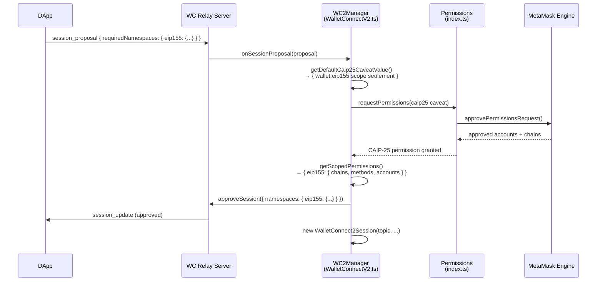

### 2.3 Flux de traitement d'une requête

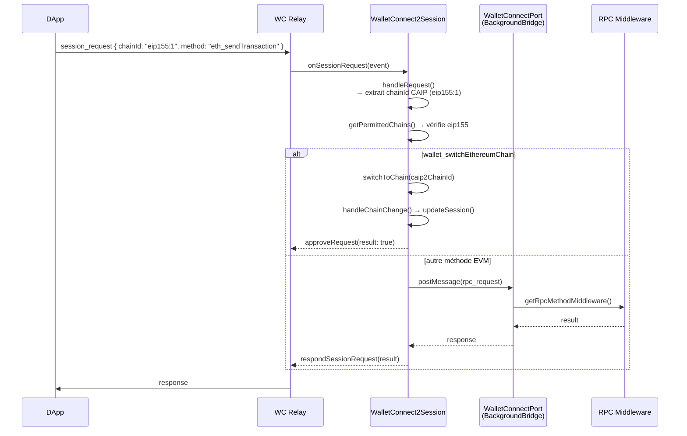

### 2.4 Où est enforced la restriction EVM-only

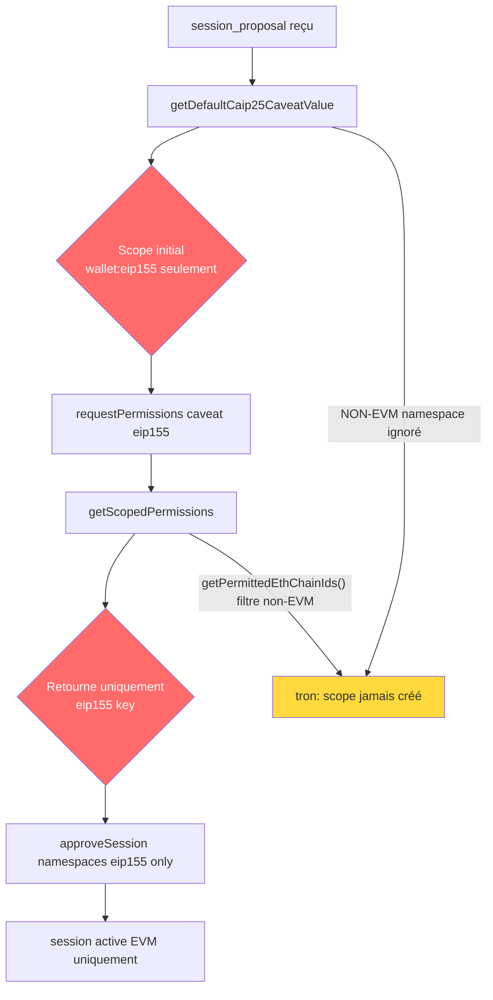

**4 points de blocage identifiés :**

1. **`getDefaultCaip25CaveatValue()`** (`Permissions/index.ts:302`) — initialise uniquement `wallet:eip155`
2. **`getScopedPermissions()`** (`wc-utils.ts:255`) — ne retourne que la clé `eip155` dans le namespace object
3. **`getPermittedChains()`** (`Permissions/index.ts:632`) — appelle `getPermittedEthChainIds()` qui filtre non-EVM
4. **`handleRequest()`** (`WalletConnect2Session.ts:649`) — assume format `eip155:` uniquement

**Points d'extension existants (non utilisés par WC) :**

- `isNonEvmScopeSupported()` callback dans les caveat specifications
- `getNonEvmAccountAddresses()` callback pour les comptes non-EVM
- `MultichainNetworkController` présent dans Engine
- `parseCaipAccountId()` gère multi-namespace dans `addPermittedAccounts()`

---

## 3. Standards CAIP pour Tron

### 3.1 CAIP-2 — Chain IDs Tron

Le format CAIP-2 est : `namespace:reference` (max 64 chars, alphanumeric + hyphens)

| Réseau         | CAIP-2 Chain ID   | Chain ID Hex |
| -------------- | ----------------- | ------------ |
| Tron Mainnet   | `tron:728126428`  | `0x2b6653dc` |
| Nile Testnet   | `tron:3448148188` | `0xcd8690dc` |
| Shasta Testnet | `tron:2494104990` | `0x94a9059e` |

### 3.2 CAIP-10 — Format de compte Tron

```
tron:728126428:TKVDxNMaizfhFZEnPJGrgSCDp3GdLH4G6F
└─────────────────────────────────────────────────────┘
  namespace:chainId:address (Base58Check, préfixe 'T')
```

### 3.3 Comparaison avec EVM

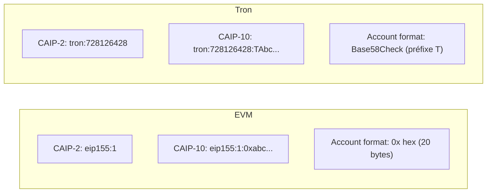

---

## 4. WalletConnect & Tron — Protocole officiel

### 4.1 Méthodes RPC Tron (Reown/WalletConnect)

Source : `docs.reown.com/advanced/multichain/rpc-reference/tron-rpc`

#### Méthodes requises

**`tron_signTransaction`** — Signe une transaction sans la broadcaster

```json
{
  "method": "tron_signTransaction",
  "params": {
    "address": "TKVDxNMaizfhFZEnPJGrgSCDp3GdLH4G6F",
    "transaction": {
      "txID": "abc123...",
      "raw_data": { ... },
      "raw_data_hex": "0a02..."
    }
  }
}
```

Réponse :

```json
{
  "txID": "abc123...",
  "signature": ["3045..."],
  "raw_data": { ... },
  "raw_data_hex": "0a02...",
  "visible": false
}
```

**`tron_signMessage`** — Signe un message personnel

```json
{
  "method": "tron_signMessage",
  "params": {
    "address": "TKVDxNMaizfhFZEnPJGrgSCDp3GdLH4G6F",
    "message": "Hello Tron"
  }
}
```

Réponse :

```json
{
  "signature": "0x..."
}
```

#### Méthodes optionnelles

**`tron_sendTransaction`** — Broadcast une transaction signée
**`tron_getBalance`** — Retourne le solde TRX en SUN (1 TRX = 1,000,000 SUN)

#### Session property importante

```json
{
  "sessionProperties": {
    "tron_method_version": "v1"
  }
}
```

> `v1` active la structure simplifiée de transaction (sans le nested `transaction.transaction` des implémentations legacy).

### 4.2 Format d'une session_proposal Tron (côté dApp)

```json
{
  "id": 1234567890,
  "params": {
    "id": 1234567890,
    "expiry": 1711980000,
    "relays": [{ "protocol": "irn" }],
    "proposer": {
      "publicKey": "abc...",
      "metadata": {
        "name": "SunSwap",
        "description": "Tron DEX",
        "url": "https://sun.io",
        "icons": ["https://sun.io/logo.png"]
      }
    },
    "requiredNamespaces": {
      "tron": {
        "chains": ["tron:728126428"],
        "methods": ["tron_signTransaction", "tron_signMessage"],
        "events": []
      }
    },
    "optionalNamespaces": {
      "tron": {
        "chains": ["tron:728126428", "tron:3448148188"],
        "methods": [
          "tron_signTransaction",
          "tron_signMessage",
          "tron_sendTransaction",
          "tron_getBalance"
        ],
        "events": []
      }
    }
  }
}
```

### 4.3 Format de la réponse wallet (session approval)

```json
{
  "topic": "abc...",
  "namespaces": {
    "tron": {
      "chains": ["tron:728126428"],
      "methods": ["tron_signTransaction", "tron_signMessage"],
      "events": [],
      "accounts": ["tron:728126428:TKVDxNMaizfhFZEnPJGrgSCDp3GdLH4G6F"]
    }
  },
  "sessionProperties": {
    "tron_method_version": "v1"
  }
}
```

### 4.4 Session multichain EVM + Tron (cas mixte)

```json
{
  "namespaces": {
    "eip155": {
      "chains": ["eip155:1", "eip155:137"],
      "methods": ["eth_sendTransaction", "personal_sign", "..."],
      "events": ["chainChanged", "accountsChanged"],
      "accounts": ["eip155:1:0xabc...", "eip155:137:0xabc..."]
    },
    "tron": {
      "chains": ["tron:728126428"],
      "methods": ["tron_signTransaction", "tron_signMessage"],
      "events": [],
      "accounts": ["tron:728126428:TKVDxNMaizfhFZEnPJGrgSCDp3GdLH4G6F"]
    }
  }
}
```

---

## 5. Écosystème MetaMask — connect-tron & multichain-api-client

### 5.1 Les deux voies d'intégration

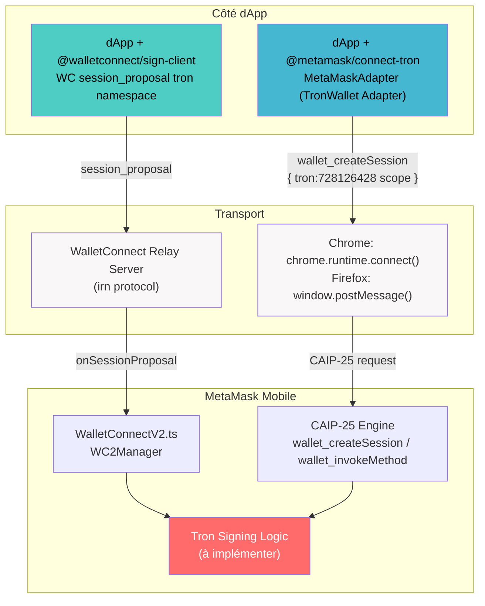

### 5.2 Architecture de connect-tron

**Package** : `@metamask/connect-tron` v0.3.1

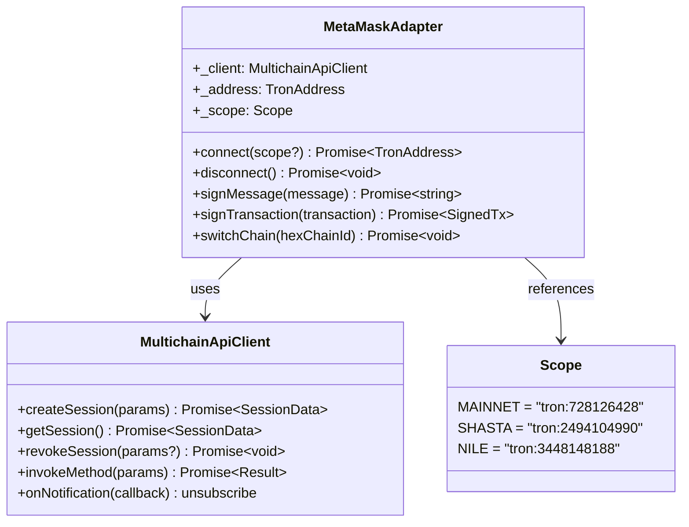

### 5.3 Flux wallet_invokeMethod pour Tron (voie B)

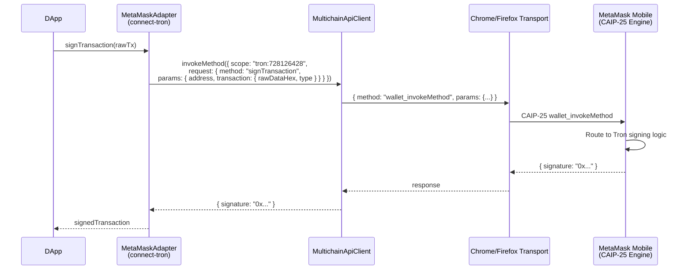

### 5.4 Paramètres de signing Tron (multichain-api-client)

Les types sont définis dans `src/types/scopes/tron.types.ts` :

```typescript
type TronAddress = `T${string}`; // Base58Check
type Base64Message = string;
type Signature = `0x${string}`;

// signTransaction
type SignTransactionParams = {
  address: TronAddress;
  transaction: {
    rawDataHex: string; // hex de raw_data_hex
    type: string; // e.g. "TransferContract"
  };
};

// signMessage
type SignMessageParams = {
  address: TronAddress;
  message: Base64Message; // message encodé en base64
};
```

> **Différence importante** : La voie WalletConnect (A) utilise les méthodes préfixées `tron_signTransaction`, `tron_signMessage`. La voie Multichain API (B) utilise `signTransaction`, `signMessage` sans préfixe (le namespace `tron:` est déjà dans le scope).

---

## 6. Top 5 des dApps Tron avec WalletConnect

Tron a un TVL total de **~$4.04 milliards** (DeFiLlama, mars 2026).

| #   | dApp                    | URL          | Catégorie        | TVL / Taille     | WC Support       | Notes                                                               |
| --- | ----------------------- | ------------ | ---------------- | ---------------- | ---------------- | ------------------------------------------------------------------- |
| 1   | **SunSwap / SUN.io**    | sun.io       | DEX + Yield      | ~$400M liquidity | Confirmé (WC v2) | Mentionne WalletConnect dans son UI wallet modal                    |
| 2   | **JustLend**            | justlend.org | Lending          | **$3.3B TVL**    | Probable (WC v2) | Plus grand protocole DeFi Tron, intègre TronLink + wallets externes |
| 3   | **JUST Stables**        | just.network | CDP / Stablecoin | $2.29B TVL       | Probable         | USDJ stablecoin, protocole JUST de la fondation Tron                |
| 4   | **Klever Exchange**     | klever.io    | DEX + Wallet     | ~$100M vol/j     | Confirmé (WC v2) | Klever Wallet supporte WC, DEX Tron actif                           |
| 5   | **HTX DeFi (ex-Huobi)** | htx.com      | CEX + DeFi       | $5.5B TVL total  | Probable         | HTX Eco Chain + Tron, WC pour connexion wallet                      |

> **Note** : La vérification directe via WebFetch a été limitée par les blocages 403/404. Les informations ci-dessus combinent les données DeFiLlama (TVL), la documentation Reown, et les connaissances publiques sur ces protocoles.

### 6.1 Patterns communs d'intégration WalletConnect côté dApp Tron

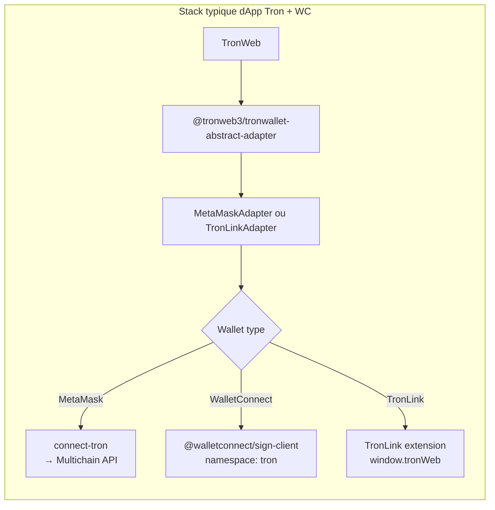

**Méthodes WalletConnect les plus demandées par les dApps Tron :**

1. `tron_signTransaction` — universellement requis (toutes transactions DeFi)
2. `tron_signMessage` — authentification, signatures EIP-712 équivalentes
3. `tron_sendTransaction` — optionnel (certains dApps préfèrent que le wallet broadcast)
4. `tron_getBalance` — souvent géré via API Tron directement plutôt que WC

**Session property systématiquement incluse** : `tron_method_version: v1`

---

## 7. Analyse des écarts — Ce qui doit changer

### 7.1 Vue d'ensemble des changements requis

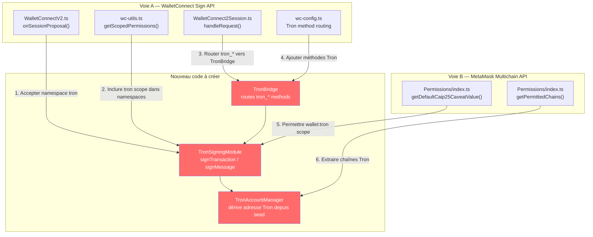

### 7.2 Détail des modifications par fichier

#### `app/core/WalletConnect/WalletConnectV2.ts`

**Problème** : `onSessionProposal()` ne traite que `eip155`, ignore `tron`

**Changements** :

```
1. Détecter la présence du namespace "tron" dans requiredNamespaces/optionalNamespaces
2. Si tron présent : récupérer le compte Tron actif (via MultichainNetworkController)
3. Construire le namespace tron dans la réponse d'approbation :
   { tron: { chains, methods, events: [], accounts: ["tron:728126428:TAddress..."] } }
4. Gérer sessionProperties { tron_method_version: "v1" } dans approveSession
```

#### `app/core/WalletConnect/wc-utils.ts`

**Problème** : `getScopedPermissions()` ne retourne que `eip155`

**Changements** :

```
1. Appeler getNonEvmAccountAddresses() pour récupérer les comptes Tron
2. Si comptes Tron disponibles, construire le scope tron :
   {
     chains: ["tron:728126428"],
     methods: TRON_METHODS,
     events: [],
     accounts: ["tron:728126428:TAddress..."]
   }
3. Merger avec le scope eip155 existant
```

#### `app/core/WalletConnect/WalletConnect2Session.ts`

**Problème** : `handleRequest()` assume `eip155:` format pour tous les chainId

**Changements** :

```
1. Parser le namespace depuis request.params.chainId (avant le ":")
2. Si namespace === "tron" : router vers TronRequestHandler (nouveau module)
3. TronRequestHandler gère :
   - tron_signTransaction → appel Tron signing
   - tron_signMessage → appel Tron message signing
   - tron_sendTransaction → broadcast via TronWeb
   - tron_getBalance → requête balance
4. Adapter updateSession() pour inclure le namespace tron si actif
```

#### `app/core/WalletConnect/wc-config.ts`

**Changements** :

```typescript
// Ajouter méthodes Tron qui nécessitent redirect vers l'app
export const TRON_SIGNING_METHODS = [
  'tron_signTransaction',
  'tron_signMessage',
  'tron_sendTransaction',
];
```

#### `app/core/Permissions/index.ts`

**Changements** :

```
1. getDefaultCaip25CaveatValue() : ne pas bloquer les scopes tron si présents
2. getPermittedChains() : étendre pour extraire aussi les chaînes Tron depuis le caveat
   (actuellement appelle seulement getPermittedEthChainIds())
```

#### Nouveau module à créer

```
app/core/Tron/
├── TronSigningModule.ts     # signTransaction, signMessage avec clé privée Tron
├── TronAccountManager.ts    # dérivation adresse Tron depuis seed MetaMask
├── TronRequestHandler.ts    # router les requêtes WC tron_* methods
└── tron-utils.ts            # conversions hex↔CAIP, validation adresse
```

### 7.3 Flux cible après implémentation

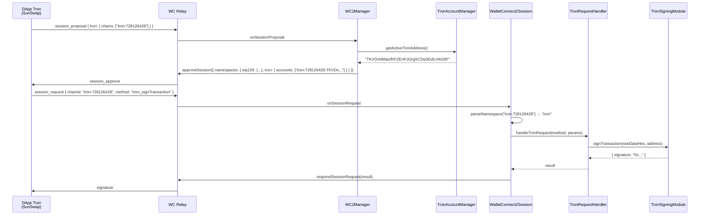

---

## 8. Roadmap d'implémentation

### Phase 1 — Foundation (Prerequis)

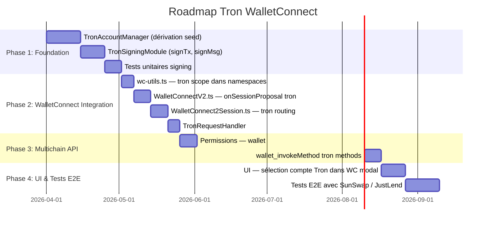

### Ordre de priorité des tâches

| Priorité | Tâche                                                                      | Fichier(s) | Effort |
| -------- | -------------------------------------------------------------------------- | ---------- | ------ |
| P0       | `TronAccountManager` — dérivation adresse Tron depuis seed MetaMask        | nouveau    | M      |
| P0       | `TronSigningModule` — signature transaction/message                        | nouveau    | L      |
| P1       | `WalletConnectV2.ts` — accepter namespace tron dans `onSessionProposal`    | existant   | M      |
| P1       | `wc-utils.ts` — `getScopedPermissions()` inclure scope tron                | existant   | S      |
| P1       | `WalletConnect2Session.ts` — router `tron_*` vers `TronRequestHandler`     | existant   | M      |
| P2       | `TronRequestHandler` — dispatch `tron_signTransaction`, `tron_signMessage` | nouveau    | M      |
| P2       | `Permissions/index.ts` — `getPermittedChains()` inclure Tron               | existant   | S      |
| P3       | `wallet_invokeMethod` Tron dans le CAIP-25 Engine (voie B)                 | existant   | L      |
| P4       | UI WalletConnect modal — afficher compte Tron                              | existant   | M      |

### Points d'attention critiques

1. **Dérivation de clé Tron** : Tron utilise le même algorithme ECDSA secp256k1 qu'Ethereum mais avec une adresse en Base58Check (préfixe `T`). La clé privée est identique — seul le format d'adresse diffère. Ceci simplifie la dérivation depuis le seed MetaMask existant.

2. **TronWeb dependency** : Il faudra évaluer si on intègre `tronweb` (heavy, ~2MB) ou si on implémente le minimum en utilisant directement `viem`/`noble-secp256k1` + la logique Base58Check Tron.

3. **Warmup retry** : Le `multichain-api-client` inclut déjà un workaround pour l'issue MetaMask Mobile #16550 (`wallet_getSession` ne répond pas au chargement de page). Ce bug doit être résolu avant ou en parallèle.

4. **Session property `tron_method_version: v1`** : À envoyer systématiquement dans la réponse d'approbation pour éviter le format legacy `transaction.transaction` des dApps anciennes.

5. **Accounts UI** : MetaMask n'affiche pas actuellement de compte "Tron" dans son UI. La dérivation doit s'appuyer sur le compte EVM actif (même seed, même index HD) pour éviter la confusion UX.

---

## Références

- `app/core/WalletConnect/WalletConnectV2.ts` — Manager WC2
- `app/core/WalletConnect/WalletConnect2Session.ts` — Session handler
- `app/core/WalletConnect/wc-utils.ts:255` — `getScopedPermissions()`
- `app/core/Permissions/index.ts:302` — `getDefaultCaip25CaveatValue()`
- `app/core/Permissions/index.ts:632` — `getPermittedChains()`
- [`@metamask/connect-tron`](https://github.com/MetaMask/connect-tron) v0.3.1
- [`@metamask/multichain-api-client`](https://github.com/MetaMask/multichain-api-client) v0.11.0
- [Reown Tron RPC Reference](https://docs.reown.com/advanced/multichain/rpc-reference/tron-rpc)
- [CAIP-2 Specification](https://standards.chainagnostic.org/CAIPs/caip-2)
- MetaMask Mobile issue [#16550](https://github.com/MetaMask/metamask-mobile/issues/16550) — multichain API warmup bug
