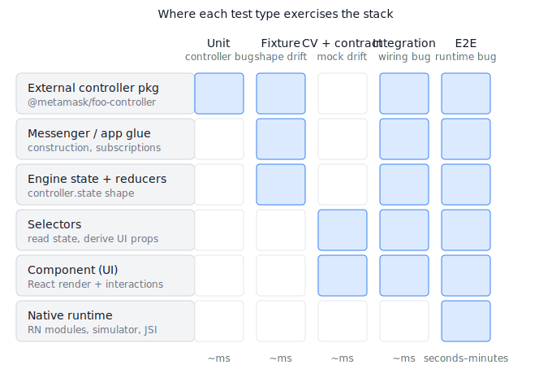

# PoC: Controller-Contract Testing

A working demo of three layers that catch controller/component integration
bugs in jest, instead of pushing them out to e2e.

## Strategy at a glance



The architecture stack runs top-to-bottom on the left: external controller
package → messenger / app glue → engine state → selectors → component →
native runtime. Each test type on the right exercises a vertical slice of
that stack. A blue cell means "this test type runs real code at this
layer"; an empty cell means "mocked or out of scope."

The three new layers introduced by this PoC — fixture verification,
CV + contract, and integration — collectively cover everything except the
native runtime, in milliseconds. The e2e column is the only one that
pays the device/simulator/network cost, and it shrinks to "things that
genuinely need a device" (native modules, real Reanimated, real keychain).

## Why this complements CV tests rather than replacing them

This pattern is designed to **sit alongside** existing component-view tests,
not displace them. Each layer addresses something CV tests can't.

- **CV tests own UI behaviour under arbitrary state.** Reaching "loading=true
  with 3 cached widgets and a stale sync timestamp" takes 4 lines as a
  state literal; producing it via real action sequences takes pages of
  setup. CV tests give you cheap, isolated coverage of every visual
  variant — empty, loading, populated, error, partial. Integration tests
  can't substitute for that economically.
- **Failure isolation.** When a CV test fails, the bug is in the component
  or its selector. When an integration test fails, the bug could be
  anywhere in the controller → messenger → reducer → selector → render
  chain. Keeping CV tests preserves a sharp bisect for UI regressions.
- **CV tests today silently consume stale shapes.** The contract layer
  fixes the one real failure mode of CV tests — that mocks drift from
  reality. After this PoC ships, CV tests are *more* reliable, not less
  necessary.
- **Integration tests catch what CV tests structurally cannot:**
  transition bugs (loading flag flips in the wrong order), cycle bugs
  (button click → action → state change → re-render), and inter-controller
  interactions. CV-with-fixture covers static state; integration covers
  dynamic flow.
- **The fixture is the bridge.** A single committed JSON file is consumed
  by both the controller's own test (which produces it) and every
  downstream CV test. That shared artifact is what stops the controller
  team and the UI team from drifting against each other in the first
  place.

The pragmatic split: fixture + contract on top of every existing CV test
(cheap, 60–70% of the value), integration tests added selectively on the
high-risk surfaces where e2e currently catches bugs, CV tests untouched
elsewhere for everything UI-only.

## Run it

```bash
cd poc/controller-contract-testing
../../node_modules/.bin/jest --config jest.config.js
```

7 tests pass across 3 suites. To regenerate fixtures after an intentional
controller change: `UPDATE_FIXTURES=1 npm test`.

## What's in here

```
src/
  WidgetController.ts        Real BaseController, has state + one async action + I/O dep
  widgetSelectors.ts         Selectors UI consumes
test/
  WidgetController.test.ts   Layer 1: behaviour + fixture verification (THE source of truth)
  widgetStateContract.ts     Layer 2: runtime contract + mockWidgetState() helper
  widgetView.view.test.ts            The "after" CV test — fixture + contract checked
  widgetView.integration.test.ts     Layer 3: real controller, mocked I/O
  __fixtures__/twoWidgetsAdded.json  Committed fixture (single source of truth)
```

## What each layer catches

| Bug class                                         | Caught by                               | Speed |
|---------------------------------------------------|-----------------------------------------|-------|
| Controller logic bug (e.g. forgot to set field)   | Controller unit test                    | ms    |
| Controller emits a different shape than before    | Fixture-verification test               | ms    |
| Component-test mock drifted from real shape       | `mockWidgetState()` contract check      | ms    |
| Bug only appears when controller + selector + UI run together | Integration test (real ctrl, mocked I/O) | ms |
| Native module / device / RN runtime issue         | e2e (still needed, but for less)        | s–min |

## Drift demo (already verified)

Comment out `priceCents: Math.round(fetched.price * 100)` in
`src/WidgetController.ts` and run the suite. Three tests fail, in the order
you'd want them:

1. `WidgetController — behaviour > adds a widget and derives priceCents from price`
   — the cheapest signal, controller-level.
2. `WidgetController — fixtures > emits the documented state for "two widgets added"`
   — tells you the contract changed; every downstream component test is
   now operating against stale assumptions.
3. `WidgetSummary integration > updates the total when a widget is added`
   — `selectWidgetTotalCents` returns `NaN`. This is the e2e-class bug,
   caught in jest in milliseconds.

Restore the line; all 7 tests pass.

---

## How to apply this to a real mobile controller

Pick CardController as a worked example (similarly applies to RewardsController,
PerpsController, etc.). Files are in `app/core/Engine/controllers/card-controller/`.

### Layer 1 — Shared fixtures

In `CardController.test.ts`, add a `describe("fixtures")` block that, after
running a representative scenario (e.g. "user authenticated, two cards
loaded"), serializes `controller.state` to
`app/core/Engine/controllers/card-controller/__fixtures__/twoCardsLoaded.json`
using the same `UPDATE_FIXTURES` pattern as the PoC. Commit those JSON files.

In existing card-related component tests
(`app/components/UI/Card/Views/CardHome/CardHome.test.tsx` and friends),
replace ad-hoc state literals like

```ts
{ engine: { backgroundState: { CardController: { ...handRolled } } } }
```

with a fixture loader:

```ts
import twoCardsLoaded from '../../../../core/Engine/controllers/card-controller/__fixtures__/twoCardsLoaded.json';

renderWithProvider(<CardHome />, {
  state: { engine: { backgroundState: { CardController: twoCardsLoaded } } },
});
```

### Layer 2 — Contract in `renderWithProvider`

Add a contract module next to each controller, e.g.
`app/core/Engine/controllers/card-controller/state-contract.ts`, exporting
an `assertCardControllerState` function. Either hand-roll it (~30 lines per
controller, as in this PoC) or adopt `zod` and derive it from the real
state type.

Then patch `app/util/test/renderWithProvider.tsx` so that, in test mode,
each known controller slice in `providerValues.state.engine.backgroundState`
is run through its `assert*State` function before the store is built. A
mock with the wrong shape fails on render, not on first selector hit.

### Layer 3 — Integration tests

A new convention: `*.integration.test.ts` colocated with each controller,
or under `app/core/Engine/integration/`. Pattern:

```ts
const messenger = new Messenger({ namespace: 'CardController' });
const controller = new CardController({
  messenger,
  cardSdk: mockCardSdk,        // mock only the SDK / network boundary
  storage: mockStorage,
});

await controller.authenticate(...);

const view = renderWithProvider(<CardHome />, {
  state: { engine: { backgroundState: { CardController: controller.state } } },
});
expect(view.getByText('Authenticated')).toBeTruthy();
```

These are still jest tests — no Detox, no simulator — but the controller's
real reducer / actions / state transitions all run. A bug like the perps
one your e2e found would fail here in ~50ms.

## Effort estimate to roll out across mobile

| Layer | Per-controller cost | Per-component-test cost | Notes |
|-------|--------------------:|------------------------:|-------|
| 1: fixtures | ~30 min (one fixture-gen test, 2-3 scenarios) | ~5 min (swap literal for import) | Fixtures are committed JSON, reviewed in PRs |
| 2: contract | ~1-2 h (write `assert*State` once, plus `renderWithProvider` patch — done once for whole repo) | 0 (transparent) | Or ~half the time with zod/io-ts |
| 3: integration | ~2-4 h per controller for first 3 scenarios, ~1 h per scenario after | n/a | Highest-leverage: targets the bugs e2e currently owns |

Suggested rollout: pilot on one controller (Card or Rewards) end-to-end,
measure how many bugs the integration tests catch over a sprint, then
prioritise the rest by how often e2e catches integration bugs there today.
