# Web3Auth Onboarding Analytics Inventory (Sorted By Screen)

Source scope: `@MetaMask/web3auth` CODEOWNERS onboarding/auth paths plus `app/components/UI/OptinMetrics`.

Total unique events: **64**
Total screens/files: **16**

## Onboarding Screenshots

### `app/components/Views/Onboarding`

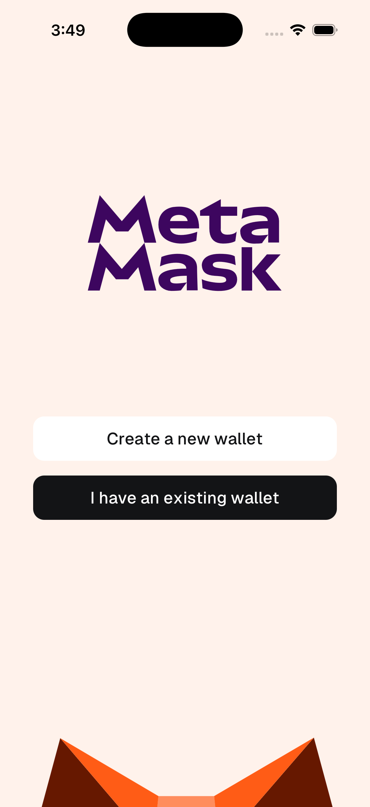

Events sent by this screen:

| event_name | occurrence_count | line_refs | scenario |
| --- | ---: | --- | --- |
| METRICS_OPT_IN | 1 | `739` | On social login CTA press (`Continue with Google/Apple`) when OAuth flow starts and metrics are enabled. |
| SOCIAL_LOGIN_COMPLETED | 1 | `461` | After OAuth login succeeds (`handlePostSocialLogin`). |
| WALLET_GOOGLE_IOS_ERROR_VIEWED | 1 | `780` | During social login flow when iOS Google login unsupported blocking sheet is shown. |
| WALLET_GOOGLE_IOS_WARNING_VIEWED | 1 | `787` | During social login flow when iOS Google login warning sheet is shown. |
| WALLET_IMPORT_STARTED | 2 | `424, 760` | On import flow start: `I have an existing wallet` press (`424`) and social-login import path start (`760`). |
| WALLET_SETUP_STARTED | 2 | `377, 756` | On create flow start: `Create a new wallet` press (`377`) and social-login create path start (`756`). |

### `app/components/Views/ImportFromSecretRecoveryPhrase`

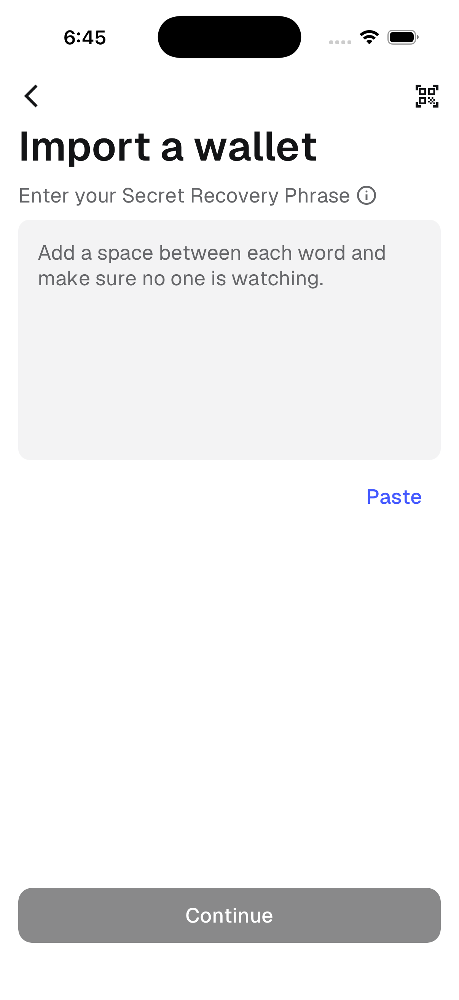

Events sent by this screen:

| event_name | line_refs | scenario |
| --- | --- | --- |
| WALLET_IMPORT_ATTEMPTED | `401` | On `Continue` press to import SRP (before validations/import). |
| WALLET_IMPORTED | `460` | After SRP import succeeds. |
| WALLET_SETUP_COMPLETED | `463` | After import flow completes successfully. |
| WALLET_SETUP_FAILURE | `416, 498` | On validation/import failure paths. |

### `app/components/Views/ChoosePassword`

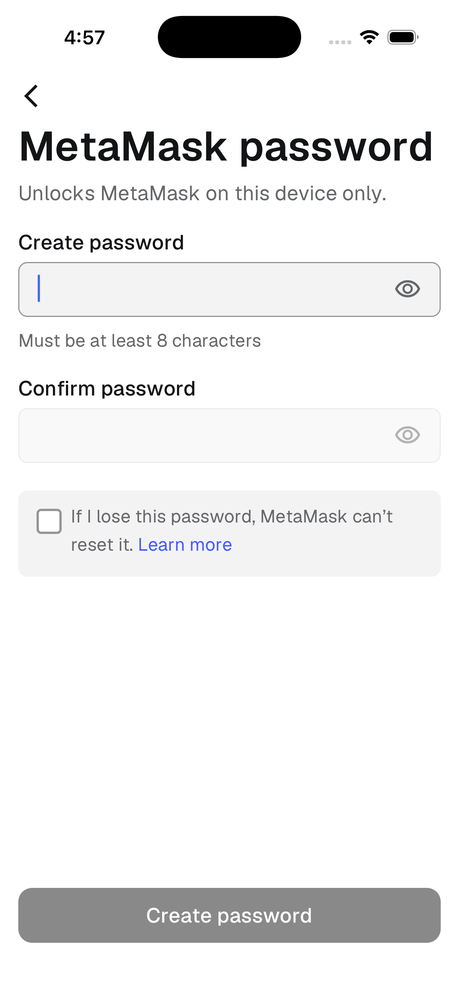

Events sent by this screen:

| event_name | line_refs | scenario |
| --- | --- | --- |
| WALLET_CREATION_ATTEMPTED | `450` | On `Create password` button press (before wallet creation attempt). |
| WALLET_CREATED | `484` | After wallet creation succeeds. |
| WALLET_SETUP_COMPLETED | `488` | After create-wallet flow completes successfully. |
| WALLET_SETUP_FAILURE | `399` | On wallet creation failure path. |
| ANALYTICS_PREFERENCE_SELECTED | `330` | In social-login create flow after success, when marketing consent analytics are recorded. |
| EXTERNAL_LINK_CLICKED | `519` | On `Learn more` link press. |

### `app/components/Views/AccountBackupStep1`

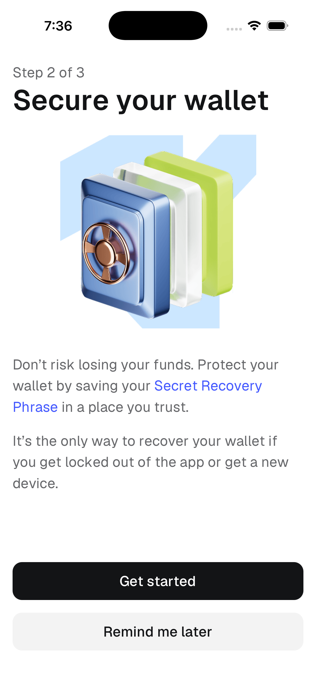

Events sent by this screen:

| event_name | line_refs | scenario |
| --- | --- | --- |
| WALLET_SECURITY_STARTED | `75` | On `Get started` button press (continue to `ManualBackupStep1`). |
| WALLET_SECURITY_SKIP_INITIATED | `123` | On `Remind me later` press (opens skip-security confirmation modal). |
| WALLET_SECURITY_SKIP_CANCELED | `118` | In skip-security confirmation modal when user cancels and proceeds with backup flow. |
| WALLET_SECURITY_SKIP_CONFIRMED | `79` | In skip-security confirmation modal when user confirms skip. |
| SRP_DEFINITION_CLICKED | `127` | On `Secret Recovery Phrase` link press. |

### `app/components/Views/AccountBackupStep1B`

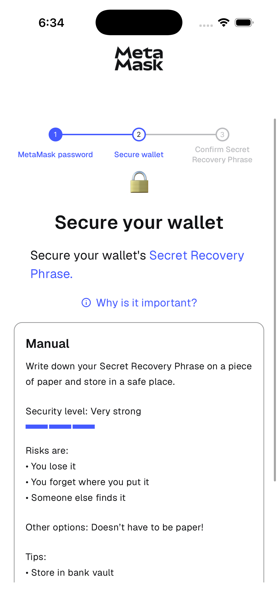

Events sent by this screen:

| event_name | line_refs | scenario |
| --- | --- | --- |
| WALLET_SECURITY_MANUAL_BACKUP_INITIATED | `112` | On selecting manual backup option to continue into SRP backup steps. |
| SRP_DEFINITION_CLICKED | `132` | On `Why is it important?` link press. |

### `app/components/Views/ManualBackupStep1`

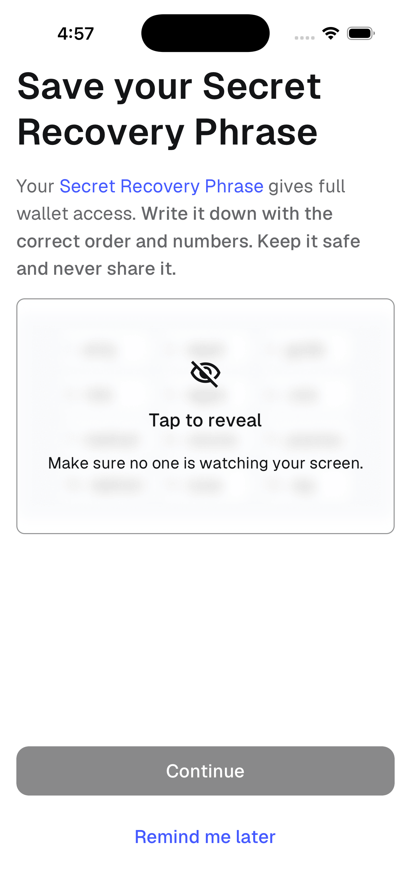 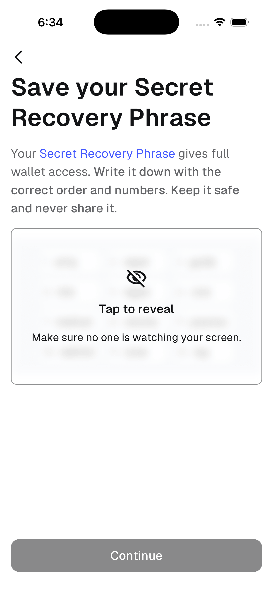

Events sent by this screen:

| event_name | line_refs | scenario |
| --- | --- | --- |
| WALLET_SECURITY_PHRASE_REVEALED | `255` | On `Tap to reveal` press for Secret Recovery Phrase. |
| WALLET_SECURITY_SKIP_INITIATED | `248` | On `Remind me later` press (skip backup initiation). |

### `app/components/UI/OptinMetrics/index.tsx`

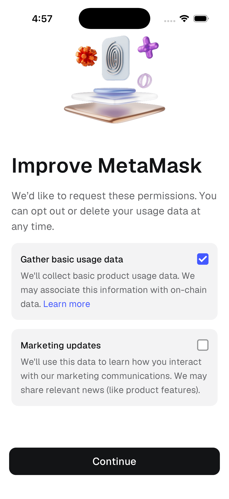

Events sent by this screen (on `Continue` press):

| event_name | line_refs | scenario |
| --- | --- | --- |
| METRICS_OPT_IN | `176` | Fired when user keeps basic usage data enabled. |
| METRICS_OPT_OUT | `177` | Fired when user disables basic usage data. |
| ANALYTICS_PREFERENCE_SELECTED | `189` | Fired when preference selection is confirmed (includes marketing consent + opt-in state). |

### `app/components/Views/ManualBackupStep3`

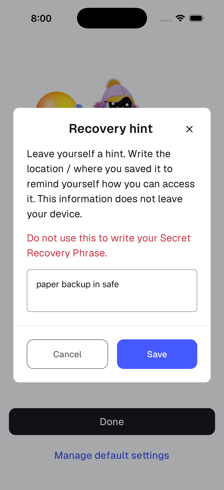

Remarks:

- This screen renders `OnboardingSuccessComponent` (visually the same success UI as onboarding success).
- In current production onboarding flow, this route appears unreachable (no active navigation path into `ManualBackupStep3`).
- Cleanup candidate: remove or refactor this legacy screen/event path if product confirms it is deprecated.

| event_name | line_refs | scenario |
| --- | --- | --- |
| WALLET_SECURITY_RECOVERY_HINT_SAVED | `105` | Fires when saving a manual backup hint from this legacy screen path. |

### `app/components/Views/OnboardingSuccess`

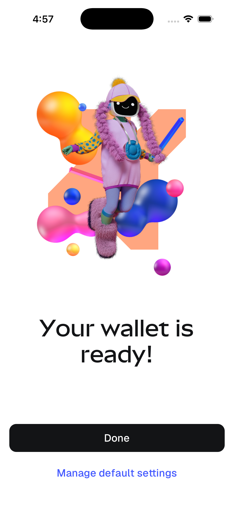 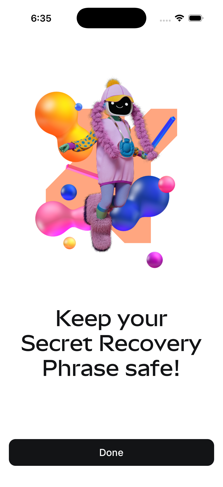

Event note:

- No direct `MetaMetricsEvents.*` tracked in `OnboardingSuccess/index.tsx` itself.
- `SETTINGS_UPDATED` events under the `OnboardingSuccess` folder are emitted in `OnboardingGeneralSettings/index.tsx` when user updates default settings.

### `app/components/Views/OnboardingSuccess/DefaultSettings` flow

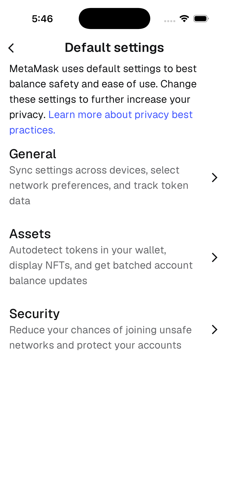 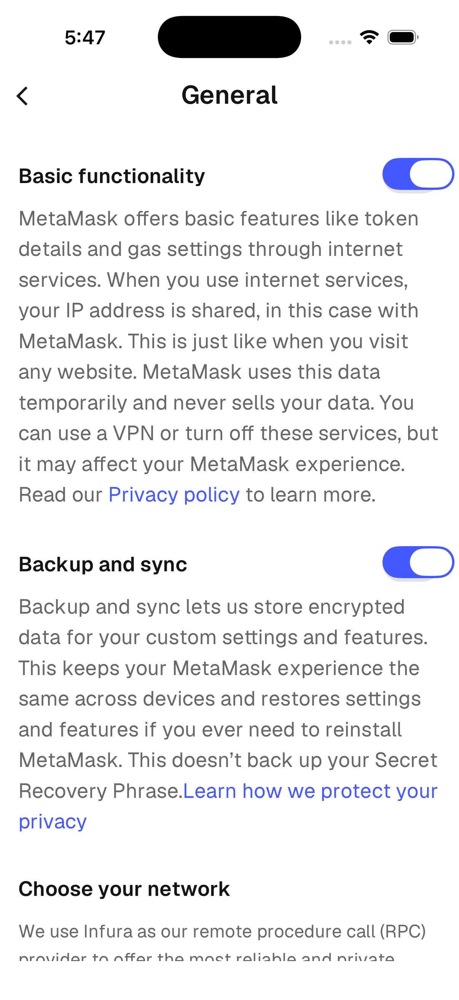 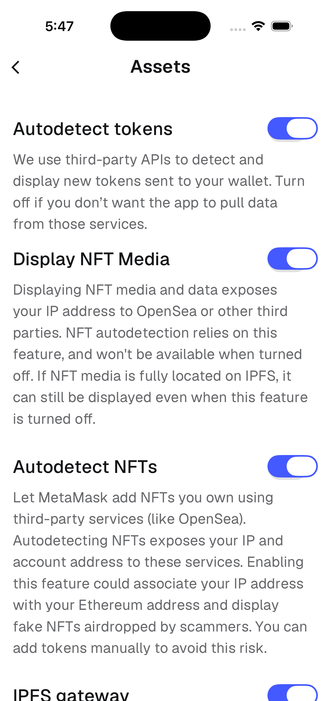 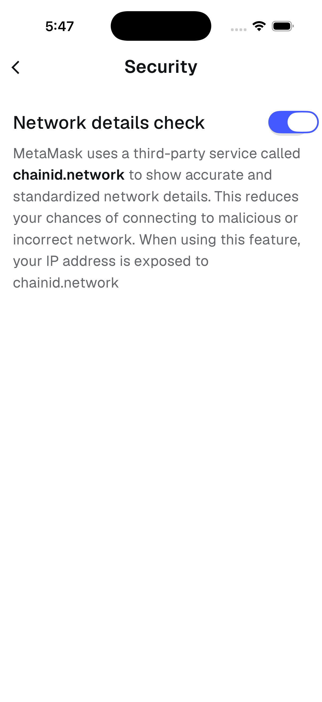

Events for this flow:

| event_name | line_refs | scenario |
| --- | --- | --- |
| SETTINGS_UPDATED | `OnboardingGeneralSettings/index.tsx:33` | On `Basic functionality` toggle interaction. |
| SETTINGS_UPDATED | `OnboardingGeneralSettings/index.tsx:47` | On `Backup and sync` toggle interaction. |

Notes:

- `DefaultSettings/index.tsx`, `OnboardingAssetsSettings/index.tsx`, and `OnboardingSecuritySettings/index.tsx` do not emit `MetaMetricsEvents.*` directly in those files.
- Child settings components inside Assets/Security may emit their own analytics when toggles are changed.

### `app/components/Views/OnboardingSheet`

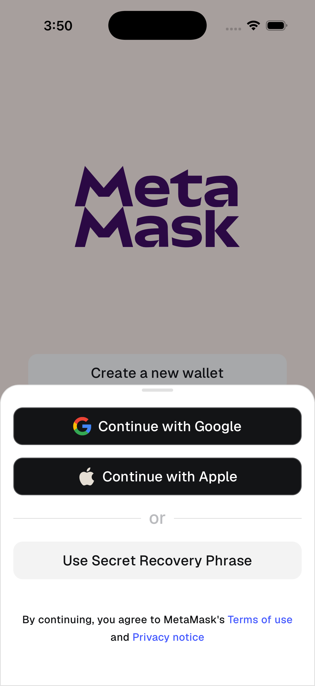

Events for this UI are emitted via `app/components/Views/Onboarding/index.tsx` handlers:

| event_name | line_refs | scenario |
| --- | --- | --- |
| METRICS_OPT_IN | `739` | On `Continue with Google/Apple` button press from the sheet (OAuth flow start). |
| WALLET_SETUP_STARTED | `756` | On `Continue with Google/Apple` for create-wallet path. |
| WALLET_IMPORT_STARTED | `760` | On `Continue with Google/Apple` for import-wallet path. |
| SOCIAL_LOGIN_COMPLETED | `461` | After OAuth login success initiated from this sheet flow. |
| WALLET_GOOGLE_IOS_ERROR_VIEWED | `780` | When unsupported iOS Google blocking modal is shown from sheet-triggered flow. |
| WALLET_GOOGLE_IOS_WARNING_VIEWED | `787` | When unsupported iOS Google warning modal is shown from sheet-triggered flow. |

### `app/components/Views/SocialLoginIosUser`

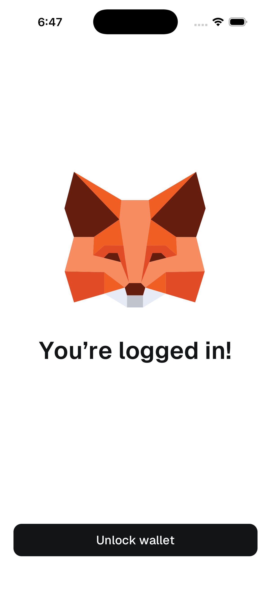

Events sent by this screen:

| event_name | line_refs | scenario |
| --- | --- | --- |
| SOCIAL_LOGIN_IOS_SUCCESS_VIEWED | `55` | On screen load (`useEffect` mount). |
| SOCIAL_LOGIN_IOS_SUCCESS_CTA_CLICKED | `67` | On primary CTA press (new-user path -> `ChoosePassword`). |
| SOCIAL_LOGIN_IOS_SUCCESS_CTA_CLICKED | `87` | On primary CTA press (existing-user path -> `OnboardingOAuthRehydrate`). |

### `app/components/Views/AccountStatus` (Wallet Already Exists path)

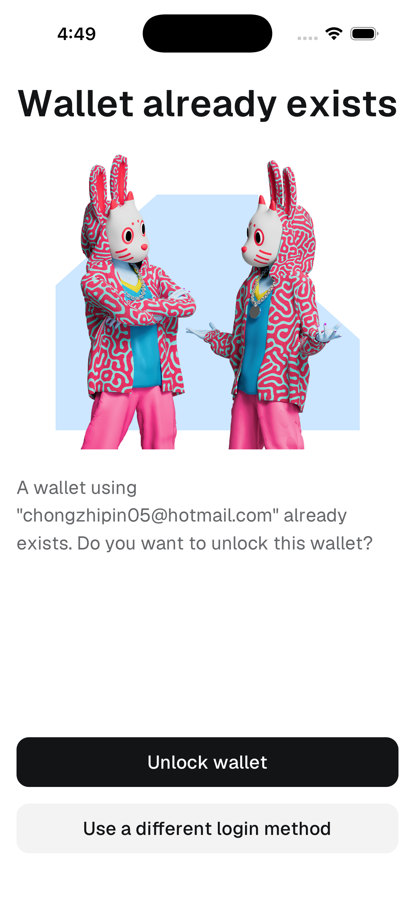

Events sent by this screen:

| event_name | line_refs | scenario |
| --- | --- | --- |
| ACCOUNT_ALREADY_EXISTS_PAGE_VIEWED | `129` | On screen load when `type === found` (`Wallet already exists`). |
| WALLET_IMPORT_STARTED | `167` | On `Unlock wallet` button press (existing account import path). |
| WALLET_SETUP_STARTED | `168` | On primary CTA press only when `type !== found` (account-not-found variant, not this screenshot). |

### `app/components/Views/OAuthRehydration`

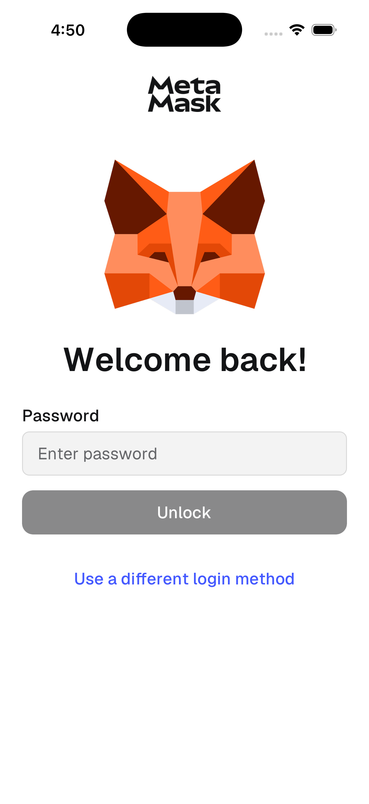 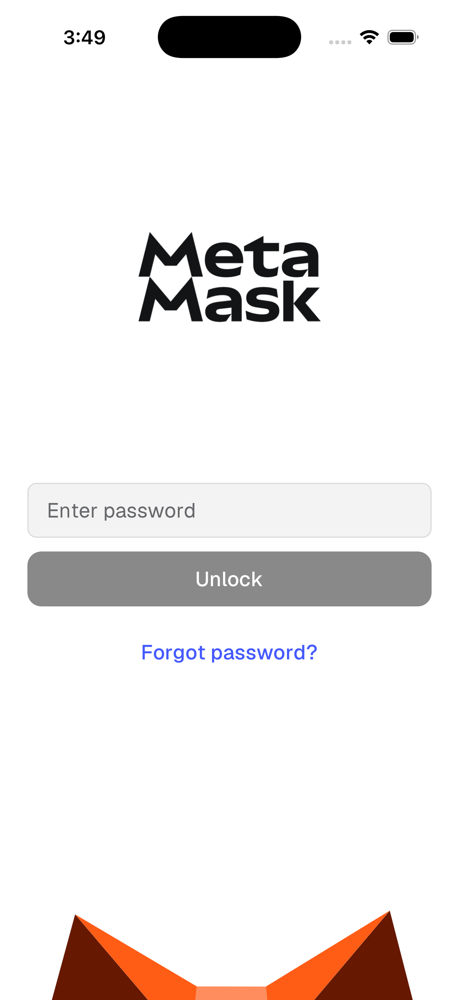 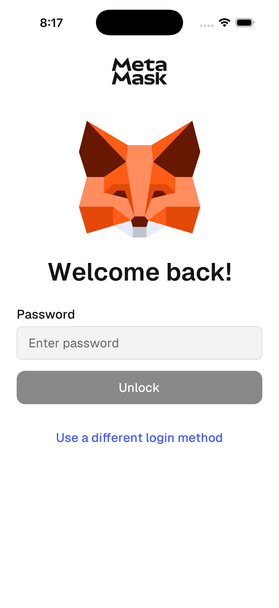 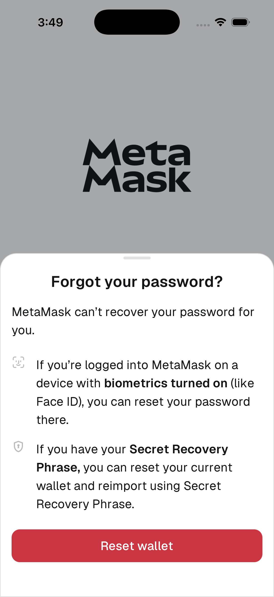 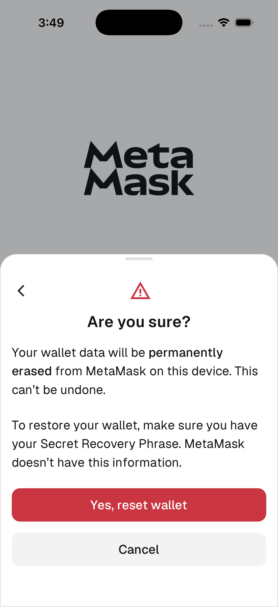

Events sent by this screen:

| event_name | occurrence_count | line_refs | scenario |
| --- | ---: | --- | --- |
| ANALYTICS_PREFERENCE_SELECTED | 1 | `199` | After successful unlock, when marketing opt-in status is synced (`syncMarketingOptInAfterUnlock`). |
| FORGOT_PASSWORD_CLICKED | 1 | `737` | On `Forgot password?` press. |
| LOGIN_DOWNLOAD_LOGS | 1 | `711` | On download logs action press. |
| LOGIN_SCREEN_VIEWED | 1 | `681` | On screen load (`useEffect` mount). |
| REHYDRATION_COMPLETED | 1 | `580` | After successful rehydration login flow completion. |
| REHYDRATION_PASSWORD_ATTEMPTED | 1 | `539` | On login/unlock submit press (`onRehydrateLogin`). |
| REHYDRATION_PASSWORD_FAILED | 6 | `338, 355, 376, 410, 484, 515` | On failed rehydration login attempts (wrong password, too many attempts, passcode not set, unknown errors). |
| USE_DIFFERENT_LOGIN_METHOD_CLICKED | 1 | `702` | On `Use different login method` press. |

## `app/components/Views/ImportNewSecretRecoveryPhrase`

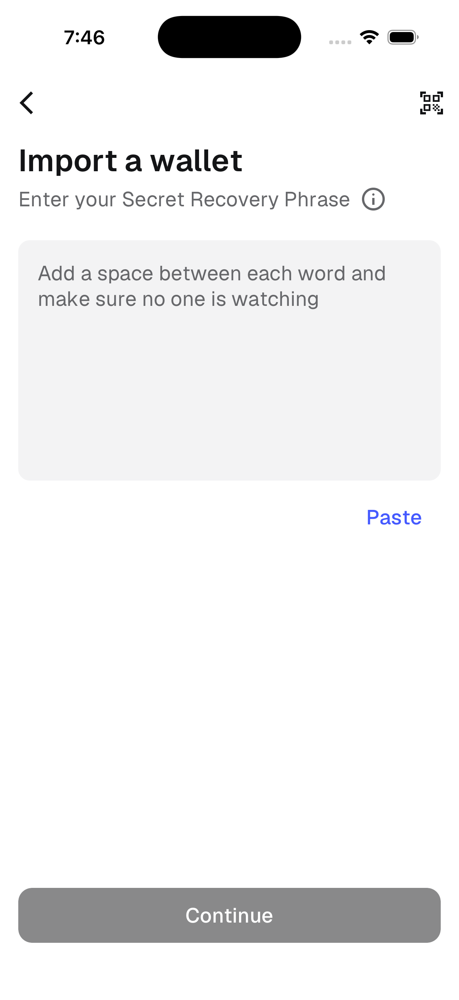

| event_name | line_refs | scenario |
| --- | --- | --- |
| IMPORT_SECRET_RECOVERY_PHRASE_COMPLETED | `145` | After successful SRP import completion from this screen. |

## `app/components/Views/ManualBackupStep2`

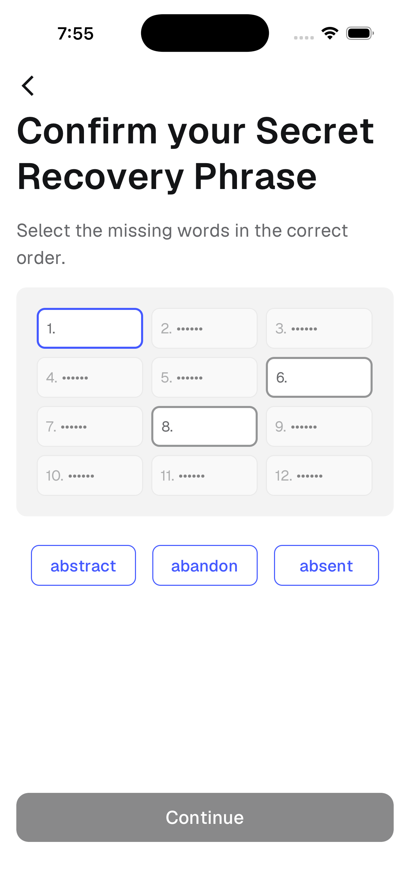

| event_name | line_refs | scenario |
| --- | --- | --- |
| WALLET_SECURITY_PHRASE_CONFIRMED | `159` | On `Continue` press after all missing words are placed correctly. |
| WALLET_SECURITY_COMPLETED | `419` | After successful SRP confirmation flow completion. |

## `app/components/Views/RestoreWallet`

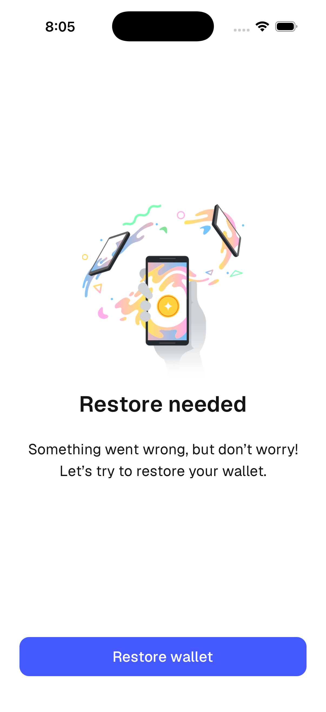

| event_name | occurrence_count | line_refs |
| --- | ---: | --- |
| VAULT_CORRUPTION_RESTORE_WALLET_BUTTON_PRESSED | 1 | `77` |
| VAULT_CORRUPTION_RESTORE_WALLET_SCREEN_VIEWED | 1 | `65` |
| VAULT_CORRUPTION_WALLET_RESET_NEEDED_CREATE_NEW_WALLET_BUTTON_PRESSED | 1 | `49` |
| VAULT_CORRUPTION_WALLET_RESET_NEEDED_SCREEN_VIEWED | 1 | `39` |
| VAULT_CORRUPTION_WALLET_RESET_NEEDED_TRY_AGAIN_BUTTON_PRESSED | 1 | `62` |
| VAULT_CORRUPTION_WALLET_SUCCESSFULLY_RESTORED_CONTINUE_BUTTON_PRESSED | 1 | `70` |
| VAULT_CORRUPTION_WALLET_SUCCESSFULLY_RESTORED_SCREEN_VIEWED | 1 | `45` |

## `app/components/Views/RevealPrivateCredential`

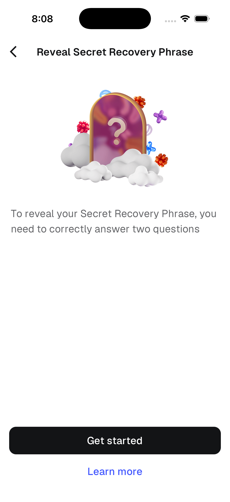 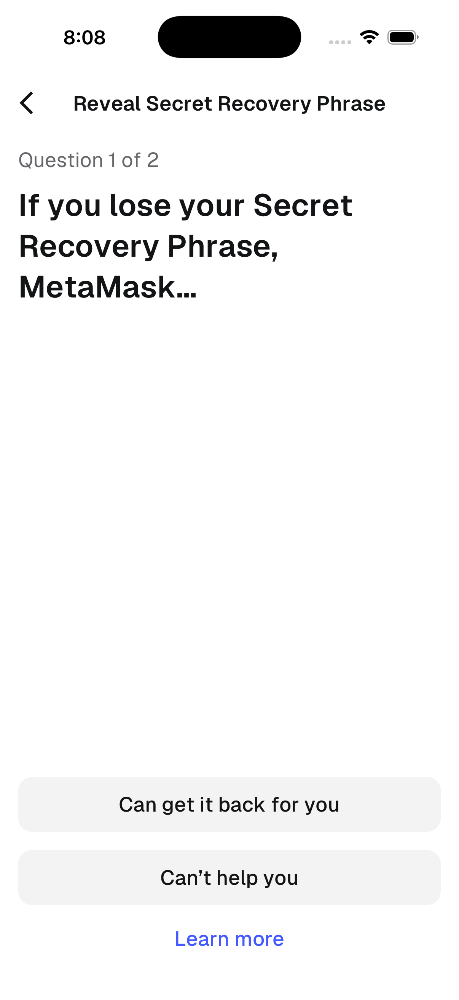 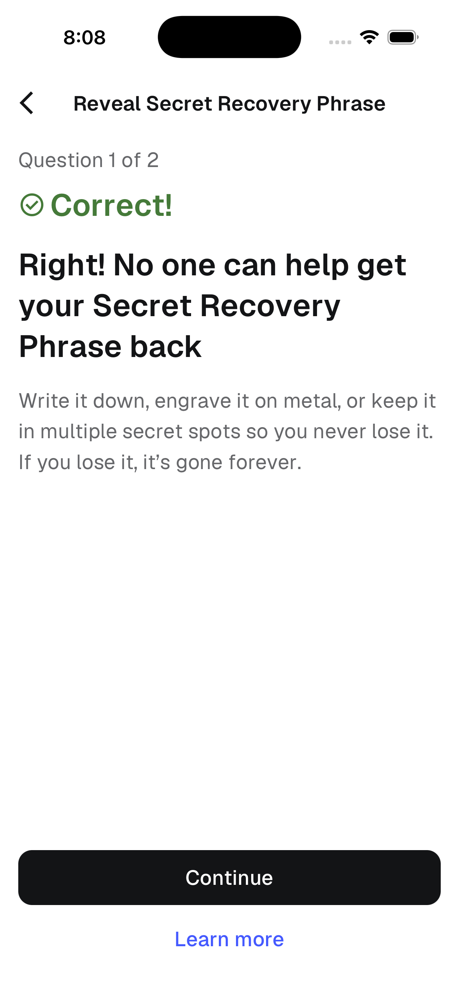 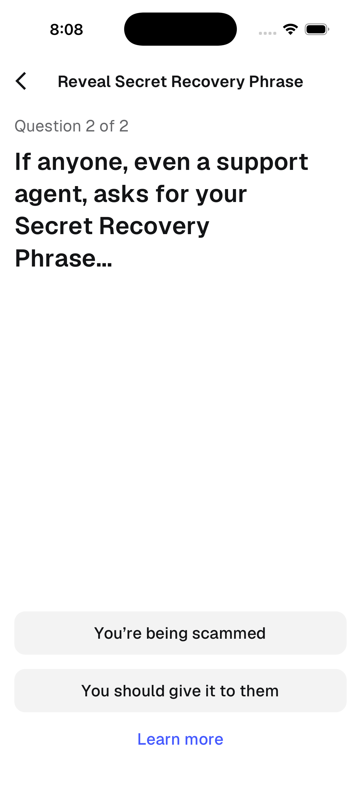 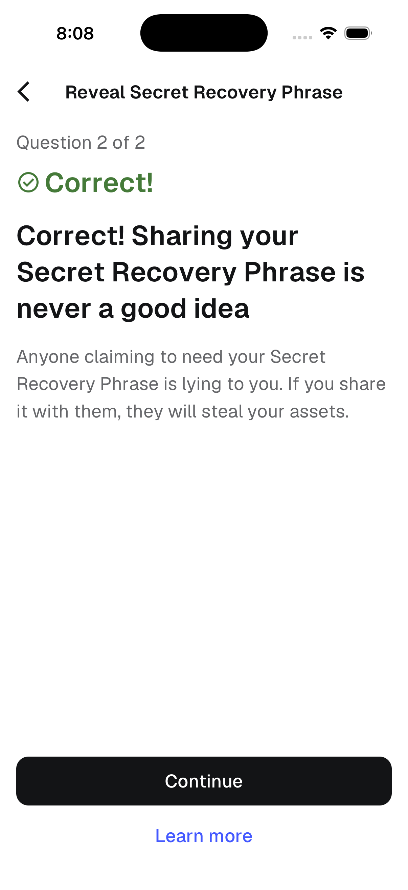 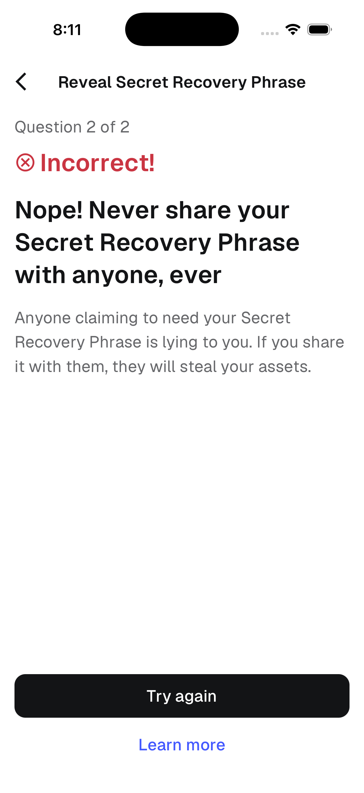 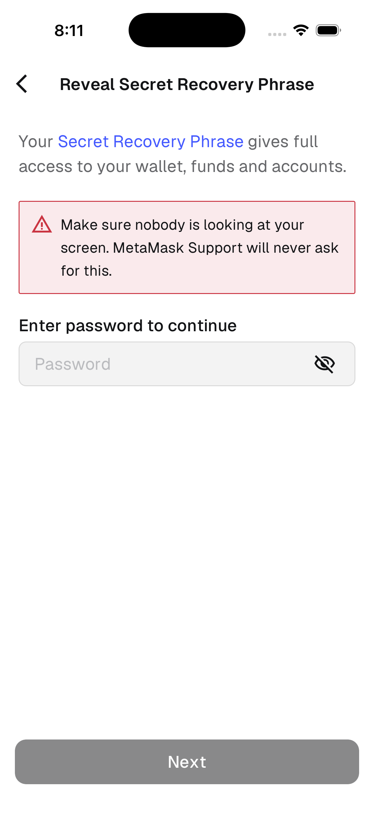 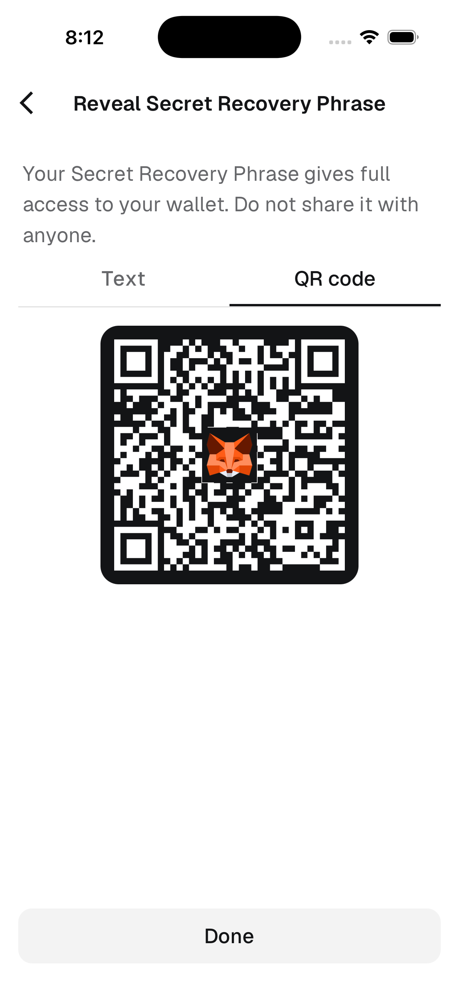 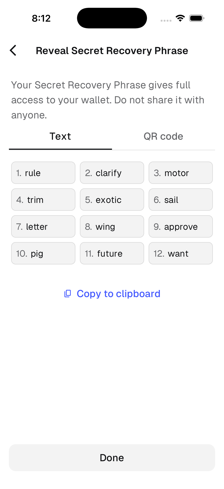

Screenshot coverage notes:

- Covered by current screenshots: quiz prompt shown, Q1 shown + correct answer, Q2 shown + correct + wrong answer, password entry screen, action view SRP text tab, action view QR tab.
- Not yet shown in screenshots: Q1 wrong answer flow, explicit copy success interaction, cancel flow, done flow, back-navigation action.

| event_name | occurrence_count | line_refs |
| --- | ---: | --- |
| CANCEL_REVEAL_SRP_CTA | 1 | `181` |
| COPY_SRP | 1 | `244` |
| GO_BACK_SRP_SCREEN | 1 | `113` |
| NEXT_REVEAL_SRP_CTA | 1 | `118` |
| REVEAL_SRP_CANCELLED | 1 | `173` |
| REVEAL_SRP_COMPLETED | 3 | `209, 216, 237` |
| REVEAL_SRP_CTA | 1 | `72` |
| REVEAL_SRP_INITIATED | 1 | `70` |
| REVEAL_SRP_SCREEN | 1 | `128` |
| SRP_DONE_CTA | 1 | `188` |
| SRP_REVEAL_FIRST_QUESTION_RIGHT_ASNWER | 1 | `91` |
| SRP_REVEAL_FIRST_QUESTION_SEEN | 1 | `49` |
| SRP_REVEAL_FIRST_QUESTION_WRONG_ANSWER | 1 | `97` |
| SRP_REVEAL_QUIZ_PROMPT_SEEN | 1 | `37` |
| SRP_REVEAL_SECOND_QUESTION_RIGHT_ASNWER | 1 | `108` |
| SRP_REVEAL_SECOND_QUESTION_SEEN | 1 | `55` |
| SRP_REVEAL_SECOND_QUESTION_WRONG_ANSWER | 1 | `114` |
| SRP_REVEAL_START_CTA_SELECTED | 1 | `75` |
| VIEW_SRP | 1 | `213` |
| VIEW_SRP_QR | 1 | `220` |

## `app/components/Views/WalletCreationError`

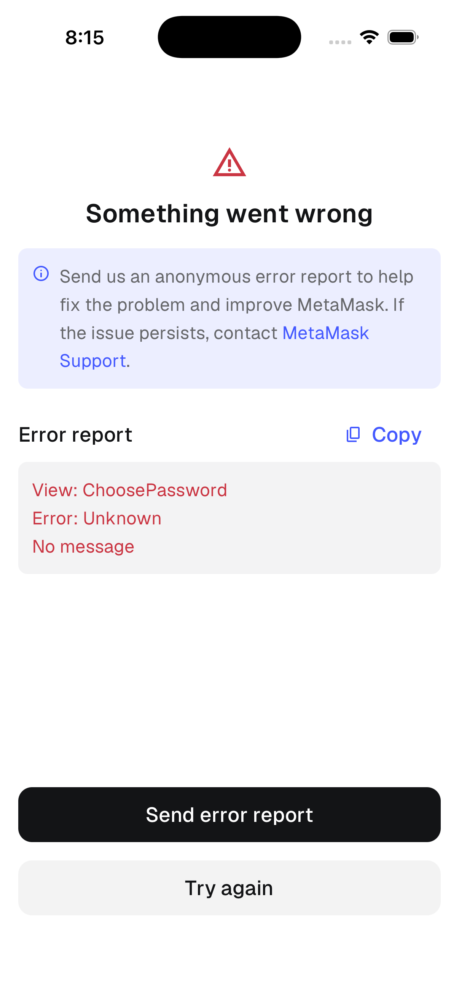

| event_name | line_refs | scenario |
| --- | --- | --- |
| WALLET_CREATION_ERROR_SCREEN_VIEWED | `54, 77` | On WalletCreationError screen load (includes this `View: ChoosePassword` variant). |
| WALLET_CREATION_ERROR_SCREEN_CTA_CLICKED | `67, 85, 94, 113, 158` | On CTA presses (`Send error report`, `Try again`, `Contact MetaMask Support`, and related error action CTAs). |

## `app/core/OAuthService/OAuthService.ts`

| event_name | occurrence_count | line_refs |
| --- | ---: | --- |
| SOCIAL_LOGIN_FAILED | 1 | `402` |
