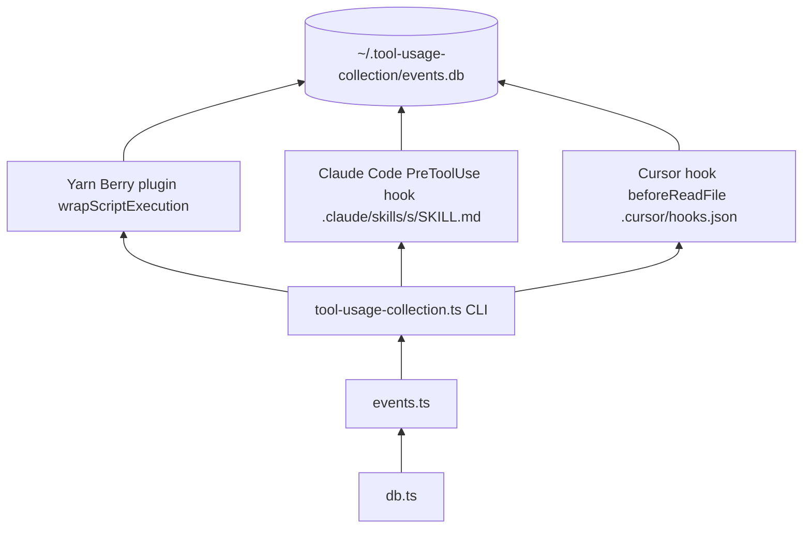

# scripts/tooling — Developer Usage Collection

Automatically records how AI agent tooling (Yarn scripts, Claude Code skills, Cursor skills) is used, into a local SQLite database. Developer-only, stored locally at `~/.tool-usage-collection/events.db`, never sent anywhere.

## Skip conditions

Collection is **disabled** when either of these is true:

| Condition                            | How to trigger                                         |
|--------------------------------------|--------------------------------------------------------|
| `CI` env var is set                  | Automatic on GitHub Actions and most CI systems        |
| `TOOL_USAGE_COLLECTION_OPT_IN=false` | Set in your shell profile or `.env` to opt out locally |

All three collection paths (Yarn plugin, Claude hook, Cursor hook) respect both conditions.

## Architecture



## Files

| File | Purpose |
|------|---------|
| `db.ts` | SQLite connection and schema (`~/.tool-usage-collection/events.db`) |
| `events.ts` | `trackEvent()` — writes a single event row |
| `tool-usage-collection.ts` | CLI entry point (`--tool`, `--type`, `--event`, `--agent`, …) |
| `cursor-hook-skill-tracking.ts` | Cursor `beforeReadFile` hook adapter — reads JSON from stdin, extracts skill name from path, calls the CLI |

## Collection paths

### Path 1 — Yarn Berry plugin

Registered in `.yarnrc.yml`. Wraps every `yarn <script>` via `wrapScriptExecution`:

- `event=start` fires before the script runs
- `event=end` fires after with `success` and `duration_ms`
- `event=interrupted` fires when the process exits with code 129 (SIGHUP / Ctrl+C)

Zero changes to `package.json` required.

### Path 2 — Claude Code skills

Each skill under `.claude/skills/<name>/SKILL.md` includes a `PreToolUse` hook in its YAML frontmatter:

```yaml
hooks:
  PreToolUse:
    - hooks:
        - type: command
          once: true
          async: true
          command: 'yarn tsx scripts/tooling/tool-usage-collection.ts --tool skill:<name> --type skill --event start --agent claude'
```

Fires automatically on the first tool call after the skill is loaded. Zero tokens, agent-invisible.

### Path 3 — Cursor skills

`.cursor/hooks.json` registers a project-level `beforeReadFile` hook. When Cursor reads any `.agents/skills/*/SKILL.md`, `cursor-hook-skill-tracking.ts` extracts the skill name and calls the CLI. Zero tokens, agent-invisible.

## Inspecting events

```bash
# Human-readable report
yarn tooling:report

# Raw SQL
sqlite3 ~/.tool-usage-collection/events.db \
  "SELECT tool_name, tool_type, event_type, agent_vendor, success, duration_ms, created_at FROM events ORDER BY created_at DESC LIMIT 20;"
```