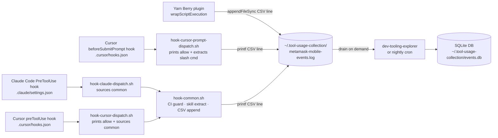

# scripts/tooling — Developer Usage Collection

Automatically records how AI agent tooling (Yarn scripts, Claude Code skills, Cursor skills) is used into a local CSV log. Developer-only, stored locally, never sent anywhere.

## How it works

Every collection path appends one CSV row to a project-scoped log file:

- `start` when a skill or Yarn script begins

The log accumulates locally. The [dev-tooling-explorer](https://github.com/MetaMask/experimental-dev-tooling-explorer) and a nightly cron job drain the log into SQLite for reporting and summarisation.

## Skip conditions

Collection is **disabled** when either of these is true:

| Condition                            | How to trigger                                         |
|--------------------------------------|--------------------------------------------------------|
| `CI` env var is set                  | Automatic on GitHub Actions and most CI systems        |
| `TOOL_USAGE_COLLECTION_OPT_IN=false` | Set in your shell profile or `.env` to opt out locally |

All four collection paths (Yarn plugin, Claude hook, Cursor preToolUse hook, Cursor prompt hook) check both conditions. The shell dispatchers exit immediately when either is set — zero filesystem or subprocess overhead. Both Cursor entry scripts emit `{"permission":"allow"}` before the guard so Cursor never blocks a tool use or prompt submission.

## Log file location

| Scenario | Path |
|---|---|
| Default | `~/.tool-usage-collection/metamask-mobile-events.log` |
| Custom | Set `TOOL_USAGE_COLLECTION_LOG_PATH` to any absolute path |

### Log format

One CSV row per event, with a header row written on first creation:

```
tool_name,tool_type,event_type,agent_vendor,session_id,success,duration_ms,created_at
```

Example rows:

```
skill:pr-create,skill,start,cursor,abc-123,,,2026-05-12T10:00:00Z
yarn:test:unit,yarn_script,start,,,true,8423,2026-05-12T10:01:00Z
```

Appends are done with `printf … >> file` (Yarn plugin) or `fs.appendFileSync` (Yarn Berry plugin), both of which are atomic for single-line writes on macOS/Linux.

## Architecture



## Files

| File | Purpose |
|---|---|
| `hook-cursor-dispatch.sh` | Cursor `preToolUse` entry point — emits `{"permission":"allow"}` unconditionally, then sources common |
| `hook-cursor-prompt-dispatch.sh` | Cursor `beforeSubmitPrompt` entry point — emits `{"permission":"allow"}` unconditionally, extracts skill from slash command prompt, appends CSV |
| `hook-claude-dispatch.sh` | Claude entry point — sources common |
| `hook-common.sh` | Shared logic — CI/opt-out guard, skill extraction, CSV append; receives agent name as `$1` |
| `hook-dispatchers.test.ts` | Jest tests for all entry scripts (runs shell scripts via `child_process`) |

## Collection paths

### Path 1 — Yarn Berry plugin

`.yarn/plugins/plugin-usage-tracking.cjs` wraps every `yarn <script>` via `wrapScriptExecution`. On `start` it appends a CSV row; on `finish` it updates `success` and `duration_ms` in a second row.

### Path 2 — Claude Code skills

`.claude/settings.json` registers a project-level `PreToolUse` hook for the `Skill` tool pointing to `hook-claude-dispatch.sh`. That script sources `hook-common.sh` which extracts the skill name from the `"skill"` field in the tool input, appends one CSV row, and exits.

### Path 3 — Cursor skills (agent reads SKILL.md)

`.cursor/hooks.json` registers a `preToolUse` hook pointing to `hook-cursor-dispatch.sh`. That script emits `{"permission":"allow"}` as its first output (unconditionally), then sources `hook-common.sh` which extracts the skill name from the SKILL.md file path in the payload (matches `.agents/skills/`, `.cursor/skills/`, or `.claude/skills/`) and appends one CSV row.

### Path 4 — Cursor slash commands

`.cursor/hooks.json` also registers a `beforeSubmitPrompt` hook pointing to `hook-cursor-prompt-dispatch.sh`. When a user invokes a skill via a slash command (e.g. `/mms-pr-changelog`), Cursor injects the skill content directly into the prompt context without the agent reading a SKILL.md file — so Path 3 never fires. This hook intercepts the raw prompt before submission, extracts the skill name from the `"prompt"` field (pattern: `"/mms-[a-z0-9-]*"`), and appends one CSV row. The `{"permission":"allow"}` response is always emitted first so Cursor never blocks the submission.

## Inspecting the log

```bash
# Tail live events
tail -f ~/.tool-usage-collection/metamask-mobile-events.log

# Count skill uses by name
awk -F, '{print $1}' ~/.tool-usage-collection/metamask-mobile-events.log | sort | uniq -c | sort -rn
```

To see events in the SQLite database populated by the explorer or cron:

```bash
sqlite3 ~/.tool-usage-collection/events.db \
  "SELECT tool_name, tool_type, event_type, agent_vendor, created_at FROM events ORDER BY created_at DESC LIMIT 20;"
```

## Demo: pushing a metric to Prometheus

`push-metrics-demo.ts` is a standalone example of how to remote-write the local
usage data to a Prometheus Pushgateway, so you can explore it in Grafana. It is
**not wired into the build** — it's a reference you can run by hand.

```bash
cp scripts/tooling/.env.example scripts/tooling/.env   # then fill in URL + creds
yarn tsx scripts/tooling/push-metrics-demo.ts
```

It loads credentials from `scripts/tooling/.env` (gitignored), reads the CSV log,
aggregates it per `(tool, tool_type, agent_vendor)`, and `POST`s the result in
Prometheus text exposition format with basic auth to
`<PUSHGATEWAY_URL>/metrics/job/<job>/instance/<hostname>`.

Metrics emitted:

| Metric | Type | Source |
|---|---|---|
| `metamask_devtools_invocations_total` | counter | count of `start` events |
| `metamask_devtools_success_total` | counter | `end` events with `success=true` |
| `metamask_devtools_failure_total` | counter | `end` events with `success=false` |
| `metamask_devtools_duration_seconds_sum` | gauge | sum of `duration_ms / 1000` |
| `metamask_devtools_duration_seconds_count` | gauge | count of timed events |

## Using dev-tooling-explorer

[dev-tooling-explorer](https://github.com/MetaMask/experimental-dev-tooling-explorer) is a local web UI for browsing the SQLite database written by the collection hooks. It lets you filter events by repo, tool, agent vendor, or date; view per-session history; explore usage charts; and prune or reset the database.

### Installation

```bash
git clone https://github.com/MetaMask/experimental-dev-tooling-explorer
cd experimental-dev-tooling-explorer
yarn install
```

### Usage

```bash
yarn start                    # opens local web UI
yarn start -- --port 4242    # fixed port
```

### Demo workflow (no collection setup needed)

```bash
yarn demo:generate
yarn start:demo
```

### DB path resolution

The explorer reads the database from `TOOL_USAGE_COLLECTION_DB_PATH` if set, otherwise defaults to `~/.tool-usage-collection/events.db`.

