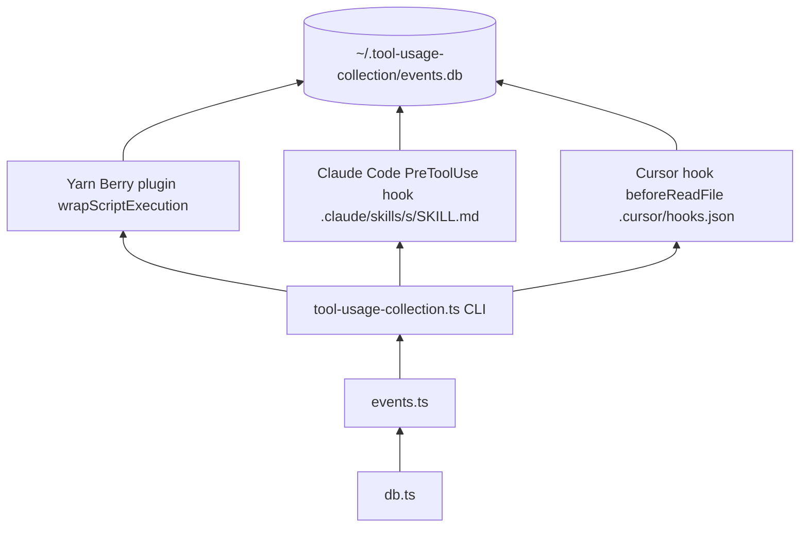

# scripts/tooling — Developer Usage Collection

Automatically records how AI agent tooling (Yarn scripts, Claude Code skills, Cursor skills) is used, into a local SQLite database. Developer-only, stored locally, never sent anywhere.

## How it works

Every collection path writes events to a local SQLite database:

- `start` when work begins
- `end` when work completes
- `interrupted` for aborted yarn script runs (exit code 129 / SIGHUP / Ctrl+C)

## Skip conditions

Collection is **disabled** when either of these is true:

| Condition                            | How to trigger                                         |
|--------------------------------------|--------------------------------------------------------|
| `CI` env var is set                  | Automatic on GitHub Actions and most CI systems        |
| `TOOL_USAGE_COLLECTION_OPT_IN=false` | Set in your shell profile or `.env` to opt out locally |

All three collection paths (Yarn plugin, Claude hook, Cursor hook) respect both conditions.

## Database location

| Scenario | Path |
|---|---|
| Default | `~/.tool-usage-collection/events.db` |
| Custom | Set `TOOL_USAGE_COLLECTION_DB_PATH` to any absolute path |

To redirect the database, set `TOOL_USAGE_COLLECTION_DB_PATH` in your shell profile:

```bash
export TOOL_USAGE_COLLECTION_DB_PATH="$HOME/.tool-usage-collection/events.db"
```

## Architecture



## Files

| File | Purpose |
|---|---|
| `db.ts` | SQLite connection and schema |
| `events.ts` | `trackEvent()` — writes a single event row |
| `tool-usage-collection.ts` | CLI entry point (`--tool`, `--type`, `--event`, `--agent`, …) |
| `cursor-hook-skill-tracking.ts` | Cursor `beforeReadFile` hook adapter — reads JSON from stdin, extracts skill name from path, calls the CLI |

## Collection paths

### Path 1 — Yarn Berry plugin

`.yarn/plugins/plugin-usage-tracking.cjs` wraps every `yarn <script>` via `wrapScriptExecution`.

### Path 2 — Claude Code skills

Each skill under `.claude/skills/<name>/SKILL.md` includes a `PreToolUse` hook in its YAML frontmatter.

### Path 3 — Cursor skills

`.cursor/hooks.json` registers a project-level `beforeReadFile` hook.

## CLI usage

The CLI is invoked internally by hooks. You can also call it directly for debugging:

```bash
yarn tsx scripts/tooling/tool-usage-collection.ts \
  --tool my-tool \
  --type skill \
  --event start \
  [--session <uuid>] \
  [--agent cursor|claude|codex] \
  [--success true|false] \
  [--duration <ms>] \
  [--verbose]
```

`--tool`, `--type`, and `--event` are required.

## Inspecting events

```bash
yarn tooling:report
sqlite3 ~/.tool-usage-collection/events.db \
  "SELECT tool_name, tool_type, event_type, agent_vendor, success, duration_ms, created_at FROM events ORDER BY created_at DESC LIMIT 20;"
```
