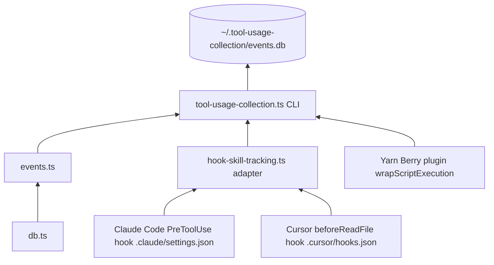

# scripts/tooling — Developer Usage Collection

Automatically records how AI agent tooling (Yarn scripts, Claude Code skills, Cursor skills) is used, into a local SQLite database. Developer-only, stored locally, never sent anywhere.

## How it works

Every collection path writes events to a local SQLite database:

- `start` when work begins
- `end` when work completes
- `interrupted` for aborted yarn script runs (exit code 129 / SIGHUP / Ctrl+C)

## Skip conditions

Collection is **disabled** when either of these is true:

| Condition                            | How to trigger                                         |
|--------------------------------------|--------------------------------------------------------|
| `CI` env var is set                  | Automatic on GitHub Actions and most CI systems        |
| `TOOL_USAGE_COLLECTION_OPT_IN=false` | Set in your shell profile or `.env` to opt out locally |

All three collection paths (Yarn plugin, Claude hook, Cursor hook) respect both conditions.

## Database location

| Scenario | Path |
|---|---|
| Default | `~/.tool-usage-collection/events.db` |
| Custom | Set `TOOL_USAGE_COLLECTION_DB_PATH` to any absolute path |

To redirect the database, set `TOOL_USAGE_COLLECTION_DB_PATH` in your shell profile:

```bash
export TOOL_USAGE_COLLECTION_DB_PATH="$HOME/.tool-usage-collection/events.db"
```

## Architecture



## Files

| File | Purpose |
|---|---|
| `db.ts` | SQLite connection and schema |
| `events.ts` | `trackEvent()` — writes a single event row |
| `tool-usage-collection.ts` | CLI entry point (`--tool`, `--type`, `--event`, `--agent`, …) |
| `hook-skill-tracking.ts` | Shared adapter for Cursor and Claude skill hooks — parses stdin, extracts the skill name from `.{agents,cursor,claude}/skills/<name>/SKILL.md`, calls the CLI with the right `--agent` |

## Collection paths

### Path 1 — Yarn Berry plugin

`.yarn/plugins/plugin-usage-tracking.cjs` wraps every `yarn <script>` via `wrapScriptExecution`.

### Path 2 — Claude Code skills

`.claude/settings.json` registers a single project-level `PreToolUse` hook on the `Read` tool, filtered to `.claude/skills/*/SKILL.md`. The hook calls `hook-skill-tracking.ts --agent claude`. No per-skill frontmatter boilerplate is needed — every skill under `.claude/skills/` is tracked automatically when Claude activates it.

### Path 3 — Cursor skills

`.cursor/hooks.json` registers a project-level `beforeReadFile` hook that calls `hook-skill-tracking.ts --agent cursor`. The adapter filters reads to `.agents/skills/<name>/SKILL.md` and `.cursor/skills/<name>/SKILL.md`.

## How skill tracking is triggered

Both harnesses issue a `Read` against the skill's `SKILL.md` when it is activated, and our hook intercepts that read.

- **Claude Code** reads `.claude/skills/<name>/SKILL.md` via the `Read` tool when a skill is activated. The project-level `PreToolUse(Read)` hook with `if: Read(**/.claude/skills/*/SKILL.md)` intercepts that read.
- **Cursor** reads `.agents/skills/<name>/SKILL.md` (or `.cursor/skills/<name>/SKILL.md`) on activation. Its `beforeReadFile` hook fires on every file read; the adapter filters to the skill directories.

If a `.claude/skills/<name>/SKILL.md` delegates to `.agents/skills/<name>/SKILL.md` (via a `Follow .agents/skills/<name>/SKILL.md` body), Claude will issue a second `Read` against the `.agents/skills/` path. That second read is ignored by the filter in `.claude/settings.json`, so each activation is counted exactly once.

### Caveats

- **Granularity is per-session, not per-invocation.** Both harnesses cache skill content within a session, so the `Read` — and our event — fires only on the first activation of a skill in a given session. Subsequent uses of the same skill in the same session are not recorded.
- **Relative rankings, not absolute counts.** Because of session caching, these numbers reflect "how many sessions activated skill X" rather than "how many times skill X was invoked". That is intentional — the goal is comparative adoption, not raw frequency.
- **False positives from manual reads.** Opening a `SKILL.md` manually in Cursor, or asking Claude to read it explicitly, also produces a tracking event. Expected to be rare relative to actual skill activations.

## CLI usage

The CLI is invoked internally by hooks. You can also call it directly for debugging:

```bash
yarn tsx scripts/tooling/tool-usage-collection.ts \
  --tool my-tool \
  --type skill \
  --event start \
  [--session <uuid>] \
  [--agent cursor|claude|codex] \
  [--success true|false] \
  [--duration <ms>] \
  [--verbose]
```

`--tool`, `--type`, and `--event` are required.

## Inspecting events

```bash
sqlite3 ~/.tool-usage-collection/events.db \
  "SELECT tool_name, tool_type, event_type, agent_vendor, success, duration_ms, created_at FROM events ORDER BY created_at DESC LIMIT 20;"
```
