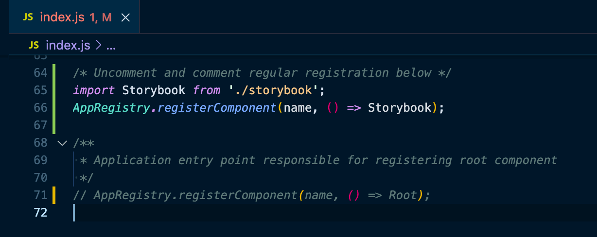
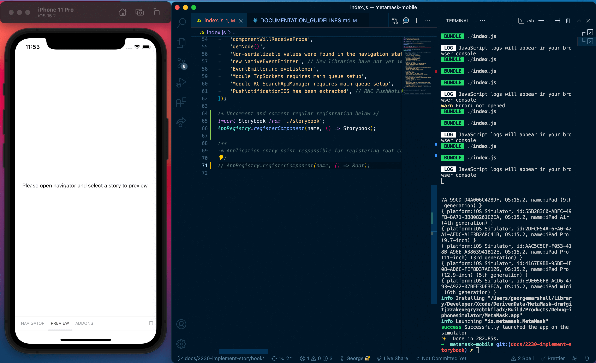
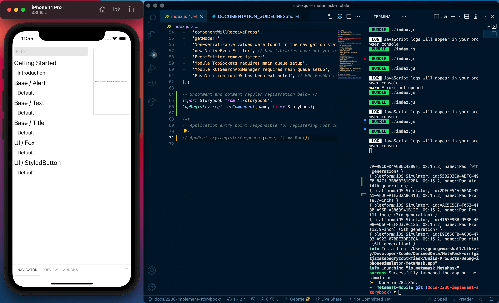
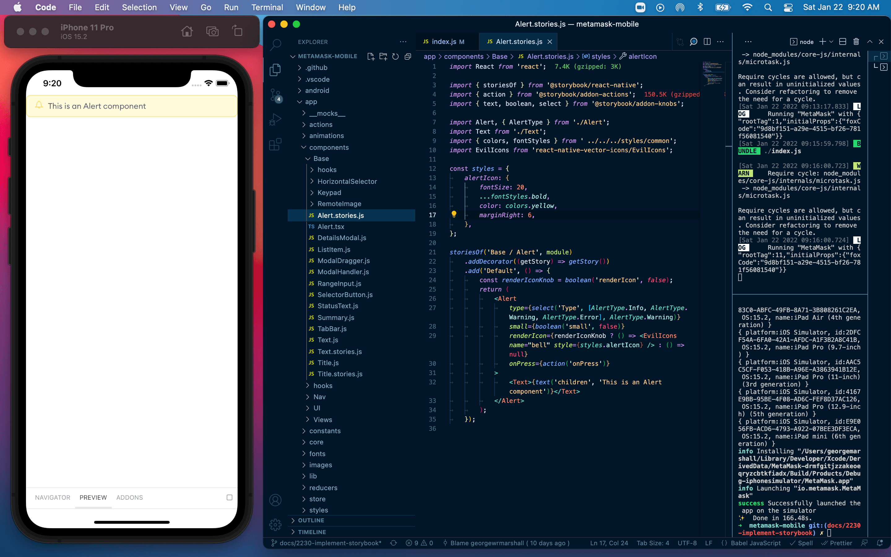
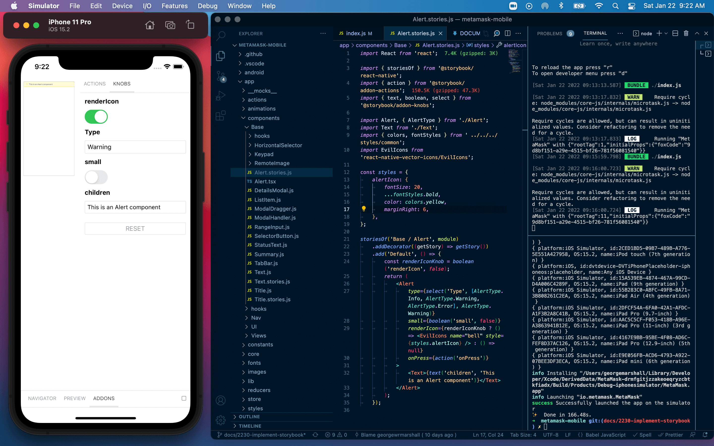

# Documentation Guidelines

## General Guidelines

Thorough documentation makes it much easier for a component to be found, adapted and reused. It also provides space for explanation and reasoning for a component. This is useful as components become more complex.

## Using React Native Storybook

The below steps will explain how to use Storybook for React Native with our current set up.

In the React Native Storybook [Getting Started](https://github.com/storybookjs/react-native/tree/v5.3.25#getting-started) guide they suggest you change the default export to the storybook UI. This doesn't have the greatest developer experience and we will improve this in future([see other ways to render storybook](https://github.com/storybookjs/react-native/tree/v5.3.25#other-ways-to-render-storybook)) but for now:

**Prerequisite**
Make sure you have your environment set up first. To do that follow the set up instructions in the main [README.md](https://github.com/MetaMask/metamask-mobile)

1. In the root `./index.js` file **uncomment**:

```
// import Storybook from './storybook';
// AppRegistry.registerComponent(name, () => Storybook);
```

and add **comment** out:

```
AppRegistry.registerComponent(name, () => Root);
```

It should look like the below screenshot



this will replace the entry point of the app with storybook.

2. Once you have replaced the entry point of the app with storybook in `./index.js` run

```
yarn watch
```

3. Open a new terminal window and run

```
yarn start:ios
```

Once the app builds you should be greeted with this screen.



To view all of the stories open the navigator



Select a story to preview



You should also be able to use storybook plugins including actions and knobs in the addons tab



## Creating a Story

1. Create a `ComponentName.stories.tsx` file (example `Alert` story below)
2. Run `yarn prestorybook` (Uses [storybook loader](https://github.com/elderfo/react-native-storybook-loader) to automatically find `stories.@(js|tsx)`(javascript or typescript) files **required step after every new story file is created**)

Example `Alert` story

```jsx
// app/components/Base/Alert.stories.tsx

// Import react
import React from 'react';

// Import storybook functions and plugins
import { storiesOf } from '@storybook/react-native';
import { action } from '@storybook/addon-actions';
import { text, boolean, select } from '@storybook/addon-knobs';

// Import the component and any supplementary components / styles that will help with documentation / interactivity
import Alert, { AlertType } from './Alert';
import Text from './Text';
import { colors, fontStyles } from ' ../../../styles/common';
import EvilIcons from 'react-native-vector-icons/EvilIcons';

// Add any styles that are needed
const styles = {
	alertIcon: {
		fontSize: 20,
		...fontStyles.bold,
		color: colors.yellow,
		marginRight: 6,
	},
};

// Create story using the component directory and name for the title
storiesOf('Base / Alert', module)
	.addDecorator((getStory) => getStory())
	// The naming convention for a component's the first story should be "Default"
	.add('Default', () => {
		const renderIconKnob = boolean('renderIcon', false);
		return (
			<Alert
				// All appropriate props should include an action or knob to show component api options
				type={select('Type', [AlertType.Info, AlertType.Warning, AlertType.Error], AlertType.Warning)}
				small={boolean('small', false)}
				renderIcon={renderIconKnob ? () => <EvilIcons name="bell" style={styles.alertIcon} /> : () => null}
				onPress={action('onPress')}
			>
				<Text>{text('children', 'This is an Alert component')}</Text>
			</Alert>
		);
	});
```

Nice work! You're now ready to start creating component documentation using storybook 🎉 👍

> Note: Currently React Native Storybook is at v5.3 hoping to upgrade to [v6](https://github.com/storybookjs/react-native/blob/next-6.0/v6README.md) soon..
