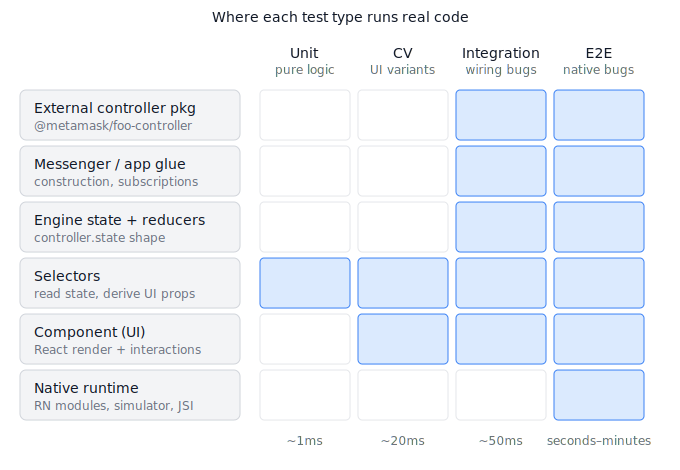

# Perps testing strategy — combined four-layer approach

A plan for testing perps using each test layer for what it uniquely covers — happy paths first, no overlap, no gaps.

## TL;DR

Four layers, each owning what no other can cover cheaply:

- **E2E** — real device, real keychain, real network. Owns native runtime concerns only.
- **Integration** — real controller, mocked I/O. Owns every public controller action's happy path + main rejection paths.
- **CV** — real component render, mocked Engine. Owns UI variants and visual concerns.
- **Unit** — pure functions. Owns business logic correctness.

The point of Integration is _not_ "find bugs CV missed." It's "every flow a user can trigger has a deterministic 50ms test that proves it works end-to-end through real controller code." Bug-finding falls out of that as a side effect — including, as one example, the reverse-position class of bug that prompted this work. See [`perps-use-cases.md`](perps-use-cases.md) for the full enumeration of perps use cases mapped to layers.

## Strategy at a glance



Read top-to-bottom on the left for the architecture stack, left-to-right on the top for the test type. A blue cell means "this test type runs real code here"; an empty cell means "out of scope or mocked." The four layers stack so that anything reachable in jest stays in jest, and E2E only owns the bottom row (native runtime).

Integration now has three perps harness shapes. Shape A drives the provider directly, Shape B renders hooks through the Engine shim, and Shape C renders real perps components with app providers while reusing Shape B's real TradingService/provider chain. Shape B/C are allowed to mock documented app-shell glue inside the harness only; tests still do not add one-off mocks. Shape C is intentionally reserved for flows where the rendered button press is part of the bug surface; CV still owns pure UI variants.

### Perps integration harness shapes

The harness shapes are additive. Each one exists for a different failure class, not as a replacement for the previous shape.

| Layer of the stack                                                         | Shape A: provider      | Shape B: flow                     | Shape C: rendered component               | Future Shape D: real controller/app       |
| -------------------------------------------------------------------------- | ---------------------- | --------------------------------- | ----------------------------------------- | ----------------------------------------- |
| External controller package                                                | ✓                      | ✓                                 | ✓                                         | ✓                                         |
| Messenger / app glue                                                       | ✗                      | shimmed                           | shimmed                                   | ✓                                         |
| Engine state + reducers                                                    | ✗                      | partial                           | ✓ minimal Redux fixture                   | ✓ fuller app fixture                      |
| `HyperLiquidProvider`                                                      | ✓                      | ✓                                 | ✓                                         | ✓                                         |
| `TradingService` validation seams and multi-step flows like `flipPosition` | ✗                      | ✓                                 | ✓                                         | ✓                                         |
| SDK / wallet / websocket I/O                                               | mocked                 | mocked                            | mocked                                    | mocked                                    |
| Selectors                                                                  | ✗                      | whatever the hook reads           | ✓ real selectors against fixture state    | ✓ real selectors against fuller app state |
| Hook: `usePerpsTrading`                                                    | ✗                      | ✓                                 | ✓                                         | ✓                                         |
| Perps UI hooks                                                             | ✗                      | partial                           | ✓                                         | ✓                                         |
| `Engine.context.PerpsController` orchestration                             | ✗                      | shimmed                           | shimmed                                   | ✓                                         |
| Component UI                                                               | ✗                      | ✗ (`renderHook`, not `render`)    | ✓                                         | ✓                                         |
| Navigation / theme / toast / providers                                     | ✗                      | ✗                                 | ✓ test providers                          | ✓ app-like providers                      |
| Confirmation/pay subsystem                                                 | ✗                      | ✗                                 | mocked as out-of-scope app-shell plumbing | preferably real fixture-backed            |
| Native runtime                                                             | ✗                      | ✗                                 | mocked                                    | mocked                                    |
| Best for                                                                   | Provider contract bugs | Hook → service/provider flow bugs | User click reaches real trading flow      | Controller/app orchestration bugs         |
| Cost                                                                       | low                    | medium                            | medium-high                               | high                                      |
| Maintenance burden                                                         | low                    | medium                            | medium-high                               | high                                      |

Shape C's boundary is deliberately narrow: real rendered perps UI, real perps hooks, real `TradingService`, real provider, mocked SDK/native runtime, and mocked confirmation/pay app-shell plumbing unless the test is explicitly about pay-with-token behaviour. Confirmation/pay should have its own integration harness where its providers, selectors, transaction confirmation paths, quote alerts, and token-selection behaviour are real with only their I/O boundary mocked.

The maintenance risk in Shape C is not rendering itself; it is letting the harness become "whatever mocks are needed to mount a large screen." To keep it healthy, use Shape C only when the rendered interaction must prove it reaches real perps trading code. Keep pure visual states in CV tests, keep provider/service behaviour in Shape A/B, and add a future Shape D only when the target bug is in `PerpsController` orchestration, messenger integration, or app state glue that the current Engine shim intentionally bypasses.

During the PoC, side-by-side Shape A/B/C tests may intentionally cover a similar flow to demonstrate what each shape catches. In the long-term rollout, the use-case matrix should assign one primary owner per use case and keep secondary tests only when they prove a unique concern at another boundary.

## Layer responsibilities — what each one uniquely covers

| Layer           | Owns (uniquely)                                                                                                                                                                                                         | Excludes (cheaper elsewhere)                                                                             |
| --------------- | ----------------------------------------------------------------------------------------------------------------------------------------------------------------------------------------------------------------------- | -------------------------------------------------------------------------------------------------------- |
| **E2E**         | Native module init · real wallet signing · real keychain unlock · real network calls · chain switching across native re-init                                                                                            | Order validation logic · UI variants · pure calculations · controller behaviour reachable via mocked I/O |
| **Integration** | Controller-app wiring · validation seams · state transitions across actions · multi-controller interactions · upstream package behaviour drift · targeted rendered component flows that must reach real controller code | Visual variants · broad UI layout assertions · pure functions · device behaviour                         |
| **CV**          | UI variant rendering · accessibility · theming · keyboard/focus · component-level interactions                                                                                                                          | Anything requiring real controller code · cross-controller behaviour · native modules                    |
| **Unit**        | Pure function correctness · edge cases (zero, NaN, big numbers, precision) · selector composition over hand-rolled state                                                                                                | Anything stateful or async · anything requiring the controller machinery                                 |

## Comparison — cost & efficiency by bug class

Each row is a kind of bug. The cell shows the cheapest layer that can catch it, and what it costs.

| Bug class                                                      | Cheapest layer      | Per-test cost | Speed  | Why                                                                     |
| -------------------------------------------------------------- | ------------------- | ------------- | ------ | ----------------------------------------------------------------------- |
| Pure calculation wrong (price slippage, position size math)    | Unit                | ~15 min       | ~5ms   | No state, no async — unit tests are precisely calibrated for this.      |
| Public controller action breaks (open / close / cancel / etc.) | Integration         | ~30 min       | ~50ms  | Real action through real reducer; CV mocks it away.                     |
| Validation bug at the seam between two controller methods      | Integration         | ~30 min       | ~50ms  | Each method correct alone, broken together. The class CV can't see.     |
| Component renders wrong layout for a state                     | CV                  | ~30 min       | ~20ms  | Variant coverage; getting the state via real actions costs 5–10× more.  |
| Component handles loading/error/empty states                   | CV                  | ~30 min       | ~20ms  | Same — variant coverage.                                                |
| Button click triggers wrong controller action                  | Integration Shape C | ~45 min       | ~100ms | Renders the button but keeps the real TradingService/provider chain.    |
| Native module init fails on cold launch                        | E2E                 | ~1 day        | ~30s   | No other layer touches native code.                                     |
| Real wallet signing flow                                       | E2E                 | ~1 day        | ~60s   | No other layer can run real keychain + native bridge.                   |
| Multi-step user flow (open → close → flip)                     | Integration         | ~1 hour       | ~100ms | Real actions, real state transitions, no UI rendering needed.           |
| Upstream package version-bump regression                       | Integration         | ~0 (existing) | ~50ms  | Real controller code runs on the bump PR; failures show up immediately. |

## Comparison — refactor sensitivity

| Refactor                                      | Unit       | CV                  | Integration             | E2E                   |
| --------------------------------------------- | ---------- | ------------------- | ----------------------- | --------------------- |
| Rename a pure function                        | Some break | None                | None                    | None                  |
| Rename a controller method                    | None       | None                | **Many break**          | None                  |
| Split a controller into two                   | None       | None                | **Harness surgery**     | None                  |
| Add a new field to controller state           | None       | Some break (mocks)  | Some break (assertions) | None                  |
| Move a button on screen                       | None       | **Break**           | None                    | **Break**             |
| Redesign a UI flow                            | None       | **Wholesale break** | None                    | **Wholesale break**   |
| Bump upstream perps package, behaviour change | None       | None                | **Break (good catch)**  | Maybe break (delayed) |
| Native module API change                      | None       | None                | None                    | **Break**             |

The pattern: each layer is robust to the kinds of refactors that don't affect what it covers. Integration is sensitive to internal code structure (its job); CV and E2E are sensitive to UI structure (theirs). Unit is robust to almost everything that doesn't touch the function under test.

---

## Perps coverage plan

Driven by the use-case matrix in [`perps-use-cases.md`](perps-use-cases.md), which enumerates every user-facing perps flow and assigns each one to its primary test layer. The summary by area:

| Area                                                        |   E2E | Integration |     CV |    Unit |   Total |
| ----------------------------------------------------------- | ----: | ----------: | -----: | ------: | ------: |
| Order lifecycle (open / edit / cancel / close / flip)       |     1 |          11 |      6 |         |      18 |
| Position management (collateral, TP/SL, leverage)           |       |           6 |      5 |         |      11 |
| Account / funds (deposit, withdraw, view balance)           |     2 |           2 |      6 |         |      10 |
| Market data / discovery                                     |       |             |      5 |       1 |       6 |
| Realtime / subscriptions                                    |       |           4 |      1 |         |       5 |
| Session / config (init, testnet, providers)                 |     2 |           5 |        |         |       7 |
| Pure helpers (`orderCalculations`, `hyperLiquidValidation`) |       |             |        |     ~25 |     ~25 |
| Composed selectors                                          |       |             |        |      ~5 |      ~5 |
| **Total**                                                   | **5** |      **28** | **23** | **~31** | **~87** |

Distribution: ~6% E2E, ~32% Integration, ~26% CV, ~36% Unit. A normal pyramid — Unit broadest, E2E narrowest, Integration sized to cover every public controller action's happy path plus its main rejection paths.

**The integration count is the meaningful one.** The job of those 28 tests is "every perps action a user can perform has a deterministic ~50ms test that proves the controller does the right thing." Open a position, close it, edit a limit, add collateral, flip direction, deposit funds, switch testnet — each one is a user-facing happy path with a corresponding integration test, not a bug-driven afterthought.

---

## Implementation plan

Six phases, ~6 weeks total. Each phase is a **vertical slice through one functional area** — implementing all four layers (E2E, Integration, CV, Unit) at once for that area, then pausing for review before continuing. This lets the team validate the approach end-to-end on a small surface before scaling, and catches "the harness doesn't quite work for X" early rather than after 30 tests are written.

The functional areas come from [`perps-use-cases.md`](perps-use-cases.md). Order is by user impact + integration-layer exercise (start where the harness gets stretched the most).

### Phase 1 — Order lifecycle (week 1–2, ~20 hours)

Use cases: open long/short (market + limit), edit limit, cancel single, cancel multi, close full/partial/limit, flip.

- **Integration** (~12 tests). Use Shape A for provider actions, Shape B for the `TradingService`/hook seam, and Shape C only where a rendered press must reach real trading code. Add helpers like `setupOpenPosition()` and `setupTradingReady()` to the harnesses as repeated setup appears. Reserve future Shape D for real `PerpsController` orchestration, messenger integration, or app state glue.
- **CV** (audit + add). Inventory existing `PerpsOrderView` and `PerpsClosePositionView` view tests against the matrix. Add missing variants — empty, loading, error, edge layouts.
- **E2E** (1 test). One "open a market long on testnet" smoke test for native-runtime concerns. Identify existing perps E2E order tests that are now covered by integration; mark them for the phase 6 audit.
- **Unit**. `orderCalculations.ts` utilities used by the order-lifecycle flows. Most likely already covered; fill gaps as encountered.

**Pause and review** before phase 2: does the harness pattern scale? Are tests landing in the right layer? Is the integration count tracking the matrix? Is anything in CV/E2E now obviously redundant? Adjust before continuing.

### Phase 2 — Position management (week 3, ~12 hours)

Use cases: add/remove collateral, set TP/SL, update TP/SL, adjust leverage on existing position.

- **Integration** (~6 tests). Reuse the harness from phase 1. Add helpers for margin / TP-SL state setup if needed.
- **CV**. TP/SL input variants, leverage slider clamping, collateral form variants (sufficient balance, insufficient balance).
- **E2E**. None new — these flows don't add native-runtime concerns beyond what phase 1 covers.
- **Unit**. Margin/leverage calculation helpers if any are pure functions.

### Phase 3 — Account / funds (week 4, ~10 hours)

Use cases: deposit USDC, withdraw USDC, view balance / positions / orders / history.

- **Integration** (~2 tests). Deposit & withdraw validation + state preparation.
- **CV** (~6 tests). Account balance view, positions list, orders list, history view, deposit form, withdraw form. The bulk of work here.
- **E2E** (up to 2 tests). Real signing of a deposit transaction and a withdraw transaction — only add these if they're not already covered by existing perps E2E.
- **Unit**. Amount-formatting helpers if pure.

### Phase 4 — Realtime + market data (week 5, ~10 hours)

Use cases: live updates (price / position / order-fill / balance), markets list with sort + search, market detail, funding rates.

- **Integration** (~4 tests). Drive subscription messages through the real handlers, assert state updates correctly.
- **CV** (~6 tests). Markets list (sorted, searched, empty), market detail, funding rate display, position list reacting to subscription tick.
- **E2E**. None new.
- **Unit** (~1 test). Sort comparator if it's a pure helper.

### Phase 5 — Session / config (week 6, ~6 hours)

Use cases: provider init, testnet ↔ mainnet toggle, multi-provider routing, builder fee approval, referrer set.

- **Integration** (~5 tests). Init flow with mocked SDK. Testnet toggle state transition. Provider switch routing logic. Builder fee + referrer state updates.
- **CV**. None — these are not directly user-rendering flows.
- **E2E** (2 tests). Cold launch (native module init); testnet ↔ mainnet toggle (native SecureKeychain scope re-init).
- **Unit**. None.

### Phase 6 — Reconciliation + measurement (week 6, ~8 hours)

Cross-cutting cleanup and the data-collection scaffolding for measuring the rollout's impact.

- **E2E audit.** List all existing perps E2E tests. Mark each as: "covered by integration now" / "covered by CV now" / "genuine native concern, keep." Delete or downgrade to nightly anything now redundant. Should leave only the ~5 native-runtime tests across phases 1–5.
- **CI tagging.** Add a jest reporter or GitHub Action that posts a `caught-by-integration` label on PRs where an `*.integration.test.ts` failed. Aggregate weekly.
- **Mutation testing.** Schedule the first quarterly run — reintroduce a known controller bug, verify integration catches it.
- **Outcome.** Smaller, faster, less flaky perps E2E suite. Measurement infra producing data to pitch wider rollout (Card, Rewards, Bridge, Swaps).

See [`coverage-and-tracking.md`](coverage-and-tracking.md) for coverage targets and bug-tracking mechanism details, and [`perps-use-cases.md`](perps-use-cases.md) for the per-use-case layer assignments that drive each phase.

---

## How to add a perps integration test

```ts
// app/path/to/myFeature.integration.test.ts
import { buildPerpsIntegrationHarness } from '../../../../../tests/integration/harnesses/perps';
import { PERPS_ERROR_CODES } from '../../../../controllers/perps/perpsErrorCodes';

describe('My perps feature', () => {
  it('does the thing', async () => {
    const { provider } = buildPerpsIntegrationHarness();
    const result = await provider.placeOrder({
      /* real params */
    });
    expect(result.success).toBe(true);
  });
});
```

Three lines of setup. The harness mocks the I/O boundary; the rest runs real. See [`AGENTS.md`](AGENTS.md) for the framework rules and [`.agents/skills/integration-test/SKILL.md`](../../.agents/skills/integration-test/SKILL.md) for the full skill (decision tree, golden rules, references).

## Where things live

```
tests/integration/                           ← framework, mirrors tests/component-view/
├── AGENTS.md                                  framework rules + per-domain harnesses
├── STRATEGY.md                                this file
├── coverage.svg                               the diagram above
├── coverage-and-tracking.md                   coverage targets + bug-tracking mechanisms
├── perps-use-cases.md                         every perps use case → primary test layer
└── harnesses/
    ├── perps.ts                               Shape A: provider-level harness
    ├── perps-flow.ts                          Shape B: hook-flow harness
    └── perps-component.tsx                    Shape C: rendered-component harness

.agents/skills/integration-test/             ← the skill, mirrors component-view-test
├── SKILL.md
├── agents/openai.yaml
└── references/
    ├── writing-tests.md                       how to add an integration test
    ├── harness-extension.md                   how to add or extend a domain harness
    └── reference.md                           run commands, self-review, failure diagnosis

app/components/UI/Perps/hooks/
├── usePerpsFlipPosition.test.ts               unit test (existing)
└── usePerpsFlipPosition.integration.test.ts   first integration test (seed of the suite)

jest.config.integration.js                   ← `yarn jest -c jest.config.integration.js`
```

Run a single integration test:

```bash
yarn jest -c jest.config.integration.js app/components/UI/Perps/hooks/usePerpsFlipPosition.integration.test.ts
```

Run all integration tests across the repo:

```bash
yarn jest -c jest.config.integration.js
```
