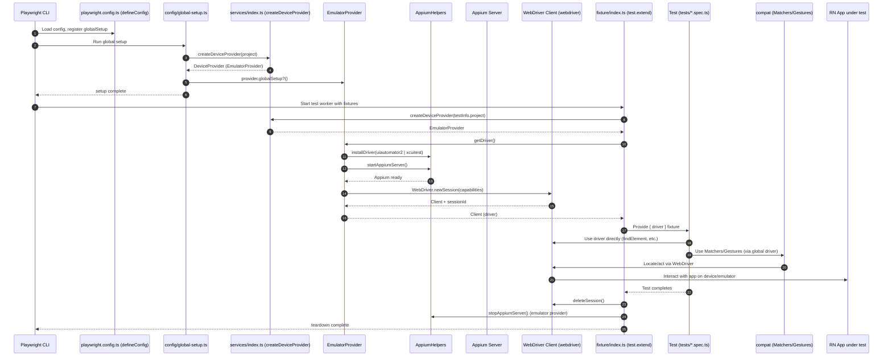

## WDIO Playwright Integration Overview

This folder integrates Playwright test runner with an Appium-driven mobile driver, exposing a Playwright fixture that hands tests a WebDriver client. It also provides a small compatibility layer to reuse existing Detox-style page objects via Matchers/Gestures.

### Runtime flow



### Architecture and contracts

```mermaid
classDiagram
    direction LR

    class DeviceProvider {
      <<interface>>
      +sessionId?: string
      +globalSetup()? Promise~void~
      +getDriver() Promise~unknown~
      +syncTestDetails(details) Promise~void~
    }

    class EmulatorProvider {
      -project: FullProject~WebDriverConfig~
      +sessionId?: string
      +constructor(project)
      +globalSetup() Promise~void~
      +getDriver() Promise~Client~
      -createDriver() Promise~Client~
      -createConfig() Promise~object~
    }

    class ServicesIndex {
      <<module>>
      +createDeviceProvider(project) DeviceProvider
    }

    class FixtureModule {
      <<module>>
      +test.extend({ deviceProvider, driver })
    }

    class ConfigModule {
      <<module>>
      +defineConfig(userCfg) PlaywrightTestConfig
    }

    class GlobalSetup {
      <<module>>
      +globalSetup(fullConfig)
    }

    class AppiumHelpers {
      <<module>>
      +installDriver(name) Promise~void~
      +startAppiumServer() Promise~ChildProcess~
      +stopAppiumServer() Promise
      +isEmulatorInstalled(platform) Promise~boolean~
    }

    class CompatMatchers {
      <<module>>
      +getElementByID(id) DetoxElement
      +getElementByText(text) DetoxElement
      +getElementByLabel(label) DetoxElement
    }

    class CompatGestures {
      <<module>>
      +waitAndTap(el, options) Promise~void~
      +typeText(el, text, options) Promise~void~
    }

    DeviceProvider <|.. EmulatorProvider
    ServicesIndex ..> DeviceProvider : returns
    ServicesIndex ..> EmulatorProvider : constructs when provider=="emulator"
    EmulatorProvider ..> AppiumHelpers : uses
    EmulatorProvider ..> WebDriver : newSession
    FixtureModule ..> DeviceProvider : creates
    FixtureModule ..> WebDriver : exposes as fixture "driver"
    GlobalSetup ..> ServicesIndex : createDeviceProvider
    ConfigModule <.. playwright.config.ts : imported
    CompatMatchers ..> WebDriver : uses global driver
    CompatGestures ..> WebDriver : uses global driver
```

### File map

- Config: `config/config.ts`, `config/global-setup.ts`, `playwright.config.ts`
- Fixtures: `fixture/index.ts`
- Services: `services/index.ts`, `services/emulator/EmulatorService.ts`, `services/common/*`
- Compat layer: `compat/Matchers.ts`, `compat/Gestures.ts`
- Tests: `tests/*.spec.ts`

### Notes

- The `DeviceProvider` abstraction allows swapping providers; currently only `emulator` is implemented via `EmulatorProvider`.
- The compat layer expects a global WebDriver client (`globalThis.driver`). Tests using the page objects should ensure the driver is globally accessible if needed, or adapt POs to consume the Playwright fixture-provided `driver`.

